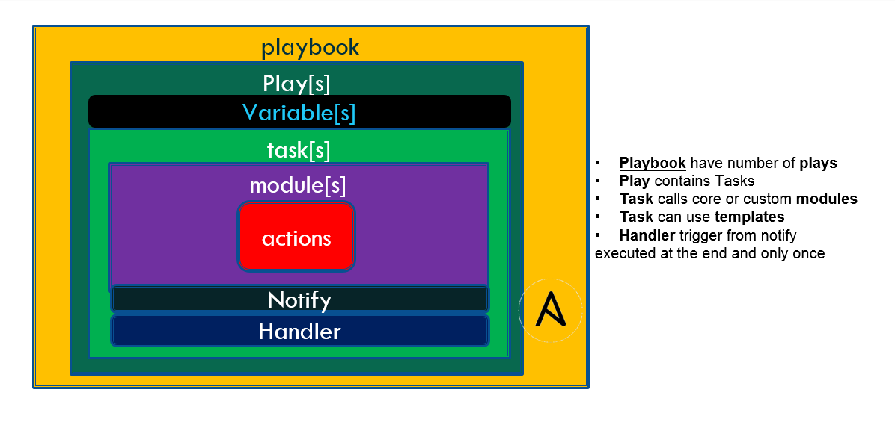

# Ansible 学习笔记

## 目录

* **[Ansible 架构](#ansible架构)**

* **[主机清单 - Inventory](#主机清单---inventory)**

* **[配置文件 - ansible.cfg](配置文件---ansible.cfg)**

* **[Ansible 管理被控端的两种方式](#ansible-管理被控端的两种方式)**

  * **[模块 - Module](#模块---module)**
  * **[Ad-Hoc Commands](#ad-hoc-commands)**
  * **[Playbooks - xxx.yml](#playbooks---xxxyml)**
  * **[Role]()**
  * ****

* **[]()**


* Tasks：任务，由模板定义的操作列表
* Variables：变量
* Templates：模板，即使用模板语法的文件
* Handlers：处理器 ，当某条件满足时，触发执行的操作
* Roles：角色
* Control node ：安装了 Ansible 的主机
* Managed nodes：Ansible 管理的网络设备或服务器

## Ansible 架构


* 用户可以通过编写 Playbook 或使用 Ad-HOC 命令直接操控 Ansible，也可以通过公有、私有云或 CMDB(Configuration Management Database) 操控 Ansible
* Ansible 组成：
  * Inventory - 被管理主机清单
  * APIs - 提供 Ansible 与云端的传输服务
  * Plugins
  * Modules
* Ansible 可管理对象：主机和网络设备

## 主机清单 - Inventory

> 被管理主机 ( managed nodes ) 的清单，inventory 也被称做“hostfile”

* inventory 是 `.ini` 格式编写的

* 默认路径： `/etc/ansible/hosts`
* 指定路径：
  * `ansible -i <path>` 或 `ansible-play -i <path>` 
  * 设置 ansible.cfg 中 `[default]` 下的 `inventory`  为指定 `hosts` 文件路径
  * **ansible  支持多个 inventory 文件**。先创建一个 `inventory/` 文件夹，然后将 ansible.cfg 中的 `inventory` 设置为**文件夹的路径**
* **ansible 还支持动态的 inventory**。可以用自定义脚本从 CMDB 系统和 Zabbix 监控系统等拉取所有的主机信息，脚本可以使用任何语言编写，但是脚本使用参数有一定的规范并且对脚本执行的结果也有要求，应用时只需要把 ansible.cfg 文件中 inventory 的值改成一个**执行脚本路径**即可

**`inventory 行为参数`**

|            参数名            |           参数说明           |     默认值      |
| :--------------------------: | :--------------------------: | :-------------: |
|       ansible_ssh_host       |    登录主机的hostname或ip    |     主机名      |
|       ansible_ssh_port       |         ssh 目的端口         |       22        |
|       ansible_ssh_user       |     ssh 登录使用的用户名     |      root       |
|       ansible_ssh_pass       |      ssh 认证使用的密码      |      None       |
|         ansible_sudo         |        主机的sudo用户        |                 |
|      ansible_sudo_pass       |        主机的sudo密码        |                 |
|       ansible_sudo_exe       |        主机的sudo路径        |                 |
|      ansible_connection      |        连接主机的模式        |      smart      |
| ansible_ssh_private_key_file |      ssh 认证使用的私钥      |      None       |
|      ansible_shell_type      |        主机shell类型         |       sh        |
|  ansible_python_interpreter  |     主机python解释器路径     | /usr/bin/python |
|    ansible_*_interpreter     | 类似python解释器的其他语言版 |      None       |

#### 主机变量和群组变量

* Ansible 变量支持布尔型、字符串、列表和字典，但**在 inventory 文件中，只能将变量指定为布尔型和字符串**
* 以上介绍的 inventory 内置参数其实就是具有特殊意义的 Ansible 变量，可以针对主机定义任意的变量名并指定相应的值

**`主机变量`**

``` ini
192.168.13.12 color=green
192.168.13.14 color=red
```

**`群组变量`**

* **[<group_name>:vars]**

```ini
[all:var]
color=green
```

#### 主机变量和群组变量文件

* 可以为每个主机和群组创建独立的变量文件（YAML 格式）
* 主机变量文件：`host_vars` 目录中寻找
* 群组变量文件：`group_vars` 目录中寻找

>  这个两个目录和 playbook 和 inventory 文件平级

**键值格式 :**

```
# playbooks/group_vars/production
db_primary_host: prod.db.com
db_primary_port: 5432
db_replica_host: rep.db.com
db_name: mydb
db_user: root
db_pass: 123456

# 访问方法:
{{ db_primary_host }}
```

**字典格式 :**

```
# playbooks/group_vars/production
db:
    user: root
    password: 123456
    name: mydb
    primary:
        host: primary.db.com
        port: 5432
    replica:
        host: replica.db.com
        port: 5432
rabbitmq:
    host: rabbit.example.com
    port: 6379

# 访问方法
{{ db.primary.host }}
```

#### 动态 inventory

* 如果 inventory 文件被标记为可执行，则 Ansible 会假设这是一个动态的 inventory 脚本并且执行它而不是读取它的内容 - `chmod +x 文件名`
* 动态 inventory 脚本必须支持两个命令行参数：
  * `--host=<hostname>` - 列出主机的详细信息
  * `--list` - 列出群组

#### ansible.cfg 设置 Inventory 行为参数默认值

可以在 `[defaults]` 中改变一些行为参数的默认值:

| inventory 行为参数               | ansible.cfg 选项             |
| :------------------------------- | :--------------------------- |
| ansible_ssh_port                 | remote_port                  |
| ansible_ssh_user                 | remote_user                  |
| ansible_ssh_private_key_file     | private_key_file             |
| ansible_shell_type, shell 的名称 | executable, shell 的绝对路径 |

#### 静态 Inventory 与 动态 Inventory 结合使用

1、将动态 inventory 和 静态 inventory 放在同一目录下

2、在 ansible.cfg 中将 `hostfile` 的值, 指向该目录即可

## 配置文件 - `ansible.cfg`

Playbooks 加载顺序：**`ANSIBLE_CONFIG`**  -> **`./ansible.cfg`** -> **`~/.ansible.cfg`** -> **`/etc/ansible/ansible.cfg`**

* **`ANSIBLE_CONFIG`**：首先，Ansible 命令会先检查环境变量 `ANSIBLE_CONFIG`，及这个环境变量将指向的配置文件
* **`./ansible.cfg`**：其次，将会检查当前目录下的 ansible.cfg 配置文件
* **`~/.ansible.cfg`**：再次，将会检查当前用户 home 目录下的**`~/.ansible.cfg`** 配置文件
* **`/etc/ansible/ansible.cfg`**：最后，将会检查在安装 Ansible 时自动生产的配置文件

#### 常用配置项

**`[defaults]`**

|         配置项          |                             说明                             |         默认值         |
| :---------------------: | :----------------------------------------------------------: | :--------------------: |
|        inventory        |                  ansible inventory文件路径                   |   /etc/ansible/hosts   |
|         library         |                     ansible模块文件路径                      | /usr/share/my_modules/ |
|       remote_tmp        |               ansible远程主机脚本临时存放目录                |     ~/.ansible/tmp     |
|        local_tmp        |               ansible管理节点脚本临时存放目录                |     ~/.ansible/tmp     |
|          forks          |                      ansible执行并发数                       |           5            |
|      poll_interval      |                   ansible异步任务查询间隔                    |           15           |
|        sudo_user        |                       ansible sudo用户                       |          root          |
|      ask_sudo_pass      |               运行ansible是否提示输入sudo密码                |          True          |
|        ask_pass         |                 运行ansible是否提示输入密码                  |          True          |
|        transport        |                     ansible远程传输模式                      |         smart          |
|       remote_port       |                       远程主机SSH端口                        |           22           |
|       module_lang       |                 ansible模块运行默认语言环境                  |           C            |
|        gathering        |                    facts信息收集开关定义                     |         smart          |
|       roles_path        |                     ansible role存放路径                     |   /etc/ansible/roles   |
|         timeout         |                   ansible SSH连接超时时间                    |           10           |
|       remote_user       |                     ansible远程认证用户                      |          root          |
|        log_path         |                     ansible日志记录文件                      |  /var/log/ansible.log  |
|       module_name       |                     ansible默认执行模块                      |        command         |
|       executable        |                     ansible命令执行shell                     |        /bin/sh         |
|     hash_behaviour      |                 ansible主机变量重复处理方式                  |        replace         |
|    private_role_vars    | 默认情况下，角色中的变量将在全局变量范围中可见。 为了防止这种情况，可以启用以下选项，只有tasks的任务和handlers得任务可以看到角色变量 |          yes           |
|   vault_password_file   |                    指定vault密码文件路径                     |           无           |
|     ansible_managed     | 定义的一个Jinja2变量，可以插入到Ansible配置模版系统生成的文件中 |    Ansible managed     |
|  display_skipped_hosts  |                      开启显示跳过的主机                      |          True          |
| error_on_undefined_vars |                 开启错误，或者没有定义的变量                 |         False          |
|     action_plugins      |                    ansible action插件路径                    |           无           |
|      cache_plugins      |                    ansible cache插件路径                     |           无           |
|    callback_plugins     |                   ansible callback插件路径                   |           无           |
|   connection_plugins    |                  ansible connection插件路径                  |           无           |
|     lookup_plugins      |                    ansible lookup插件路径                    |           无           |
|    inventory_plugins    |                  ansible inventory插件路径                   |           无           |
|      vars_plugins       |                     ansible vars插件路径                     |           无           |
|     filter_plugins      |                    ansible filter插件路径                    |           无           |
|    terminal_plugins     |                   ansible terminal插件路径                   |           无           |
|    strategy_plugins     |                   ansible strategy插件路径                   |           无           |
|      fact_caching       |                  定义ansible facts缓存方式                   |         memory         |
| fact_caching_connection |                  定义ansible facts缓存路径                   |           无           |

**privilege_escalation - 权限升级**

|     配置项      |          说明          | 默认值 |
| :-------------: | :--------------------: | :----: |
|     become      |   是否开启become模式   |  True  |
|  become_method  |     定义become方式     |  sudo  |
|   become_user   |     定义become方式     |  root  |
| become_ask_pass | 是否定义become提示密码 | False  |

## Ansible 管理被控端的两种方式

<div align=center>

</div>

>  **Ad-hoc 和 playbook 可以看成是 Linux 下的命令和 shell 脚本之间的关系**

### 模块 - Module

* Bash 中的常用命令 `cd`、`yum`、`apt` 等，在 Ansible 中就对应于模块，所以模块可视为 Ansible 的 “命令”
* Bash 中调用命令时可以跟不同的参数，每个命令的参数都是该命令自定义的；同样，Ansible 中调用 module 也可以跟不同的参数，每个module 的参数也都是由 module 自定义的
* Ansible 自带的模块都是用 Python 编写的，但实际上可以使用任何语言编写模块
* Ansible 提供一些常用功能的 Module，同时 Ansible 也提供 API，让用户可以自己写 Module，使用的编程语言是 Python

#### 查看 module 用法

* **`ansible-doc <module_name>`**

#### 命令行中使用 module

* **`ansible <host-pattern> -m <module_name> -a '<module_args>'`** 

#### Playbook 脚本中使用 module

* tasks 中的每一个 action 都是对应 module 的一次调用
* **`<module_name>: <module_args>`**

```yaml
tasks:
  - name: ensure apache is at the latest version
     yum: pkg=httpd state=latest
```

### Ad-Hoc Commands

#### Ad-Hoc 执行过程

> * 加 `-vvv` 可查看执行过程

1、加载配置文件，默认是 `/etc/ansible/ansible.cfg`

2、加载模块文件

3、 将 Ad-Hoc 生成对应的临时 py 文件，并将文件传输到被控主机的对应用户 `~/.ansible/tmp/ansible-tmp-xxx/xxx.py`

4、被控主机 py 文件加执行权限（ +x ）

5、执行 py 文件并返回结果

6、删除本地和被控主机上的临时 py 文件，`sleep 0` 退出

### Playbooks - `xxx.yml`



> * Playbooks contain plays
> * Plays contain tasks
> * Tasks call modules, tasks run sequentially
> * Handlers are triggered by tasks

* 一个 Playbook 可以包含多个 Play
* 一个 Play 一定包含一个 hosts 和 tasks，也可能有 variables、roles、handlers 等

* Playbooks语法 - YAML
* playbook 其实就是一个**字典列表**，也就是一个 playbook 就是一个 play 列表

### Handlers


### Roles


### Facts


