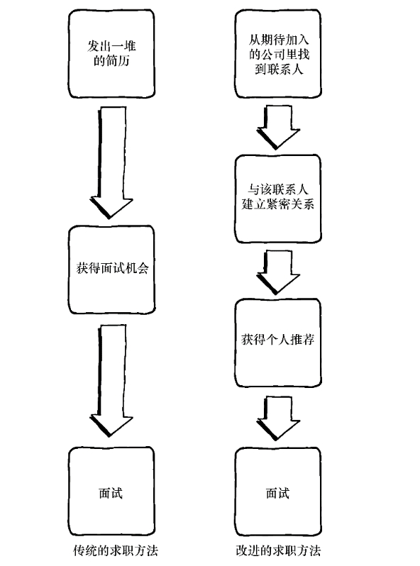
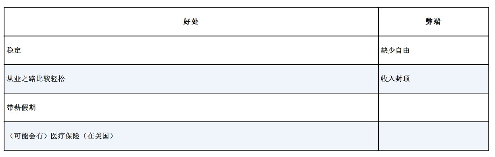
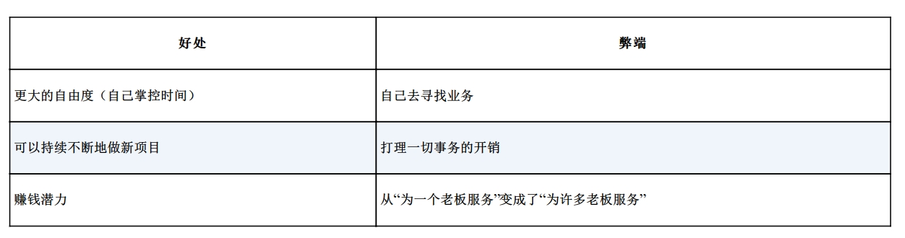
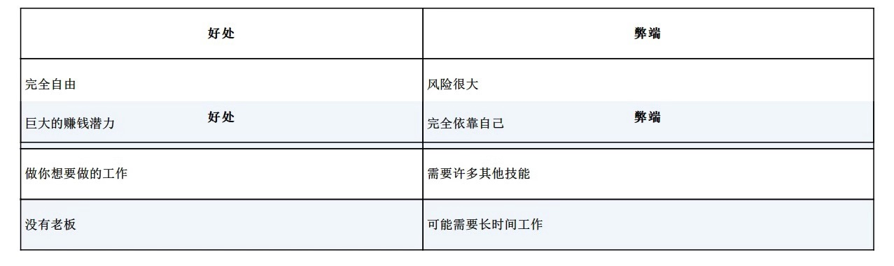
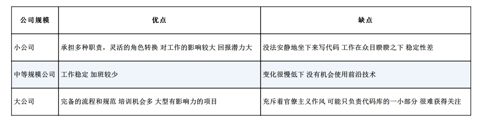
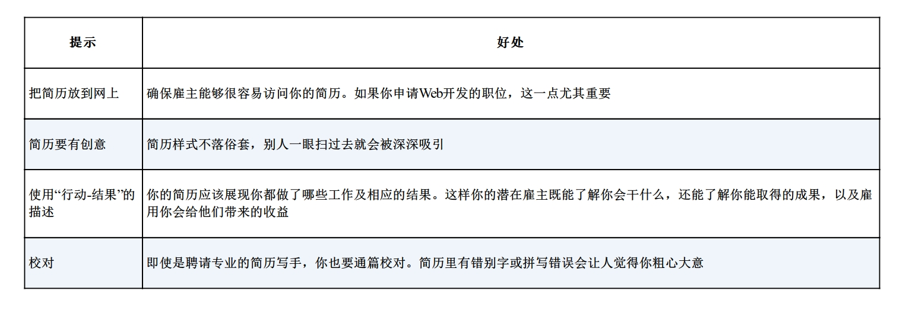

# 《软技能:代码之外的生存指南》

* 通过在希望加入公司员工博客下评论，建立联系，本质就是扩大自己的 IT 社交圈

## 就业选择

1、雇员

2、独立咨询师

3、创业者

在一个专业方向上拥有专长

专业化的规则：专业化程度越深，潜在的机会越少，但获得这些机会的可能越大

以生产软件为核心业务的公司往往比那些软件开发并非核心业务的公司更重视开发人员，也更容易推广前沿技术的使用

在任何公司能让你脱颖而出的最重要的法宝就是承担更多的责任

