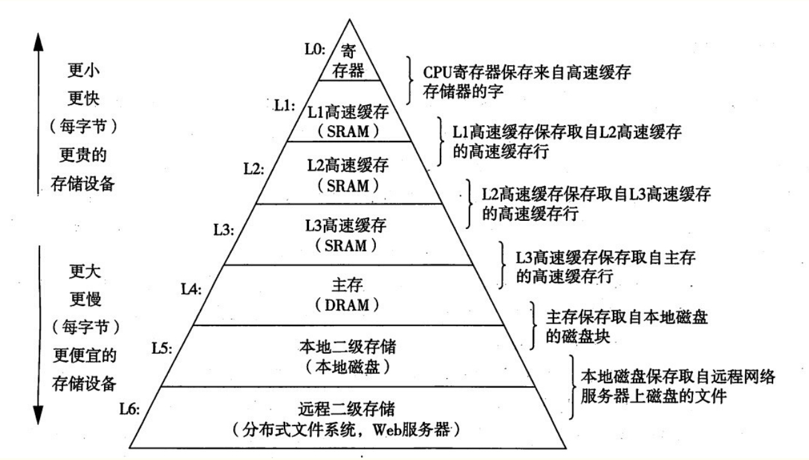
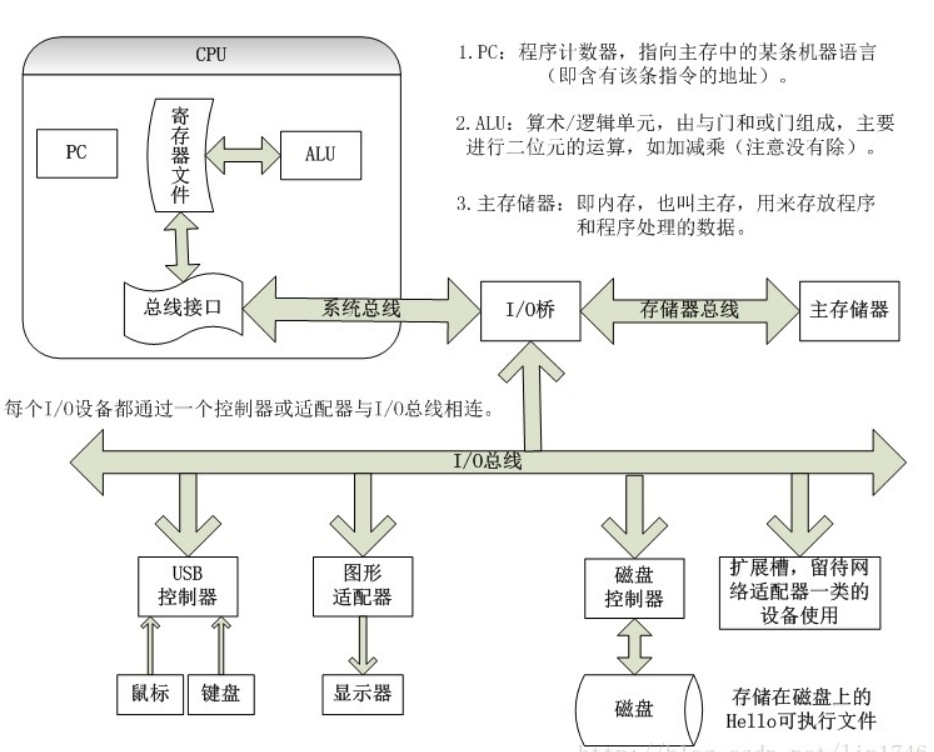

# 计算机组成原理学习笔记

## 存储层次结构

 Intel Core i7存储层次结构

* CPU很少会直接访问内存，相反，当CPU请求内存中的数据时，L1 Cache会接管该访问。如果请求的数据在缓存中，那么L1 Cache 就将数据提供给CPU，并结束这次内存访问；如果请求的数据不在L1 Cache中，那么L1 Cache就将请求传递给L2 Cache。
* 如果L2 Cache有需要的数据，它就将数据返回给L1 Cache，L1 Cache再将数据返回给CPU。后续短时间内对这些数据的访问请求将由L1 Cache而不是L2 Cache满足，因为当Cache缺失时，大多数Cache系统会读取主存中连续的一些字节(这块数据被称为Cache Line，例如80x86 CPU在一次高速缓存缺失时读取16到64个字节)，现在L1 Cache已经有这些数据的副本了。
* 如果L1 Cache与L2 Cache都不包含需要的数据，那么请求被发送到主存。如果在主存中发现了请求的数据，那么主存子系统就将数据传递给L2 Cache，再由L2 Cache传递给L1 Cache，最后由L1 Cache传递给CPU。同样，数据现在已经在L1 Cache中了，因此，短时间内对这些数据的访问请求将由L1 Cache满足。
* 如果数据不在主存中，而在虚存中，在某个存储设备上，那么操作系统会接管这次访问操作，从磁盘或其他设备(例如网络存储服务器)读取数据，并将数据传送到主存子系统。主存再通过Cache将数据传送给CPU，过程如前所述。

## 总线

 计算机总线详解图

