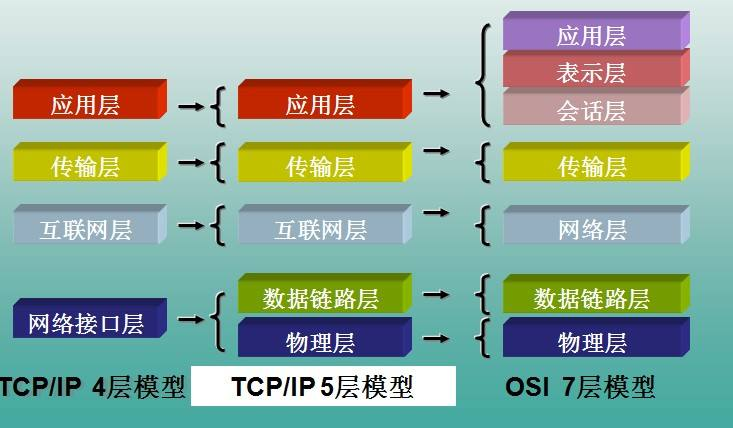

# 计算机网络学习笔记

## OSI 模型 - Open System Interconnection Reference Model - 开放式系统互联通信参考模型

 OSI 七层结构

 OSI 模型在数据传输过程中的应用

> 两主机通信，从发送者到接收者的过程：在发送者端从第七层（应用层）到第一层（物理层）封装，然后传输到远端接受者，再从第一层（物理层）到第七层（应用层）解封装

* 应用层（ Application Layer ）
  * 就是应用软件使用的协议，如邮箱使用的 POP3，SMTP、远程登录使用的 Telnet、获取 IP 地址的 DHCP、域名解析的 DNS、网页浏览的 http 协议等；这部分协议主要是规定应用软件如何去进行通信的，为用户的应用程序提供网络服务
* 表示层（ Presentation Layer ）
  * 决定数据的展现（编码）形式，如同一部电影可以采样、量化、编码为 RMVB、AVI，一张图片能够是 JPEG、BMP、PNG 等
* 会话层（ Session Layer ）
  * 负责在网络中的两节点之间建立、维持和终止通信。功能包括：建立通信链接，保持会话过程通信链接的畅通，同步两个节点之间的对话，决定通信是否被中断以及通信中断时决定从何处重新发送
* 传输层（ Transport Layer ）
  * 将一个数据/文件斩件分成很多小段，标记顺序以被对端接收后可以按顺序重组数据，另外标记该应用程序使用的端口号及提供 QOS。（不同的应用程序使用不同计算机的端口号，同样的应用程序需要使用一样的端口号才能正常通信）
  * 定义了一些传输数据的协议和端口号（ WWW 端口 80 等），如：TCP（传输控制协议，传输效率低，可靠性强，用于传输可靠性要求高，数据量大的数据），UDP（用户数据报协议，与 TCP 特性恰恰相反，用于传输可靠性要求不高，数据量小的数据，如 QQ 聊天数据就是通过这种方式传输的）， 主要是将从下层接收的数据进行分段和传输，到达目的地址后再进行重组，常常把这一层数据叫做段
* 网络层（ Network Layer ）
  * 路由选路，选择本次通信使用的协议（http、ftp等），指定路由策略及访问控制策略。（ IP 地址在这一层）
  * 网络层负责在源机器和目标机器之间建立它们所使用的路由，路由器在该层。协议有：IP、ICMP（互联网控制报文协议）、ARP（地址转换协议）、RARP（反向地址转换协议）
* 数据链路层（ Datalink Layer ）
  * 根据端口与 MAC 地址，做分组（VLAN）隔离、端口安全、访问控制（ MAC 地址在这一层）
  * 定义了如何让格式化数据以进行传输，以及如何让控制对物理介质的访问，这一层通常还提供错误检测和纠正，以确保数据的可靠传输（交换机、网桥设备在这一层）
* 物理层（ Physical Layer ）
  * 主要定义物理设备标准，如网线的接口类型、光纤的接口类型、各种传输介质的传输速率等。它的主要作用是传输比特流（就是由 1、0 转化为电流强弱来进行传输，到达目的地后在转化为 1、0，也就是我们常说的数模转换与模数转换），这一层的数据叫做比特，单位是 bit 比特。

> * OSI 七层模型是一种框架性的设计方法，建立七层模型的主要目的是为解决异种网络互连时所遇到的兼容性问题，其最主要的功能就是帮助不同类型的主机实现数据传输。它的最大优点是将服务、接口和协议这三个概念明确地区分开来，通过七个层次化的结构模型使不同的系统不同的网络之间实现可靠的通讯
> * OSI 模型所分的七层，在实际应用中，往往有一些层被整合，或者功能分散到其他层去，比如 TCP/IP 模型实际上是 OSI 模型的一个浓缩版本
> * 用户数据经过以上七层后，一串 0、1 组成的二进制流诞生了，然后根据物理层是光纤、电缆、还是空气，二进制流转化为光信号、电信号、电磁波信号在物理介质（物理层）里传输，经过若干个中继交换机（链路层）的交换、经过若干个中继路由器（网络层）的转发，最终到达数据的终点
> * 经以上层最终产生了二进制流，除了物理层之外，每层都会在原始数据前添加一串属于自己的协议头

## TCP/IP 模型

 TCP/IP 结构图

 TCP/IP 与 OSI 对比图

## HTTP 响应码

* HTTP 响应状态代码指示特定 [HTTP](https://developer.mozilla.org/zh-cn/HTTP) 请求是否已成功完成

* 响应分为五类：信息响应(`100`–`199`)，成功响应(`200`–`299`)，重定向(`300`–`399`)，客户端错误(`400`–`499`)和服务器错误 (`500`–`599`)