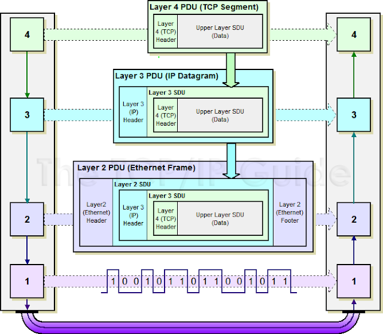
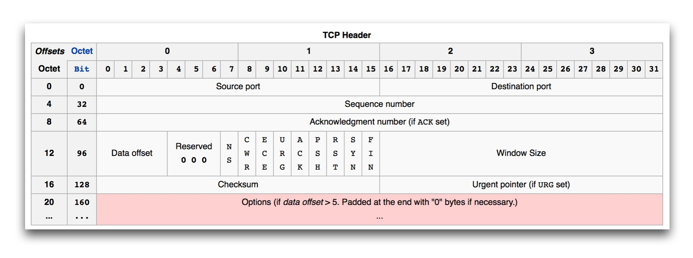
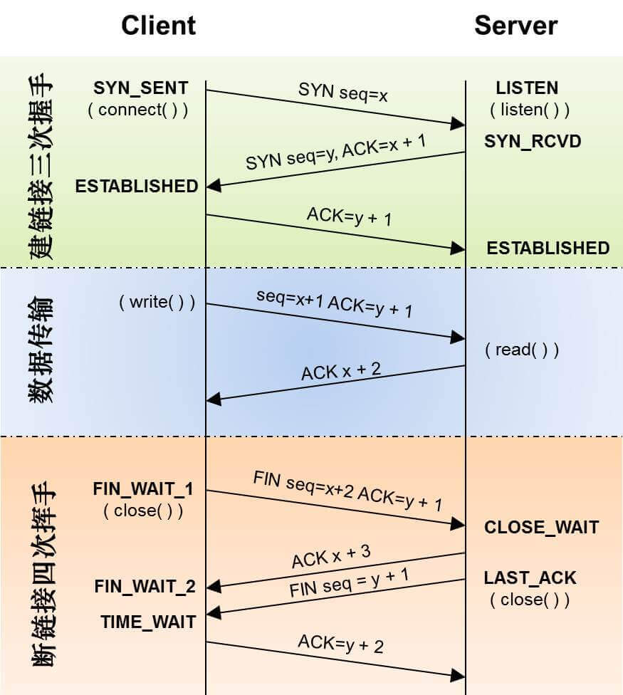

# 学习计算机网络中的小知识

## 目录

### OSI 七层和 TCP/IP 五层

| OSI | TCP / IP | 功能 | 协议 | 传输数据 |
| --- | --- | --- | --- | --- |
| 应用层 Application Layer | 应用层 | 文件传输、电子邮件、文件服务、虚拟终端 | HTTP、FTP、DHCP、SNMP、SMTP、DNS、Telnet、TFTP、etc |  |
| 表示层 Presentation Layer | 应用层 | 数据格式转化、数据加密 | 无 |  |
| 会话层 Session Layer | 应用层 | 接触或建立与别的节点的链接 | 无 |  |
| 传输层Transport Layer | 传输层 | 提供端对端的接口 | TCP、UDP | TCP Segment 或 UPD Datagram |
| 网络层Network Layer | 网络层 | 为数据包选择路由 | IP、ICMP、IGMP、RIP、OSPF、etc | IP Datagram |
| 数据链路层 Data Link Layer | 数据链路层 | 传输有地址的帧以及错误检测功能 | PPP、ARP、RARP、MTU、etc | Ethernet Frame |
| 物理层 Physical Layer | 物理层 | 以二进制数据形式在物理媒体上传输数据 | ISO2110、IEEE802、IEEE802.2、etc | Bits |

* 数据从应用层发下来，会在每一层都会加上头部信息，进行封装，然后再发送到数据接收端，即每个数据都会经过数据的封装和解封装的过程
* 我们可以用一个公式来表示每一层协议的构成：Packet = Protocol Header + Payload
  * Payload 指传入这一层的数据内容
  * 比如：TCP Segment = TCP header + HTTP data
* **所以对于每一层协议的学习，最后就落实到每一层 header 的学习上了，学习 TCP 就是研究 TCP header 的构成，header 里的每一个 bit 位都有特别的用处，来实现协议层对于网络传输的控制。学习网络协议其实就是学习网络协议的 header**

### Segment、Datagram、Frame、Packet、Fragment、SDU、PDU

《TCP/IP 详解》中的描述：
* Segment: If the transport protocol is TCP, the unit of data sent from TCP to network layer is called Segment. 
* Datagram: This is used in 2 layers. If the network protocol is IP, the unit of data is called Datagram. At transport layer, if protocol is UDP, we use datagram there as well. Hence, we differentiate them as UDP Datagram, IP Datagram. 
* Frame: Physical layer representation. 
* Packet: It is a more generic term used either transport layer or network layer. TCP Packet, UDP Packet, IP Packet etc. I have not seen it to represent Physical layer data units. 
* Fragment: My guess here is that when a unit of data is chopped up by a protocol to fit the MTU size, the resultant unit of data is called Fragments. But I am guessing.

**SDU & PDU**

* SDU - Service Data Unit 
* PDU - Protocol Data Unit 
* 封装过程中，对于 OSI 模型中第 N 层而言，从 N+1 层接受到的数据即是此层的 SDU，然后会将接受的数据（即第 N 层的 SDU）加上根据本层协议生成的头（ header ）或尾 （ footer ），然后向下转发；解封过程中，也是一样，从 N-1 层接收到的是发送方 N 层的 PDU，掐头去尾得到本层的 SDU，让后向上转发
* 所以每一层都有自己的 SDU 和 PDU。简言之就是，向下转发数据时，某一层接受到的数据就是本层的 SDU，而转发出去的就是本层的 PDU，即上一层的 PDU 是本层的 SDU；向上转发数据时，某一层接受到的数据就是本层的 PDU，转发出去的就是本层的 SDU，即上一层的 SDU 是本层的 PDU

### TCP Header 详解

> * 一个 TCP Header 一般有 20 个字节，如果启用了 options，header 的长度可以达到 60 个 bytes。上图中每一行是 4 个 bytes ( 32 bits )
> * 计算机中，通常会以 bit，byte，word（ 4 个 byte ）等不同粒度来描述信息，header 的学习一般是以 4 个字节为一个单位来展示的

 

* <kbd>Source port</kbd> 和 <kbd>Destination port</kbd> 
  * 这两个字段分别表示 TCP 连接中的，发送方端口号和接收方的端口号，2 个字节对应端口范围即是 0 ~ 65535  
* <kbd>Sequence number</kbd>
  * 表示发送方的序列号。用来标识从 TCP 发送端向 TCP 接收端发送的数据字节流，它表示在这个报文段中的的第一个数据字节在数据流中的序号；主要用来解决网络包乱序的问题
* <kbd>Acknowledge number</kbd>
  * 表示接收方 ack 的序列号。接收方收到发送方一个的 TCP 包之后，取出其中的 sequence number，在下一个接收方自己要发送的包中，设置 ack 比特位为 1，同时设置 acknowledge number 为 sequence number + 1。所以接收方的 acknowledge number 表示的是，接收方期待接收的下一个包起始字节的标号，大家可以仔细理解下这一句话。所以 acknowledge number 和 sequence number 是配对使用的
* <kbd>Offset</kbd> 
  * 给出首部中32 bit字的数目，需要这个值是因为任选字段的长度是可变的。这个字段占4bit（最多能表示15个32bit的的字，即 4\*15=60个字节的首部长度），因此TCP最多有60字节的首部。然而，没有任选字段，正常的长度是20字节
* <kbd>Tcp Flag</kbd>
  * TCP 首部中有 6 个标志比特，它们中的多个可同时被设置为 1，主要是用于操控 TCP 的状态机的，依次为 URG、ACK、PSH、RST、SYN、FIN。每个标志位的意思如下：
  * `URG` - 此标志表示 TCP 包的紧急指针域有效，用来保证 TCP 连接不被中断，并且督促中间层设备要尽快处理这些数据
  * `ACK` - 此标志表示应答域有效，就是说前面所说的 TCP 应答号将会包含在 TCP 数据包中；有两个取值：0 和 1，为 1 的时候表示应答域有效，反之为 0。TCP 协议规定，只有 ACK=1 时有效，也规定连接建立后所有发送的报文的 ACK 必须为 1
  * `PSH` - 这个标志位表示 Push 操作。所谓 Push 操作就是指在数据包到达接收端以后，立即传送给应用程序，而不是在缓冲区中排队；
  * `RST` - 这个标志表示连接复位请求。用来复位那些产生错误的连接，也被用来拒绝错误和非法的数据包
  * `SYN` -  表示同步序号，用来建立连接。SYN 标志位和 ACK 标志位搭配使用，当连接请求的时候，`SYN=1，ACK=0`；连接被响应的时候，`SYN=1，ACK=1`；这个标志的数据包经常被用来进行端口扫描。扫描者发送一个只有 SYN 的数据包，如果对方主机响应了一个数据包回来 ，就表明这台主机存在这个端口；但是由于这种扫描方式只是进行 TCP 三次握手的第一次握手，因此这种扫描的成功表示被扫描的机器不很安全，一台安全的主机将会强制要求一个连接严格的进行 TCP 的三次握手
  * `FIN` -  表示发送端已经达到数据末尾，也就是说双方的数据传送完成，没有数据可以传送了，发送 FIN 标志位的 TCP 数据包后，连接将被断开。这个标志的数据包也经常被用于进行端口扫描
* <kbd>Window</kbd>
  * 窗口大小，也就是有名的滑动窗口，用来进行流量控制
* <kbd>Checksum</kbd> 
  * checksum 是个通用的计算机概念，做完整性校验之用，在很多协议（ IP，UDP，ICMP ）中都有应用，这个值由包的发送方去计算，之后由包的接收方取出来校验
* <kbd>Urgent pointer</kbd>
  * Urgent pointer 为两个字节的偏移量，加上当前包的 sequence number，用来标记某一个范围内的 bytes 为特殊用途数据

> * SYN(SYNchronization)  - 在连接建立时用来同步序号。当SYN=1而ACK=0时，表明这是一个连接请求报文。对方若同意建立连接，则应在响应报文中使SYN=1和ACK=1. 因此, SYN置1就表示这是一个连接请求或连接接受报文
> * FIN （finish）即终结的意思， 用来释放一个连接。当 FIN = 1 时，表明此报文段的发送方的数据已经发送完毕，并要求释放连接

### TCP 3 次握手和 4 次分手

 

**三次握手**

1. 第一次握手：建立连接。客户端发送连接请求报文段，将 SYN 设置为1，假设 Sequence Number 为 x；然后，客户端进入 SYN_SEND 状态，等待服务器的确认
2. 第二次握手：服务器收到 SYN 报文段。服务器收到客户端的 SYN 报文段，需要对这个 SYN 报文段进行确认，设置 Acknowledgment Number 为 x+1( Sequence Number+1 )；同时，自己自己还要发送 SYN 请求信息，将 SYN 位置为1，假设 Sequence Number 为 y；服务器端将上述所有信息放到一个报文段（即 SYN+ACK 报文段）中，一并发送给客户端，此时服务器进入 SYN_RECV 状态
3. 第三次握手：客户端收到服务器的 SYN+ACK 报文段。然后将 Acknowledgment Number 设置为 y+1，向服务器发送 ACK 报文段，这个报文段发送完毕以后，客户端和服务器端都进入 ESTABLISHED 状态，完成 TCP 三次握手

**四次分手**

1. 第一次分手：主机 1（可以使客户端，也可以是服务器端），设置 Sequence Number 和 Acknowledgment Number，向主机 2 发送一个 FIN 报文段；此时，主机 1 进入FIN_WAIT_1 状态；这表示主机 1 没有数据要发送给主机 2 了
2. 第二次分手：主机 2 收到了主机 1 发送的 FIN 报文段，向主机 1 回一个 ACK 报文段，Acknowledgment Number 为 Sequence Number 加 1；主机 1 进入 FIN_WAIT_2 状态；主机 2 告诉主机 1，我已经知道你没有数据要发送了
3. 第三次分手：主机 2 向主机 1 发送 FIN 报文段，请求关闭连接，同时主机 2 进入 CLOSE_WAIT 状态
4. 第四次分手：主机 1 收到主机 2 发送的 FIN 报文段，向主机 2 发送 ACK 报文段，然后主机 1 进入 TIME_WAIT 状态；主机 2 收到主机 1 的 ACK 报文段以后，就关闭连接；此时，主机 1 等待 2MSL ( 最大报文段生存时间 ) 后依然没有收到回复，则证明 Server 端已正常关闭，那好，主机 1 也可以关闭连接了

**为什么要三次握手**

在谢希仁著《计算机网络》第四版中讲“三次握手”的目的是“为了防止已失效的连接请求报文段突然又传送到了服务端，因而产生错误”。在另一部经典的《计算机网络》一书中讲“三次握手”的目的是为了解决“网络中存在延迟的重复分组”的问题。

在谢希仁著《计算机网络》书中同时举了一个例子，如下：

>“已失效的连接请求报文段”的产生在这样一种情况下：client发出的第一个连接请求报文段并没有丢失，而是在某个网络结点长时间的滞留了，以致延误到连接释放以后的某个时间才到达server。本来这是一个早已失效的报文段。但server收到此失效的连接请求报文段后，就误认为是client再次发出的一个新的连接请求。于是就向client发出确认报文段，同意建立连接。假设不采用“三次握手”，那么只要server发出确认，新的连接就建立了。由于现在client并没有发出建立连接的请求，因此不会理睬server的确认，也不会向server发送数据。但server却以为新的运输连接已经建立，并一直等待client发来数据。这样，server的很多资源就白白浪费掉了。采用“三次握手”的办法可以防止上述现象发生。例如刚才那种情况，client不会向server的确认发出确认。server由于收不到确认，就知道client并没有要求建立连接。”

这就很明白了，防止了服务器端的一直等待而浪费资源

**白话三次握手**

<kbd>**A -> B：吃了吗？**</kbd> - 第 1 次握手，A 向 B 发出建立沟通请求

<kbd>**B -> A：吃了**</kbd> - 第 2 次握手，B 听到 A 的话还没回应时，就明白了 A 可以说话，并且 A 的话我能听懂 ( **即 B 确认了 A 的发送能力** )， 回应 A 是为了让 A 知道 B 能听懂他的话并且让 A 判断自己说的话 A 能否听懂，**即让 A 确认 B 具有接收能力和判断 B 是否有发送能力**

<kbd>**A -> B：知道了**</kbd> - 第 3 次握手，A 在听到 B 的话还没回应时，就明白了 B 可以听懂我的话并能做出相应的回答，并且自己可以听懂 B 的话 ( **即 A 确认 B 的发送能力和接收能力** ) ，之后 A 回应 B ，是为了让 B 知道自己也能听懂他的话，**即让 B 确认 A 具有接收能力**，B 收到 A 的回应时，即明白了 A 也能听懂我说的话 ( **即 B 确认了 A 的接收能力** )， 然后就可以愉快沟通了

**为什么是三次握手**
* TCP 需要建立全双工的通道，所以**通信双方都要确认对方具有发送和接收信息的能力**
* 第一次 client 发出请求，server 收到了消息，此时 **server 就能确认 client 具有发送能力** ，然后回复 “我能收到你的请求，我向你发一个请求”，**这一步是为了让 client 确认 server 具有接受的能力和发送能力**，client 收到 server 发来的回应，此时 **client 就能确认 server 具有接收和发送能力**，并做出应答 “我可以收到你的回应”，**这一步是为了让 server 确认 client 具有接收能力**，server 接收到 client 的应答，此时 **server 就能确认 client 具有接收的能力**。所以，**三次握手就是为了确认 client 和 server 都有收发信息的能力**

**为什么不是四次握手**

* 通过三次握手就已经达到了互相确认对方收发的能力，所以三次握手是最小成本完成建立全双工信道的方式

**为什么不是两次握手**

1. 从上面可以知道，两次握手只能完成 **client 确认了 server 具有接收和发送能力，以及 server 确认了 client 具有发送能力**，但由于缺少了 client 回复 server “我可以收到你的回应”，所以 **server 并不能确认 client 是否具有接收能力**
2. 可能存在这样情况，client 发出建立连接请求后一段时间的没有收到 server 回应，所以默认丢失，又发送了一遍建立连接请求，这次成功通过两次握手建立连接，通信结束断开连接后，此时之前那个以为丢失的建立连接请求又来了，原来是因为在路上阻塞了，然后 server 收到后以为 client 又需要建立连接，然后分配资源回复 client，并苦苦等着 client 发来请求资源的连接，由于是两次握手，所以连接就这么建立了，但 client 此时并没有建立连接请求呀！所以，server 就一直会等待 client 请求，**这样会浪费 server 资源**

## 简述DNS进行域名解析的过程？
用户要访问www.baidu.com，会先找本机的host文件，再找本地设置的DNS服务器，如果也没有的话，就去网络中找根服务器，根服务器反馈结果，说只能提供一级域名服务器.cn，就去找一级域名服务器，一级域名服务器说只能提供二级域名服务器.com.cn,就去找二级域名服务器，二级域服务器只能提供三级域名服务器.baidu.com.cn，就去找三级域名服务器，三级域名服务器正好有这个网站www.baidu.com，然后发给请求的服务器，保存一份之后，再发给客户端

## 什么叫CDN？

- 即内容分发网络
- 其目的是通过在现有的Internet中增加一层新的网络架构，将网站的内容发布到
  最接近用户的网络边缘，使用户可就近取得所需的内容，提高用户访问网站的速度

## 什么叫网站灰度发布？
灰度发布是指在黑与白之间，能够平滑过渡的一种发布方式
AB test就是一种灰度发布方式，让一部用户继续用A，一部分用户开始用B
如果用户对B没有什么反对意见，那么逐步扩大范围，把所有用户都迁移到B上面 来
灰度发布可以保证整体系统的稳定，在初始灰度的时候就可以发现、调整问题，以保证其影响度

