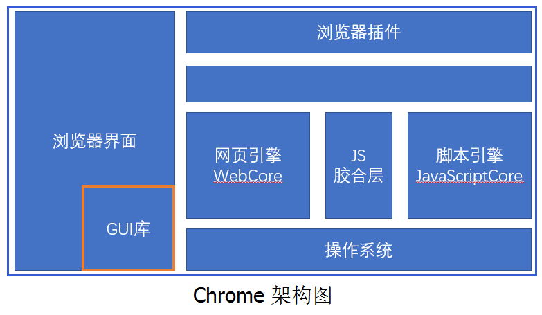
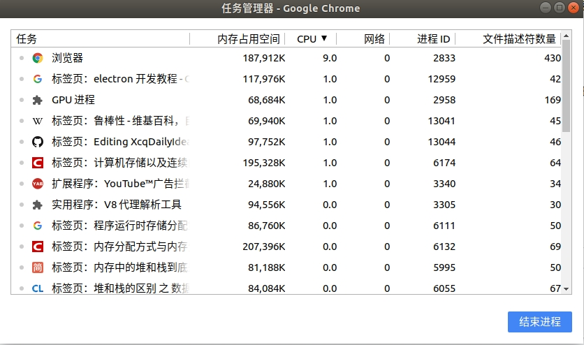
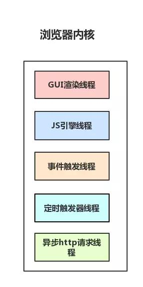
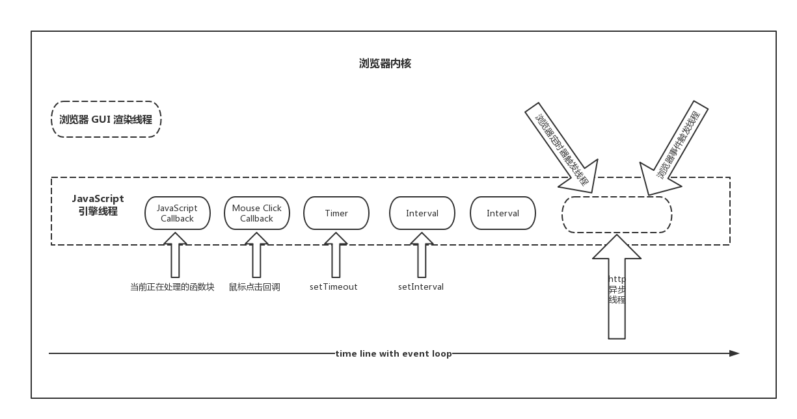

# 浏览器架构简析

## 浏览器的主要组件

 浏览器的组件图

1. 用户界面 (User Interface) - 包括地址栏、前进/后退按钮、书签菜单等。除了浏览器主窗口显示的您请求的页面外，其他显示的各个部分都属于用户界面
2. 浏览器引擎 (Browser engine) - 在用户界面和渲染引擎之间传送指令
3. 渲染引擎 (Rendering engine) - 解析DOM文档和CSS规则并将内容排版到浏览器中显示有样式的界面，也有人称之为排版引擎，我们常说的浏览器内核主要指的就是渲染引擎
4. 网络 (Networking) - 用于网络调用资源下载的模块,比如 HTTP 请求，其接口与平台无关，并为所有平台提供底层实现
5. 用户界面后端 (UI Backend) - 用来绘制基本的浏览器窗口内控件，如输入框、按钮、单选按钮等，根据浏览器不同绘制的视觉效果也不同，但功能都是一样的,其公开了与平台无关的通用接口，而在底层使用操作系统的用户界面方法
6. JavaScript 解释器 (JavaScript Interpreter) - 用于解析和执行 JS脚本的模块，如 V8 引擎、JavaScriptCore
7. 数据存储 (Date Persistence) - 这是持久层,浏览器需要在硬盘上保存各种数据，可通过浏览器引擎提供的API进行调用,例如 Cookie，新的 HTML 规范 (HTML5) 定义了“网络数据库”，这是一个完整、轻便的浏览器内数据库

> * 作为前端开发人员，我们需要重点理解**渲染引擎的工作原理**，灵活应用**数据存储技术**，在实际项目开发中会经常涉及到这两个部分，尤其是在做项目性能优化时，理解浏览器渲染引擎的工作原理尤为重要。而其他部分则是由浏览器自行管理的，开发者能控制的地方较少。
> * 默认情况下，渲染引擎可显示 HTML 和 XML 文档与图片。通过插件（或浏览器扩展脚本），还可以显示其他类型的内容；例如，使用 PDF 查看器插件就能显示 PDF 文档
> * Chrome 浏览器通常会为每一个标签页和扩展插件开一个进程

## 浏览器的多进程架构

> ### 推荐阅读
> * [从浏览器多进程到JS单线程，JS运行机制最全面的一次梳理](https://juejin.im/post/5a6547d0f265da3e283a1df7)
> * [Chromium官方博客-Multi-process Architecture
](https://blog.chromium.org/2008/09/multi-process-architecture.html)
> * [Chromium源码浅析-Chromium的多线程机制](http://www.voidcn.com/article/p-zpxvohld-bcz.html)
> * [Chromium浏览器的多进程架构](http://www.voidcn.com/article/p-pbsqmdvx-bcz.html)
> * [浏览器内核常驻线程](https://www.cnblogs.com/lidgblogs/p/7427187.html)

### 使用多线程原因
1. 稳定性 - 在 chromium 引入多进程架构之前，当前流行的浏览器都采用单进程实现，例如 FireFox，IE，Safari 等，浏览器所有的标签页、插件等都运行在同一个进程中，当某个标签页或插件崩溃时，就会导致整个浏览器崩溃
2. 安全性 - 利用渲染引擎中的漏洞的网页通常可以接管整个计算机，而且现代系统都有进程的安全机制，特别是沙箱机制；而且浏览器中的可与计算机通信的只有brower 进程，其他进程需要与计算机系统通信都需要通过 brower 进程
3. 性能 - 随着 SPA （单网页应用）技术和硬件的发展，单个网页对的硬件资源（ CPU、内存、IO等）需求越来越高，同时不稳定的机率也增大，如果同时开启多个页面，就会引入更长的操作延迟，严重影响用户体验；并且对于多处理器，采用多进程可以并行运行

### 包含的进程

   Chrome 浏览器进程管理图

* Browser 进程：浏览器的主进程（负责协调、主控），只有一个
    * 负责浏览器界面显示，与用户交互。如前进，后退等
    * 负责各个页面的管理，创建和销毁其他进程
    * 将Renderer进程得到的内存中的Bitmap，绘制到用户界面上
    * 网络资源的管理，下载等
* 第三方插件进程：每种类型的插件对应一个进程，仅当使用该插件时才创建
* GPU进程：最多一个，用于 3D 绘制等
* 浏览器渲染进程（render 进程，浏览器内核）：通常默认每个新标签页面一个进程，互不影响
    * 页面渲染，脚本执行，事件处理等
> 也有可能多个标签页对应一个进程，一来可能是浏览器自带的优化导致，二来可能是浏览器的最大渲染进程达到上限

### 浏览器内核常驻线程（渲染进程）详解

   浏览器内核线程图

   浏览器内核线程执行图

1. GUI 渲染线程
* 负责渲染浏览器界面，解析 HTML，CSS，构建 DOM 树和 RenderObject 树，布局和绘制等
* 当界面需要重绘（Repaint）或由于某种操作引发回流 (reflow) 时，该线程就会执行
> GUI 渲染线程与 JS 引擎线程是互斥的。当 JS 引擎执行时，GUI 线程会被挂起（相当于被冻结了）
2. JS 引擎线程（又称JS 内核）
* JS 引擎线程负责解析 Javascript 脚本，运行代码（例如V8引擎）
* JS 引擎一直等待着任务队列中任务的到来，然后加以处理，浏览器无论什么时候都只有一个 JS 线程在运行 JS 程序
> GUI 渲染线程与 JS 引擎线程是互斥的。如果JS执行的时间过长，这样就会造成页面的渲染不连贯，导致页面渲染加载阻塞
3. 浏览器事件触发线程
* 归属于浏览器而不是 JS 引擎，用来控制事件循环（可以理解，JS 引擎自己都忙不过来，需要浏览器另开线程协助）
* 当 JS 引擎执行代码块如 setTimeOut 时（也可来自浏览器内核的其他线程,如鼠标点击、AJAX 异步请求等），会将对应任务添加到事件线程中
* 当对应的事件符合触发条件被触发时，该线程会把事件添加到待处理队列的队尾，等待 JS 引擎的处理
> 由于 JS 的单线程关系，所以这些待处理队列中的事件都得排队等待 JS 引擎处理（当 JS 引擎空闲时才会去执行）
4. 浏览器定时触发器线程
* 传说中的 setInterval 与 setTimeout 所在线程
* 浏览器定时计数器并不是由 JavaScript 引擎计数的，（因为 JavaScript 引擎是单线程的, 如果处于阻塞线程状态就会影响记计时的准确）
因此通过单独线程来计时并触发定时（计时完毕后，添加到事件队列中，等待 JS 引擎空闲后执行）
> W3C 在 HTML 标准中规定，规定要求 setTimeout 中低于 4ms 的时间间隔算为 4ms
5. 浏览器异步 http 请求线程
* 在 XMLHttpRequest 在连接后是通过浏览器新开一个线程请求
* 当检测到状态变更时，如果设置有回调函数，异步线程就产生状态变更事件，将这个回调再放入事件队列中。再由 JavaScript 引擎执行

