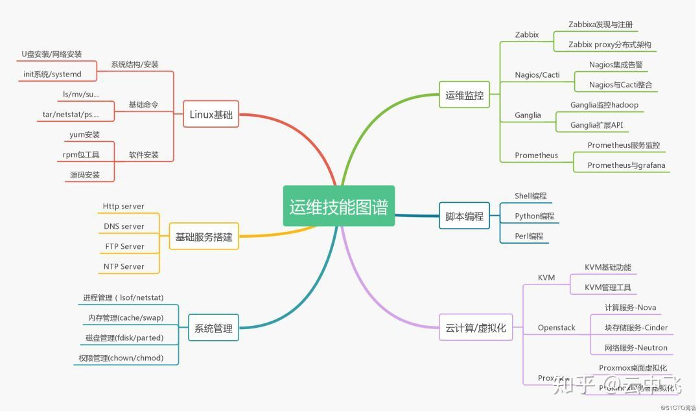
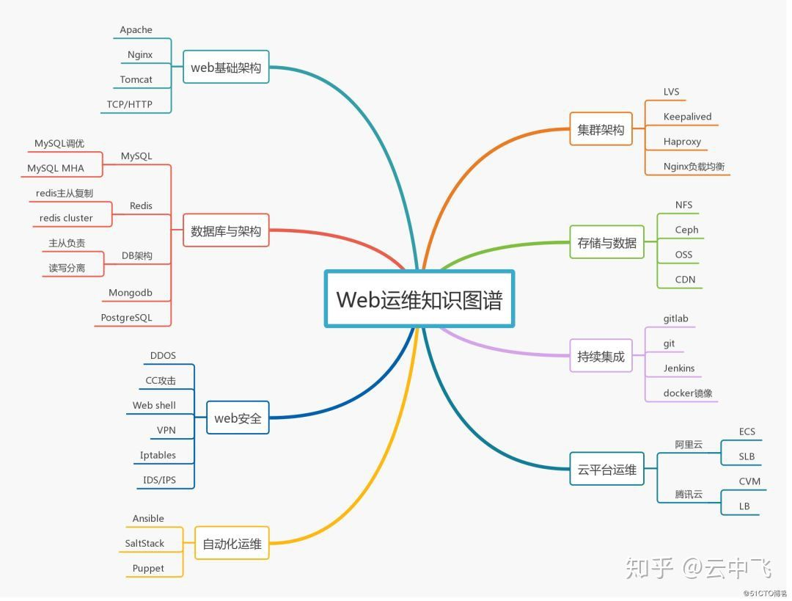
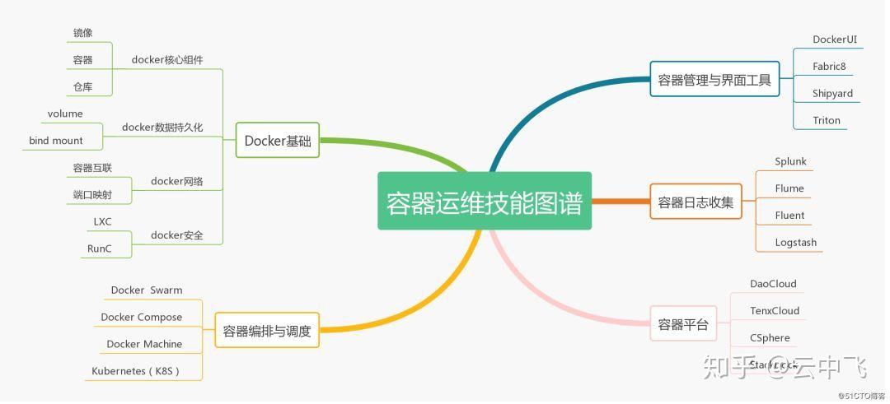
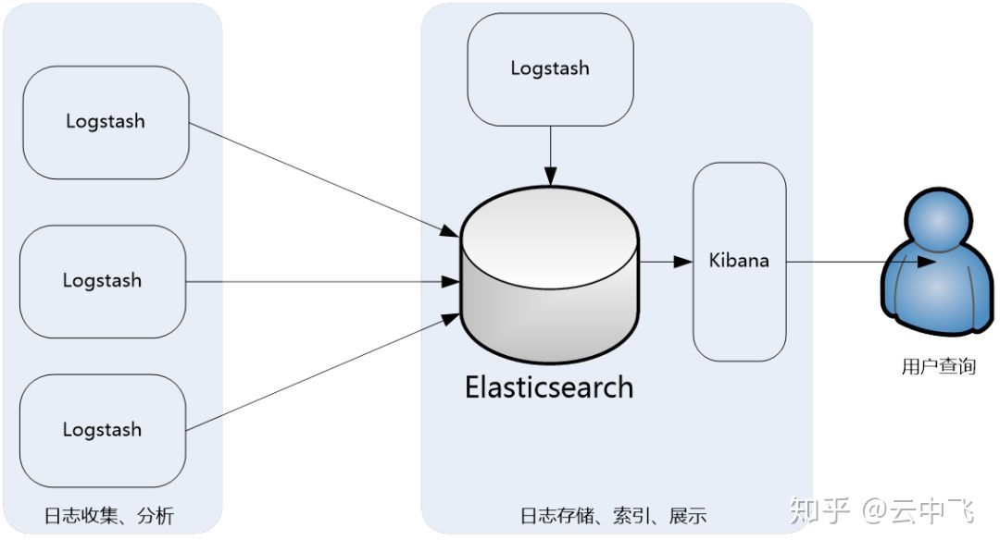
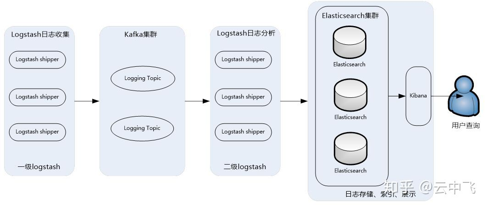
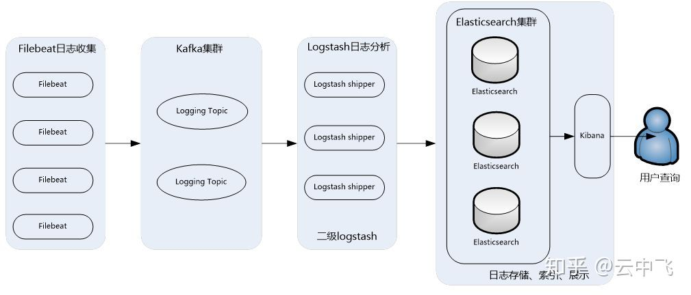

# 运维技能图谱

> **[原文链接](https://zhuanlan.zhihu.com/p/66525026）

运维是一个融合多学科(网络、系统、开发、安全、应用架构、存储等)的综合性技术岗位，从最初的网络管理（网管）发展到现在的系统运维工程师、网络运维工程师、安全运维工程师、运维开发工程师等，可以看出，运维的分工一直在细化，并且对综合技能要求越来越高，可以看出，未来运维的发展趋势是高、精、尖，高表示高度，精表示精通，尖表示尖端，也就是运维职场一定要站在一定的技术高度，在多个技术领域中，要精通某项技能，同时对尖端前沿技术一定要能掌控趋势。

## 一、运维职位的发展和趋势
根据不同的运维领域和技术面以及分工流程三个方面来了解下2019年运维职位的发展趋势。

 
1、按领域来划分
1）、基础设施运维：IDC/网络运维、服务器/存储设备运维
2）、系统运维：系统中间件运维、云计算平台运维
3）、数据运维：数据库运维、大数据技术平台运维
4）、应用运维：应用软件系统
5）、云平台运维：公有云平台运维
6）、容器运维：基于容器服务的运维

 
2、按技术切面来分
1）、安全运维
2）、性能运维
3）、数据运维
4）、集成运维

 
3、按流程来划分
1）、构建/持续集成、发布
2）、安装部署、升级、迁移、合并、扩展
3）、配置、初始化、配置变更
4）、备份、传输、恢复
5）、日志、监控、预警
6）、诊断排查、优化

## 二、系统运维技能图谱

系统运维是运维的基础，新的一年中，对基础运维技能要求也在提高，打好系统运维基础，才能深入学习后面的各种运维技能。

下图列出了系统运维要掌握的必备技能：

 

## 三、web运维技能图谱

web运维是运维岗位中岗位最多的一个，薪资也相对较高，但需要掌握的知识点也比较多，新的技能要掌握，老的运维技能也不能丢，下图列出了web运维要掌握的各种必备技能

 

## 四、大数据运维技能图谱

大数据从2017年开始逐渐走到生活的各个角落，2018年在逐渐落地，而在2019年，大数据依然火热，加上国家对大数据产业的扶持，大数据产业在新的一年岗位需求一定会更加大，因此掌握大数据运维技能，就走在了运维的前沿，下图列出了大数据运维要掌握的各种必备技能

 

## 五、容器运维技能图谱

容器的产生，是一次IT行业的革命，2015 年到 2016 年，是业界普遍认为的容器技术爆发的一年，短短一年多时间里，容器技术在中国大陆完成了从零星概念到烽火燎原的壮举

时至今日，容器技术在国内大多数企业中落地已成为一种共识，而国内的生态系统，也呈现出了企业产品、开源社区和公有云齐头并进的良好局面。因此，2019年也是容器继续快速落地的一年，下图列出了大数据运维要掌握的各种必备技能

 

## 六、数据为王的时代

万丈高楼平地起，高楼稳不稳取决于地基是否扎实。运维数据便是运维管理这座高楼的地基。运维数据大致分为CMDB、日志、生产DB、知识库四个方面。

CMDB中文是配置管理数据库，存储与管理企业IT架构中设备的各种配置信息，主要是IT资产管理信息。

日志数据保护了企业服务器上运行的各种系统产生的应用日志，系统日志、设备日志、数据库日志等数据，这部分数据是企业数据的核心。

DB数据主要是所有IT系统的数据库信息，包括运维管理系统本身的数据库，数据库包含生产数据库、测试数据库、开发数据库三种类型。

知识库主要存储日常开发、测试、运维管理中发生的事件、问题以及一些经典问题的解决和常用的解决方案，主要起到运维管理辅助的功能。

对数据的维护和管理只管重要，特别是日志数据，对运维来说，通过日志可以比较准确全面地知道系统或是设备的运行情况，可以返查问题产生的原因，还原问题发生的整个过程。通过日志也可以提前预测系统可能要发生的问题或是故障，如系统安全日志，如果网络攻 击会在系统安全日志中有一定的体现。

下面简单介绍下，运维重点收集的日志数据有哪些部分以及用途。

### 1、系统日志
系统日志主要指的是操作系统的日志，主要在/var/log下的各种日志信息。包含系统操作日志、系统安全日志、定时任务日志等。系统日志是运维管理安全模块中审计的重要依据。一般默认的操作系统日志不能满足要求，需要对系统的参数进行修改，如为history命令加上时间戳、IP，并且长久保留历史等功能。并且对日志文件进行处理，不允许用户进行清空命令，只能追加。

### 2、应用日志
应用日志主要记录应用服务的健康运行情况以及业务操作的具体日志两部分。应用监控运行情况反应应用服务的健康状态，如果应用占用CPU或是内存过高或是忽高忽低不定，都可以通过分析应用日志结合业务操作日志得出结论。业务操作日志可以为业务审计提供主要依据。有一些系统喜欢把业务操作日志写到数据库中，这个也是需要注意的。不过不管在哪个地方，要求是不可缺少的，它为以后业务审计和问题返查提供依据。

### 3、数据库日志

数据库日志主要反馈数据库的运行情况。通过监控和管理数据库的日志，及时了解数据库的运行情况，遇到问题及时解决等。可以通过数据库日志结合数据库系统自带的数据库如Oracle的系统视图v$开头，MySQL的performance_schema等。虽然数据库的一些信息不是存在日志中而是在数据库里面，但是也可以作为数据库日志的一部分进行管理和监控，已便我们及时知道数据库的监控状况，从而预防可能出现的问题。

### 4、设备日志

设备日志一般是一个比较容易忽略的地方，但设备日志往往可以反映设备的运行情况。交换机故障，防火墙故障等设备故障都可能引起大面积的系统和服务故障。所以设备日志一定要收集，分析和监控预警。常用的设备日志有交换机日志、防火墙日志、网络安全设备日志等。

这么多的日志，运维要通过各种手段完成日志的收集、过滤分析、可视化展示，那么如何实现这些功能呢，方法很多，例如ELK集成套件（Elasticsearch , Logstash, Kibana）就可以轻松实现日志数据的实时收集、分析传输以及图形化展示。

Elasticsearch是个开源分布式搜索引擎，提供搜集、分析、存储数据三大功能。它的特点有：分布式，零配置，自动发现，索引自动分片，索引副本机制，restful风格接口，多数据源，自动搜索负载等。

Logstash主要是用来日志的搜集、分析、过滤日志的工具，支持大量的数据获取方式。一般工作方式为c/s架构，client端安装在需要收集日志的主机上，server端负责将收到的各节点日志进行过滤、修改等操作在一并发往elasticsearch上去。

Kibana 也是一个开源和免费的工具，Kibana可以为 Logstash 和 ElasticSearch 提供的日志分析友好的 Web 界面，可以帮助汇总、分析和搜索重要数据日志。

另外，还有Filebeat可以替换Logstash作为日志收集工具，Filebeat隶属于Beats。目前Beats包含四种工具：

* Packetbeat（搜集网络流量数据）
* Topbeat（搜集系统、进程和文件系统级别的 CPU 和内存使用情况等数据）
* Filebeat（搜集文件数据）
* Winlogbeat（搜集Windows事件日志数据）

可以看到，Beats涵盖了所有收集日志数据的各个方面。

那么要如何使用ELK呢，根据日志量的不同，对应的ELK架构也不尽相同，看下面几个常见架构：

 

此架构主要是将Logstash部署在各个节点上搜集相关日志、数据，并经过分析、过滤后发送给远端服务器上的Elasticsearch进行存储。Elasticsearch再将数据以分片的形式压缩存储，并提供多种API供用户查询、操作。用户可以通过Kibana Web直观的对日志进行查询，并根据需求生成数据报表。
此架构的优点是搭建简单，易于上手。缺点是Logstash消耗系统资源比较大，运行时占用CPU和内存资源较高。另外，由于没有消息队列缓存，可能存在数据丢失的风险。此架构建议供初学者或数据量小的环境使用。

由此衍生出来了第二种架构：

 

此架构主要特点是引入了消息队列机制，位于各个节点上的Logstash Agent（一级Logstash，主要用来传输数据）先将数据传递给消息队列（常见的有Kafka、Redis等），接着，Logstash server（二级Logstash，主要用来拉取消息队列数据，过滤并分析数据）将格式化的数据传递给Elasticsearch进行存储。最后，由Kibana将日志和数据呈现给用户。由于引入了Kafka（或者Redis）缓存机制，即使远端Logstash server因故障停止运行，数据也不会丢失，因为数据已经被存储下来了。

这种架构适合于较大集群、数据量一般的应用环境，但由于二级Logstash要分析处理大量数据，同时Elasticsearch也要存储和索引大量数据，因此它们的负荷会比较重，解决的方法是将它们配置为集群模式，以分担负载。

此架构的优点在于引入了消息队列机制，均衡了网络传输，从而降低了网络闭塞尤其是丢失数据的可能性，但依然存在Logstash占用系统资源过多的问题，在海量数据应用场景下，可能会出现性能瓶颈。

最后，还有第三种架构：

 

这个架构是在上面第二个架构基础上改进而来的，主要是将前端收集数据的Logstash Agent换成了filebeat，消息队列使用了kafka集群，然后将Logstash和Elasticsearch都通过集群模式进行构建，此架构适合大型集群、海量数据的业务场景，它通过将前端Logstash Agent替换成filebeat，有效降低了收集日志对业务系统资源的消耗。同时，消息队列使用kafka集群架构，有效保障了收集数据的安全性和稳定性，而后端Logstash和Elasticsearch均采用集群模式搭建，从整体上提高了ELK系统的高效性、扩展性和吞吐量。

七、用大数据思维做运维监控
大数据分析最早就来源于运维人的日志分析，到逐渐发展对各种业务的分析，人们发现这些数据蕴涵着非常大的价值，通过实时监测、跟踪研究对象在互联网上产生的海量行为数据，进行挖掘分析，揭示出规律性的东西，提出研究结论和对策。这就是大数据的用途。

同样，通过大数据分析，我们可以得到各种指标，例如：

1、在业务层面，如团购业务每秒访问数，团购券每秒验券数，每分钟支付、创建订单等。

2、在应用层面，每个应用的错误数，调用过程，访问的平均耗时，最大耗时，95线等

3、在系统资源层面：如cpu、内存、swap、磁盘、load、主进程存活等

4、在网络层面： 如丢包、ping存活、流量、tcp连接数等

而这些指标，刚好是运维特别需要的东西。通过大数据分析出的这些指标，可以解决如下方面的问题：

* 系统健康状况监控
* 查找故障根源
* 系统瓶颈诊断和调优
* 追踪安全相关问题

那么如何用大数据思维做运维呢，大数据架构上的一个思维就是：提供一个平台让运维方便解决这些问题， 而不是，让大数据平台去解决出现的问题

基本的一个大数据运维架构是这样的：

 

对于运维的监控，利用大数据思维，需要分三步走：

* 获取需要的数据
* 过滤出异常数据并设置告警阀值
* 通过第三方监控平台进行告警

所有系统最可靠的就是日志输出，系统是不是正常，发生了什么情况，我们以前是出了问题去查日志，或者自己写个脚本定时去分析。现在这些事情都可以整合到一个已有的平台上，我们唯一要做的就是定义分析日志的的逻辑

## DevOps常用工具集清单
Operating Systems
Linux (RHEL, CentOS, Ubuntu,CoreOS)
Unix (Solaris, AIX, HP/UX, etc.)
Windows
Mac OS X
Infrastructure as a Service
Amazon Web Services
Azure
OpenStack
Aliyun
Virtualization Platforms
VMware
VirtualBox
Vagrant
Containerization Tools
Docker
Rocket
Kubernetes
Linux OS Installation
Kickstart
Cobbler
Stacki
Foreman
Configuration Management
Ansible
Puppet
Chef
Salstack
Compile and Build Systems
Gradle
Maven
Ant
Integration System
Jenkins
Hudson
Bamboo
Application Servers
JBoss
Tomcat
Jetty
Glassfish
Weblogic
Web Servers
Nginx
Apache
Queues, Caches
ActiveMQ
RabbitMQ
Memcache
Databases
Percona Server
MySQL
PostgreSQL
MongoDB
Cassandra
Redis
Oracle
MS SQL
Monitoring, Alerting, and Trending
Nagios
Graphite
Ganglia
Cacti
PagerDuty
Logging
PaperTrail
Logstash
Loggly
ELK
Splunk
Process Supervisors
Monit
Runit
Supervisor
God
Security
Snorby Threat Stack
Tripwire
Snort
Miscellaneous Tools
Multihost SSH Wrapper
Code Climate

