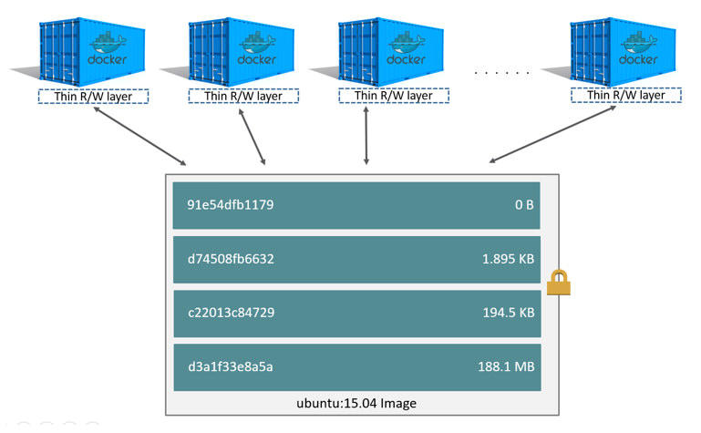

# Docker 基础学习笔记

## 参考 && 扩展

> * [Docker 最佳实践之多阶段构建](https://www.hi-linux.com/posts/55545.html)
> * [如何 10 步 Docker 化一个应用](https://www.hi-linux.com/posts/57498.html)
> * [10张图带你深入理解Docker容器和镜像](http://dockone.io/article/783)
> * [Dockerfile 最佳实践及示例](http://dockone.io/article/9551)
> * [Docker容器安全性分析](http://dockone.io/article/9550)

## 目录

* **[Docker 常用命令](#docker-常用命令-top)**
* **[Docker 基础架构](#docker-基础架构-top)**
* **[Docker 原理简述](#docker-原理简述-top)**
* **[Dockerfile - 构建自定义镜像](#dockerfile---构建自定义镜像-top)**
* **[Docker 多阶段构建](#docker-多阶段构建-top)**
* **[Docker Compose - 编排操控容器](#docker-compose---编排操控容器-top)**
* **[Docker Machine - 创建管理容器宿主机](#docker-machine---创建管理容器宿主机-top)**
* **[Docker Swarm](#docker-swarm-top)**


## Docker 常用命令 [[Top]](#目录)

**`命令手册查看`**

* **`docker`** | **`man docker`**
* **`man docker <command>`**  | **`docker <command> -h`** 
* **`docker-machine`** 
* **`docker-machine <command> --help`**

**`docker`**

* **`docker [options] COMMAND`**
* **`docker version`** - 显示 docker 版本信息
* **`docker search 关键字`** - 默认从 docker hub 搜索指定镜像
* **`docker pull 镜像名:tag`** - 拉取镜像
* **`docker images`** - 列出已安装的镜像
* **`docker rmi [i-id]`** - 删除指定镜像
* **`docker rm [c-id]`** - 删除指定容器
* **`docker ps`** -  查看运行中的容器 `-a` 查看所有容器
* **`docker start|stop|restart [c-id]|[c-name]`** - 通过容器 id 或容器名运行 / 关闭容器
* **`docker run`** - 在隔离容器中运行命令
* **`docker run --name [c-name] -d -p 3306:3306 mysql`**  - docker 启动容器
  * `--name` - 自定义容器名
  * `-p` - 端口映射，`-p 宿主机端口:容器端口`
  * `-d` - 守护进程
* **`docker run volume`** - 数据卷、数据卷容器
* **`docker run -v|--volume[=[[HOST-DIR:]CONTAINER-DIR[:OPTIONS]]] ...`** - 添加一个数据卷
* **`docker rm -v`** - 删除容器和容器绑定的数据卷
* **`docker run --rm`** - 在关闭容器后也会自动删除容器和容器绑定的数据卷
* **`docker run -it -v /dbdata --name dbdata ubuntu`** - 创建一个数据卷容器 dbdata ，并在其中创建一个数据卷挂载到 /dbdata
* **`docker run -it --volumes-from dbdata --name db1 ubuntu`** - 创建 db1 容器，并从 dbdata 容器挂载数据卷
*  **`docker logs container-name/[c-id]`** - 查看容器日志
* **`Ctrl+P+Q`** - 退出容器交互式界面，但不关闭容器
* **`docker attach`** - 将本地输入、输出、错误流附加到正在运行的容器
* **`docker commit`**—从当前更改的容器状态创建新镜像
* **`docker exec`**—在活动或正在运行的容器中运行命令
  * `docker exec -it container command`
* **`docker history [i-id]`** - 显示镜像历史记录
* **`docker info`** - 显示系统范围信息
* **`docker inspect [img|con]`** - 查找 docker 指定容器和镜像的系统级信息
* **`docker login --username=xxx --email=xxx`** - 登录到本地注册表或 Docker Hub
* **`docker pull`** - 从本地注册表或 Docker Hub 中提取镜像或存储库

* **`docker inspect --format="{\{ \.Volumes }}" [container]`** - 查看宿主机上对应容器数据卷位置

**`docker network`** - 管理网络

* **`docker network ls`**
* **`docker network connect`**
* **`docker network create`**
* docker network disconnect
* docker network inspect
* docker network prune
* docker network rm

## Docker 基础架构 [[Top]](#目录)

* 常说的 Docker 又称为 Docker Engine

* C/S 架构 - 客户端、服务器两大组件
* 客户端可以通过 **socket** 或 **RESTful API** 与服务器进行通信
* **`Docker Engine`** = **`Docker 守护进程`** + **`REST API （指定与守护进程交互的接口）`** + **`命令行接口（CLI）（与守护进程通信，通过封装 REST API）`**

<div align=center>
    <br/>
</div>

### 服务端

#### 四大组件

1、**`dockerd`**

``` bash
$ ps -ef | grep dockerd
root      3769     1  0 Dec02 ?        00:01:08 /usr/bin/dockerd -H fd:// --containerd=/run/containerd/containerd.sock
```

2、**`docker-proxy`**

dockerd 子进程，当容器启动并使用端口映射时才会执行，负责配置容器的端口映射规则

```bash
$ ps aux | grep docker-proxy
root     24923  0.0  0.0 700716  4656 ?        Sl   13:19   0:00 /usr/bin/docker-proxy -proto tcp -host-ip 0.0.0.0 -host-port 8011 -container-ip 172.17.0.2 -container-port 80
root     24937  0.0  0.0 626728  3824 ?        Sl   13:19   0:00 /usr/bin/docker-proxy -proto tcp -host-ip 0.0.0.0 -host-port 2222 -container-ip 172.17.0.2 -container-port 2222
```

3、**`containerd`**

dockerd 子进程


4、**`containerd-shim`**

containerd 子进程

### 客户端


## Docker 原理简述 [[Top]](#目录)

### 命名空间 - namespace

* 操作系统中，进程间共享的资源有内核、文件系统、网络、进程号 ( Process ID, PID )、用户号 ( User ID，UID )、进程间通信 ( InterProcess Communication，IPC )等。Linux 命名空间就是为了实现以上的相互隔离，保证了容器之间彼此互补影响

1、**`进程命名空间`**

2、**`IPC 命名空间`**

* IPC - Interprocess Communication - 进程间交互
* 容器中的进程交互还是采用 Linux 常见 IPC，包括信号量、消息队列、共享内存等方式

3、**`网络命名空间`**

4、**`挂载命名空间`**

5、**`UTS 命名空间`**

* UTS - UNIX Time-sharing System

6、**`用户命名空间`**

### 控制组 - Control Groups - CGroups

* Linux 内核特性，主要用来对共享资源进行隔离、限制、审计等
* 限制资源配额，比如某个容器只能使用 100M 内存

### 联合文件系统 - Union File System - UnionFS

**[参考]**

> * [DOCKER基础技术：AUFS - 201508](https://coolshell.cn/articles/17061.html)

* UnionFS 是一种分层、轻量级并且高性能的文件系统，可以把不同物理位置的目录合并 mount 到同一个目录中
* UnionFS 的一个最主要的应用是，把一张 CD/DVD 和一个硬盘目录给联合 mount 在一起，然后，你就可以对这个只读的 CD/DVD 上的文件进行修改
* Docker 的镜像与容器就是分层存储，可用的存储引擎有 aufs、overlay 等，在 `/var/lib/docker ` 下查看若有 aufs 目录，则使用的是 aufs 文件系统，若是 overlay 则是 overlay 文件系统分层镜像
* 只读层 - Read Layer - 镜像层
* 读写层 - Read Write Layer - 容器层


<div align=center>
    <br/>容器就是由存储 image 的只读层和读写层构成
</div>

* 容器需要修改只读层的文件，会先从只读层拷贝一份到读写层，再修改它，实际上修改的是副本。但修改后，只读层对应的文件就“隐藏” 起来了

* 容器的只读层 ( 镜像 ) 是共享的，也就是当同一镜像创建的多个容器时，其实只是创建了多个读写层，删除容器时，就只是删除容器的读写层。而且读写层也是在容器操作产生数据时才消耗资源，所以创建容器的成本很小！

<div align=center>
    <br/>镜像作为只读层是共享的，而容器在镜像之上附加了一层可写层
</div>

* docker engine 是共享宿主机操作系统的，容器又是共享 image 的（只读层共享），所以容器启动成本很小！

## Dockerfile - 构建自定义镜像 [[Top]](#目录)

* Dockerfile 一般分为：基础镜像、镜像元信息、镜像操作指令和容器启动时执行指令
* Dockerfile 行注释：`#`
* Dockerfile 换行符：`\`
* Dockerfile 的指令是顺序执行的

|                  指令                   |                          说明                           |
| :-------------------------------------: | :-----------------------------------------------------: |
|           FROM [image]:[tag]            |             基础镜像，省略 tag 则是 latest              |
|      LABLE [k1]=[v1] [k2]=[v2]...       | 为镜像添加元数据,多用于声明构建信息，作者、机构、组织等 |
|       ENV [k] [v] or ENV [k]=[v]        |                 环境变量，${k} 引用变量                 |
|           ARG [name]=[value]            |                    构建运行时的变量                     |
|             WORKDIR [path]              |          工作目录，其他指令都会在这个目录执行           |
|            ADD [src] [dest]             |                **本地文件**添加到镜像中                 |
|            COPY [src] [dest]            |          同上，但不会自动解压tar和访问网络资源          |
|              RUN [command]              |             构建镜像时执行的命令，shell模式             |
| `RUN ["<command>", "<arg1>", "<arg2>"]` |              RUN exec执行格式，命令行模式               |
| `CMD ["<command>", "<arg1>", "<arg2>"]` |                 容器启动时才执行的命令                  |
|               ENTRYPOINT                |                可以覆盖 CMD ，下面有详解                |
|        EXPOSE [port1] [port2]...        |                 声明镜像内服务监听端口                  |
|     `VOLUME ["<src1>","<src2>"...]`     |                 创建镜像内数据卷挂载点                  |
|      USER [UID]\|[Username]\|[GID]      |                   指定运行指令的用户                    |
|          ONBUILD [INSTRUCTION]          |     当所构建的镜像被用做其他镜像的基础镜像时被触发      |

> * RUN 指令创建的中间镜像会被缓存，并会在下次构建中使用，如果不想使用缓存镜像，可在构建时指定 `--no-cache` 参数
> * EXPOSE 只是声明作用，并不会自动完成端口映射，启动容器时候还是需要添加 `-P` 或 `-p`
> * VOLUME 和 EXPOSE 类似，不会自动挂载数据卷，需要启动容器时使用 `-v` 

#### **`ADD`** 和 **`COPY`**


#### **`CMD` 、 `ENTRYPOINT`**  和 **`docker run ... [command]`**

> **`docker run ... [command]`** 是指执行 `docker run` 时跟在最后面的容器启动命令

* **`CMD`** 、**`ENTRYPOINT`**  和 **`docker run ... [command]`** 都可以设定容器启动时执行的命令
* **`ENTRYPOINT`**  >  **`docker run ... [command]`** > **`CMD` **
  * 当存在 **`ENTRYPOINT`** 时，**`ENTRYPOINT`**  会将  **`docker run ... [command]`** 和 **`CMD` ** 中指定的参数传入
  * 当不存在 **`ENTRYPOINT`** ，但存在 **`docker run ... [command]`** ，会覆盖 **`CMD` **
  * 当既不存在 **`ENTRYPOINT`** 也不存在 **`docker run ... [command]`**，则默认执行 **`CMD` **

* **通常在 Dockerfile 中使用 `ENTRYPOINT`指定容器启动时的命令同时用 `CMD` 指定默认命令参数，这样在 `docker run` 时既可以添加参数，也可以不添加使用 `CMD` 的默认参数**
* 一个 Dockerfile 最多只能有一个 **`CMD` 和 `ENTRYPOINT`**，如果有多个，只有最后一个生效

**`CMD`** 的三种用法：

* `CMD ["executable","param1","param2"]`  (exec form, this is the preferred form，命令行模式 )
* `CMD ["param1","param2"]`  (as default parameters to ENTRYPOINT)
* `CMD command param1 param2`  (shell form，shell 模式 )

**`ENTRYPOINT`** 的两种用法：

* `ENTRYPOINT ["executable", "param1", "param2"]` (exec form, preferred)

* `ENTRYPOINT command param1 param2` (shell form)

## Docker Compose - 编排操控容器 [[Top]](#目录)

**`安装`**

```bash
# Linux
$ sudo curl -L https://github.com/docker/compose/releases/download/1.18.0/docker-compose-`uname -s`-`uname -m` -o /usr/local/bin/docker-compose
$ sudo chmod +x /usr/local/bin/docker-compose
$ docker-compose --version
```

**`常用命令`**

* **`docker-compose [-f <arg>...] [options] [COMMAND] [ARGS...]`**

* **`docker-compose`** 
* **`docker-compose <command> -h`** 

1、编写需要重复生成应用 ( app ) 的 **Dockerfile**

> 一般一个容器里一个应用，比如 mysql 数据库

2、定义用于编排多个应用以组成服务 ( service ) 的 **docker-compose.yml** 

> 一个服务一般由多个应用组成，比如 web service 可以由 nignx 负载均衡器、tomcat web 服务器、mysql 数据库服务器等组成

3、`docker-compose up`

* docker-compose 本身没有构建镜像的功能，如果容器镜像是直接从 docker registry 拉取，则不需要 Dockerfile ；但如果需要基于基础镜像构建新的镜像，则需要使用 Dockerfile


## Docker Machine - 创建管理容器宿主机 [[Top]](#目录)

**`简介`**

* docker-machine 可以在本地、云端服务器快速创建包含 Docker Engine 的虚拟机，但不能在虚拟机中创建（虚拟机中不能再创建虚拟机）
* docker-machine 可以启动、审查、停止和重新启动托管的宿主机、升级 Docker 客户端和守护程序、并配置 Docker 客户端与你的宿主机通信
* 也可以使用 Ansible 等 DevOps 工具实现对 Docker 环境的自动化管理
* 本质上 docker-machine 是一个虚拟机管理工具，它通过创建一个安装好docker 的虚拟机（支持 VirtualBox，DigitalOcean，EC2 等），并设置对应的环境变量（ DOCKER_HOST，DOCKER_MACHINE_NAME 等），使得本地的 docker 工具获得透明远程操作虚拟机的能力。从而使本身不支持 docker 的 Windows 和 Mac 系统能够直接使用 docker 命令

**`常用命令`**

* **`docker-machine`**  - 查看常用命令
* **`docker-machine <command> --help`** - 查看常用命令帮助

**`安装`**

> https://github.com/docker/machine/releases/

```bash
$ curl -L https://github.com/docker/machine/releases/download/v0.16.2/docker-machine-`uname -s`-`uname -m` >/usr/local/bin/docker-machine
$ chmod +x /usr/local/bin/docker-machine
```

**`常用命令`**

* **`docker-machine [OPTIONS] COMMAND [arg...]`**
* **`docker-machine` - 查看常用命令**
* **`docker-machine COMMAND -h` - 查看具体某一个命令功能** 

**`解决首次运行慢`**

> 第一次运行 `docker-machine create` 会去 https://github.com/boot2docker/boot2docker/releases/ 下载一个最新的 57M 的 boot2docker.iso 镜像，国内下载会很慢

``` bash
# 1. 下载 boot2docker.iso  最新版本到本地 - https://github.com/boot2docker/boot2docker/releases/
# 2. 移动 boot2docker.iso  到 ~/.docker/machine/cache/
$ mv boot2docker.iso ~/.docker/machine/cache/
# 3. 指定本地的 boot2docker.iso 路径，并跳过网络检查创建新的 docker machine ，命名为 default
$ docker-machine create default -d virutalbox --virtualbox-boot2docker-url=/home/`whoami`/.docker/machine/cache/boot2docker.iso 
# --virtualbox-boot2docker-url  手动指定了boot2docker.iso 位置
```

**`配置当前shell docker server`**

```bash
$ docker-machine env default
export DOCKER_TLS_VERIFY="1"
export DOCKER_HOST="tcp://192.168.99.100:2376"
export DOCKER_CERT_PATH="/home/xcq/.docker/machine/machines/default"
export DOCKER_MACHINE_NAME="default"
# Run this command to configure your shell: 
# eval $(docker-machine env default)
$ eval $(docker-machine env default)
# 执行上面命令即可切换 docker server 为 default 主机中 docker server
```


## Docker Swarm [[Top]](#目录)

