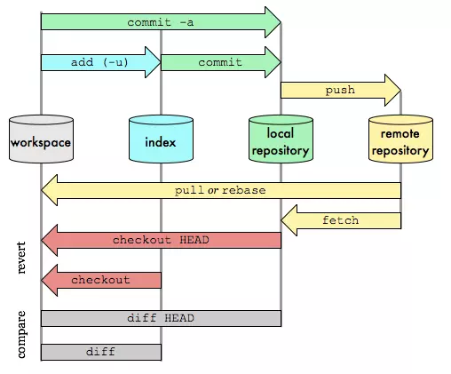

# Git 学习笔记

## 【参考】

> * [常用 Git 命令清单](https://www.hi-linux.com/posts/60426.html)
> * [Git 简明指南](https://www.hi-linux.com/posts/3337.html)
> * [图解Git](http://marklodato.github.io/visual-git-guide/index-zh-cn.html)
> * [Github 帮助](https://help.github.com/cn)
> * [Git 官方文档](https://book.git-scm.com/)
> * [Git远程操作详解 - 阮一峰](https://www.ruanyifeng.com/blog/2014/06/git_remote.html)

## 目录

**[常用命令](#常用命令)**

**[Github加速](#github-加速)**

**[查看变更内容 - git diff](#查看变更内容---git diff)**

**[回退](#回退)**

**[建立、删除、修改跟踪关系](#建立、删除、修改跟踪关系)**

## Git安装指引

Git是一个开源的分布式版本控制系统，可以有效、高速的处理从很小到非常大的项目版本管理，是目前使用范围最广的版本管理工具。

**安装前准备**

1. 准备一台linux主机， 本安装指引以腾讯云上的虚拟机为例。
2. 网络可通外网，需下载git软件。
以下安装配置操作均在root用户下执行。

**安装配置**

1、安装依赖包

```
yum -y install curl-devel expat-devel gettext-devel openssl-devel zlib-devel
yum -y install gcc perl-ExtUtils-MakeMaker
```

2、删除已有的git

```
yum remove git
```

3、下载git源码

切换目录：

```
cd /usr/src
```

下载安装包：

```
wget https://www.kernel.org/pub/software/scm/git/git-2.8.3.tar.gz
```

4、配置安装

解压安装包：

```
tar -zxvf git-2.8.3.tar.gz

```

配置git安装路径：

```
cd git-2.8.3
./configure prefix=/usr/local/git/
```

编译安装：

```
make && make install
```

git已经安装完毕。

5、将git指令添加到用户bash中

```
vi /etc/profile
```

在最后一行加入

```
export PATH=$PATH:/usr/local/git/bin
```

执行以下命令让该配置文件立即生效

```
source /etc/profile
```

6、检查

查看git版本号：

```
git --version
```

能显示git的版本， 则安装配置已成功。

7、初始化本地代码库

在当前目录新建一个Git代码库

```
git init
```

## 常用命令

> * Workspace：工作区
> * Index / Stage：暂存区
> * Repository：仓库区（或本地仓库）
> * Remote：远程仓库

* **`工作区`** -> **`git add`** - > **`暂存区`**  -> **`git commit`** -> **`本地仓库`** -> **`git push`** -> **`远程仓库`**
* ，后续 `git commit`就是往 master 上提交





* **`git init`** - 初始化 git 仓库，`git init` 时默认创建了一个 master 分支
* **`git init [RepName]`** - 新建一个目录 RepName，并将其初始化为 git 本地仓库
* **`git ls-files`** - 查看暂存区文件
* **`git rm [file]`** - 同时删除工作区和暂存区 file
* **`git mv [file1] [file2]`** - 在工作区和暂存区同时重命名 file1 为 file2
* **`git commit -m <message>`** - 提交 ( commit ) 暂存区到本地仓库，message 是本次提交说明
* **`git commit -a -m <message>`** - 会自动暂存 modified、deleted，但不会暂存 untracked 文件，然后 commit

#### **`git config`**

* **`git config`** - 修改 `./.git/config` 配置文件，当前仓库配置，相同配置会覆盖用户和系统配置
* **`./.git/config`** - 在 git 仓库目录下执行该命令，同 `git config`
* **`git config --global`** - 修改 `~/.gitconfig` 配置文件，当前用户配置，会覆盖系统配置
* **`git config --system`** - 修改 `/etc/gitconfig` 配置文件，系统配置
* **`git config -l[--list]`** - 显示 system、global、local 配置
* **`git config --local --list`** - 显示当前仓库配置
* **`git config --global --list`** - 显示用户配置
* **`git config --system --list`** - 显示系统配置
* **`git config [--global] user.name "[name]"`** - 设置提交代码时的用户名
* **`git config [--global] user.email "[email]"`** - 设置提交代码时的用户邮箱
* **`git config [--global] http.https://github.com.proxy socks5://127.0.0.1:1080`** - 配置 git github socks5 代理，执行 git 命令时只对 github 代理
* **`git config [--global] https.https://github.com.proxy socks5://127.0.0.1:1080`** - 配置 git github socks5 代理 
* **`git config [--global] --unset http.https://github.com.proxy`** - 取消 github git 代理

#### **`git add`**

* **`git add <file>`** - 工作区把 file 添加到暂存区
* **`git add -u`** - 可以暂存 ( stage ) 工作区 modified、deleted 文件，但不能暂存 untracked 文件
 * **`git add --ignore-removal .`** - 可以暂存工作区 modified、untracked 文件，但不能暂存 deleted 文件
* **`git add .`** - git 2.0+ 版本中，和 `git add -A` 功能一样，可以暂存工作区 modified、deleted、untracked 文件
* **`git add -A`** - 暂存工作区所有文件变化 ( modified、deleted、untracked  )

#### **`git status`**

* **`git status`** - 查看工作区和暂存区文件修改状态
* **`git status -s`** - `git status` 输出精简版

#### **`git log`**

* **`git log`**  - 查看本地仓库 commit 记录
* **`git log --pretty=oneline`**  - 查看本地仓库 commit 记录及对应 commit ID，以单行形式展示
* **`git reflog`** - 可以查看所有分支对当前仓库的操作记录 ( commit / reset / checkout / merge / etc ) 以及操作的 commit ID ( 方便回退到某个操作时版本状态 )

#### **`git reset`**

* **`git reset HEAD <file>`** -  **暂存区撤销 file 修改**，把暂存区内关于 file 的修改回退到工作区
* **`git reset --hard HEAD^`** - 本地仓库回退到上一次 commit 版本
* **`git reset --hard HEAD~5`** - 本地仓库回退到 5 次 commit 前版本
* **`git reset --hard <commit_ID>`** - 本地仓库跳到 commit_ID 对应的 commit 版本

#### **`git diff`**


* **`git diff file`** - 查看 file **工作区**和**暂存区**里的区别
* **`git diff HEAD`** - 查看工作区与当前分支最新commit之间的差异
* **`git diff HEAD -- file`** - 查看文件 file **工作区**和**当前本地仓库**之间的差异
* **`git diff --cached`** - 查看已暂存未提交的内容，及查看**暂存区**和**本地仓库**里的区别

#### **`git checkout`**


* **`git checkout <分支名>`** - 切换到其他分支，并更新工作区
* **`git checkout -b <newbranch>`** - 创建并切换到 newbranch 分支 
* **`git checkout -`** - 切换到上一分支
* **`git checkout -- <file>`** - **工作区撤销 file 修改**，工作区的 file 回退到最近一次 `git commit` 或 `git add` 时的状态
* **`git merge <branch>`** - 合并 branch 分支到当前分支
* **`git cherry-pick <commit_ID>`** - 选择一个 commit，合并到当前分支

#### **`git switch`**


* **`git switch -c <branch>`** - 切换到 branch 分支，最新版切换分支方式
* **`git switch master`** - 切换到本地仓库的 master 主分支

#### **`git branch`**


* **显示所有分支和用 `*` 标记当前所在分支**
* **`git branch -r`** - 列出所有远程分支
* **`git branch -a`** - 列出所有本地分支和远程分支
* **`git branch <分支名>`** - 新建一个分支，但依旧停在当前分支
* **`git branch -d <分支名>`** - 删除分支 ( 删除不了当前分支，需要先切换到其他分支; 也删除不了未合并的分支 )
* **`git branch -D <分支名>`** - 强制删除分支
* **`git branch -vv`** - 查看本地分支和远程分支的跟踪关系
* **`git branch --set-upstream-to=<主机名>/<分支名> <本地分支名>`** - 为本地分支创建跟踪分支，跟踪远程主机的某个分支

#### **`git clone`**

* **`git clone [-o <主机名>] <版本库的网址> [<本地目录名>]`**
  * **`git clone <版本库的网址>`** - 从远程主机克隆一个版本库到本地，且默认生成的本地仓库名就是远程版本库名
  * **`<本地目录名>`** - 指定克隆到本地的版本库名字，
  * **`-o <主机名>`** - 克隆并指定远程主机名，默认是 origin

#### **`git remote`** 


* **列出所有远程主机名**
* **`git remote -v`** - 参看远程主机的网址
* **`git remote show <主机名>`** - 查看远程主机详细信息
* **`git remote add <主机名> <版本库的网址>`** - 添加远程主机
* **`git remote add origin git@github.com:username/reponame.git`** - 本地 git 仓库关联 github 上的仓库
* **`git remote rm <主机名>`** - 删除远程主机
* **`git remote rename <原主机名> <新主机名>`** - 远程主机重命名

#### **`git fetch`**


* **`git fetch <远程主机名>`** - 将某个远程主机的更新，全部取回本地
* **`git fetch <远程主机名> <分支名>`** - 取回远程主机特定分支的更新，默认取回所有分支的更新
* **`git fetch origin master:temp`** - 从远程的 origin 仓库的 master 分支下载到本地，并新建一个 temp 分支

#### **`git pull`**

* **取回远程主机某个分支的更新，再与本地的指定分支合并**


* **`git pull <远程主机名> <远程分支名>:<本地分支名>`**
  * **`git pull <远程主机名> <远程分支名>`** - 远程主机指定分支与本地当前分支合并
  * **`git pull <远程主机名>`** - 当前分支设置了跟踪分支
  * **`git pull`** - 当前分支只设置了一个跟踪分支
* **`git pull -p`** - 在本地删除远程已经删除的分支
* **`git pull --rebase`** - 合并采用 rebase 模式

#### **`git push`** 

* **将本地分支的更新，推送到远程主机**


* **`git push <远程主机名> <本地分支名>:<远程分支名>`**
  * **`git push <远程主机名> <本地分支名>`** - 省略远程分支名，则表示将本地分支推送与之存在"追踪关系"的远程分支（通常两者同名），如果该远程分支不存在，则会被新建
  * **`git push <远程主机名> :<远程分支名>`** - 省略本地分支名，则表示删除指定的远程分支，因为这等同于推送一个空的本地分支到远程分支
  * **`git push <远程主机名>`** - 当前分支与远程分支之间存在追踪关系
  * **`git push`** - 当前分支只有一个追踪分支，那么主机名都可以省略
* **`git push <远程主机名> --delete <远程分支名>`** - 删除远程分支，效果同上
* **`git push -u <远程主机名> <本地分支名>:<远程分支名>`** - 当前分支与多个主机存在追踪关系，则可以使用 `-u` 选项指定一个默认主机，之后就可以直接用`git push` 
* **`git push -u origin master`** - 第一次推送 master 分支，`-u` 创建跟踪关系，指定当前分支的 upstream
* **`git push origin master`** - 后续本地推送到远程仓库
* **``** - 

## Github 加速

> * [GitHub加速最佳实践](https://mp.weixin.qq.com/s?__biz=MzI3MTI2NzkxMA==&mid=2247484855&idx=1&sn=29531ce36a3f916b37441d2af79f30bc&chksm=eac5249eddb2ad888c72d7bc151b566a1185cde4e59d38deb21a4b17e44660b064050667b4ce#rd)

* Git 目前支持的两种协议 `ssh://` 和 `https://`，其代理配置各不相同：`http.proxy`用于 `https://` 协议，`ssh://` 协议的代理需要配置 `ssh` 的 `ProxyCommand` 参数

#### 针对HTTPS 协议(https://)配置代理

一、使用 **`git config`**

```bash
# 对所有git服务器设置代理
$ git config --global http.proxy http://127.0.0.1:<port>

# 只对github.com设置代理
$ git config --global http.https://github.com.proxy http://127.0.0.1:<port>

# 代理需要帐号密码
$ git config --global http.proxy http://<proxyuser>:<proxypwd>@<proxy.server.com>:<port>
#proxyuser= 代理的登录用户名
#proxypwd= 代理的登录密码
#proxy.server.com:1087 = 代理的ip（或域名）以及端口
```

二、编辑 `~/.gitconfig` 文件

``` bash
# 对所有git服务器设置代理
[http]
    proxy = http://127.0.0.1:8123
[http]
    proxy = http://127.0.0.1:8123
# 只对github.com设置代理
[https "https://github.com"]
	proxy = socks5://127.0.0.1:8123
[http "https://github.com"]
	proxy = socks5://127.0.0.1:8123
```

### 针对SSH 协议(ssh://)配置代理

## 查看变更内容 - **`git diff`**

* **`git diff file`** - 查看 file **工作区**和**暂存区**里的区别
* **`git diff HEAD -- file`** - 查看 file **工作区**和**本地仓库**里的区别
* **`git diff --cached`** - 查看已暂存未提交的内容，及查看**暂存区**和**本地仓库**里的区别

``` shell
git diff t
diff --git a/t b/t
index f007ede..d09b7e1 100644
--- a/t
+++ b/t
@@ -1,4 +1,4 @@
 吃了吗
 吃了
 你吃了吗
-没吃
+我也吃了
```
* `diff --git a/t b/t` - 对比两个文件，其中 a 改动前，b 是改动后
* `iindex f007ede..d09b7e1 10064` - 两个版本的 git 哈希值，index 区域（ add 之后）的 f007ede 对象和工作区域的 d09b7e1 对象， `100` 表示普通文件，`644` 表示控制权限
* `--- a/t ` - `---` 代表源文件  
* `+++ b/t ` - `+++` 代表目标文件  
* `@@ -1,2 +1,5 @` - `@@` 表示文件变动描述合并显示的开始和结束，一般在变动前后多显示3行，其中-+表示变动前后，逗号前是起始行位置，逗号后为从起始行往后几行。合起来就是变动前后都是从第4行开始，变动前文件往后数8行对应变动后文件往后数9行
变动内容 ——+表示增加了这一行，-表示删除了这一行，没符号表示此行没有变动。

当git status告诉你有文件被修改过，用git diff可以查看修改内容

## 回退

* `HEAD` 指向当前版本，`HEAD^` 上一个版本，`HEAD~100` 之前 100 个的版本

### 版本回退 - **`git reset`**

``` shell
# 使用 git log --pretty=oneline 或 git log 可以查看 commit 日志及 commit ID
$ git log --pretty=oneline
14ab3268f5bda2287d04cd713e9df978b65bf381 create README
b61f11035eff9ca39acd7a8d98356b3060c5997d delete again README.md;
0e41957b5b5be1be7cabcffd09de3bf8ae297e60 modify README.md
6ed84a9599334f9e9632479860b2dfd038f6e2aa create test
9d0e11c192851639ccfba51436af852e6fd5a029 create README.md

# 使用 HEAD 回滚一次
$ git reset --hard HEAD^
$ git log --pretty=oneline
b61f11035eff9ca39acd7a8d98356b3060c5997d delete again README.md;
0e41957b5b5be1be7cabcffd09de3bf8ae297e60 modify README.md
6ed84a9599334f9e9632479860b2dfd038f6e2aa create test
9d0e11c192851639ccfba51436af852e6fd5a029 create README.md

# 使用 HEAD 回滚两次
git reset --hard HEAD~2
重置后撤出暂存区的变更：
D	README.md
$ git log --pretty=oneline
6ed84a9599334f9e9632479860b2dfd038f6e2aa create test
9d0e11c192851639ccfba51436af852e6fd5a029 create README.md

# 使用 commid ID 回到“未来”版本
$ git reset --hard 14ab
$ git log --pretty=oneline
14ab3268f5bda2287d04cd713e9df978b65bf381 create README
b61f11035eff9ca39acd7a8d98356b3060c5997d delete again README.md;
0e41957b5b5be1be7cabcffd09de3bf8ae297e60 modify README.md
6ed84a9599334f9e9632479860b2dfd038f6e2aa create test
9d0e11c192851639ccfba51436af852e6fd5a029 create README.md

# 使用 git reflog 查看各个版本的 commit ID 前 7 位，以供返回对应版本（ git reset commitID ）
 $ git reflog
14ab326 HEAD@{0}: reset: moving to 14ab
6ed84a9 HEAD@{1}: reset: moving to HEAD~2
b61f110 HEAD@{2}: reset: moving to HEAD^
14ab326 HEAD@{3}: reset: moving to 14ab3
0e41957 HEAD@{4}: reset: moving to HEAD^
b61f110 HEAD@{5}: reset: moving to HEAD^
14ab326 HEAD@{6}: commit: create README
b61f110 HEAD@{7}: commit: delete again README.md;
0e41957 HEAD@{8}: commit: modify README.md
6ed84a9 HEAD@{9}: commit: create test
9d0e11c HEAD@{10}: commit (initial): create README.md
```

### 修改回退- **`git checkout`** **`git reset`**

1. 工作区 file 修改的回退

* **`git checkout -- <file>`** 
* 工作区 file 修改撤销，**工作区的 file 回退到最近一次 `git commit` 或 `git add` 时的状态**
  * `上次 commit` -> `修改 file` -> `git checkout -- file` -> `file 回退到上次 commit`
  * `上次 commit` -> `修改 file` -> `git add file` -> `git checkout -- file` -> `file 回退到上一次 add 后状态`

2. 暂存区 file 修改的回退

* **`git reset HEAD <file>`**
* 暂存区 file 修改撤销，**把暂存区内关于 file 的修改全部回退到工作区**

###  删除回退

**`git rm file`** - 同时删除工作区和暂存区 file - **`还原：git reset HEAD file + git checkout file`**

**`rm file`** - 只删除工作区里的 file - **`还原：git checkout file`**

### 重命名回退

**`mv file file1`** - 只在工作区里重命名 file 为 file1 - **`还原：git checkout file + rm file1 -rf`**

**`git mv file file1`** - 同时重命名工作区和暂存区 file 为 file1 - **`还原：git reset HEAD file + git checkout file + rm file1 -rf`**

> * note: 重命名 file file1 = 删除 file + 新建 file1（ 和 file 内容相同 ）

## 建立、删除、修改跟踪关系

1、git clone` 时自动创建 `master` 分支追踪 `origin/master` 分支

``` bash
$ git clone git@github.com:Xiechengqi/test.git testbook
正克隆到 'testbook'...
. . .
$ cd testbook
$ git branch -vv
* master 77418ad [origin/master] Update index.html
```

## 案例实操

### 一、file 在工作区修改并 add 一次，之后又在工作区修改了，此时可以回退到上一次 add 状态，也可以回退到上一次 commit 状态

**工作区内操作文件 file 只要没 commit 都能回退到上次 commit 时的版本**

1、没有 `git add` 时，用 `git checkout -- file`

2、已经 `git add` 时，先 `git reset HEAD <file>` 回退到 1，再按 1 操作

``` shell
$ git status -s
$ cat test
你好
你也好
他也好
$ echo 'hello' > test
$ git add test
$ echo 'hello world!' > test
$ git status -s
MM test

# 此时工作区、暂存区和仓库内的 file 都不相同
# 工作区和暂存区比较
$ git diff test
diff --git a/test b/test
index ce01362..a042389 100644
--- a/test
+++ b/test
@@ -1 +1 @@
-hello
+hello world!
# 工作区和仓库比较
git diff HEAD -- test
diff --git a/test b/test
index f9132cb..a042389 100644
--- a/test
+++ b/test
@@ -1,3 +1 @@
-你好
-你也好
-他也好
+hello world!

### 回退还原
# 先回退暂存区与否无所谓，先退回暂存区比先退回工作区少一步操作而已
git reset HEAD test           # 回退暂存区
重置后取消暂存的变更：
M	test
$ git status -s
 M test
$ git checkout test              # 回退工作区
$ git status -s
$ cat test
你好
你也好
他也好
```

### 二、更新本地仓库至最新改动

**`git pull` = `git fetch` + `git merge`** 

**方法一、`git pull`**

``` shell
# 在本地仓库执行 git pull，便自动更新你的本地仓库至最新改动
$ git pull
```

**方法二、`git fetch` + `git merge`**

* 如果远程仓库分支和本地仓库当前分支都修改了同一文件的同一位置（都修改了同一文件是可以的），这就会导致 merge 失败，需要手动修改远程或本地其一

  ``` shell
$ git fetch origin master:temp
  来自 github.com:Xiechengqi/wiki
   * [新分支]          master     -> temp
  $ git diff temp    # 查看当前分支 master 和 temp 分支的不同
  diff --git a/index.md b/index.md
  deleted file mode 100644
  index c0cd5ef..0000000
  --- a/index.md
  +++ /dev/null
  @@ -1,3 +0,0 @@
  -# 目录
  -
  -* [hello world](./hello.md)
  diff --git a/index.rst b/index.rst
  new file mode 100644
  index 0000000..42cee67
  --- /dev/null
  +++ b/index.rst
  @@ -0,0 +1,20 @@
  
  $ git merge temp       # 合并 temp 到当前分支 master
  更新 7df7451..36ce930
  Fast-forward
   index.md  |  3 +++
   index.rst | 20 --------------------
   2 files changed, 3 insertions(+), 20 deletions(-)
   create mode 100644 index.md
   delete mode 100644 index.rst
  
  $ git brach -d temp       # 删除 temp 分支
  ```
  
  


