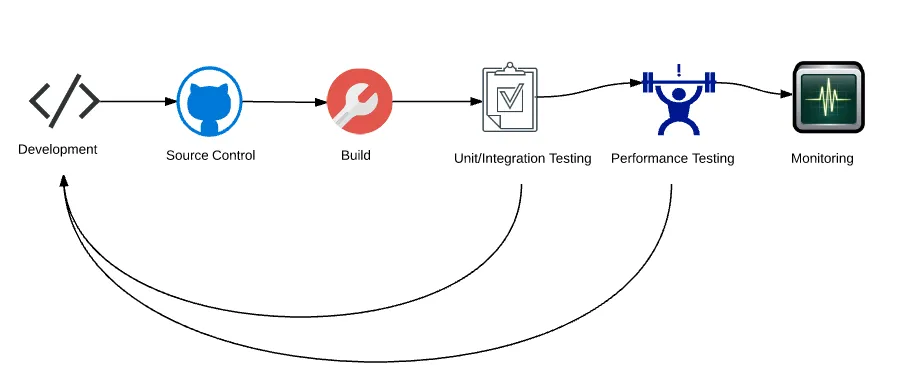
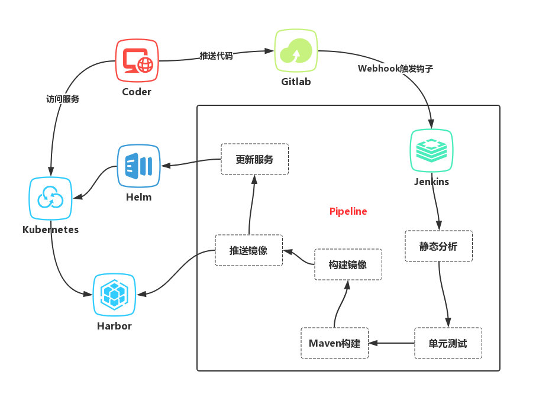

# 收集一些 CI 落地架构

> * https://supereagle.github.io/2017/12/03/devops/

自动化的软件生命周期的管理，主要可以分为3个阶段：

- **CI(Continuous Integration)：持续集成**

通过 Webhook 或者定时触发器，自动将软件从源代码构建成可以发布的包或者 Docker 镜像。 一般包括如下流程：代码检出、单元测试、集成测试、静态代码分析、代码覆盖率检查、构建和推送包或者 Docker 镜像。 在这个阶段，可以对各流程的结果进行严格控制，从而保证构建出来的软件的质量。CI 阶段比较强调的是各流程状态、结果的可视化， 例如：流水线执行到哪个阶段、该阶段成功或者失败、查看执行日志、测试报告、静态代码分析和代码覆盖率检查结果。

- **CD(Continuous Delivery)：持续交付**

经过在一系列环境中的部署和测试，最终将合格的软件版本发布到生产环境中，真正发挥软件的价值。 环境一般包括系统集成测试环境、用户验收测试环境、性能测试环境以及生产环境，根据实际情况，环境的名称不一样，可能叫 Staging 环境、预生产环境等。 CD 阶段存在的挑战，主要包括：不同环境对应的配置如何管理；采用何种发布策略，保证线上服务不中断的情况下稳定发布； 如果发布失败，如何进行回滚；微服务间如何进行注册和发现。

- **CO (Continuous Operation)：持续运营**

通过平台提供的日志收集、监控告警、自动伸缩、健康检查等功能，保证线上环境的安全、可靠运行，达到我们设定的 SLA(ServiceLevel Agreement)。 CO 相对于 CI 和 CD，是比较新的概念，通过对线上系统的监控，达到服务的自治和自愈的目标。它需要完善的平台来支撑，因此运维人员需要向 SRE 的方向发展， 最终摆脱“背锅侠”的命运。

