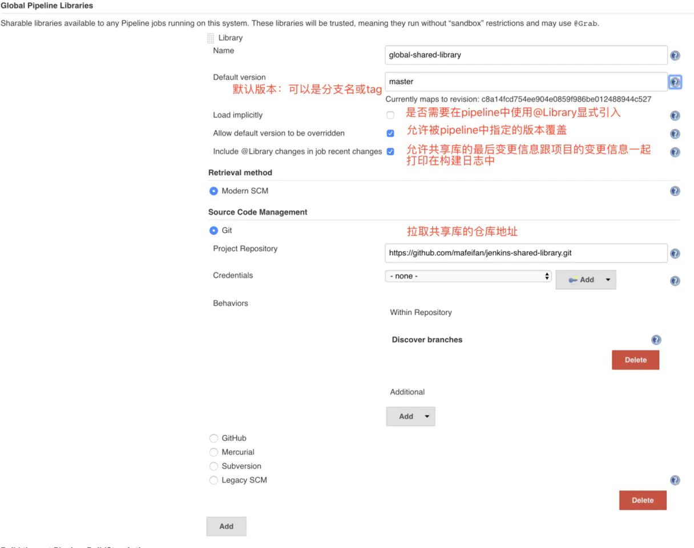

# Jenkins

## 流水线

* Jenkins 流水线是一套插件，它支持实现和集成持续交付流水线到 Jenkins
* 流水线支持 两种语法：声明式（在 Pipeline 2.5 引入）和脚本式流水线。两种语法都支持构建持续交付流水线，两种都可以用来在 web UI 或 `Jenkinsfile` 中定义流水线，不过通常认为创建一个 `Jenkinsfile` 并将其检入源代码控制仓库是最佳实践
* 流水线创建方法：
  * Blue Ocean - 在 Blue Ocean 中设置一个流水线项目后，Blue Ocean UI 会自动帮你编写流水线的 `Jenkinsfile` 文件并提交到源代码管理系统
  * 经典 UI - 通过经典 UI 在 Jenkins 中直接输入基本的流水线，使用经典 UI 创建的 `Jenkinsfile` 由 Jenkins 自己保存（在 Jenkins 的主目录下）
  * 在源码管理系统中定义 - 手动编写一个 `Jenkinsfile` 文件，然后提交到项目的源代码管理仓库中

 WebHook的本质就是从GitLab发了一条请求，Jenkins配置了一个终端地址（endpoint）来接收，从而实现了两个步骤的串联




*pipeline* 中可以使用 `archiveArtifacts` 命令存档文件。
存档的文件会保存到 *Jenkins* 的 *jobs/JOB_NAME/builds/BUILD_NO* 目录下。

```groovy
archiveArtifacts artifacts: '**/target/*.jar', fingerprint: true 
```