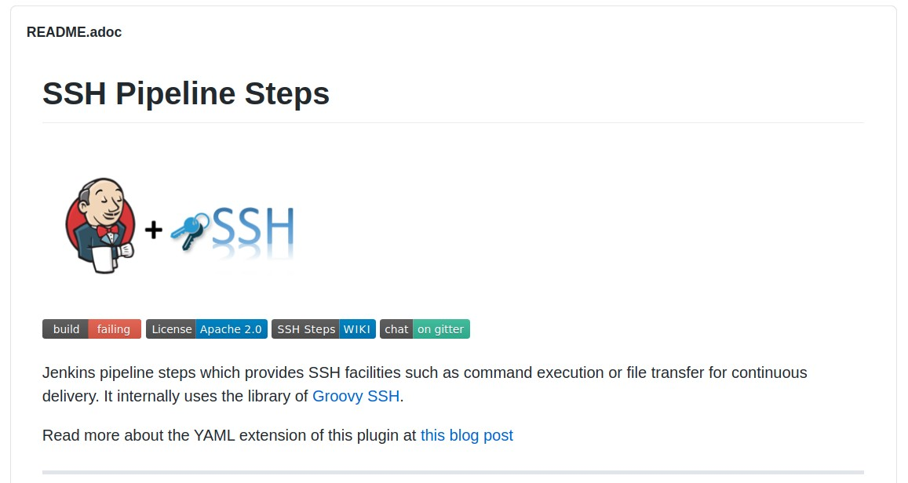
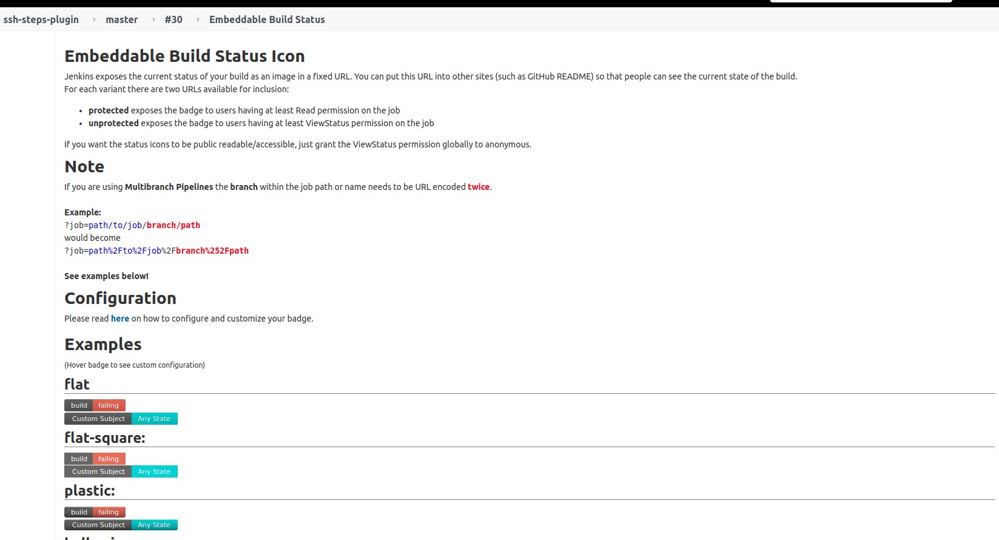
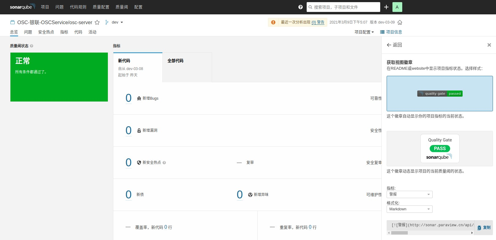
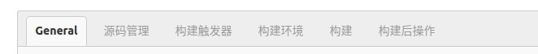

# Jenkins 小知识

> * **[Jenkins Pipeline 插件列表](https://www.jenkins.io/doc/pipeline/steps/)**
> * Jenkins 作为使用最为广泛的 CI/CD 平台，网上流传着无数的脚本和攻略，在学习和开发的时候一定要从基本出发，了解内部原理，多看官方的文档，不要拿到一段代码就开始用，这样才能不会迷失在各式各样的脚本之中。
> * 更重要的是要结合自己的业务需求，开发和定制属于自己的流程，不要被 Jenkins 的框架限制住。比如我们是否可以定义一个自己的 YAML 配置文件，然后根据 YAML 来生成 Pipeline，不需要业务自己写 Pipeline 脚本，规范使用，提前检查不合法的脚本，核心的模块共同升级，避免了一个流程小改动需要所有项目组同步更新

## 目录

* https://blog.csdn.net/liumiaocn/article/details/104586482
* [Jenkins 官方使用的 Jenkins 地址](#jenkins-官方使用的-jenkins-地址)
* [徽章](#徽章)
* [Sonar 扫描](#soanr-扫描)
* [单元测试](#单元测试)
* [freestyle](#freestyle)
* [Jenkins 权限控制](#jenkins-权限控制)
* [Pipeline Post](pipeline-post)
* [Pipeline 合法的 DSL 标签](#pipeline 合法的-dsl-标签)
* [插件获取变量](#插件获取变量)
* [pipeline 中反斜杠转义报错](#pipeline-中反斜杠转义报错)
* [Method code too large问题对应方法](#method-code-too-large-问题对应方法)
* [pipeline 中 agent 使用](#pipeline-中-agent-使用)
* [pipeline 常用 options](#pipeline-常用-options)
* [获取 job 持续时间](#获取-job-持续时间)
* [pipeline 中使用 archiveArtifacts 存档文件](#pipeline-中使用-archiveArtifacts-存档文件)
* [并行任务和并行任务流](#并行任务和并行任务流)


## Jenkins 官方使用的 Jenkins 地址

* **https://ci.jenkins.io/**
* Jenkins 相关插件 Job 地址: https://ci.jenkins.io/job/Plugins/
* 要是有个只读帐号能进去学习学习就好了 。。。

## 徽章



* 一个高大上的 Git 仓库一定要有一行自动化徽章

#### Jenkins 相关徽章

> * 插件: https://plugins.jenkins.io/embeddable-build-status/
> * Jenkins 插件装好后，Job 页侧边栏会有 `embeddable-build-status` 标签，有 `build` 默认标签，还可以自定义标签，使用开袋即食

```
all params
id: A unique id for the configuration
subject: A subject text
status: A status text
color: A valid color (RGB-HEX: RRGGBB or valid SVG color name)
animatedOverlayColor: A valid color (RGB-HEX: RRGGBB or valid SVG color name)
link: The link to be opened upon clicking.

addEmbeddableBadgeConfiguration(id: <string>, subject: <string>, status: <string>, color: <string>, animatedOverlayColor: <string>, link: <string>)
```



#### SonarQube 相关徽章

> * SonarQube 徽章在 Web UI 项目信息下的徽章即可找到




## Sonar 扫描

```groovy
 stage ("SonarQube analysis") {
    steps {
       withSonarQubeEnv('SonarQube') {
          sh "mvn clean test sonar:sonar"   
       }
 
       def qualitygate = waitForQualityGate()
       if (qualitygate.status != "OK") {
          error "Pipeline aborted due to quality gate coverage failure: ${qualitygate.status}"
       }
    }
 }
```

## 单元测试

> * https://zhuanlan.zhihu.com/p/50935348
> * https://www.cnblogs.com/cac2020/p/13691505.html

* maven 插件: **maven-surefire-plugin**

* maven-surefire-plugin 的 test 目标会自动执行测试源码路径（默认为src/test/java/）下所有符合一组命名模式的测试类

* 这组模式为：


  **/Test*.java：任何子目录下所有命名以Test开关的Java类。
  **/*Test.java：任何子目录下所有命名以Test结尾的Java类。
  **/*TestCase.java：任何子目录下所有命名以TestCase结尾的Java类。

``` XML
<plugins>
<plugin>
<groupId>org.apache.maven.plugins</groupId>
<artifactId>maven-surefire-plugin</artifactId>
<version>2.20.1</version>
<configuration>
<skipTests>false</skipTests>>
</configuration>
</plugin>
</plugins>  
```

测试套件 - suit

* 随着项目的开展，测试用例会越写越多，在测试时一个一个的点测试用例显然是不可行的。JUnit提供了测试套件，可以实现批量测试的功能


### 单元测试覆盖率

这里所讲的`覆盖率`是指测试代码的覆盖率，这个指标有多种计算方式，如下是比较常用的有：

- 行覆盖率：执行代码行数 / 总代码行数，判断有多少行代码被测试执行；
- 类覆盖率：执行的类 / 代码中类总个数；
- 分支覆盖率：执行的逻辑分支数 / 总的分支数，一般用于检测是不是`lf/else`都有测试覆盖；
- 方法覆盖率：执行的方法数 / 代码总方法数，检测是否有方法被遗漏，构造方法也看作为方法。
- 圈复杂度：用于判断代码结构的复杂程序，`JaCoCo`不考虑异常处理的分支；一般认为圈复杂度大于10，就存在比较大的风险，严格要求不可大于15

Jacoco

执行`JaCoCo`有多种方式：

（1）直接通过命令执行：https://www.eclemma.org/jacoco/trunk/doc/agent.html

（2）Ant执行：https://www.eclemma.org/jacoco/trunk/doc/ant.html

（3）Maven执行：https://www.eclemma.org/jacoco/trunk/doc/maven.html

（4）集成IDE执行：https://www.eclemma.org/

Maven 执行

在`pom.xml`中引入 JaCoCo 插件

``` xml
<plugin>
    <groupId>org.jacoco</groupId>
    <artifactId>jacoco-maven-plugin</artifactId>
    <version>0.8.2</version>
    <executions>
        <execution>
            <goals>
                <goal>prepare-agent</goal>
            </goals>
        </execution>
        <!-- change phase from verify to test -->
        <execution>
            <id>report</id>
            <phase>test</phase>
            <goals>
                <goal>report</goal>
            </goals>
        </execution>
    </executions>
</plugin>
```

当运行mvn clean test时，jacoco-maven-plugin插件会依次运行：

首先运行prepare-agent goal（默认phase是initialize）收集maven-surefire-plugin插件运行测试产生的测试覆盖率信息，并写入target/jacoco.exec文件
运行reportgoal（默认phase是verfiry，这里指定phase为test）读取target/jacoco.exec中的测试覆盖率信息，并生成测试覆盖率报告到target/site/jacoco目录，包括html, xml和csv格式

查看mvn clean test运行日志，关键步骤的执行顺序如下：

1. maven-clean-plugin:clean # delete target folder
2. jacoco-maven-plugin:prepare-agent # prepare and run JaCoCo agent
3. maven-compiler-plugin:compile # compile source code
4. maven-compiler-plugin:testCompile # compile test code
5. maven-surefire-plugin:test # run tests
6. jacoco-maven-plugin:report # generate code test coverage reports


``` shell
<plugin>
                <groupId>org.jacoco</groupId>
                <artifactId>jacoco-maven-plugin</artifactId>
                <version>0.8.3</version>
                <configuration>
                    <skip>false</skip>
                    <destFile>target/coverage-reports/jacoco.exec</destFile>
                </configuration>
                <executions>
                    <execution>
                        <id>prepare-agent</id>
                        <goals>
                            <goal>prepare-agent</goal>
                        </goals>
                    </execution>
                    <execution>
                        <id>report</id>
                        <phase>prepare-package</phase>
                        <goals>
                            <goal>report</goal>
                        </goals>
                    </execution>
                    <execution>
                        <id>post-unit-test</id>
                        <phase>test</phase>
                        <goals>
                            <goal>report</goal>
                        </goals>
                        <configuration>
                            <!--jacoco执行数据的文件路径-->
                            <dataFile>target/coverage-reports/jacoco.exec</dataFile>
                            <!--输出报告路径-->
                            <outputDirectory>target/coverage-reports</outputDirectory>
                        </configuration>
                    </execution>
                </executions>
            </plugin>
```

``` groovy
pipeline{
    agent any
    options {
        ansiColor('xterm')
    }
    stages{
        stage("单元测试"){
            steps {
                sh "mvn clean install -Dmaven.test.skip=false"
                jacoco(
                        //代码覆盖率统计执行文件路径 Ant风格路径
                        execPattern: 'target/coverage-reports/jacoco.exec',
                        //class文件位置 Ant风格路径
                        classPattern: 'target/classes',
                        //源代码位置 Ant风格路径
                        sourcePattern: 'src/main/java',
                        //排除分析的位置 Ant风格路径
                        exclusionPattern: 'src/test*',
                        //是否禁用每行覆盖率的源文件显示
                        skipCopyOfSrcFiles: false,
                        //true则对各维度的覆盖率进行比较 如果任何一个维度的当前覆盖率小于最小覆盖率阈值 则构建状态为失败；
                        //如果介于最大最小阈值之间则构建状态为不稳定；如果大于最大阈值则构建成功
                        changeBuildStatus: true,
                        //字节码指令覆盖率
                        minimumInstructionCoverage: '30',
                        maximumInstructionCoverage: '70',
                        //行覆盖率
                        minimumLineCoverage: '30',
                        maximumLineCoverage: '70',
                        //圈复杂度覆盖率
                        minimumComplexityCoverage: '30',
                        maximumComplexityCoverage: '70',
                        //方法覆盖率
                        minimumMethodCoverage: '30',
                        maximumMethodCoverage: '70',
                        //类覆盖率
                        minimumClassCoverage: '30',
                        maximumClassCoverage: '70',
                        //分支覆盖率
                        minimumBranchCoverage: '30',
                        maximumBranchCoverage: '70',
                        //如果为true 则只有所有维度的覆盖率变化量的绝对值小于小于相应的变化量阈值时构建结果才成功
                        buildOverBuild: true,
                        //各个维度覆盖率的变化量阈值
                        deltaInstructionCoverage: '80',
                        deltaLineCoverage: '80',
                        deltaComplexityCoverage: '80',
                        deltaMethodCoverage: '80',
                        deltaClassCoverage: '80',
                        deltaBranchCoverage: '80'
                )
            }
        }
    }
    //将JUnit步骤放在post always中 当测试环境不通过时 依然可以收集到测试报告
    post{
        always{
            script{
                junit "**/target/surefire-reports/*.xml"
            }
        }
    }

}
```


## freestyle



* General
  　　项目基本配置
    　　项目名字,描述,参数,禁用项目,并发构建,限制构建默认node等
*  Source code managemet
    　　代码库信息,支持Git,Subversion等
* Build Triggers
  　　构建触发方式
    　　周期性构建,poll scm,远程脚本触发构建,其他项目构建结束后触发等
* Build Environment
  　　构建环境相关设置
    　　构建前删除workspace,向Console输出添加时间戳,设置构建名称,插入环境变量等
* Build
  　　项目构建任务
    　　添加1个或者多个构建步骤
* Post-build Actions
  　　构建后行为
    　　Artifact归档,邮件通知,发布单元测试报告,触发下游项目等

## Jenkins 权限控制

#### 一、实现 GitLab 单点登录


#### 二、划分用户、组权限

> * Role-based Authorization Strategy


* 三个选项，分别表示**管理角色、分配用户给角色和角色策略**

**`管理角色`**


* 添加角色，可以添加三种类型的角色，分别是**全局角色、项目角色和节点角色**

* Pattern 可以使用正则表达式，例如 `abc.*` ，**不能少 `.`**
* 全局角色优先级高于项目角色
* Anonymous 是匿名用户

| 分组    | 角色权限   | 解释                                                         |
| ------- | ---------- | ------------------------------------------------------------ |
| Overall | Administer | 允许用户更改 jenkins 系统级别的配置，开放后可进入 jenkins 管理页面 |
|         | Read       | 全局读权限，没有此权限，必须登录才能看到 jenkins 主页面      |
|         | SystemRead | 系统配置读权限，没有此权限，看不到 `manage jenkins`          |
| 凭据    |            |                                                              |
| Job     | Discover   | 没有此权限，直接在浏览器中输入 jenkins 任务 URL(真实存在) 时，会直接跳转到 404 页面，如果有该权限，则跳转到登录页面 |
|         | Workspace  | 允许查看Jenkins任务的工作空间内容的权限                      |
| Run     | Update     | 允许用户更新构建历史的属性，如手动更新某次构建失败的原因     |


## Pipeline Post

- `always` - 总是执行

``` groovy
post{
    always{
        script{
            node(win_node){
                //delete report file
                println "Start to delete old html report file."
                bat("del /s /q C:\\JenkinsNode\\workspace\\selenium-pipeline-demo\\test-output\\*.html")
                //list the log files on jenkins ui
                //archive 'log/*.log'
                archiveArtifacts artifacts: 'log/*.log'
            }
        }
    }
}

post {
    always {
        archiveArtifacts artifacts: 'generatedFile.txt', onlyIfSuccessful: true
    }
}
```

- `changed` - 状态改变时执行
- `failure` - 失败时执行
- `success` - 成功后执行
- `unstable` - 当前不稳定时执行，黄色指示，通常由测试失败，代码违例等引起
- `aborted` - 别终止时执行，通常是由于 Pipeline 被手动中止


## Pipeline 合法的 DSL 标签

``` shell
No such DSL method 'post' found among steps [archive, bat, build, catchError, checkout, deleteDir, dir, dockerFingerprintFrom, dockerFingerprintRun, echo, emailext, emailextrecipients, envVarsForTool, error, fileExists, findBuildScans, getContext, git, input, isUnix, jiraComment, jiraIssueSelector, jiraSearch, junit, library, libraryResource, load, lock, mail, milestone, node, parallel, powershell, properties, publishChecks, publishHTML, pwd, pwsh, readFile, readTrusted, resolveScm, retry, script, sh, sleep, stage, stash, step, timeout, timestamps, tm, tool, unarchive, unstable, unstash, validateDeclarativePipeline, waitForQualityGate, waitUntil, warnError, withContext, withCredentials, withDockerContainer, withDockerRegistry, withDockerServer, withEnv, withGradle, wrap, writeFile, ws] or symbols [all, allBranchesSame, allOf, always, ant, antFromApache, antOutcome, antTarget, any, anyOf, apiToken, architecture, archiveArtifacts, artifactManager, authorizationMatrix, batchFile, bitbucket, bitbucketBranchDiscovery, bitbucketForkDiscovery, bitbucketPublicRepoPullRequestFilter, bitbucketPullRequestDiscovery, bitbucketSshCheckout, bitbucketTagDiscovery, bitbucketTrustEveryone, bitbucketTrustNobody, bitbucketTrustProject, bitbucketTrustTeam, bitbucketWebhookConfiguration, bitbucketWebhookRegistration, booleanParam, branch, brokenBuildSuspects, brokenTestsSuspects, buildButton, buildDiscarder, buildDiscarders, buildRetention, buildTimestamp, buildTimestampExtraProperties, buildUser, buildingTag, caseInsensitive, caseSensitive, certificate, changeRequest, changelog, changeset, checkoutToSubdirectory, choice, choiceParam, cleanWs, clock, command, credentials, cron, crumb, culprits, defaultFolderConfiguration, defaultView, demand, developers, disableConcurrentBuilds, disableResume, docker, dockerCert, dockerServer, dockerTool, dockerfile, downstream, dumb, durabilityHint, email-ext, envVars, envVarsFilter, environment, equals, expression, file, fileParam, filePath, fingerprint, fingerprints, frameOptions, freeStyle, freeStyleJob, fromDocker, fromScm, fromSource, git, gitBranchDiscovery, gitHubBranchDiscovery, gitHubBranchHeadAuthority, gitHubExcludeArchivedRepositories, gitHubExcludePublicRepositories, gitHubForkDiscovery, gitHubPullRequestDiscovery, gitHubSshCheckout, gitHubTagDiscovery, gitHubTopicsFilter, gitHubTrustContributors, gitHubTrustEveryone, gitHubTrustNobody, gitHubTrustPermissions, gitTagDiscovery, github, githubPush, gradle, headRegexFilter, headWildcardFilter, hyperlink, hyperlinkToModels, inheriting, inheritingGlobal, installSource, isRestartedRun, jdk, jdkInstaller, jgit, jgitapache, jnlp, jobBuildDiscarder, jobName, junitTestResultStorage, label, lastDuration, lastFailure, lastGrantedAuthorities, lastStable, lastSuccess, legacy, legacySCM, list, local, location, logRotator, loggedInUsersCanDoAnything, mailer, masterBuild, maven, maven3Mojos, mavenErrors, mavenGlobalConfig, mavenMojos, mavenWarnings, modernSCM, myView, namedBranchesDifferent, newContainerPerStage, node, nodeProperties, nonInheriting, none, not, overrideIndexTriggers, paneStatus, parallelsAlwaysFailFast, parameters, password, pattern, permanent, pipeline-model, pipeline-model-docker, pipelineTriggers, plainText, plugin, pollSCM, preserveStashes, projectNamingStrategy, proxy, pruneTags, queueItemAuthenticator, quietPeriod, rateLimit, rateLimitBuilds, recipients, requestor, resourceRoot, retainOnlyVariables, run, runParam, sSHLauncher, schedule, scmRetryCount, scriptApproval, scriptApprovalLink, search, security, shell, simpleBuildDiscarder, skipDefaultCheckout, skipStagesAfterUnstable, slave, sourceRegexFilter, sourceWildcardFilter, ssh, sshPublicKey, sshUserPrivateKey, standard, status, string, stringParam, suppressAutomaticTriggering, swapSpace, tag, teamSlugFilter, text, textParam, timestamper, timestamperConfig, timezone, tmpSpace, toolLocation, triggeredBy, unsecured, untrusted, upstream, upstreamDevelopers, userSeed, usernameColonPassword, usernamePassword, viewsTabBar, weather, withAnt, withSonarQubeEnv, x509ClientCert, zip] or globals [currentBuild, docker, env, params, pipeline, scm]
```

## 插件获取变量

* Build Timestamp - **`${BUILD_TIMESTAMP}`** - 获取 Job 触发时间点

## pipeline 中反斜杠转义报错

* **`\`** 字符是在Groovy一个特殊字符，所以 Jenkins Pipeline 中使用 **`\\`** 代替单个反斜杠做转义
* 转义 **`$`** : **`\\$`**
* 转义 **`/`** : **`\\/`**
* 转义 **`\`** : **`\\\\`**

## Method code too large 问题对应方法

**`报错信息`**

``` shell
Started by user devops
Running in Durability level: MAX_SURVIVABILITY
org.codehaus.groovy.control.MultipleCompilationErrorsException: startup failed:
General error during class generation: Method code too large!
```

* 出现这个问题的原因是 Jenkins 将整个声明性管道 ( pipeline { ... } ) 放入单个方法中，且大小不能超过 JVM 单个方法大小限制 64KB
* Jenkins Jira Issue: [Method code too large using declarative pipelines](https://issues.jenkins.io/browse/JENKINS-50033)

**`解决方法`**

一、将步骤放到管道外的方法中

二、从声明式迁移到脚本式管道

三、使用 	Shared Libraries

## pipeline 中 agent 使用

* jenkins pipeline 可以支持指定任意节点(any)，不指定(none)，标签(label)，节点(node)，docker，dockerfile 和 kubernetes

**`docker`**

``` shell
agent {
    docker {
        image 'myregistry.com/node'
        label 'my-defined-label'
        registryUrl 'https://myregistry.com/'
        registryCredentialsId 'myPredefinedCredentialsInJenkins'
        args '-v /tmp:/tmp'
    }
}
```

## pipeline 常用 options

**`skipDefaultCheckout()`** - 
**`timestamps()`** - 控制台输出时间
**`buildDiscarder(logRotator(numToKeepStr: '20', artifactNumToKeepStr: '20'))`** - 限制保留历史构建
**`checkoutToSubdirectory('foo')`** - 拉代码到子目录
**`disableConcurrentBuilds()`** - 不允许同时执行流水线
**`skipDefaultCheckout()`** - 在`agent` 指令中，跳过从源代码控制中检出代码的默认情况
**`timeout`** - 设置流水线运行的超时时间，超时后将 abort 流水线
**`retry()`** - 在失败时, 重试此阶段指定次数，例如: options { retry(3) }

## pipeline 获取 job 持续时间

* 安装插件：Build Timestamp Plugin - This plugin adds BUILD_TIMESTAMP to Jenkins variables and system properties

## pipeline 中使用 archiveArtifacts 存档文件

* pipeline 中可以使用 `archiveArtifacts` 命令存档文件
* 存档的文件会保存到 Jenkins 的 `jobs/JOB_NAME/builds/BUILD_NUMBER` 目录下
* `**` 表示匹配任意数目路径节点

**`steps 中使用 archiveArtifacts`**

``` shell
pipeline {
    agent any
    stages {
        stage('Archive') {
            steps {
                archiveArtifacts artifacts: '**/target/*.jar', fingerprint: true 
            }
        }
    }
}
```

**`post 中使用 archiveArtifacts`**

``` shell
always{
    script{
        node(win_node){
            // delete report file
            println "Start to delete old html report file."
            bat("del /s /q C:\\JenkinsNode\\workspace\\selenium-pipeline-demo\\test-output\\*.html")
            // list the log files on jenkins ui
            archiveArtifacts artifacts: 'log/*.*'
        }
    }
}


always {
	archiveArtifacts artifacts: 'build/libs/**/*.jar', fingerprint: true
	junit 'build/reports/**/*.xml'
}
```


## 并行任务和并行任务流

**并行任务**

``` shell
stages {
	stage('stage1') {
		parallel {
			stage('stage2.1') {
				steps {
					echo '在任务 stage2.1'
				}
			}
			stage('stage2.2') {
                steps {
					echo '在任务 stage2.2'
				}
			}
		}
	}
	stage('stage3') {
		steps {
			echo '在任务 stage3'
		}
	}
}
```


**并行任务流**

``` shell
stages {
	stage('stage1') {
		parallel {
			stage('windows')
				stages {
					stage('stage2.1.0') {
						steps {
                            echo '在任务 stage2.1.0'
                        }
					}
					stage('stage2.1.1') {
						steps {
                            echo '在任务 stage2.1.1'
                        }
					}
					stage('stage2.1.2') {
						steps {
                            echo '在任务 stage2.1.2'
                        }
					}
				}
			}
			stage('linux')
				stages {
					stage('stage2.2.0') {
						steps {
                            echo '在任务 stage2.2.0'
                        }
					}
					stage('stage2.2.1') {
						steps {
                            echo '在任务 stage2.2.1'
                        }
					}
					stage('stage2.2.2') {
						steps {
                            echo '在任务 stage2.2.2'
                        }
					}
				}
			}
		}
	}
	stage('stage3') {
		steps {
            echo '在任务 stage3'
        }
	}
}
```


