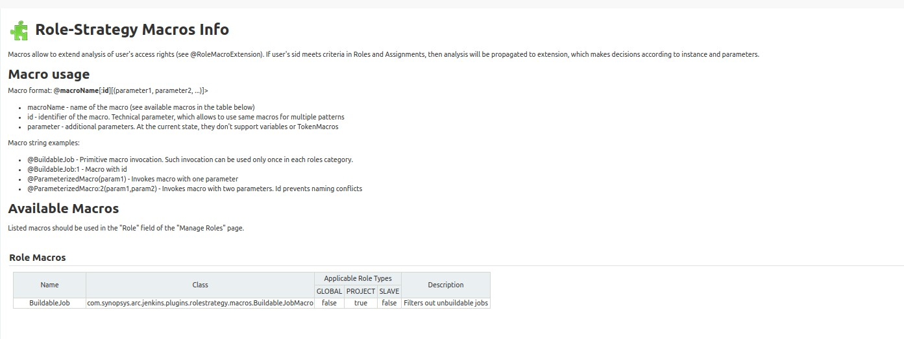
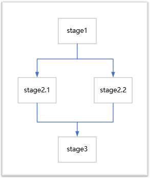
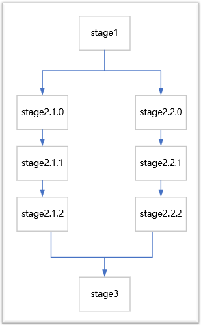

# Jenkins 小知识

> * Jenkins 作为使用最为广泛的 CI/CD 平台，网上流传着无数的脚本和攻略，在学习和开发的时候一定要从基本出发，了解内部原理，多看官方的文档，不要拿到一段代码就开始用，这样才能不会迷失在各式各样的脚本之中。
> * 更重要的是要结合自己的业务需求，开发和定制属于自己的流程，不要被 Jenkins 的框架限制住。比如我们是否可以定义一个自己的 YAML 配置文件，然后根据 YAML 来生成 Pipeline，不需要业务自己写 Pipeline 脚本，规范使用，提前检查不合法的脚本，核心的模块共同升级，避免了一个流程小改动需要所有项目组同步更新

## 目录

* https://blog.csdn.net/liumiaocn/article/details/104586482
* [Jenkins 权限控制](#jenkins-权限控制)
* [Pipeline Post](pipeline-post)
* [Pipeline 合法的 DSL 标签](#pipeline 合法的-dsl-标签)
* [插件获取变量](#插件获取变量)
* [pipeline 中反斜杠转义报错](#pipeline-中反斜杠转义报错)
* [Method code too large问题对应方法](#method-code-too-large-问题对应方法)
* [pipeline 中 agent 使用](#pipeline-中-agent-使用)
* [pipeline 常用 options](#pipeline-常用-options)
* [获取 job 持续时间](#获取-job-持续时间)
* [pipeline 中使用 archiveArtifacts 存档文件](#pipeline-中使用-archiveArtifacts-存档文件)
* [并行任务和并行任务流](#并行任务和并行任务流)


## Jenkins 权限控制

#### 一、实现 GitLab 单点登录


#### 二、划分用户、组权限

> * Role-based Authorization Strategy


* 三个选项，分别表示**管理角色、分配用户给角色和角色策略**

**`管理角色`**


* 添加角色，可以添加三种类型的角色，分别是**全局角色、项目角色和节点角色**

* Pattern 可以使用正则表达式，例如 `abc.*` ，**不能少 `.`**
* 全局角色优先级高于项目角色
* Anonymous 是匿名用户

| 分组    | 角色权限   | 解释                                                         |
| ------- | ---------- | ------------------------------------------------------------ |
| Overall | Administer | 允许用户更改 jenkins 系统级别的配置，开放后可进入 jenkins 管理页面 |
|         | Read       | 全局读权限，没有此权限，必须登录才能看到 jenkins 主页面      |
|         | SystemRead | 系统配置读权限，没有此权限，看不到 `manage jenkins`          |
| 凭据    |            |                                                              |
| Job     | Discover   | 没有此权限，直接在浏览器中输入 jenkins 任务 URL(真实存在) 时，会直接跳转到 404 页面，如果有该权限，则跳转到登录页面 |
|         | Workspace  | 允许查看Jenkins任务的工作空间内容的权限                      |
| Run     | Update     | 允许用户更新构建历史的属性，如手动更新某次构建失败的原因     |




## Pipeline Post

- `always` - 总是执行

``` groovy
post{
    always{
        script{
            node(win_node){
                //delete report file
                println "Start to delete old html report file."
                bat("del /s /q C:\\JenkinsNode\\workspace\\selenium-pipeline-demo\\test-output\\*.html")
                //list the log files on jenkins ui
                //archive 'log/*.log'
                archiveArtifacts artifacts: 'log/*.log'
            }
        }
    }
}

post {
    always {
        archiveArtifacts artifacts: 'generatedFile.txt', onlyIfSuccessful: true
    }
}
```

- `changed` - 状态改变时执行
- `failure` - 失败时执行
- `success` - 成功后执行
- `unstable` - 当前不稳定时执行，黄色指示，通常由测试失败，代码违例等引起
- `aborted` - 别终止时执行，通常是由于 Pipeline 被手动中止


## Pipeline 合法的 DSL 标签

``` shell
No such DSL method 'post' found among steps [archive, bat, build, catchError, checkout, deleteDir, dir, dockerFingerprintFrom, dockerFingerprintRun, echo, emailext, emailextrecipients, envVarsForTool, error, fileExists, findBuildScans, getContext, git, input, isUnix, jiraComment, jiraIssueSelector, jiraSearch, junit, library, libraryResource, load, lock, mail, milestone, node, parallel, powershell, properties, publishChecks, publishHTML, pwd, pwsh, readFile, readTrusted, resolveScm, retry, script, sh, sleep, stage, stash, step, timeout, timestamps, tm, tool, unarchive, unstable, unstash, validateDeclarativePipeline, waitForQualityGate, waitUntil, warnError, withContext, withCredentials, withDockerContainer, withDockerRegistry, withDockerServer, withEnv, withGradle, wrap, writeFile, ws] or symbols [all, allBranchesSame, allOf, always, ant, antFromApache, antOutcome, antTarget, any, anyOf, apiToken, architecture, archiveArtifacts, artifactManager, authorizationMatrix, batchFile, bitbucket, bitbucketBranchDiscovery, bitbucketForkDiscovery, bitbucketPublicRepoPullRequestFilter, bitbucketPullRequestDiscovery, bitbucketSshCheckout, bitbucketTagDiscovery, bitbucketTrustEveryone, bitbucketTrustNobody, bitbucketTrustProject, bitbucketTrustTeam, bitbucketWebhookConfiguration, bitbucketWebhookRegistration, booleanParam, branch, brokenBuildSuspects, brokenTestsSuspects, buildButton, buildDiscarder, buildDiscarders, buildRetention, buildTimestamp, buildTimestampExtraProperties, buildUser, buildingTag, caseInsensitive, caseSensitive, certificate, changeRequest, changelog, changeset, checkoutToSubdirectory, choice, choiceParam, cleanWs, clock, command, credentials, cron, crumb, culprits, defaultFolderConfiguration, defaultView, demand, developers, disableConcurrentBuilds, disableResume, docker, dockerCert, dockerServer, dockerTool, dockerfile, downstream, dumb, durabilityHint, email-ext, envVars, envVarsFilter, environment, equals, expression, file, fileParam, filePath, fingerprint, fingerprints, frameOptions, freeStyle, freeStyleJob, fromDocker, fromScm, fromSource, git, gitBranchDiscovery, gitHubBranchDiscovery, gitHubBranchHeadAuthority, gitHubExcludeArchivedRepositories, gitHubExcludePublicRepositories, gitHubForkDiscovery, gitHubPullRequestDiscovery, gitHubSshCheckout, gitHubTagDiscovery, gitHubTopicsFilter, gitHubTrustContributors, gitHubTrustEveryone, gitHubTrustNobody, gitHubTrustPermissions, gitTagDiscovery, github, githubPush, gradle, headRegexFilter, headWildcardFilter, hyperlink, hyperlinkToModels, inheriting, inheritingGlobal, installSource, isRestartedRun, jdk, jdkInstaller, jgit, jgitapache, jnlp, jobBuildDiscarder, jobName, junitTestResultStorage, label, lastDuration, lastFailure, lastGrantedAuthorities, lastStable, lastSuccess, legacy, legacySCM, list, local, location, logRotator, loggedInUsersCanDoAnything, mailer, masterBuild, maven, maven3Mojos, mavenErrors, mavenGlobalConfig, mavenMojos, mavenWarnings, modernSCM, myView, namedBranchesDifferent, newContainerPerStage, node, nodeProperties, nonInheriting, none, not, overrideIndexTriggers, paneStatus, parallelsAlwaysFailFast, parameters, password, pattern, permanent, pipeline-model, pipeline-model-docker, pipelineTriggers, plainText, plugin, pollSCM, preserveStashes, projectNamingStrategy, proxy, pruneTags, queueItemAuthenticator, quietPeriod, rateLimit, rateLimitBuilds, recipients, requestor, resourceRoot, retainOnlyVariables, run, runParam, sSHLauncher, schedule, scmRetryCount, scriptApproval, scriptApprovalLink, search, security, shell, simpleBuildDiscarder, skipDefaultCheckout, skipStagesAfterUnstable, slave, sourceRegexFilter, sourceWildcardFilter, ssh, sshPublicKey, sshUserPrivateKey, standard, status, string, stringParam, suppressAutomaticTriggering, swapSpace, tag, teamSlugFilter, text, textParam, timestamper, timestamperConfig, timezone, tmpSpace, toolLocation, triggeredBy, unsecured, untrusted, upstream, upstreamDevelopers, userSeed, usernameColonPassword, usernamePassword, viewsTabBar, weather, withAnt, withSonarQubeEnv, x509ClientCert, zip] or globals [currentBuild, docker, env, params, pipeline, scm]
```

## 插件获取变量

* Build Timestamp - **`${BUILD_TIMESTAMP}`** - 获取 Job 触发时间点

## pipeline 中反斜杠转义报错

* **`\`** 字符是在Groovy一个特殊字符，所以 Jenkins Pipeline 中使用 **`\\`** 代替单个反斜杠做转义
* 转义 **`$`** : **`\\$`**
* 转义 **`/`** : **`\\/`**
* 转义 **`\`** : **`\\\\`**

## Method code too large 问题对应方法

**`报错信息`**

``` shell
Started by user devops
Running in Durability level: MAX_SURVIVABILITY
org.codehaus.groovy.control.MultipleCompilationErrorsException: startup failed:
General error during class generation: Method code too large!
```

* 出现这个问题的原因是 Jenkins 将整个声明性管道 ( pipeline { ... } ) 放入单个方法中，且大小不能超过 JVM 单个方法大小限制 64KB
* Jenkins Jira Issue: [Method code too large using declarative pipelines](https://issues.jenkins.io/browse/JENKINS-50033)

**`解决方法`**

一、将步骤放到管道外的方法中

二、从声明式迁移到脚本式管道

三、使用 	Shared Libraries

## pipeline 中 agent 使用

* jenkins pipeline 可以支持指定任意节点(any)，不指定(none)，标签(label)，节点(node)，docker，dockerfile 和 kubernetes

**`docker`**

``` shell
agent {
    docker {
        image 'myregistry.com/node'
        label 'my-defined-label'
        registryUrl 'https://myregistry.com/'
        registryCredentialsId 'myPredefinedCredentialsInJenkins'
        args '-v /tmp:/tmp'
    }
}
```

## pipeline 常用 options

**`skipDefaultCheckout()`** - 
**`timestamps()`** - 控制台输出时间
**`buildDiscarder(logRotator(numToKeepStr: '20', artifactNumToKeepStr: '20'))`** - 限制保留历史构建
**`checkoutToSubdirectory('foo')`** - 拉代码到子目录
**`disableConcurrentBuilds()`** - 不允许同时执行流水线
**`skipDefaultCheckout()`** - 在`agent` 指令中，跳过从源代码控制中检出代码的默认情况
**`timeout`** - 设置流水线运行的超时时间，超时后将 abort 流水线
**`retry()`** - 在失败时, 重试此阶段指定次数，例如: options { retry(3) }

## pipeline 获取 job 持续时间

* 安装插件：Build Timestamp Plugin - This plugin adds BUILD_TIMESTAMP to Jenkins variables and system properties

## pipeline 中使用 archiveArtifacts 存档文件

* pipeline 中可以使用 `archiveArtifacts` 命令存档文件
* 存档的文件会保存到 Jenkins 的 `jobs/JOB_NAME/builds/BUILD_NUMBER` 目录下
* `**` 表示匹配任意数目路径节点

**`steps 中使用 archiveArtifacts`**

``` shell
pipeline {
    agent any
    stages {
        stage('Archive') {
            steps {
                archiveArtifacts artifacts: '**/target/*.jar', fingerprint: true 
            }
        }
    }
}
```

**`post 中使用 archiveArtifacts`**

``` shell
always{
    script{
        node(win_node){
            // delete report file
            println "Start to delete old html report file."
            bat("del /s /q C:\\JenkinsNode\\workspace\\selenium-pipeline-demo\\test-output\\*.html")
            // list the log files on jenkins ui
            archiveArtifacts artifacts: 'log/*.*'
        }
    }
}


always {
	archiveArtifacts artifacts: 'build/libs/**/*.jar', fingerprint: true
	junit 'build/reports/**/*.xml'
}
```


## 并行任务和并行任务流

**并行任务**

``` shell
stages {
	stage('stage1') {
		parallel {
			stage('stage2.1') {
				steps {
					echo '在任务 stage2.1'
				}
			}
			stage('stage2.2') {
                steps {
					echo '在任务 stage2.2'
				}
			}
		}
	}
	stage('stage3') {
		steps {
			echo '在任务 stage3'
		}
	}
}
```




**并行任务流**

``` shell
stages {
	stage('stage1') {
		parallel {
			stage('windows')
				stages {
					stage('stage2.1.0') {
						steps {
                            echo '在任务 stage2.1.0'
                        }
					}
					stage('stage2.1.1') {
						steps {
                            echo '在任务 stage2.1.1'
                        }
					}
					stage('stage2.1.2') {
						steps {
                            echo '在任务 stage2.1.2'
                        }
					}
				}
			}
			stage('linux')
				stages {
					stage('stage2.2.0') {
						steps {
                            echo '在任务 stage2.2.0'
                        }
					}
					stage('stage2.2.1') {
						steps {
                            echo '在任务 stage2.2.1'
                        }
					}
					stage('stage2.2.2') {
						steps {
                            echo '在任务 stage2.2.2'
                        }
					}
				}
			}
		}
	}
	stage('stage3') {
		steps {
            echo '在任务 stage3'
        }
	}
}
```



