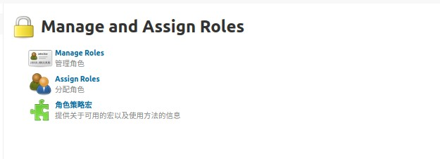

# Jenkins 权限控制

> 基于插件 Role-based Authorization Strategy

* 三个选项，分别表示**管理角色、分配用户给角色和角色策略**

* 添加角色，可以添加三种类型的角色，分别是**全局角色，基于项目的 和 基于节点的**

* Pattern 可以使用正则表达式，例如 `abc.*` ，不能少 `.`
* 全局角色优先级高于项目角色
*  Anonymous 是匿名用户

| 分组    | 角色权限   | 解释                                                         |
| ------- | ---------- | ------------------------------------------------------------ |
| Overall | Administer | 允许用户更改 jenkins 系统级别的配置，开放后可进入 jenkins 管理页面 |
|         | Read       | 全局读权限，没有此权限，必须登录才能看到 jenkins 主页面      |
|         | SystemRead | 系统配置读权限，没有此权限，看不到 `manage jenkins`          |
| 凭据    |            |                                                              |
| Job     | Discover   | 没有此权限，直接在浏览器中输入 jenkins 任务 URL(真实存在) 时，会直接跳转到 404 页面，如果有该权限，则跳转到登录页面 |
|         | Workspace  | 允许查看Jenkins任务的工作空间内容的权限                      |
| Run     | Update     | 允许用户更新构建历史的属性，如手动更新某次构建失败的原因     |
|         |            |                                                              |
|         |            |                                                              |

