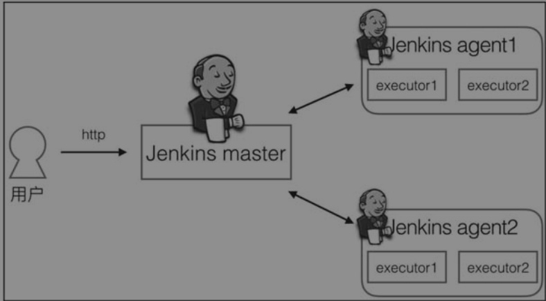
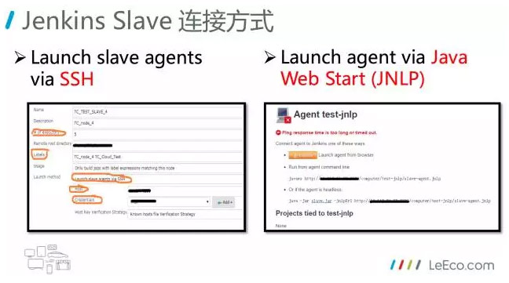
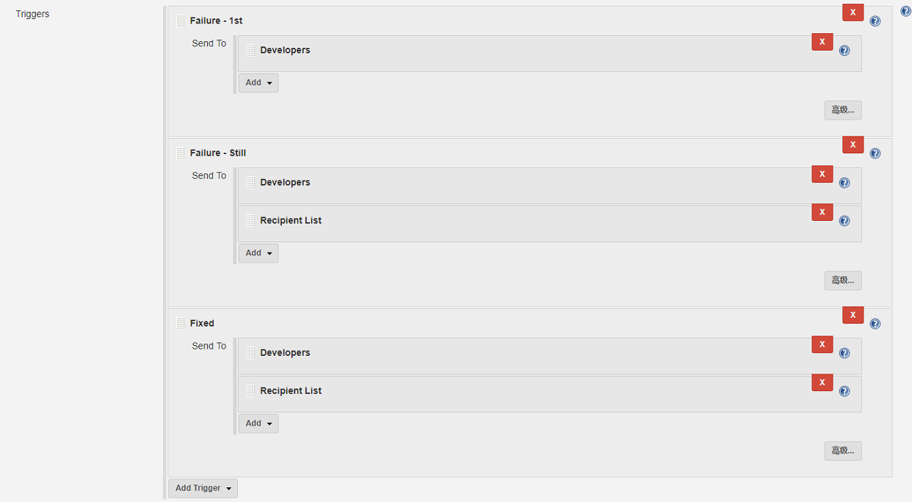

# Jenkins

## 名词解释

> * [Jenkins 术语表](https://www.jenkins.io/zh/doc/book/glossary/)

* master:
* slave / node：节点，指包含 Jenkins 环境及有能力执行项目的机器。master 和 agent 都被认为是节点

- executor：执行器，是真正执行项目的单元。一个执行器可以被理解为一个单独的进程（事实上是线程），在一个节点上可以运行多个执行器
- agent：代理，在概念上指的是相对于 Jenkins master 的一种角色，实际上是指运行在机器或容器中的一个程序，它会连接上 Jenkins master，并执行 Jenkins master 分配给它的任务
- label：标签，当 agent 数量变多时，如何知道哪些 agent 支持 JDK 8、哪些 agent 支持 Node.js 环境呢？可以通过给 agent 打标签（有时也称为 tag）来确定
- job：随着 Jenkins Pipeline2.0 的引入，目前主要有三种类型 job：Free Style Job，Scripted Pipeline and Declarative Pipeline。Scripted Pipeline 和 Declarative Pipeline属于Jenkins Pipeline2.0引入的Job类型，最大的优点就是Pipeline as Code，在一个Jenkinsfile文件里可以编写整个CI流程，并且可以提交到代码仓库，比如Git，作版本管理

## 架构

#### Jenkins 两种架构

1、单机架构：一台部署了 jenkins 服务器做 master 节点，并在 master 节点上完成构建，然后通过 ssh，将包传输到服务器上完成部署

2、master-slave 分布式架构：将构建过程分配到 slave 节点上完成部署，slave 节点上不需要安装 jenkins 服务

* master-slave 相当于 server 和 agent 的概念。master 提供 web 接口让用户来管理 job 和 slave，job 可以运行在 master 本机或者被分配到 slave 上运行。一个 master 可以关联多个 slave 用来为不同的 job 或相同的 job 的不同配置来服务

* 在 Jenkins master 上管理你的项目，可以把你的一些构建任务分担到不同的 slave 节点上运行，master 的性能就提高了

* Jenkins master 负责提供界面、处理 HTTP 请求及管理构建环境；构建的执行则由 Jenkins slave 负责
* Jenkins slave 的横向扩容：只需要增加 slave 就可以轻松支持更多的项目同时执行



* Jenkins slave 作为一个负责执行任务的程序，它需要与 Jenkins master 建立双向连接。连接方式有多种，这也代表有多种增加 slave 的方式



> * master 通过 ssh 启动 Linux slave：Jenkins 内置有 ssh 客户端实现，可以用来与远程的 sshd 通信，从而启动 slave
> * master 通过 WMI+DCOM 启动 Windows slave：Jenkins 可以使用 Windows2000 及以后内置的远程管理功能（WMI+DCOM），你只需要提供对 slave 有管理员访问权限的用户名和密码，jenkins 将远程地创建 windows service 然后远程地启动和停止他们。但是此方法不允许运行有显示交互的 GUI 程序
> * 编写脚本来启动 slave
>
> * 通过 Java web start( jnlp ) 启动 slave：基于 Java Web Start 的 JNLP 的连接，从 Slave 往 Master 主动的方式，需要登录到 slave，在浏览器打开 slave 的配置页面来连接。还可以安装 windows service 来使得 slave 在后台运行
> * 直接启动slave：此方式类似于 java web start，可以方便地在 Lunix系统上将 slave 运行为 daemon。需要配置 slave 为 JNLP 类型连接，然后在 slave 机器上执行 - `java -jar slave.jar -jnlpUrl http://yourserver:port/computer/slave-name/slave-agent.jnlp`

#### Slave 配置建议

* 每个slave都有用户jenkins，所有的机器使用相同的UID和GID，使得slave的管理更加简单

* 每个机器上jenkins用户的home目录都相同/home/jenkins, 拥有相同的目录结构使得维护简单

* 所有的slave运行sshd，windows运行cygwin sshd

* 所有的slave安装ntp client，用来与相同的ntp server同步

*  使用 shell 脚本来自动地配置 slave 的环境，例如创建 jenkins 用户，安装sshd、java、ant、maven 等

* 使用脚本来启动slave，保证slave总是运行在相同的参数下：

```shell
#!/bin/bash 
JAVA_HOME=/opt/SUN/jdk1.6.0_04
PATH=$PATH:$JAVA_HOME/bin
export PATH
java -jar /var/jenkins/bin/slave.jar
```

* Jenkins 特意为了更好使用pipeline，开发了一些工具类，方便我们更好地在step中处理各种需求( https://jenkins.io/doc/pipeline/steps/pipeline-utility-steps/ )，这个页面包含一些常用的工具类的使用

## 通知

Jenkins的通知方式非常多，具体如下：

- 电子邮件通知
- 声明构建
- RSS订阅
- 构建分发器
- 即时消息
- IRC通知
- 桌面通知器
- 通过Notifo通知
- 移动通知
- 短信通知
- 制造噪声
- 极端反馈设备

> 经过实践，我们发现：开发人员更关心的是构建失败，因为他需要及时知道构建失败的结果并及时进行修复，而团队负责人更关心的是构建失败是否有人及时修复。因此，为了减少邮件通知分散大家精力，我们建议采用以下电子邮件通知策略：
>
> - 第一次构建失败只发送给提交更改的开发人员
>   - 任何连续构建失败同时发送给团队负责人
> - 构建失败之后的首次构建成功同时发送给团队负责人

