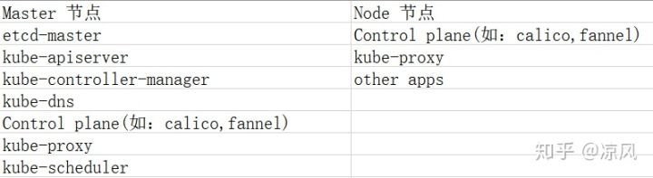

# Kubernetes 学习


安装 k8s 关键在如何拉取镜像，有四个方法：

* 配置 docker 代理
* 国内阿里云等仓库下载镜像，再把镜像的 tag 改成 google
* docker save 和 load 命令导入
* 可视化网页部署 - https://github.com/wise2c-devops/breeze/blob/master/BreezeManual-CN.md
* 直接编译 k8s 源码，打成 docker 镜像，难度较高

Kubernetes需要安装的部件如下：



安装步骤如下：

1. 添加相应的源
2. 下载Docker & Kubeadm & Kubelet & Kubernetes-cni
3. 关闭 swap
4. 获取镜像列表，以便从国内获取
5. 初始化环境
6. 配置授权信息, 以便可以便捷访问 kube-apiserver
7. 添加网络插件
8. 单节点，设置 master 节点也可以运行 Pod（默认策略是 master 节点不运行）
9. 部署其他插件

1、添加国内源

```shell
cat <<EOF > /etc/apt/sources.list.d/kubernetes.list
deb http://mirrors.ustc.edu.cn/kubernetes/apt kubernetes-xenial main
EOF
```