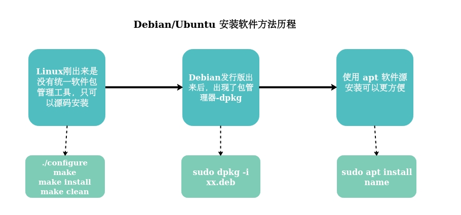
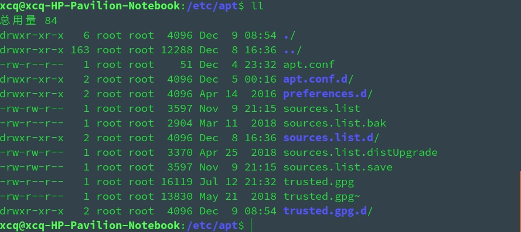

# APT 原理剖析、详解

> APT - Advanced Packaging Tool

<div align=center>
</br>软件安装方法历程图
</div>


`/etc/apt/sources.list` 只会告知系统可以访问的镜像站点地址，这时每当系统执行一次 `sudo apt install xxx` 都要链接镜像站检索出对应的软件地址，这样是很浪费时间的，所以在本地 `/var/lib/apt/lists/` 会缓存一份镜像站里的所有软件源信息，这样每次执行 `sudo apt install xxx` 直接在本地缓冲里检索，在连接网络下载文件。所以 `sudo apt install` 会先访问 `/var/lib/apt/lists/`；而且 `sudo apt update` 更新的是 `/var/lib/apt/lists/` 里的软件源


每当执行命令进行软件的安装或着更新，或者软件源的更新时，apt 会访问 `/etc/apt/sources.list` 内的地址，并在该网站中找到对应系统的包信息例如我的操作系统是 ubuntu，网站是 `deb http://mirrors.163.com/ubuntu/ precise main restricted universe multiverse` 网易的，那么当我们执行安装的命令时，他就会对应的访问 `http://mirrors.163.com/ubuntu/dists/lucid/main/binary-i386/` 的 `packages.gz`，这个文件是服务器上软件包及其依赖关系的清单，并且用 `gzip` 压缩过了。`apt-get update`使用这个清单来确定能够获得哪些补充的软件包且他的内容会被保存在 `/var/lib/apt/lists` 内，通过访问这个 lists 确定该软件是否已安装，是否是最新版本，依赖关系是否满足，从而确定要更新内容，并进行更新，其安装过程主要是由 dpkg 来完成

## 一、 背景知识

### 1. PPA 源 - Personal Package Archives - 个人软件包集

> 源和软件仓库实际上是一个意思，厂商将编译后的二进制文件和软件信息存放至服务器，用户需要安装软件时，包管理器自动分析本机和容器（repository）内的信息，下载需要的包并自动安装，安装后将新安装的软件信息存放至本地

* 添加、删除 PPA 软件源
```bash
# 添加 PPA 软件源的命令
$ sudo add-apt-repository ppa:user/ppa-name
# 删除 PPA 软件源的命令
$ sudo add-apt-repository --remove ppa:user/ppa-name
```
例如，我们想要添加一个 Wireshark 软件的 PPA 源，我们可以根据它官网上提供的命令来进行添加，如下图所示： 

当我们添加完 PPA 源之后，系统就会在 `/etc/apt/sources.list.d/` 文件夹里创建了两个文件，一个 `.list` 文件和一个带有 `.save` 后缀的备份文件：

``` shell
$ cd /etc/apt/sources.list.d
$ ls | grep wireshark
wireshark-dev-stable-trusty.list
wireshark-dev-stable-trusty.list.save
```

我们再来打开一下 `wireshark-dev-stable-trusty.list` 文件看看里面的内容是什么：

```
deb http://ppa.launchpad.net/wireshark-dev/stable/ubuntu trusty main
# deb-src http://ppa.launchpad.net/wireshark-dev/stable/ubuntu trusty main
```
原来文件里就是添加了一个跟软件源一模一样的东西，他们的作用殊途同归啊。我想这其实是 Ubuntu 为了分辨官方的源和第三方的源才设计成在 `sources.list` 和 `sources.list.d/` 这两个地方中存储软件源信息。因为第三方的源毕竟不太可信，如果随便更新的话可是会出事情的。

### 2. `deb http://site.example.com/debian distribution component` 格式详解 

``` shell
deb http://site.example.com/debian distribution component1 component2 component3
deb-src http://site.example.com/debian distribution component1 component2 component3
# 例如
deb http://mirrors.aliyun.com/ubuntu/ bionic main restricted
deb-src http://mirrors.aliyun.com/ubuntu/ bionic restricted universe multiverse main
```
1. 档案类型 - Archive type

* 条目的第一个词 deb 或是 deb-src 表明了所获取的软件包档案类型
  * deb - 档案类型为二进制预编译软件包，一般我们所用的档案类型
  * deb-src - 档案类型为用于编译二进制软件包的源代码

> 每行的第一个单词 deb 或 deb-src，描述了文件类型，目录中包含的是二进制软件包（ deb ），即我们通常使用的已编译好的软件包；或包含的是源码包（ deb-src ），源码包包含源程序编码、Debian 管理文件（ .dsc ）和 “Debian 化” 该程序所做更改的记录文件 diff.gz

2. 仓库地址 - Repository URL

* 条目的第二个词则是软件包所在仓库的地址，我们可以更换仓库地址为其他地理位置更靠近自己的镜像来提高下载速度
  * Ubuntu 软件源的源列表：[国内开源镜像站点汇总](https://segmentfault.com/a/1190000000375848)
* 仓库地址可以是多种类型：http、ftp、file（ 本地文件，例如：一个加载了 ISO9600 文件系统的目录 ） 或 ssh 


3. 发行版 - Distribution

* 跟在仓库地址后的是发行版。发行版有两种分类方法
  * 一类是发行版的具体代号，如 xenial,trusty, precise 等
  * 另一类则是发行版的发行类型，如 oldstable, stable, testing 和 unstable
* 另外，在发行版后还可能有进一步的指定，如 xenial-updates, trusty-security, stable-backports 等


> * 可以通过命令 `lsb_release -cs`,查看当前操作系统代号, 例如 Ubuntu 16.04 LTS 代号为 xenial, Ubuntu 18.04 LTS 代号为 bionic

``` shell
$ lsb_release -ca
No LSB modules are available.
Distributor ID:	Ubuntu
Description:	Ubuntu 18.04.3 LTS
Release:	18.04
Codename:	bionic
```

4. 软件包分类 - Component

* 跟在发行版之后的就是软件包的具体分类了，可以有一个或多个。不同的 Linux 发行版对软件有着不同的分类

**Debian**

* main
  * 包含符合 DFSG 指导原则的自由软件包，而且这些软件包不依赖不符合该指导原则的软件包。这些软件包被视为 Debian 发型版的一部分
* contrib
  * 包含符合 DFSG 指导原则的自由软件包，不过这些软件包依赖不在 main 分类中的软件包
* non-free
  * 包含不符合 DFSG 指导原则的非自由软件包

**Ubuntu**

* main
  * 官方支持的自由软件
* restricted
  * 官方支持的非完全自由的软件
* universe
  * 社区维护的自由软件
* multiverse
  * 非自由软件

| Ubuntu | 自由软件 | 非自由软件 |
| :------: | :------: | :------: |
| 官方支持 | Main | Restricted |
| 非官方支持 | Universe | Multiverse|


## 二、 apt 基本命令

* **`apt [选项] 命令`**

* **`[选项]`**
  * `list` - 根据名称列出软件包
  * `search` - 搜索软件包描述
  * `show` - 显示软件包细节
  * `install` - 安装软件包
  * `remove` - 移除软件包
  * `autoremove` - 卸载所有自动安装且不再使用的软件
  * `update` - 根据 `/etc/apt/sources.list` 更新 `/var/lib/apt/lists` 软件包列表
  * `upgrade` - 根据 `/var/lib/apt/lists` 安装/升级 软件来更新系统
  * `full-upgrade` - 通过 卸载/安装/升级 来更新系统
  * `edit-sources` - 编辑软件源信息文件


**`添加 PPA 软件源并安装`**

```bash
$ sudo add-apt-repository <PPA_info>            # 此命令将 PPA 仓库添加到列表中
$ sudo apt-get update     # 此命令更新可以在当前系统上安装的软件包列表
$ sudo apt-get install <package_in_PPA>       # 此命令安装软件包

# 例如
$ sudo add-apt-repository ppa:dr-akulavich/lighttable
$ sudo apt-get update
$ sudo apt-get install lighttable-installer
```


**`强制重装已安装的软件`**

```bash
 $ sudo apt-get --reinstall install <package-name>
 # 会先删除软件，再安装
```


**`sudo apt install \<package-name\> 新增文件位置`**

* 主要分散到以下四个目录
  * `/usr/bin` - 二进制文件
  * `/usr/lib` - 动态函数库文件
  * `/usr/share/doc` - 使用手册
  * `/usr/share/man` - man page
*   所以在多用户情况下使用 `sudo apt install <package-name>` 安装软件，会造成软件存放散乱，寻找软件配置文件麻烦；但好处是 apt 安装软件系统会自动注册环境变量，且是全局的
* 当自己使用源码安装软件通常把源码包放在 `/usr/local`


**`sudo apt update 具体执行动作`**

* 执行 `sudo apt update`
* 链接 `/etc/apt/sources.list` 里的软件源的镜像站，自动检索对比镜像站里的所有软件源与本地的 `/var/lib/apt/lists/` 目录，若发现有更新，立即在 `/var/lib/apt/lists/` 目录里跟新
* 更新完毕


**`强制更新`**

``` shell
sudo rm -rf /var/lib/apt/lists/*
sudo apt-get update
```

## 3. `sudo apt autoremove`

`autoclean` 是另一种方法，用于清除下载的包文件的本地存储库，clean 和之间的区别在于autoclean后者仅删除无法再从其源下载的包文件，并且很可能无用

## 4. `/etc/apt/` 目录详解

<div align=center>
</br>/etc/apt 目录详解图
</div>

### `/etc/apt/sources.list` && `/etc/apt/sources.list.d/`

#### `/etc/apt/sources.list`内容组成

<div align=center>
</br>/etc/apt/sources.list 文件
</div>

* 当使用`sudo apt install xxx`安装软件时，系统会自动在配置的镜像软件源列表（ /var/lib/apt/lists/ )寻找，找到后自动添加进来


#### `/etc/apt/sources.list.d/`内容组成

<div align=center>
</br>/etc/apt/sources.list.d/ 文件夹
</div>

* `/etc/apt/sources.list.d/`多是由第三方软件源文件组成，比如使用`sudo dpkg -i xxx.deb`安装或通过添加 PPA 软件第三方源`sudo add-apt-repository ppa:user/ppa-name`安装，而这些文件主要有这么三种：

```
xxx.list
xxx.list.distUpgrade
xxx.list.save
```

> 1. xxx.list - 记录第三方软件的软件源信息
``` shell
### THIS FILE IS AUTOMATICALLY CONFIGURED ###
# You may comment out this entry, but any other modifications may be lost.
# deb [arch=amd64] http://dl.google.com/linux/chrome/deb/ stable main # 已禁止升级到 bionic
```

> 2. xxx.list.save - 是`xxx.list.save`的备份，内容相同
> 3. xxx.list.disUpgrade - 网上没找到，未知待续

``` shell
### THIS FILE IS AUTOMATICALLY CONFIGURED ###
# You may comment out this entry, but any other modifications may be lost.
deb [arch=amd64] http://dl.google.com/linux/chrome/deb/ stable main
```

### `/etc/apt/apt.conf` && `/etc/apt/apt.conf.d/`

/etc/apt/apt.conf:APT配置文件。

/etc/apt/apt.conf.d/:APT配置文件片段。

### `/etc/apt/preferences`

版本首选项文件。您可以在此处指定“ 固定 ”，即从单独的源或不同版本的分发中获取某些包的首选项。

## 5. `/var/cache/apt/`

### `/var/cache/apt/archives/`

检索到的包文件的存储区域

`$ sudo apt clean`清空此目录

APT缓存文件，目录是在用 apt-get install 安装软件时，软件包的临时存放路径

### `/var/cache/apt/archives/partial/`

传输中的包文件的存储区域。

### `/var/lib/apt/lists/`

sources.list中指定的每个包资源的状态信息的存储区域

### `/var/ lib/apt/lists/partial/`

传输中的状态信息的存储区域。

### `/var/lib/dpkg/available`

文件的内容是软件包的描述信息，该软件包括当前系统所使用的安装源中的所有软件包，其中包括当前系统中已安装的和未安装的软件包

