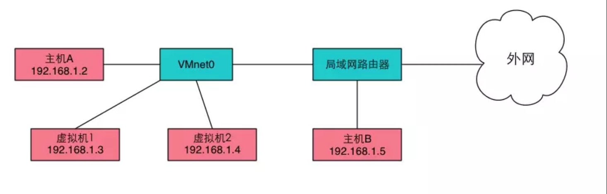

# Linux 主机、虚拟机和docker网络配置

> 使用过 VMware 、VirtualBox、KVM，但一直不太喜欢，最主要的原因就是繁琐的网络配置，例如 NAT、桥接、Host-Only 都啥意思，一直不懂，一直都是按着网上安装教程傻瓜式操作，最近需要搭建多台虚拟机，单是一个里面 ping 外面、外面 ping 里面、虚拟机互相 ping，就弄得我晕头转向！关键还是网络配置的短板，特来记录一下几天来的学习！

## 背景学习

### 1、IP、NetMask、GateWay、DNS

> 检查 DNS 是否正常：因为 QQ 不需要有 DNS ( QQ 只是一个客户端程序，用不到 DNS)，只有浏览网页 ( 需输入网址时 ) 才用到 DNS，所以如果出现 QQ 能用但浏览器连不上网，则很可能是 DNS 出现问题

**`Sub NetMask - 子网掩码`**

* 子网掩码 - 用来判断任意两台计算机的 IP 地址是否属于同一子网络

对于一台计算机来说，差不多有三种场合的通信

1）自己与自己通信

2）与本网段其它主机通信

3）与别的网段主机的通信

子网掩码就是为了分辨出以上三个场景而设计的

**举个例子**：10.10.10.1  255.255.255.0
其中 `255.255.255.0` 就是网络掩码，由于这个掩码全 1 的二进制位长为 24位，我们也经常写为 10.10.20.1/24

* **自己与自己通信**
  当 `ping 10.10.10.1` 时，计算机和自己的IP相比较，所以会发给自己，我们称之为**精确匹配**

* **与本网段其它主机通信**
  当 `ping 10.10.10.2` 时，计算机和自己的 IP 相比较，发现并不相等，则需要退而求其次，使用**模糊匹配**，用自己的掩码 `255.255.255.0` 与 `10.10.10.2` 做按位与，得到网段 `10.10.10`，这个和自己在一个网段（一个广播域），所以可以广播 ARP 得到对方的 MAC，完成通信。

* **与别的网段主机的通信**
  当 `ping 8.8.8.8` 时，计算机和自己的 IP 相比较，发现并不相等，则需要退而求其次，使用模糊匹配，用自己的掩码 `255.255.255.0` 与 `8.8.8.8` 做按位与，得到网段 `8.8.8`，和自己 `10.10.10` 不在一个网段，需要使用**最模糊的匹配**，一般会匹配 **0.0.0.0/0**，这个是最后的选择，一般指向网关，由于网关和自己在一个网段（一个广播域），所以可以广播 ARP 得到网关的MAC，然后把 ping 包发给网关，完成通信

**`GateWay - 网关`**

* 网关 - 是一个网络通向其他网络的 IP 地址

* 比如有网络 A 和网络 B，网络 A 的 IP 地址范围为 `192.168.1.1~192. 168.1.254`，子网掩码为 `255.255.255.0`；网络 B 的 IP 地址范围为 `192.168.2.1~192.168.2.254`，子网掩码为 `255.255.255.0`。在没有**路由器**的情况下，两个网络之间是不能进行 TCP/IP 通信的，即使是两个网络连接在同一台交换机（或集线器）上，TCP/IP 协议也会根据子网掩码（ 255.255.255.0 ）判定两个网络中的主机处在不同的网络里。而要实现这两个网络之间的通信，则必须通过网关 ( 比如路由器 )
* 如果网络 A 中的主机发现数据包的目的主机不在本地网络中，就把数据包转发给它自己的网关，再由网关转发给网络 B 的网关，网络 B 的网关再转发给网络 B 的某个主机

**`DNS - Domain Name Server - 域名服务器`**

将 URL 解析成主机 IP 地址


### 2、常见网卡详解

​    服务器通常有多块网卡，有板载集成的，同时也有插在 PCIe 插槽的。Linux 系统的命名原来是 eth0,eth1 这样的形式，但是这个编号往往不一定准确对应网卡接口的物理顺序

**`网卡查看方法`**

1. `ip a`
2. `ifconfig`
3. 以上命令都没安装，还可直接读取文件 `cat /proc/net/dev`

**`判断网卡是虚拟还是物理网卡`**

```bash
# /sys/devices/virtual/net 目录下都是虚拟网卡
$ ls  -l /sys/devices/virtual/net
总用量 0
drwxr-xr-x 7 root root 0 Nov 22 16:48 docker0
drwxr-xr-x 5 root root 0 Nov 22 16:48 lo
drwxr-xr-x 6 root root 0 Nov 22 16:48 veth61d2c91
drwxr-xr-x 6 root root 0 Nov 22 16:48 vethbe484a2
```

**`物理网卡`**

1. `eno1` - 代表由主板 bios 内置的网卡，如果从 BIOS 中能够取到可用的，板载网卡的索引号，则使用这个索引号命名，例如: eno1
2. `ens1` - 代表有主板 bios 内置的 PCI-E 网卡，如果从BIOS中能够取到可以用的，网卡所在的PCI-E热插拔插槽(***\*注：pci槽位号)\****的索引号，则使用这个索引号命名，例如: ens1
3. `enp2s0` - PCI-E 独立网卡，如果能拿到设备所连接的物理位置（PCI总线号+槽位号）信息，则使用这个信息命名，例如: enp2s0
4. `eth0、eth1、eth2 ...` - 如果以上都不使用，则回到默认的网卡名，统一的 kernel 命名方法，例如: eth0，这种命名方法的结果不可预知的，即可能第二块网卡对应 eth0，第一块网卡对应 eth1

**`虚拟网卡`**

* 虚拟网络接口并不真实地从外界接收和发送数据包，而是在系统内部接收和发送数据包，因此虚拟网络接口不需要驱动程序
* 虚拟网卡和物理网卡在使用上是一致的

* `lo` -  localhost - 本地环回接口，ip 是 127.0.0.1，实现系统内部发送和接收数据
* `docker0` - docker 在宿主机中的网卡

### 3. Linux 网络配置文件

#### I、CentOS 系列

* **`/etc/sysconfig/network-scripts/`** - 网卡的控制文件目录

``` bash
$ ls /etc/sysconfig/network-scripts/
ifcfg-eth0   ifdown-ib    ifdown-ppp       ifdown-tunnel  ifup-ib    ifup-plusb   ifup-Team         network-functions
ifcfg-lo     ifdown-ippp  ifdown-routes    ifup           ifup-ippp  ifup-post    ifup-TeamPort     network-functions-ipv6
ifdown       ifdown-ipv6  ifdown-sit       ifup-aliases   ifup-ipv6  ifup-ppp     ifup-tunnel
ifdown-bnep  ifdown-isdn  ifdown-Team      ifup-bnep      ifup-isdn  ifup-routes  ifup-wireless
ifdown-eth   ifdown-post  ifdown-TeamPort  ifup-eth       ifup-plip  ifup-sit     init.ipv6-global
```

* **`/etc/sysconfig/network-scripts/ifcfg-eth0`** - 网卡信息文件

  ``` bash
      DEVICE=eth0  #网卡设备名称   
      ONBOOT=yes  #启动时是否激活 yes | no  
      BOOTPROTO=static  #协议类型 dhcp bootp none  
      IPADDR=192.168.1.90  #网络IP地址  
      NETMASK=255.255.255.0  #网络子网地址  
      GATEWAY=192.168.1.1  #网关地址  
      BROADCAST=192.168.1.255  #广播地址  
      HWADDR=00:0C:29:FE:1A:09  #网卡MAC地址  
      TYPE=Ethernet  #网卡类型为以太网
  ```

  * TYPE    网络类型（通常是 Ethemet）
  * DEVICE    接口名（设备,网卡）
  * USERCTL   [yes|no]（非root用户是否可以控制该设备）
  * BOOTPROTO  IP 的配置方法 [none|static|bootp|dhcp]（引导时不使用协议|静态分配IP|BOOTP协议|DHCP协议）
  * HWADDR    MAC地址  
  * ONBOOT    系统启动的时候网络接口是否有效（yes/no）    
  * NETMASK    网络掩码  
  * IPADDR    IP 地址  
  * IPV6INIT  IPV6 是否有效（yes/no）  
  * GATEWAY    默认网关IP地址
  * BROADCAST   广播地址
  * NETWORK 网络地址
  * DNS1  第一 DNS 服务器指向；
  * DNS2  备用 DNS 服务器指向；

> * 修改 **`/etc/sysconfig/network-scripts/ifcfg-eth0`**  文件后需要重启网卡 ( sudo systemctl restart network )或电脑

**`/etc/sysconfig/network`**

**`/etc/resolv.conf`** - DNS 配置文件

**`/etc/hostname`** -  主机名

**`/etc/hosts`**

#### II、Ubuntu 系列

**`/etc/network`** 

**`/etc/network/interfaces `** - ip、子网掩码、默认网关

**`/etc/NetworkManager/`**

**`/etc/hostname`** -  主机名

**`/etc/resolv.conf`** - DNS 配置文件

**`/etc/hosts`**


## Linux 主机常用网络配置

#### I. Ubuntu

**`设置静态 IP`**

```bash
$ vim /etc/network/interface
# 在 interface 添加 eth0 接口的 IP，网络号，掩码，广播地址和网关
auto eth0
iface eth0 inet static
       address 192.168.2.100
       network 192.168.2.0
       netmask 255.255.255.0
       broadcast 192.168.0.255
       gateway 192.168.0.1
```

**`重启网卡`**

```bash
$ sudo ifup eth0
$ sudo ifdown eth0
# 或
$ sudo ifconfig eth0 down
$ sudo ifconfig eth0 up
```

**`重启网络`**

```bash
`sudo` `/etc/init``.d``/networking` `restart``sudo` `/etc/init``.d``/network-manager` `restart`
```


**``**

**``**

**``**

### 2. 


|                  |           NAT            |  Bridged Adapter   |     Host-Only      |
| ---------------- | :----------------------: | :----------------: | :----------------: |
| VM -> Host       |    :heavy_check_mark:    | :heavy_check_mark: |                    |
| Host -> VM       | :heavy_multiplication_x: | :heavy_check_mark: |                    |
| VM <-> VM        |    :heavy_check_mark:    | :heavy_check_mark: | :heavy_check_mark: |
| VM -> Other Host |    :heavy_check_mark:    | :heavy_check_mark: |                    |
| Other Host -> VM | :heavy_multiplication_x: | :heavy_check_mark: |                    |


## 桥接 - Bridged Adapter

* 虚拟机和主机是处于同等地位的机器，所以网络功能也无异于主机。并且和主机处于同一网段

* #### 原理

  桥接模式，使用的是VMnet0虚拟网卡。
   vmnet0实际上就是一个虚拟的网桥(2层交换机)，这个网桥有若干个接口，一个端口用于连接你的Host主机，其余端口可以用于连接虚拟机，他们的位置是对等的，谁也不是谁的网关。所以桥接模式下，虚拟机和Host主机是同等地位的主机

  

配置

`/etc/sysconfig/network-scripts/ifcfg-enp0s3`


## NAT - Network address translation - 网络地址转换

## Linux 网络配置命令

ifconfig - 网卡配置

## 【参考】

* [linux网卡命名规则](https://blog.csdn.net/hzj_001/article/details/81587824)

* [IP地址，子网掩码，默认网关，DNS服务器详解](https://www.cnblogs.com/JuneWang/p/3917697.html)