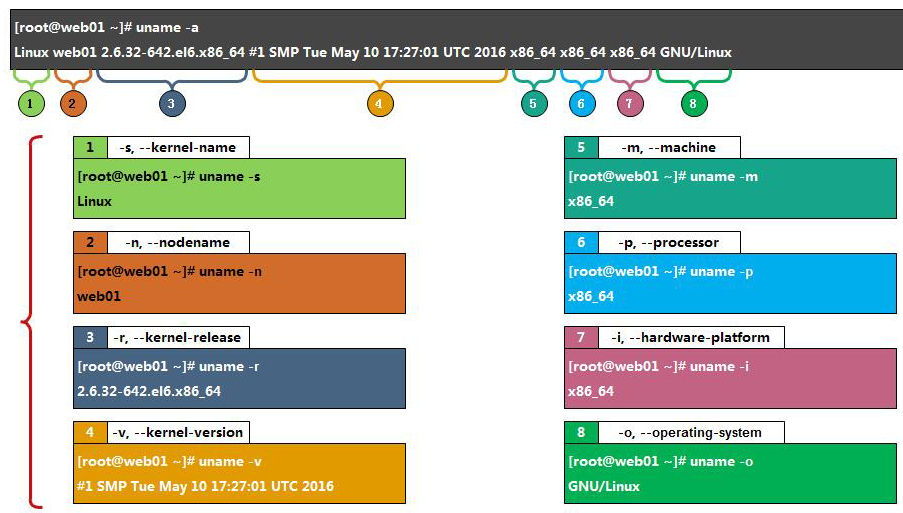

# 记录平时常用易忘的 Linux 命令


## 【参考】

* [搞定Linux Shell文本处理工具，看完这篇集锦就够了 - 腾讯云](https://cloud.tencent.com/developer/article/1366507)

## 目录

* [系统信息](#系统信息-top)<br/>
* [硬件信息](#硬件信息-top)<br/>
* [日志管理](#日志管理-top)<br/>
* [搜索命令](#搜索命令-top)
  * [find](#1、find)
  * [locate](#2、locate)
  * [whereis](#3、whereis)
  * [which](#4、which)
  * [grep](#5、grep)
  * [ag](#6、ag)
  * [fd](#7、fd)
  * [fzf](#8、fzf)
* [screen](#screen-top)<br/>
* [wget](#wget-top)<br/>
* [gcc](#gcc-top)<br/>
* [paping](#paping-top)<br/>
* [nmap](#nmap-top)<br/>
* [tldr](#tldr-top)<br/>
* [du](#du)<br/>
* []()<br/>
* []()<br/>
* []()<br/>

## 系统信息 [[Top]](#目录)

> * [系统信息&&硬件信息查看](https://www.cnblogs.com/wang618/p/11996634.html)



``` shell
uname -a                          # 查看 Linux 内核版本信息
cat /proc/version           # 查看内核版本
cat /etc/os-release    # 查看Linux系统版本
cat /etc/issue                   # 查看系统版本
lsb_release -a                   # 查看系统版本，可以带各种参数, -a ALL
locale -a                              # 列出所有语系
locale                                   # 当前环境变量中所有编码
hwclock                              # 查看时间
who                                     # 显示已登录用户
w                                          # 显示已登录用户并显示它们正在执行任务
whoami                         # 查看当前用户名
logname                         # 查看初始登录用户名
uptime                                # 查看服务器启动时间
sar -n DEV 1 10                  # 查看网卡网速流量
dmesg                                # 显示开机信息
lsmod                                # 查看内核模块
```
## 硬件信息 [[Top]](#目录)

``` shell
lscpu# 查看 CPU 信息
more /proc/cpuinfo# 查看 CPU 信息
cat /proc/cpuinfo | grep name | cut -f2 -d: | uniq -c # 查看 CPU 型号和逻辑核心数
getconf LONG_BIT # CPU 运行的位数
cat /proc/cpuinfo | grep 'physical id' | sort | uniq -c # 物理 CPU 个数
cat /proc/cpuinfo | grep flags | grep 'lm' | wc -l # 结果大于 0 则支持 64 位
more /proc/meminfo # 查看内存信息
dmidecode # 查看全面硬件信息
dmidecode | grep "Product Name" # 查看服务器型号
dmidecode | grep -P -A5 "Memory\s+Device" | grep Size | grep -v Range # 查看内存插槽
cat /proc/mdstat # 查看软 raid 信息
cat /proc/scsi/scsi # 查看 Dell 硬 raid 信息 ( IBM、HP 需要官方检测工具 )
lspci # 查看硬件信息
lspci | grep RAID # 查看是否支持 RAID
lspci -vvv | grep Ethernet # 查看网卡型号
lspci -vvv | grep Kernel | grep driver # 查看驱动模块
modinfo tg2 # 查看驱动版本 ( 驱动模块 )
ethtool -i <网卡名> # 查看网卡驱动版本，先用 ip -a 查看网卡名
```

## 日志管理 [[Top]](#目录)

``` shell

```

## 搜索命令 [[Top]](#目录)

#### 1、find

* 实时查找工具，通过遍历指定路径而完成对文件的查找，精确实时查找，但速度慢，且只能搜索用户具备读取和执行权限的目录

* **`find <搜索路径> [选项]|[表达式] ... <处理动作>`**

* **`<搜索路径>`** - 指定搜索范围路径，默认为当前目录

* **`<处理动作>`** - 指定对符合条件的文件的操作，默认输出至屏幕
  
* **`[选项]`** 

  * `-name` - 搜索文件（夹）名
    * -iname：name的忽略大小写版本
    * -lname pattern：查找符号连接文件名为pattern的文件
    * -ilname：lname的忽略大小写版本
  * `-type filetype` - 以指定文件类型 `filetype` 查找文件，`filetype` 可以是：
    * b：块设备
    * c：字符设备
    * d：目录
    * p：命名管道
    * f：普通文件
    * l：符号连接
    * s：socket

  * `-regex "PATTERN"` - 以 `PATTERN` 匹配整个文件路径字符串，而不仅仅是文件名称
  * `-iregex` - regex 的忽略大小写版本
  * `-inum` - 根据文件的 inode 编号查找
  * `-size [+-]n[cwbkMG]` - 指定文件长度查找文件。单位可以是：
    * c：字节单位
    * b：默认以块为单位，块大小为 512 字节
    * w：以 words 为单位，words 表示两个字节
    * k：以 1024 字节为单位
    * M：以 1048576 字节为单位
    * G：以 1073741824 字节为单位
    * +或-：文件大小大于或小于 n 单位

* **`[表达式]`**
  * `expr1 expr2` `expr1 -a expr2` 或 `expr1 -and expr2` - 效果一样，若 expr1 是 false 则不执行 expr2 ，反之则执行 expr2
    * `find / -size +10M -a -size -50M -type f` - 根目录下搜索大于 10M 且 小于 50M 的普通文件
  * `expr1 -o expr2` 或 `expr1 -or expr2` - 效果一样，类似上面

**`实战`**

``` bash
# 正则方式查找 .txt 和 pdf
$ find . -regex  ".*\(\.txt|\.pdf\)$"
# 查找 txt 和 pdf 文件
$ find . \( -name "*.txt" -o -name "*.pdf" \) -print
# 查找所有非 txt 文本
$ find . ! -name "*.txt" -print
# 最近 7 天被访问过的所有文件
$ find . -atime 7 -type f -print
# 寻找大于 2k 的文件
$ find . -type f -size +2k
# 找具有可执行权限的所有文件
$ find . -type f -perm 644 -print 
# 找用户weber所拥有的文件
$ find . -type f -user weber -print
# 删除当前目录下所有的swp文件
$ find . -type f -name "*.swp" -delete
# 将当前目录下的所有权变更为weber
$ find . -type f -user root -exec chown weber {} \
```

#### 2、locate

**`原理`**

* Linux 系统会在 `/etc/crontab` 设定每天执行一次 `updatedb` ，而 `updatedatedb` 这个命令会建立硬盘中的所有档案和目录资料的索引数据库 更新 `lib/mlocate/mlocage.db` ，执行 `locate` 命令会在这个索引数据库中查找，所以相比于 `find` 命令查找 `locate` 更快

``` bash
$ cat /etc/crontab
25 6	* * *	root	test -x /usr/sbin/anacron || ( cd / && run-parts --report /etc/cron.daily )
. . . 
$ ls /etc/cron.daily
mlocate
. . .
$ cat /etc/cron.daily/mlocate
# 可以看到定时执行 updatedb 具体过程
```

* `locate` 不能查找到上次(一般一天更新一次) `updatedb` 或变动的文件，所以，需要查找当天变动的文件，可以前执行一边 `updatedb` ，更新索引数据库，再执行 `locate`

* **`locate [选项] 目标名`**
* **`[选项]`**
  * `-r` - 使用正规运算式 做寻找的条件

``` bash
# 搜索 /etc/ 目录下名为 passwd 的文件路径
$ locate /etc/passwd
/etc/passwd
/etc/passwd-
/snap/core/7917/etc/passwd
/snap/core/8039/etc/passwd
# 搜索主目录下以 a  开头的所有文件，且不区分大小写
$ locate -i ~/a
```

#### 3、whereis

* **`whereis [选项] commandName`**
* 用于定位命令的二进制可执行文件、源码文件和手册文件
* **`[选项]`**
  * `-b` - binaries
  * `-m` - manuals
  * `-s` - sources

``` bash
$ whereis docker
docker: /usr/bin/docker /etc/docker /usr/libexec/docker /usr/share/man/man1/docker.1.gz

# 选项一定要放在 whereis 和 commandName 之间
$ whereis -b docker
docker: /usr/bin/docker /etc/docker /usr/libexec/docker
```

#### 4、which

* 在当前环境变量 `$PATH` 路径中，搜快速查找命令可执行文件路径
* **`which [-a] commandName`**
* **`[-a]`** - 输出所有匹配的结果

``` bash
$ which docker
/usr/bin/docker

# -a 必须在 which 和 commandName 之间
$ which -a java
/usr/lib/jvm/jdk-12.0.1/bin/java
/usr/bin/java
```

#### 5、grep

#### 6、af


#### 5、grep

#### 8、fzf

* 命令行交互式模糊匹配
* https://github.com/junegunn/fzf

## screen [[Top]](#目录)

* **`yum install screen`**
* **`apt install screen`**
* **`screen`** - 新建一个会话
* **`screen -S [name]`** - 新建一个 name 会话
* **`Ctrl+a+d`** - 暂离当前会话
* **`screen -r`** -当只有一个会话时，直接重新进入会话
* **`screen -r [name]|[id]`** - 重新进入 name 会话
* **`screen -ls`** - 列出已创建的会话
* **`exit`** - 在需要退出的会话执行 exit ，即删除当前会话

## wget [[Top]](#目录)

* wget - World Wide Web Get
* wget 支持 http、https 和 ftp 协议，支持 ftp 和 http 下载方式，支持通过 http 代理（ 但不支持通过 socks 代理 ）

* **`wget [options]... [URL]...`**

### 常用命令
``` bash
支持断点续传
wget -c URL
获取https地址时不检查证书
wget --no-check-certificate URL
后台下载文件
wget -b URL     # 查看下载进度命令：tail -f wget-log 
测试下载链接
wget --spider URL
设定下载带宽上线，实现限速下载
wget --limit-rate 数字k(千字节)/m(兆字节) URL                         
访问需认证的页面
wget --user username -password password URL    # 指定–user 和–password参数
wget --user username --ask-password pass URL    # 不指定密码，而由网页提示并手动的输入密码
从保存多个链接的文件读取 URL 并下载（又称递归下载）
cat > filelist.txt url1 url2 url3 url4
wget -i filelist.txt 
限制总下载文件大小
wget -Q 5m -i filelist.txt   
想要下载的文件超过5M而退出下载，-Q 参数对单个文件下载不起作用，只能递归下载时才有效
```
**爬取整站**

```
wget --random-wait -r -p -e robots=off -U mozilla http://www.baidu.com

wget -c -r -npH -k -nv http://www.baidu.com

参数说明

-c：断点续传

-r：递归下载

-np：递归下载时不搜索上层目录

-nv：显示简要信息

-nd：递归下载时不创建一层一层的目录,把所有文件下载当前文件夹中

-p：下载网页所需要的所有文件(图片,样式,js文件等)

-H：当递归时是转到外部主机下载图片或链接

-k：将绝对链接转换为相对链接,这样就可以在本地脱机浏览网页了

-L:     只扩展相对连接，该参数对于抓取指定站点很有用，可以避免向宿主主机

启用地址伪装

-user-agent="Mozilla/5.0 (Windows NT 10.0; WOW64) AppleWebKit/537.36 (KHTML, like Gecko) Chrome/53.0.2785.104 Safari/537.36 Core/1.53.4482.400 QQBrowser/9.7.13001.400"
```

## GCC [[Top]](#目录)

> [gcc 编译 c 源文件过程详解](/Linux/Linux小知识.md#linux-下-gcc-编译-c-源文件过程详解-top)

* GCC - GNU project C and C++ compiler

* gcc 命令使用 GNU 推出的基于 **C/C++ 的编译器**，是开放源代码领域应用最广泛的编译器，具有功能强大，编译代码支持性能优化等特点
* 经过了这么多年的发展，GCC 已经不仅仅能支持 C 语言；它现在还支持 Ada 语言、C++ 语言、Java 语言、Objective C 语言、Pascal 语言、COBOL 语言，以及支持函数式编程和逻辑编程的 Mercury 语言，等等

* **`gcc [选项] [参数]`**
* **`[选项]`**
  * -o：指定生成的输出文件
  * -E：仅执行编译预处理
  * -S：将C代码转换为汇编代码
  * -wall：显示警告信息
  * -c：仅执行编译操作，不进行连接操作

``` shell
// 无选项编译链接 - 将 test.c 预处理、汇编、编译并链接形成可执行文件，这里未指定输出文件，默认输出为 a.out
gcc test.c

// 将 test.c 预处理、汇编、编译并链接形成可执行文件 test，-o 选项用来指定输出文件的文件名
gcc test.c -o test

// 将 test.c 预处理输出 test.i 文件
gcc -E test.c -o test.i
gcc -E test.c    //直接在终端输出显示 test.i 文件内容
 
// 将预处理输出文件 test.i 汇编成 test.s 文件
gcc -S test.c   //会生成 test.s 文件
gcc -S test.i
gcc -S test.i -o test.s

// 将汇编输出文件 test.s 编译输出二进制 test.o 文件
gcc -c test.c     //会生成 test.o 文件
gcc -c test.o
gcc -c test.s -o test.o

// 将编译输出文件 test.o 链接成最终可执行文件 test
gcc test.o -o test

// 多个文件一起编译
gcc test1.c test2.c -o test
//或
gcc -c test1.c -o test1.o
gcc -c test2.c -o test2.o
gcc test1.o test2.o -o test
```

## paping [[Top]](#目录)

* 安装：https://code.google.com/archive/p/paping/downloads
* 用于测试主机 tcp 端口连通和延迟

```bash
-p, --port N  指定被测试服务的 TCP 端口（必须）
--nocolor  屏蔽彩色输出
-t, --timeout	指定超时时长，单位为毫秒，默认值为 1000
-c, --count N	指定测试次数
```

## nmap [[Top]](#目录)

> * https://github.com/nmap/nmap

* 安装：
  * windows - https://nmap.org/dist/nmap-7.70-setup.exe
  * linux - yum/apt install nmap

## tldr [[Top]](#目录)

> * Too Long; Didn't Read - https://github.com/tldr-pages/tldr

* **`tldr [command]`**
* 简化输出 **`command`** 的 man 手册

```bash
$ tldr grep
  grep
  Matches patterns in input text.
  Supports simple patterns and regular expressions.
  - Search for an exact string:
    grep search_string path/to/file
  - Search in case-insensitive mode:
    grep -i search_string path/to/file
  - Search recursively (ignoring non-text files) in current directory for an exact string:
    grep -RI search_string .
  - Use extended regular expressions (supporting ?, +, {}, () and |):
    grep -E ^regex$ path/to/file
  - Print 3 lines of [C]ontext around, [B]efore, or [A]fter each match:
    grep -C|B|A 3 search_string path/to/file
  - Print file name with the corresponding line number for each match:
    grep -Hn search_string path/to/file
  - Use the standard input instead of a file:
    cat path/to/file | grep search_string
  - Invert match for excluding specific strings:
    grep -v search_string
```

## du

* `du -sh *`
* `du -d 0 -h`
* `du -d 1 -h`

## htop

## crontab

