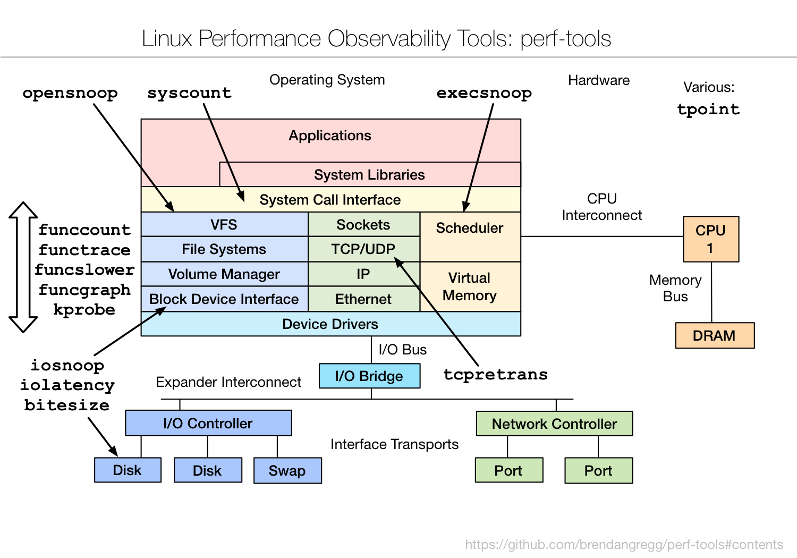

# Linux 性能相关常用命令 - Linux Performance

> * 主要以Ubuntu 18.04 LTS 为例，命令在 Linux 不同操作系统可能略有差别
> * [《BPF Performance Tools》](http://www.brendangregg.com/linuxperf.html)
> * [linux 指标监控小记](https://github.com/shfshanyue/op-note/blob/master/linux-monitor.md)


<div align=center>
</br> Linux 性能分析工具
</div>

<div align=center>
</br> Linux 性能观测工具
</div>

<div align=center>
</br> Linux 性能测评工具
</div>

<div align=center>
</br> Linux
</div>

<div align=center>
</br> Linux
</div>

<div align=center>
</br> Linux
</div>

## 目录

* [top](#top-top) - `CPU` `DRAM`
* [netstat](#netstat-top) - `Sockets` `TCP\UDP` `IP` `Ethernet`
* [ip](#ip-top) - `Ethernet`
* [nload]() -
* [iostat](#iostat-top) - `Block Device Interface` `I/O Controller`
* [iotop](#iotop)
* [iopp](#iopp)
* [lsof](#lsof-top)
* [ps](#ps-top)
* [free](#free-top) - `Virtual Memory`
* [pidstat](#pidstat-top) - `CPU`
* [vmstat](#vmstat-top) - `System Call InterFace` `Scheduler` ` Virtual Memory`
* [dstat](#dstat-top) - `CPU` `Virtual Memory` `Disk` `Port`
* [brctl](#brctl) - **`网桥管理工具`**
* mpstat - CPU
* perf - CPU
* tcpdump - Ethernet
* nicstat - Ethernet
* dtrace - Ethernet
* ping - Port
* dastat - Port
* dtrace - Port
* dastat - Disk
* dtrace - Disk
* perl
* ipconfig
* slabtop
* nicstat
* nmcli conn show -a
* nmcli conn show '连接名称'

## vmstat [[Top]](#目录)

> Virtual Meomory Statistics, Report virtual memory statistics

* **对操作系统的虚拟内存、进程、CPU活动进行监控，低开销的系统性能观察方式，不足之处是无法对某个进程进行深入分析**


### 使用技巧

* vmstat 本身就是低开销工具，在非常高负荷的服务器上，你需要查看并监控系统的健康情况，在控制窗口还是能够使用 vmstat 输出结果


## pidstat [[Top]](#目录)

> Report statistics for Linux tasks

* **监控全部或指定进程的 cpu、内存、线程、设备 IO 等系统资源的占用情况**
* `pidstat [选项] [时间] [次数]`
* [选项]
  * `-u` - 默认的参数，显示各个进程的 CPU 使用统计
  * `-r` - 显示各个进程的内存使用统计
  * `-d` - 显示各个进程的 IO 使用情况
  * `-p <pid>` - 指定进程号
  * `-w` - 显示每个进程的上下文切换情况
  * `-t` - 显示选择任务的线程的统计信息外的额外信息

 ### 常用命令

 ``` shell
 pidstat                                              # 显示所有进程的 CPU 使用率
 pidstat -r                                          # 输出进程内存使用情况统计
 pidstat -d -p 1 1 5                         # 每隔一秒，一共输出 5 次进程 ID 为 1 的 IO 统计信息
 pidstat -t -p 1                                # 显示选择任务 ( pid =1 )的线程的统计信息外的额外信息
 ```

### 使用技巧

* pidstat 首次运行时显示自系统启动开始的各项统计信息，之后运行 pidstat 将显示自上次运行该命令以后的统计信息。用户可以通过指定统计的次数和时间来获得所需的统计信息
* pidstat 是 sysstat 软件套件的一部分，sysstat 包含很多监控 linux 系统状态的工具，它能够从大多数 linux 发行版的软件源中获得
* 安装：`sudo apt install sysstat` 或 `yum install sysstat`


 ### 命令输出详解

 **`pidstat`**

 ``` shell
Linux 4.15.0-66-generic (xcq) 	Friday, November 08, 2019 	_x86_64_	(8 CPU)

08:41:58 CST   UID       PID    %usr   %system  %guest   %wait    %CPU   CPU  Command
08:41:58 CST     0             1        0.05        0.17          0.00        0.03        0.22        7        systemd
08:41:58 CST     0             7        0.00        0.00          0.00        0.00        0.00        0        ksoftirqd/0
08:41:58 CST     0             8        0.03        0.29          0.00        0.06        0.32        3        rcu_sched
08:41:58 CST     0            16       0.00       0.00           0.00        0.00        0.00        1        ksoftirqd/1
08:41:58 CST     0            22       0.00       0.00           0.00        0.00        0.00        2        ksoftirqd/2
08:41:58 CST     0            28       0.00       0.00           0.00        0.01        0.00        3        ksoftirqd/3
08:41:58 CST     0            34       0.00       0.00           0.00        0.00        0.00        4        ksoftirqd/4
 ```

* `UID` - 用户 ID
* `PID` - 进程 ID
* `%usr` - 进程在用户空间占用 CPU 的百分比
* `%system` - 进程在内核空间占用 CPU 的百分比
* `%guest` - 任务花费在虚拟机上的 CPU 使用率（ 运行在虚拟处理器 ）
* `%CPU` - 任务总的 CPU 使用率
* `CPU` - 正在运行这个任务的处理器编号
* `Command` - 这个任务的命令名称

**`pidstat -r`**

``` shell
Linux 4.15.0-66-generic (xcq) 	Friday, November 08, 2019 	_x86_64_	(8 CPU)

08:55:44 CST   UID       PID  minflt/s  majflt/s     VSZ       RSS    %MEM        Command
08:55:44 CST     0             1      8.72          0.04       225880    9476    0.12              systemd
08:55:44 CST     0           299   5.12          0.17       174836   46424   0.58        systemd-journal
```

* `minflt/s` - 从内存中加载数据时每秒出现的次要错误的数目，这些不要求从磁盘载入内存页面
* `majflt/s` - 从内存中加载数据时每秒出现的主要错误的数目，这些要求从磁盘载入内存页面
* `VSZ` - 虚拟地址大小，虚拟内存的使用 KB
* `RSS` - 长期内存使用，任务的不可交换物理内存的使用量 KB
 * `%MEM` - 进程使用的物理内存百分比，`top`命令也会输出该字段
* `Command` - task 命令名

**`pidstat -d`**

``` shelll
Linux 4.15.0-66-generic (xcq) 	Friday, November 08, 2019 	_x86_64_	(8 CPU)

09:01:44 CST   UID       PID     kB_rd/s   kB_wr/s   kB_ccwr/s    iodelay      Command
09:01:44 CST     0             1        -1.00          -1.00             -1.00            713             systemd
09:01:44 CST     0            61       -1.00          -1.00             -1.00              8                kworker/2:1
09:01:44 CST     0           219      -1.00          -1.00             -1.00            228             kworker/u16:3
```

* `kB_rd/s` - 进程每秒从磁盘读取的数据量( kB )
* `kB_wr/s` - 进程每秒向磁盘写入的数据量(kB )
* `kB_ccwr/s` - 任务写入磁盘被取消的速率（ KB ）( 当任务截断脏的 pagecache 的时候会发生  )

**`pidstat -t`**

``` shell
Linux 4.15.0-66-generic (xcq) 	Friday, November 08, 2019 	_x86_64_	(8 CPU)

09:13:48 CST   UID      TGID       TID    %usr   %system  %guest   %wait    %CPU   CPU  Command
09:13:48 CST     0             1             -        0.03         0.12          0.00          0.04          0.15       4      systemd
09:13:48 CST     0             -             1        0.03         0.12          0.00          0.04          0.15       4      |__systemd
09:13:48 CST     0             2             -        0.00         0.00          0.00          0.00          0.00       7      kthreadd
```

* `TGID` - 主线程的标识
* `TID` - 线程 ID

**`pidstat -w`**

``` shell
Linux 4.15.0-66-generic (xcq) 	Friday, November 08, 2019 	_x86_64_	(8 CPU)

09:17:57 CST   UID       PID   cswch/s nvcswch/s      Command
09:17:57 CST     0             1     29.38         0.13                  systemd
09:17:57 CST     0             2      0.09          0.00                  kthreadd
```
* `Cswch/s` - 每秒主动任务上下文切换数量
* `Nvcswch/s` - 每秒被动任务上下文切换数量

## iostat [[Top]](#目录)

> Report Central Processing Unit (CPU) statistics and input/output statistics for devices and partitions

* **主要用于监控磁盘**
* `iostat [选项] [时间间隔（秒）] [输出次数]`
* [选项]
  * `-c` - 显示 CPU 使用情况
  * `-d` - 显示磁盘使用情况
  * `-k` - 以 KB 为单位显示
  * `-m` - 以 M 为单位显示
  * `-N` - 显示磁盘阵列 ( LVM ) 信息
  * `-n` - 显示 NFS 使用情况
  * `-p` - 显示磁盘和分区的情况
  * `-t` - 显示终端和 CPU 的信息
  * `-x` - 显示详细信息
  * `-V` - 显示版本信息


### 常用命令

``` shell
iostat -x                                           # 打印磁盘使用详细状态
iostat -d 2 10                                 # 每隔 2 秒打印一次磁盘使用情况，一共打印 10 次
```

### 命令输出详解

**`iostat`**

``` shell
# CentOS 7
iostat
Linux 3.10.0-514.26.2.el7.x86_64 (iZuf62pye4v8osus1bsqgjZ) 	Thursday, November 07, 2019 	_x86_64_	(1 CPU)

avg-cpu:  %user   %nice %system %iowait    %steal   %idle
                      0.49        0.00    0.29               0.13         0.00       99.09

Device:    tps    kB_read/s    kB_wrtn/s    kB_read    kB_wrtn
vda          4.18         0.82              72.32           1690217  148491664
```
* `avg-cpu` - 和 top 输出第三行一样
  * `%user` - CPU 处在用户模式下的时间百分比
  * `%nice` - CPU 处在带 NICE 值的用户模式下的时间百分比
  * `%system` - CPU 处在系统模式下的时间百分比
  * `%iowait` - CPU 等待输入输出完成时间的百分比。**如果该值较高，表示磁盘存在 I/O 瓶颈**
  * `%steal` - 管理程序维护另一个虚拟处理器时，虚拟 CPU 的无意识等待时间百分比
  * `%idle` - CPU 空闲时间百分比
* `Device`
  * `tps` - 每秒 I/O 数（ 即 IOPS，磁盘连续读和连续写之和 ）
  * `kB_read/s` - 每秒从磁盘读取数据大小，单位 KB/s
  * `kB_wrtn/s` - 每秒写入磁盘的数据的大小，单位 KB/s
  * `kB_read` - 从磁盘读出的数据总数，单位 KB
  * `kB_wrtn` - 写入磁盘的的数据总数，单位 KB

**`iostat -x`**

``` shell
# CentOS 7
iostat -x
Linux 3.10.0-514.26.2.el7.x86_64 (iZuf62pye4v8osus1bsqgjZ) 	Thursday, November 07, 2019 	_x86_64_	(1 CPU)

avg-cpu:  %user   %nice %system %iowait  %steal   %idle
           0.49    0.00    0.29    0.13    0.00   99.09

Device:         rrqm/s   wrqm/s     r/s        w/s     rkB/s    wkB/s       avgrq-sz    avgqu-sz   await       r_await       w_await   svctm  %util
vda                 0.00         0.54            0.04    4.14     0.82      72.32         34.97          0.01             2.06          4.43              2.03             0.35     0.15
```
* `Device` - 设备名称
* `rrqm/s` - 每秒合并到设备的读取请求数
* `wrqm/s` - 每秒合并到设备的写请求数
* `r/s` - 每秒向磁盘发起的读操作数
* `w/s` - 每秒向磁盘发起的写操作数
* `rkB/s` - 每秒读 K 字节数
* `wkB/s` - 每秒写 K 字节数
* `avgrq-sz` - 平均每次设备 I/O 操作的数据大小
* `avgqu-sz` - 平均 I/O 队列长度
* `await` - 平均每次设备 I/O 操作的等待时间 ( 毫秒 )。**一般地，系统 I/O 响应时间应该低于 5ms，如果大于 10ms 就比较大了**
* `r_await` - 每个读操作平均所需的时间；不仅包括硬盘设备读操作的时间，还包括了在 kernel 队列中等待的时间
* `w_await` - 每个写操作平均所需的时间；不仅包括硬盘设备写操作的时间，还包括了在 kernel 队列中等待的时间
* `svctm` - 平均每次设备 I/O 操作的服务时间 ( 毫秒 )（ 这个数据不可信！）
* `%util` - 一秒中有百分之多少的时间用于 I/O 操作，即被 IO 消耗的 CPU 百分比。**一般地，如果该参数是 100% 表示设备已经接近满负荷运行了**

### 使用技巧

> * 除了关注指标外，我们更需要结合部署的业务进行分析。对于磁盘随机读写频繁的业务，比如图片存取、数据库、邮件服务器等，此类业务吗，tps 才是关键点。对于顺序读写频繁的业务，需要传输大块数据的，如视频点播、文件同步，关注的是磁盘的吞吐量
> * 如果 `%util` 接近 100%，说明产生的 I/O 请求太多，I/O 系统已经满负荷，该磁盘可能存在瓶颈
> * 如果 `svctm` 比较接近 `await`，说明 I/O 几乎没有等待时间
> * 如果 `await` 远大于 `svctm`，说明 I/O 队列太长，I/O 响应太慢，则需要进行必要优化
> * 如果 `avgqu-sz` 比较大，也表示有大量 I/O 在等待

## iotop [[Top]](#目录)

**``**

## iopp [[Top]](#目录)

* iopp 的实现原理非常简单，无非是遍历 `/proc/pid/io` 文件，读取出结果后，再通过进一步计算得出

**`安装`**

``` bash
# 编译工具
$ yum install cmake
$ apt-get install cmake
# 编译安装 iopp，最好切换到 root 下执行
$ git clone https://github.com/markwkm/iopp.git
$ cd iopp
$ cmake CMakeLists.txt
$ make && make install
```

**`说明`**

```bash
$ iopp --help
usage: iopp -h|--help
usage: iopp [-ci] [-k|-m] [delay [count]]
            -c, --command display full command line       #显示完整命令行
            -h, --help display help                       #显示帮助信息
            -i, --idle hides idle processes               #隐藏空闲进程
            -k, --kilobytes display data in kilobytes     #以KB为单位显示数据
            -m, --megabytes display data in megabytes     #以MB为单位显示数据
            -u, --human-readable display data in kilo-, mega-, or giga-bytes #以方便读的方式显示数据
```

**`命令输出详解 `**

```bash
$ iopp -i -k -c 1
  pid    rchar    wchar    syscr    syscw      rkb      wkb     cwkb command
  pid    rchar    wchar    syscr    syscw      rkb      wkb     cwkb command
15103       63        0        0        0        0        0        0 iopp
  pid    rchar    wchar    syscr    syscw      rkb      wkb     cwkb command
15103       63        0        0        0        0        0        0 iopp
  pid    rchar    wchar    syscr    syscw      rkb      wkb     cwkb command
 4483        0     1372        0        0        0     1384        0 /opt/google/chrome/chrome
15103       63        0        0        0        0        0        0 iopp
  pid    rchar    wchar    syscr    syscw      rkb      wkb     cwkb command
 4147        0        1        0        0        0        0        0 /usr/bin/python3
 4483        0        0        0        0        0        4        0 /opt/google/chrome/chrome
```

* pid 进程ID

* rchar 将要从磁盘读取的字节数
* wchar 已经写入或应该要写入磁盘的字节
* syscr 读I/O次数
* syscw 写I/O次数
* rbytes 真正从磁盘读取的字节数
* wbytes 真正写入到磁盘的字节数
* cwbytes 因为清空页面缓存而导致没有发生操作的字节数
* command 执行的命令

## ps [[Top]](#目录)

> report a snapshot of the current processes

* `ps [选项]`
* [选项]


* ps命令支持三种使用的语法格式
  1. UNIX 风格，选项可以组合在一起，并且选项前必须有“-”连字符
  2. BSD 风格，选项可以组合在一起，但是选项前不能有“-”连字符
  3. GNU 风格的长选项，选项前有两个“-”连字符

**常用命令**

ps aux

ps -ef

ps axjf

ps axms

ps axZ

ps -U root -u root u


## lsof [[Top]](#目录)

> list open files

* lsof 可以查看打开的文件有：普通文件、目录、网络文件系统的文件、字符或设备文件、(函数)共享库、管道、命名管道、符号链接、网络文件（NFS file、网络  socket、unix 域名 socket ）、还有其它类型的文件，等等
* `lsof [选项]`
* [选项]
`-a` - 使用 AND 逻辑，合并选项输出内容
`-c` - 列出名称以指定名称开头的进程打开的文件
`-d` - 列出打开指定文件描述的进程
`+d` - 列出目录下被打开的文件
`+D` - 递归列出目录下被打开的文件
`-n` - 列出使用 NFS 的文件
`-u` - 列出指定用户打开的文件
`-p` - 列出指定进程号所打开的文件
`-i` - 列出打开的套接字

### 常用命令

``` shell
lsof -i                          # 列出所有的网络连接
lsof -i :80                       # 列出 80 端口目前打开的文件列表
lsof -i tcp                     # 列出所有的 TCP 网络连接信息
lsof -i udp                     # 列出所有的 UDP 网络连接信息
lsof -i tcp:80             # 列出 80 端口 TCP 协议的所有连接信息
lsof -i udp:25           # 列出 25 端口 UDP 协议的所有连接信息
lsof -c ngin           # 列出以 ngin 开头的进程打开的文件列表
lsof -p 20711              # 列出指定进程打开的文件列表
lsof -u xcq                      # 列出指定用户打开的文件列表
lsof -u xcq -i tcp             # 将所有的 TCP 网络连接信息和指定用户打开的文件列表信息一起输出
lsof -a -u uasp -i tcp            # 将指定用户打开的文件列表信息，同时是 TCP 网络连接信息的一起输出；注意和上一条命令进行对比
lsof +d /usr/local/         # 列出目录下被进程打开的文件列表
lsof +D /usr/local/         # 递归搜索目录下被进程打开的文件列表
lsof -i @peida.linux:20,21,22,80 -r 3                     
# 列出目前连接到主机 peida.linux 上端口为 20，21，22，80相关的所有文件信息，且每隔 3 秒不断的执行 lsof 指令
```

### 命令输出详解 

**`lsof`**

``` shell
sudo lsof
COMMAND    PID  TID          USER   FD       TYPE         DEVICE   SIZE/OFF       NODE             NAME
systemd      1                            root   cwd       DIR               8,2         4096                      2                 /
systemd      1                            root   rtd         DIR                8,2         4096                      2                 /
systemd      1                            root   txt          REG              8,2       1595792        46137607         /lib/systemd/systemd
systemd      1                            root   mem     REG              8,2       1700792        46137433         /lib/x86_64-linux-gnu/libm-2.27.so
systemd      1                            root   mem     REG              8,2        121016          46137523         /lib/x86_64-linux-gnu/libudev.so.1.6.9
systemd      1                            root   mem     REG              8,2         84032           46139105          /lib/x86_64-linux-gnu/libgpg-error.so.0.22.0
systemd      1                            root   mem     REG              8,2         43304           46139138          /lib/x86_64-linux-gnu/libjson-c.so.3.0.1
systemd      1                            root   mem     REG              8,2         34872           21766670           /usr/lib/x86_64-linux-gnu/libargon2.so.0
systemd      1                            root   mem     REG              8,2        432640          46137584           /lib/x86_64-linux-gnu/libdevmapper.so.1.02.1
. . .
```

* `COMMAND` - 进程的名称
* `PID` - 进程标识符
* `TID` - 线程标识符
* `USER` - 进程所有者
* `FD` - 文件描述符，应用程序通过文件描述符识别该文件，一般有以下取值
  * `cwd` - 表示 current work dirctory，即：应用程序的当前工作目录，这是该应用程序启动的目录
  * `txt` - 该类型的文件是程序代码，如应用程序二进制文件本身或共享库
  * `lnn` - library references ( AIX )
  * `er` - FD information error ( see NAME column )
  * `jld` - jail directory ( FreeBSD )
  * `ltx` - shared library text ( code and data )
  * `mxx` - hex memory-mapped type number xx
  * `m86` - DOS Merge mapped file
  * `mem` - memory-mapped file
  * `mmap` - memory-mapped device
  * `pd` - parent directory
  * `rtd` - root directory
  * `tr` - kernel trace file ( OpenBSD )
  * `v86` - VP/ix mapped file
  * `0` - 表示标准输出
  * `1` - 表示标准输入
  * `2` - 表示标准错误
* `TYPE` - 文件类型，常见的文件类型有以下几种
  * `DIR` - 表示目录
  * `CHR` - 表示字符类型
  * `BLK` - 块设备类型
  * `UNIX` - UNIX 域套接字
  * `FIFO` - 先进先出 ( FIFO ) 队列
  * `IPv4` - 网际协议 ( IP ) 套接字
* `DEVICE` - 指定磁盘的名称
* `SIZE/OFF` - 文件的大小
* `NODE` - 索引节点（ 文件在磁盘上的标识 ）
* `NAME` - 打开文件的确切名称


## netstat [[Top]](#目录)

> Print network connections, routing tables, interface statistics, masquerade connections, and multicast memberships

* 显示与 IP、TCP、UDP 和 ICMP 协议相关的统计数据，同时还可用于检验本机各端口的网络连接情况
* `netstat [选项]`
* [选项]
  * `-a` - 显示所有选项，默认不显示 LISTEN 相关
  * `-t` - 仅显示 tcp 相关选项
  * `-u` - 仅显示 udp 相关选项
  * `-n` - 拒绝显示别名，能显示数字的全部转化成数字
  * `-l` - 仅显示正在 Listen（ 监听 ）的服务状态
  * `-p` - 显示建立相关连接的程序名
  * `-r` - 显示路由信息，路由表
  * `-e` - 显示扩展信息，例如 uid 等
  * `-s` - 按各个协议进行统计
  * `-c` - 每隔一个固定时间，执行该 netstat 命令
  * `-i` - 显示网卡接口信息
  

### 常用命令

``` shell
  netstat -antp                                      # 以数字的形式显示所有的 TCP 连接，并显示对应程序所监听的端口号
  netstat -anup                                     # 以数字的形式显示所有的 UDP 连接，并显示对应程序所监听的端口号
  netstat -st                                            # 统计 TCP 协议相关的网络统计数据
  netstat -rn                                           # 打印内核路由信息
  netstat -ie                                            # 显示网络接口信息
  
  # 统计中当前 TCP 每个状态的数量，通过这个数量，我们就可以大致知道服务器 TCP 连接当前的健康状态
  netstat -n | awk '/^tcp/{++state[$NF]}; END{for(key in state) print key, "\t", state[key]}'
  
  # 统计连接某服务端口最多的 IP 地址
  netstat -nat | grep ":80" | awk '{print $5}' | awk -F: '{print $1}' | sort | uniq -c | sort -nr | head -20
```

  ### 命令输出详解

**`netstat -a`**

``` shell
  netstat -a
      Active Internet connections (servers and established)
    Proto  Recv-Q   Send-Q             Local Address           Foreign Address              State      
    tcp        0                  0                          0.0.0.0:http              0.0.0.0:*                             LISTEN     
    tcp        0                  0                          0.0.0.0:https            0.0.0.0:*                             LISTEN     
    tcp        0                  0                          jellythink:https      39.154.11.104:8543      ESTABLISHED
    tcp        0                  0                          jellythink:50398    100.100.30.25:http        ESTABLISHED
. . . .                    
    Active UNIX domain sockets (servers and established)
    Proto RefCnt Flags       Type       State         I-Node   Path
    unix  9      [ ]         DGRAM                    6897     /dev/log
    unix  2      [ ]         DGRAM                    9721     /run/systemd/shutdownd
    unix  3      [ ]         STREAM     CONNECTED     11477    
    unix  3      [ ]         STREAM     CONNECTED     11478    /run/systemd/journal/stdout
    unix  3      [ ]         STREAM     CONNECTED     11234    /run/systemd/journal/stdout
. . . . 
```

* `Active Internet connections (servers and established)` - 称为有源 TCP 连接，包括 TCP 和 UDP 等的详细状态
* `Active UNIX domain sockets (servers and established)` - 称为有源 Unix 域套接口（ 和网络套接字一样，但是只能用于本机通信，性能可以提高一倍 ）
* 有源 TCP 连接字段详解：
  * `Proto` - 当前连接的协议；如 TCP、UDP
  * `Recv-Q` - 网络接收队列
  * `Send-Q` - 网络发送队列；接收队列和发送队列一般都应该是 0，如果不是则表示数据包正在队列中堆积，但是这种情况比较少见
  * `Local Address` - 本机的 ip:port（ 注意此处 127.0.0.1 默认显示主机名，0.0.0.0 默认显示 \*，端口可能显示别名。若强制显示数字，加 `-n` 参数 ）
  * `Foreign Address` - 对端 ip:port；与 Local Address 规则相同
  * `State` - 当前套接字的网络状态，有以下几种状态：
    * `LISTEN` - 监听来自其它 TCP 端口的连接请求
    * `SYN-SENT` - 再发送连接请求后等待匹配的连接请求（如果有大量这样的状态包，检查是否中招了）
    * `SYN-RECEIVED` - 再收到和发送一个连接请求后等待对方对连接请求的确认（如有大量此状态，估计被flood攻击了）
    * `ESTABLISHED` - 代表一个打开的连接
    * `FIN-WAIT-1` - 等待远程TCP连接中断请求，或先前的连接中断请求的确认
    * `FIN-WAIT-2` - 从远程TCP等待连接中断请求
    * `CLOSE-WAIT` - 等待从本地用户发来的连接中断请求
    * `CLOSING` - 等待远程TCP对连接中断的确认
    * `LAST-ACK` - 等待原来的发向远程TCP的连接中断请求的确认（不是什么好东西，此项出现，检查是否被攻击）
    * `TIME-WAIT` - 等待足够的时间以确保远程TCP接收到连接中断请求的确认
    * `CLOSED` - 没有任何连接状态

**`netstat -rn`**

``` shell
netstat -rn
内核 IP 路由表
Destination         Gateway                   Genmask         Flags   MSS  Window  irtt   Iface
0.0.0.0                   192.168.152.1         0.0.0.0               UG        0             0            0     wlo1
169.254.0.0         0.0.0.0                        255.255.0.0     U           0             0            0     wlo1
172.17.0.0            0.0.0.0                       255.255.0.0      U          0             0             0    docker0
192.168.152.0     0.0.0.0                       255.255.248.0 U          0             0            0     wlo1
```

* `Destination` - 目标网络或目标主机
* `Gateway` - 网关地址，如果没有就显示星号
* `Genmask` - 网络掩码，0.0.0.0 表示默认路由
* `Flags` - 标志位，有以下常用取值：
  * `U` - 表示该路由是启动的
  * `H` - 目标是一部主机（ IP ）而非网域
  * `G` - 需要透过外部的主机（ gateway ）来转递封包
* `Iface` - 网络接口名


## free [[Top]](#目录)

> Display amount of free and used memory in the system

* 显示系统中已用和未用的物理内存、交换内存、共享内存和内核使用的缓冲区的总和
* `free [选项]`
* [选项]
  *  `-k` - 以 KB 为单位显示内存使用情况
  *  `-m` - 以 MB 为单位显示内存使用情况
  * `-g` - 以 GB 为单位显示内存使用情况
  * `-h` - 以人类友好的方式显示内存使用情况
  
### 命令输出详解

``` shell
free -h
                      total        used        free      shared  buff/cache   available
Mem:           7.7G        5.5G        637M      735M        1.5G            1.3G
Swap:          7.9G        495M        7.4G
```

* `total` - 内存总数，物理内存总数
* `Mem` - 物理内存
* `used` - 已经使用的内存数
* `free` - 空闲的内存数
* `shared` - 多个进程共享的内存总额
* `buffers` - 缓冲内存数
* `cached` - 缓存内存数
* `Swap` - 交换分区，虚拟内存

> * total = used + free + buff + cache
> * buffer 是用于存放要输出到 disk（ 块设备 ）的数据的，而 cache 是存放从 disk 上读出的数据
>   * A buffer is something that has yet to be "written" to disk
>   * A cache is something that has been "read" from the disk and stored for later use


## top [[Top]](#目录)

> Display Linux processes

* 显示当前系统正在执行的进程的相关信息，包括进程 ID、内存占用率、CPU 占用率等
* `top [选项] ([参数])`
* [选项]  ( [参数] )
  * `-b` - 批处理
  * `-c` - 显示进程的命令行参数 ( 默认只有进程名 )
  * `-I` - 忽略失效过程
  * `-s` - 保密模式
  * `-S` - 累积模式
  * `-d<时间>` - 设置更新间隔时间
  * `-u<用户名>` - 指定用户名
  * `-p<进程号>` - 指定进程
  * `-n<次数>` - 循环显示的次数
  
### 常用命令
```
top         #显示系统进程信息
top -b      #以批处理模式显示程序信息
top -S      #以累积模式显示程序信息
top -n 2   #设置信息更新次数,表示更新 2 次后终止更新显示
top -d -3   #设置信息更新时间,表示更新周期为 3 秒
top -p 1138  #显示进程号为1138 的进程信息，CPU、内存占用率等
```

### 使用技巧

* 进程字段排序
  * 默认进入 top 时，各进程是按照 CPU 的占用量来排序的。但是，我们可以改变这种排序：
  * `M` 键 - 根据驻留内存大小进行排序
  * `P` 键 - 根据 CPU 使用百分比大小进行排序
  * `T` 键 - 根据时间 / 累计时间进行排序
* 多核 CPU 监控
  * 在 top 基本视图中，第三行表示 CPU 状态信息；这里显示数据是所有 CPU 的平均值（ avg-cpu ），多核 CPU 可以通过按 `1` 键来展开显示每个 CPU 状态

### 命令输出详解

**`top`**

 ``` shell
 $ top
top - 11:32:24 up  6:37,  0 users,  load average: 0.50, 0.55, 0.52
Tasks:   2 total,   1 running,   1 sleeping,   0 stopped,   0 zombie
%Cpu(s):  4.3 us,  1.4 sy,  0.2 ni, 93.3 id,  0.7 wa,  0.0 hi,  0.0 si,  0.0 st
KiB Mem :  8055256 total,   444928 free,  4203968 used,  3406360 buff/cache
KiB Swap:  8275964 total,  8273784 free,     2180 used.  3538032 avail Mem 

  PID  USER      PR  NI    VIRT      RES     SHR  S  %CPU %MEM     TIME+ COMMAND                                                             
    1     root        20   0     18508    3188   2776 S     0.0         0.0            0:00.21 bash                                                                
   10    root        20   0    36484    2940    2540 R     0.0         0.0           0:00.01 top
 ```
 * **第一行：与 `uptime` 输出的信息一样**
   * `11:32:24 ` - 当前系统时间 
   * `up  6:37` -  系统已运行时间
   * `0 users` - 当前连接系统的终端数 系统负载
   * `load average: 0.50, 0.55, 0.52` - 后面的三个数分别是 1 分钟、5 分钟、15 分钟的负载情况；如果平均负载值大于 0.7 * CPU 内核数，就需要引起关注
* **第二行：表示进程数信息**
  * `2 total` - 总进程数
  * `1 running` - 正在运行的进程数
  * `1 sleeping` - 正在睡眠的进程数
  * `0 stopped` - 停止的进程数
  * `0 zombie` - 僵尸进程数
* **第三行：表示 CPU 状态信息**
  * 这里显示数据是所有 CPU 的平均值。多核 CPU 可以通过按 `1` 键来展开显示每个 CPU 状态
  * `4.3 us` - 用户空间占用 CPU 百分比
  * `1.4 sy` - 内核空间占用 CPU 百分比
  * `0.2 ni` - 用户进程空间内改变过优先级的进程占用 CPU 百分比
  * `93.3 id` - CPU 空闲率
  * `0.7 wa` - 等待 IO 的 CPU 时间百分比
  * `0.0 hi` - 硬中断（ Hardware IRQ ）占用 CPU 的百分比
  * `0.0 si` - 软中断（ Software Interrupts ）占用 CPU 的百分比
  * `0.0 st` - 这个虚拟机被 hypervisor 偷去的 CPU 时间（ 译注：如果当前处于一个 hypervisor 下的 vm，实际上 hypervisor 也是要消耗一部分 CPU 处理时间的 ）
* **第四行：物理内存使用信息**
  * `8055256 total` - 物理内存总量
  * `444928 free` - 使用的物理内存总量
  * `4203968 used`- 空闲内存总量
  * `3406360 buff/cache` - 用作内核缓冲 / 缓存的内存量
* **第五行：交换空间使用信息**
  * 我们要时刻监控交换分区的 used，如果这个数值在不断的变化，说明内核在不断进行内存和 swap 的数据交换，这是真正的内存不够用了
  * `8275964 total` - 交换区总量
  * ` 8273784 free` - 交换区空闲量
  * `2180 used` - 交换区使用量
  * `3538032 avail Mem` - 可用于进程下一次分配的物理内存数量
* **第六行：空行**
* **第七行：各个进程的状态信息**
  * `PID` - 进程 id
  * `USER` - 进程所有者
  * `PR` - 进程优先级
  * `NI` - nice 值；越小优先级越高，最小 -20，最大 20（ 用户设置最大 19 ）
  * `VIRT` - 进程使用的虚拟内存总量，单位 kb；VIRT=SWAP+RES
  * `RES ` - 进程使用的、未被换出的物理内存大小，单位 kb；RES=CODE+DATA
  * `SHR` - 共享内存大小，单位 kb
  * `S` - 进程状态；D = 不可中断的睡眠状态、R = 运行、S = 睡眠、T = 跟踪/停止、Z = 僵尸进程
  * `%CPU` - 上次更新到现在的 CPU 时间占用百分比
  * `%MEM` - 进程使用的物理内存百分比
  * `TIME+` - 进程使用的 CPU 时间总计
  * `COMMAND` - 命令名/命令行
  
  
## ip [[Top]](#目录)

* **show / manipulate routing, network devices, interfaces and tunnels**

* `ip [选项] 对象 { 命令 | help }`
* 常用对象
  * `link` - 网络设备
  * `address` - 设备上的协议（ IP 或 IPv6 ）地址
  * `addrlabel` - 协议地址选择的标签配置
  * `route` - 路由表条目
  * `rule` - 路由策略数据库中的规则
  
* 常用选项
  * `-V，-Version` - 显示指令版本信息
  * `-s，-stats，statistics` - 输出详细信息
  * `-h，-human，-human-readable` - 输出人类可读的统计信息和后缀
  * `-o，-oneline` - 将每条记录输出到一行，用 `\` 字符替换换行符

### 常用命令

``` shell
ip address  # 设定与 IP 有关的各项参数，包括 netmask， broadcast 等 
ip addr show      # 显示网卡及配置的地址信息，也可用 ip a s 或 ip a
# ip address [add|del] [IP参数] [dev 设备名] [相关参数]
# [add|del]：进行相关参数的增加(add)或删除(del)设定
# [IP 参数] ：主要就是网域的设定，例如 192.168.100.100/24 之类的设定
# [dev 设备名]：IP 参数所要设定的设备，例如eth0, eth1等
# [相关参数]：
          # broadcast：设定广播位址，如果设定值是 + 表示让系统自动计算
          # label：该设备的别名，例如eth0:0
          # scope：这个设备的领域，默认global，通常是以下几个大类
                    # global：允许来自所有来源的连线
                    # site：仅支持IPv6 ，仅允许本主机的连接
                    # link：仅允许本设备自我连接
                    # host：仅允许本主机内部的连接          
ip addr add 192.168.0.50/255.255.255.0 dev eth0       # 为网卡分配 IP 地址以及其他网络信息
ip addr add broadcast 192.168.0.255 dev eth0             # 设置广播地址
ip addr add 192.168.0.20/24 dev eth0 label eth0:1     # 添加 eth0 网卡别名
ip addr del 192.168.0.10/24 dev eth0   # 删除网卡中配置的 IP 地址


ip link # 可以操作与设备( device )有关的相关设定，包括 MTU 以及该网络设备的 MAC 等，也可以启动 ( up ) 或关闭 ( down ) 某个网络设备

ip -s link          # 显示所有网络接口的统计数据
ip link set eth0 up       # 启用网卡名为 etho0 的网卡
ip link set eth0 down         # 禁用网卡
ip link set eth0 mtu 1000     # 更改 MTU 为 1000 bytes
ip link set ent0 name eth1  # 更改网卡名字

ip route # 路由配置,功能几乎与 route 这个命令一样，但是，它还可以进行额外的参数设置                        
ip route show      # 查看路由信息，也可用 ip r s 或 ip r
ip route get 119.75.216.20   # 通过 IP 地址查询路由包从哪条路由来
# ip route [add|del] [IP或网域] [via gateway] [dev 设备]
          # [add|del]：增加 ( add ) 或删除 ( del ) 路由
          # [IP或网域]：可使用 192.168.50.0/24 之类的网域或者是单纯的 IP 
          # [via gateway]：从哪个 gateway 出去，不一定需要
          # [dev 设备名]：所要设定的设备，例如 eth0, eth1 等
ip route add default via 192.168.0.150/24    #  修改当前默认路由为 192.168.0.150
ip route add 172.16.32.32 via 192.168.0.150/24 dev eth0   # 添加特定网卡的路由，增加通往外部路由
ip route del 192.168.0.150/24            # 删除路由
ip route flush cache           # 刷新路由表

# 检查所有的 ARP 记录
ip neigh
```

### 命令输出详解

**`ip address`**

``` shell
ip address
1: lo: <LOOPBACK,UP,LOWER_UP> mtu 65536 qdisc noqueue state UNKNOWN qlen 1
    link/loopback 00:00:00:00:00:00 brd 00:00:00:00:00:00
    inet 127.0.0.1/8 scope host lo
       valid_lft forever preferred_lft forever
2: eth0: <BROADCAST,MULTICAST,UP,LOWER_UP> mtu 1500 qdisc pfifo_fast state UP qlen 1000
    link/ether 00:1e:4f:c8:43:fc brd ff:ff:ff:ff:ff:ff
    inet 192.168.0.24/24 brd 192.168.0.255 scope global eth0
       valid_lft forever preferred_lft forever
  3: wlo1: <BROADCAST,MULTICAST,UP,LOWER_UP> mtu 1500 qdisc mq state UP group default qlen 1000
    link/ether a4:02:b9:54:3f:80 brd ff:ff:ff:ff:ff:ff
    inet 192.168.158.164/21 brd 192.168.159.255 scope global dynamic noprefixroute wlo1
       valid_lft 3378sec preferred_lft 3378sec
    inet6 fe80::1b3d:9f06:efac:3878/64 scope link noprefixroute 
       valid_lft forever preferred_lft forever
```
* 系统有三个接口：lo 、eth0 和 wlo1，lo 是环回接口，eth0 这个普通网络接口，wlo1 是 wifi 接口
  * ` <BROADCAST,MULTICAST,UP,LOWER_UP>` 
    * `BROADCAST` - 表示该接口支持广播
    * `MULTICAST` - 表示该接口支持多播
    * `UP` - 表示该网络接口已启用
    * `LOWER_UP` - 表示网络电缆已插入，设备已连接至网络
 * `mtu 1500` - 最大传输单位（ 数据包大小 ）为 1500 字节
 * `qdisc pfifo_fast` - 用于数据包排队
 * `state UP` - 网络接口已启用
 * `qlen 1000` - 传输队列长度
 * `link/ether 00:1e:4f:c8:43:fc` - 接口的 MAC（ 硬件 ）地址
 * `brd ff:ff:ff:ff:ff:ff` - 广播地址
 * `inet 192.168.0.24/24` - IPv4 地址
 * `brd 192.168.0.255` - 广播地址
 * `scope global` - 全局有效
 * `dynamic noprefixroute wlo1` - 地址是动态分配的
 * `valid_lft forever` - IPv4 地址的有效使用期限
 * `preferred_lft 3378sec` - IPv4 地址的首选生存期
 * `inet6 fe80::1b3d:9f06:efac:3878/64` - IPv6 地址
 * `scope link` - 仅在此设备上有效
 * `valid_lft forever` - IPv6 地址的有效使用期限
 * `preferred_lft forever` - IPv6 地址的首选生存期

 **`ip route`**

 ```shell
 ip route
 default via 192.168.152.1 dev wlo1 proto dhcp metric 600 
169.254.0.0/16 dev wlo1 scope link metric 1000 
172.17.0.0/16 dev docker0 proto kernel scope link src 172.17.0.1 linkdown 
192.168.152.0/21 dev wlo1 proto kernel scope link src 192.168.158.164 metric 600
 ```

* 第一条是默认的路由，我们可以根据我们的需要改动它
* `metric 1002` - 跳跃计数，确定网关的优先级，默认 20，数值越小优先级越高
* `proto kernel` - 该路由的协议，主要有 redirect，kernel，boot，static，ra 等，其中 kernel 指的是直接由核心判断自动设定

**`ip -s link`**

``` shell
1: lo: <LOOPBACK,UP,LOWER_UP> mtu 65536 qdisc noqueue state UNKNOWN mode DEFAULT group default qlen 1000
    link/loopback 00:00:00:00:00:00 brd 00:00:00:00:00:00
    RX: bytes  packets  errors  dropped overrun mcast   
    12421814   19572    0       0       0       0       
    TX: bytes  packets  errors  dropped carrier collsns 
    12421814   19572    0       0       0       0       
2: eno1: <NO-CARRIER,BROADCAST,MULTICAST,UP> mtu 1500 qdisc fq_codel state DOWN mode DEFAULT group default qlen 1000
    link/ether ec:8e:b5:44:4a:1c brd ff:ff:ff:ff:ff:ff
    RX: bytes  packets  errors  dropped overrun mcast   
    0          0        0       0       0       0       
    TX: bytes  packets  errors  dropped carrier collsns 
    0          0        0       0       0       0 
3: wlo1: <BROADCAST,MULTICAST,UP,LOWER_UP> mtu 1500 qdisc mq state UP mode DORMANT group default qlen 1000
    link/ether a4:02:b9:54:3f:80 brd ff:ff:ff:ff:ff:ff
    RX: bytes  packets  errors  dropped overrun mcast   
    429373334  837924   0       0       0       0       
    TX: bytes  packets  errors  dropped carrier collsns 
    23895841   143531   0       0       0       0
```

**`ip -s -s link eno1`**

``` shell
2: eno1: <NO-CARRIER,BROADCAST,MULTICAST,UP> mtu 1500 qdisc fq_codel state DOWN mode DEFAULT group default qlen 1000
    link/ether ec:8e:b5:44:4a:1c brd ff:ff:ff:ff:ff:ff
    RX: bytes  packets  errors  dropped overrun mcast   
    0          0        0       0       0       0       
    RX errors: length   crc     frame   fifo    missed
               0        0       0       0       0       
    TX: bytes  packets  errors  dropped carrier collsns 
    0          0        0       0       0       0       
    TX errors: aborted  fifo   window heartbeat transns
               0        0       0       0       1  
```

* `RX` - 表示接收
* `TX` - 表示发送
* `bytes` - 接收/发送的字节数
* `packets` - 接收/发送的包数
* `errors` - 接收/发送的带有错误的包总数
* `dropped` - 由于处理资源不足导致接收/发送的丢弃的包数
* `overrun` - 因接收溢出（ 环形缓冲区 ）导致丢失的包；通常如果接口溢出，则表示内核中存在严重问题，或者说服务器上该网络设备的处理设备太慢
* `mcast` - 接收到的多播包数
* `carrier` - 因数据链路错误导致发送失败的包数
* `collsns` - 因在网络上发送冲突而导致的失败数

## [brctl](#目录)

* brctl 用来管理以太网桥，在内核中建立，维护，检查网桥配置

* **`brctl [命令]`**

### 常用命令

``` bash
$ brctl addbr [name] 
# 创建一个名为name的桥接网络接口
$ brctl delbr [name]  
# 删除一个名为name的桥接网络接口，桥接网络接口必须先down掉后才能删除
$ brctl show          
# 显示目前所有的桥接接口
$ brctl addif [brname] [ifname]
# 把一个物理接口ifname加入桥接接口brname中，所有从ifname收到的帧都将被处理，就像网桥处理的一样。所有发往brname的帧，ifname就像输出接口一样。当物理以太网加入网桥后，据处于混杂模式了，所以不需要配置IP

```

