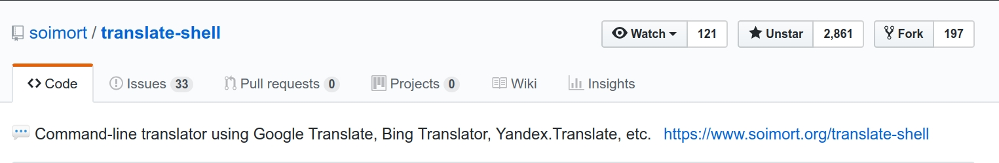

# [trans](https://github.com/soimort/translate-shell) 命令详解



## 常用命令

### 转换到特定语言，例如转换到中文和日文

``` shell
$ trans :en+ja Hello
Hello
こんにちは
(Kon'nichiwa)
Hello的定义
[ English -> 日本語 ]
感叹词
    もしもし！
        Hello!
    今日は!
        Hi!, Hello!, Good afternoon!, Good day!
Hello
    こんにちは, もしもし
```

### 指定待转换的源语言的语言类型，例如确定“手紙”是中文或日文

``` shell
$ trans ja: 手紙
手紙
(Tegami)
一封信
(Yī fēng xìn)
手紙 的翻译
[ 日本語 -> 简体中文 ]
手紙
    一封信, 信
$ trans en: 手紙
手紙
手纸
(Shǒuzhǐ)
手紙 的翻译
[ English -> 简体中文 ]
手纸
    手纸
```

### 转换一个句子，例如转换 “Hello world”

> 若不加引号，则是以单个词逐个翻译

``` shell
$ trans en: 'Hello world'
Hello world
你好，世界
(Nǐ hǎo, shìjiè)
Hello world 的翻译
[ English -> 简体中文 ]
Hello world
    你好，世界, 你好世界
    
# 多行句子翻译
$ trans en: 'Hello
world'
```

语言和相关的更多细节，参见[wiki: Languages](https://github.com/soimort/translate-shell/wiki/Languages)

| Language | Code | Language | Code | Language | Code |
| :------: | :--: | :------: | :--: | :------: | :--: |
| **[Afrikaans](http://en.wikipedia.org/wiki/Afrikaans_language)** <br/> **Afrikaans** | **`af`** | **[Hebrew](http://en.wikipedia.org/wiki/Hebrew_language)** <br/> **עִבְרִית** | **`he`** | **[Portuguese](http://en.wikipedia.org/wiki/Portuguese_language)** <br/> **Português** | **`pt`** | 
| **[Albanian](http://en.wikipedia.org/wiki/Albanian_language)** <br/> **Shqip** | **`sq`** | **[Hill Mari](http://en.wikipedia.org/wiki/Hill_Mari)** <br/> **Кырык мары** | **`mrj`** | **[Punjabi](http://en.wikipedia.org/wiki/Punjabi_language)** <br/> **ਪੰਜਾਬੀ** | **`pa`** | 
| **[Amharic](http://en.wikipedia.org/wiki/Amharic_language)** <br/> **አማርኛ** | **`am`** | **[Hindi](http://en.wikipedia.org/wiki/Hindi_language)** <br/> **हिन्दी** | **`hi`** | **[Querétaro Otomi](http://en.wikipedia.org/wiki/Querétaro_Otomi)** <br/> **Hñąñho** | **`otq`** | 
| **[Arabic](http://en.wikipedia.org/wiki/Arabic_language)** <br/> **العربية** | **`ar`** | **[Hmong](http://en.wikipedia.org/wiki/Hmong_language)** <br/> **Hmoob** | **`hmn`** | **[Romanian](http://en.wikipedia.org/wiki/Romanian_language)** <br/> **Română** | **`ro`** | 
| **[Armenian](http://en.wikipedia.org/wiki/Armenian_language)** <br/> **Հայերեն** | **`hy`** | **[Hmong Daw](http://en.wikipedia.org/wiki/Hmong_Daw)** <br/> **Hmoob Daw** | **`mww`** | **[Russian](http://en.wikipedia.org/wiki/Russian_language)** <br/> **Русский** | **`ru`** | 
| **[Azerbaijani](http://en.wikipedia.org/wiki/Azerbaijani_language)** <br/> **Azərbaycanca** | **`az`** | **[Hungarian](http://en.wikipedia.org/wiki/Hungarian_language)** <br/> **Magyar** | **`hu`** | **[Samoan](http://en.wikipedia.org/wiki/Samoan_language)** <br/> **Gagana Sāmoa** | **`sm`** | 
| **[Bashkir](http://en.wikipedia.org/wiki/Bashkir_language)** <br/> **башҡорт теле** | **`ba`** | **[Icelandic](http://en.wikipedia.org/wiki/Icelandic_language)** <br/> **Íslenska** | **`is`** | **[Scots Gaelic](http://en.wikipedia.org/wiki/Scots_Gaelic)** <br/> **Gàidhlig** | **`gd`** | 
| **[Basque](http://en.wikipedia.org/wiki/Basque_language)** <br/> **Euskara** | **`eu`** | **[Igbo](http://en.wikipedia.org/wiki/Igbo_language)** <br/> **Igbo** | **`ig`** | **[Serbian (Cyrillic)](http://en.wikipedia.org/wiki/Serbian_(Cyrillic))** <br/> **српски** | **`sr-Cyrl`** | 
| **[Belarusian](http://en.wikipedia.org/wiki/Belarusian_language)** <br/> **беларуская** | **`be`** | **[Indonesian](http://en.wikipedia.org/wiki/Indonesian_language)** <br/> **Bahasa Indonesia** | **`id`** | **[Serbian (Latin)](http://en.wikipedia.org/wiki/Serbian_(Latin))** <br/> **srpski** | **`sr-Latn`** | 
| **[Bengali](http://en.wikipedia.org/wiki/Bengali_language)** <br/> **বাংলা** | **`bn`** | **[Irish](http://en.wikipedia.org/wiki/Irish_language)** <br/> **Gaeilge** | **`ga`** | **[Sesotho](http://en.wikipedia.org/wiki/Sesotho_language)** <br/> **Sesotho** | **`st`** | 
| **[Bosnian](http://en.wikipedia.org/wiki/Bosnian_language)** <br/> **Bosanski** | **`bs`** | **[Italian](http://en.wikipedia.org/wiki/Italian_language)** <br/> **Italiano** | **`it`** | **[Shona](http://en.wikipedia.org/wiki/Shona_language)** <br/> **chiShona** | **`sn`** | 
| **[Bulgarian](http://en.wikipedia.org/wiki/Bulgarian_language)** <br/> **български** | **`bg`** | **[Japanese](http://en.wikipedia.org/wiki/Japanese_language)** <br/> **日本語** | **`ja`** | **[Sindhi](http://en.wikipedia.org/wiki/Sindhi_language)** <br/> **سنڌي** | **`sd`** | 
| **[Cantonese](http://en.wikipedia.org/wiki/Cantonese_language)** <br/> **粵語** | **`yue`** | **[Javanese](http://en.wikipedia.org/wiki/Javanese_language)** <br/> **Basa Jawa** | **`jv`** | **[Sinhala](http://en.wikipedia.org/wiki/Sinhala_language)** <br/> **සිංහල** | **`si`** | 
| **[Catalan](http://en.wikipedia.org/wiki/Catalan_language)** <br/> **Català** | **`ca`** | **[Kannada](http://en.wikipedia.org/wiki/Kannada_language)** <br/> **ಕನ್ನಡ** | **`kn`** | **[Slovak](http://en.wikipedia.org/wiki/Slovak_language)** <br/> **Slovenčina** | **`sk`** | 
| **[Cebuano](http://en.wikipedia.org/wiki/Cebuano_language)** <br/> **Cebuano** | **`ceb`** | **[Kazakh](http://en.wikipedia.org/wiki/Kazakh_language)** <br/> **Қазақ тілі** | **`kk`** | **[Slovenian](http://en.wikipedia.org/wiki/Slovenian_language)** <br/> **Slovenščina** | **`sl`** | 
| **[Chichewa](http://en.wikipedia.org/wiki/Chichewa_language)** <br/> **Nyanja** | **`ny`** | **[Khmer](http://en.wikipedia.org/wiki/Khmer_language)** <br/> **ភាសាខ្មែរ** | **`km`** | **[Somali](http://en.wikipedia.org/wiki/Somali_language)** <br/> **Soomaali** | **`so`** | 
| **[Chinese Simplified](http://en.wikipedia.org/wiki/Chinese_Simplified)** <br/> **简体中文** | **`zh-CN`** | **[Klingon](http://en.wikipedia.org/wiki/Klingon_language)** <br/> **tlhIngan Hol** | **`tlh`** | **[Spanish](http://en.wikipedia.org/wiki/Spanish_language)** <br/> **Español** | **`es`** | 
| **[Chinese Traditional](http://en.wikipedia.org/wiki/Chinese_Traditional)** <br/> **正體中文** | **`zh-TW`** | **[Klingon (pIqaD)](http://en.wikipedia.org/wiki/Klingon_(pIqaD))** <br/> ** ** | **`tlh-Qaak`** | **[Sundanese](http://en.wikipedia.org/wiki/Sundanese_language)** <br/> **Basa Sunda** | **`su`** | 
| **[Corsican](http://en.wikipedia.org/wiki/Corsican_language)** <br/> **Corsu** | **`co`** | **[Korean](http://en.wikipedia.org/wiki/Korean_language)** <br/> **한국어** | **`ko`** | **[Swahili](http://en.wikipedia.org/wiki/Swahili_language)** <br/> **Kiswahili** | **`sw`** | 
| **[Croatian](http://en.wikipedia.org/wiki/Croatian_language)** <br/> **Hrvatski** | **`hr`** | **[Kurdish](http://en.wikipedia.org/wiki/Kurdish_language)** <br/> **Kurdî** | **`ku`** | **[Swedish](http://en.wikipedia.org/wiki/Swedish_language)** <br/> **Svenska** | **`sv`** | 
| **[Czech](http://en.wikipedia.org/wiki/Czech_language)** <br/> **Čeština** | **`cs`** | **[Kyrgyz](http://en.wikipedia.org/wiki/Kyrgyz_language)** <br/> **Кыргызча** | **`ky`** | **[Tahitian](http://en.wikipedia.org/wiki/Tahitian_language)** <br/> **Reo Tahiti** | **`ty`** | 
| **[Danish](http://en.wikipedia.org/wiki/Danish_language)** <br/> **Dansk** | **`da`** | **[Lao](http://en.wikipedia.org/wiki/Lao_language)** <br/> **ລາວ** | **`lo`** | **[Tajik](http://en.wikipedia.org/wiki/Tajik_language)** <br/> **Тоҷикӣ** | **`tg`** | 
| **[Dutch](http://en.wikipedia.org/wiki/Dutch_language)** <br/> **Nederlands** | **`nl`** | **[Latin](http://en.wikipedia.org/wiki/Latin_language)** <br/> **Latina** | **`la`** | **[Tamil](http://en.wikipedia.org/wiki/Tamil_language)** <br/> **தமிழ்** | **`ta`** | 
| **[Eastern Mari](http://en.wikipedia.org/wiki/Eastern_Mari)** <br/> **Олык марий** | **`mhr`** | **[Latvian](http://en.wikipedia.org/wiki/Latvian_language)** <br/> **Latviešu** | **`lv`** | **[Tatar](http://en.wikipedia.org/wiki/Tatar_language)** <br/> **татарча** | **`tt`** | 
| **[Emoji](http://en.wikipedia.org/wiki/Emoji_language)** <br/> **Emoji** | **`emj`** | **[Lithuanian](http://en.wikipedia.org/wiki/Lithuanian_language)** <br/> **Lietuvių** | **`lt`** | **[Telugu](http://en.wikipedia.org/wiki/Telugu_language)** <br/> **తెలుగు** | **`te`** | 
| **[English](http://en.wikipedia.org/wiki/English_language)** <br/> **English** | **`en`** | **[Luxembourgish](http://en.wikipedia.org/wiki/Luxembourgish_language)** <br/> **Lëtzebuergesch** | **`lb`** | **[Thai](http://en.wikipedia.org/wiki/Thai_language)** <br/> **ไทย** | **`th`** | 
| **[Esperanto](http://en.wikipedia.org/wiki/Esperanto_language)** <br/> **Esperanto** | **`eo`** | **[Macedonian](http://en.wikipedia.org/wiki/Macedonian_language)** <br/> **Македонски** | **`mk`** | **[Tongan](http://en.wikipedia.org/wiki/Tongan_language)** <br/> **Lea faka-Tonga** | **`to`** | 
| **[Estonian](http://en.wikipedia.org/wiki/Estonian_language)** <br/> **Eesti** | **`et`** | **[Malagasy](http://en.wikipedia.org/wiki/Malagasy_language)** <br/> **Malagasy** | **`mg`** | **[Turkish](http://en.wikipedia.org/wiki/Turkish_language)** <br/> **Türkçe** | **`tr`** | 
| **[Fijian](http://en.wikipedia.org/wiki/Fijian_language)** <br/> **Vosa Vakaviti** | **`fj`** | **[Malay](http://en.wikipedia.org/wiki/Malay_language)** <br/> **Bahasa Melayu** | **`ms`** | **[Udmurt](http://en.wikipedia.org/wiki/Udmurt_language)** <br/> **удмурт** | **`udm`** | 
| **[Filipino](http://en.wikipedia.org/wiki/Filipino_language)** <br/> **Tagalog** | **`tl`** | **[Malayalam](http://en.wikipedia.org/wiki/Malayalam_language)** <br/> **മലയാളം** | **`ml`** | **[Ukrainian](http://en.wikipedia.org/wiki/Ukrainian_language)** <br/> **Українська** | **`uk`** | 
| **[Finnish](http://en.wikipedia.org/wiki/Finnish_language)** <br/> **Suomi** | **`fi`** | **[Maltese](http://en.wikipedia.org/wiki/Maltese_language)** <br/> **Malti** | **`mt`** | **[Urdu](http://en.wikipedia.org/wiki/Urdu_language)** <br/> **اُردُو** | **`ur`** | 
| **[French](http://en.wikipedia.org/wiki/French_language)** <br/> **Français** | **`fr`** | **[Maori](http://en.wikipedia.org/wiki/Maori_language)** <br/> **Māori** | **`mi`** | **[Uzbek](http://en.wikipedia.org/wiki/Uzbek_language)** <br/> **Oʻzbek tili** | **`uz`** | 
| **[Frisian](http://en.wikipedia.org/wiki/Frisian_language)** <br/> **Frysk** | **`fy`** | **[Marathi](http://en.wikipedia.org/wiki/Marathi_language)** <br/> **मराठी** | **`mr`** | **[Vietnamese](http://en.wikipedia.org/wiki/Vietnamese_language)** <br/> **Tiếng Việt** | **`vi`** | 
| **[Galician](http://en.wikipedia.org/wiki/Galician_language)** <br/> **Galego** | **`gl`** | **[Mongolian](http://en.wikipedia.org/wiki/Mongolian_language)** <br/> **Монгол** | **`mn`** | **[Welsh](http://en.wikipedia.org/wiki/Welsh_language)** <br/> **Cymraeg** | **`cy`** | 
| **[Georgian](http://en.wikipedia.org/wiki/Georgian_language)** <br/> **ქართული** | **`ka`** | **[Myanmar](http://en.wikipedia.org/wiki/Myanmar_language)** <br/> **မြန်မာစာ** | **`my`** | **[Xhosa](http://en.wikipedia.org/wiki/Xhosa_language)** <br/> **isiXhosa** | **`xh`** | 
| **[German](http://en.wikipedia.org/wiki/German_language)** <br/> **Deutsch** | **`de`** | **[Nepali](http://en.wikipedia.org/wiki/Nepali_language)** <br/> **नेपाली** | **`ne`** | **[Yiddish](http://en.wikipedia.org/wiki/Yiddish_language)** <br/> **ייִדיש** | **`yi`** | 
| **[Greek](http://en.wikipedia.org/wiki/Greek_language)** <br/> **Ελληνικά** | **`el`** | **[Norwegian](http://en.wikipedia.org/wiki/Norwegian_language)** <br/> **Norsk** | **`no`** | **[Yoruba](http://en.wikipedia.org/wiki/Yoruba_language)** <br/> **Yorùbá** | **`yo`** | 
| **[Gujarati](http://en.wikipedia.org/wiki/Gujarati_language)** <br/> **ગુજરાતી** | **`gu`** | **[Papiamento](http://en.wikipedia.org/wiki/Papiamento_language)** <br/> **Papiamentu** | **`pap`** | **[Yucatec Maya](http://en.wikipedia.org/wiki/Yucatec_Maya)** <br/> **Màaya T'àan** | **`yua`** | 
| **[Haitian Creole](http://en.wikipedia.org/wiki/Haitian_Creole)** <br/> **Kreyòl Ayisyen** | **`ht`** | **[Pashto](http://en.wikipedia.org/wiki/Pashto_language)** <br/> **پښتو** | **`ps`** | **[Zulu](http://en.wikipedia.org/wiki/Zulu_language)** <br/> **isiZulu** | **`zu`** | 
| **[Hausa](http://en.wikipedia.org/wiki/Hausa_language)** <br/> **Hausa** | **`ha`** | **[Persian](http://en.wikipedia.org/wiki/Persian_language)** <br/> **فارسی** | **`fa`** | 
| **[Hawaiian](http://en.wikipedia.org/wiki/Hawaiian_language)** <br/> **ʻŌlelo Hawaiʻi** | **`haw`** | **[Polish](http://en.wikipedia.org/wiki/Polish_language)** <br/> **Polski** | **`pl`** | 
