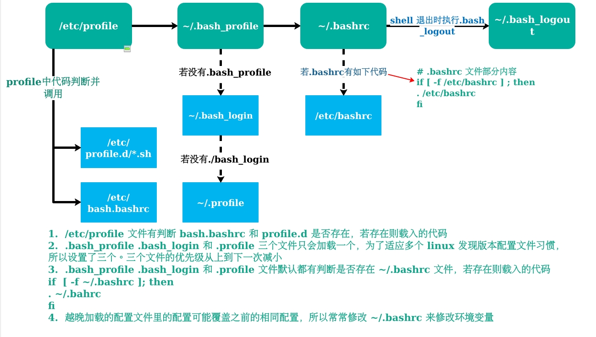
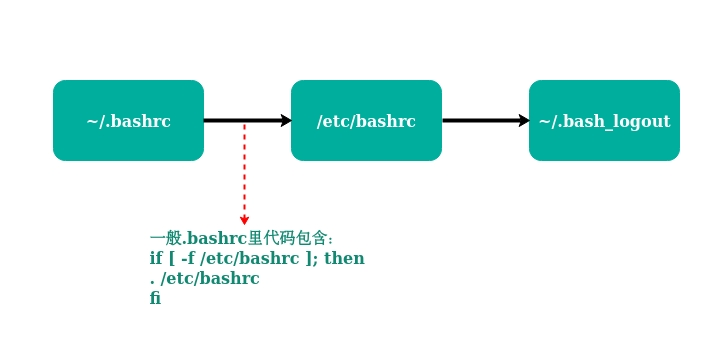
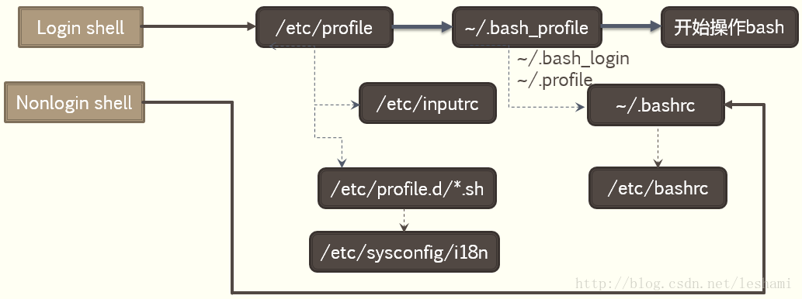

# 从 Bash Shell 启动“窥探” Linux 环境变量相关文件（ 代码以 Ubuntu 18.04 LTS 为例 ）

> 本篇涉及的 Linux 文件，除了设置环境变量，往往还有很多其他用途；本篇内容参考多篇相关网络文章，并结合自己理解，可定会有错误或不准确的地方，望指正！

## Linux Shell 

* 在有像平时启动 Windows 立马出现的图形化界面之前，与计算机的交互只能输入命令。在 UNIX 系统或 Linux 系统中，用来解释和管理命令的程序称作 Shell

Linux Shell 种类

名称 | 说明
------ | ------
Bash Shell | 全称 Bourne Again Shell，现今大多数 Linux 发行版本都包含
C Shell ( csh ) | BSD UNIX 用户中非常流行
Korn Shell ( ksh ) | UNIX System V用户中非常流行
Tcsh Shell | 一种改进的 C Shell
Ash Shell | 与 Bourne Shell 非常相似

## Bash Shell 常用的环境配置文件

> * Linux Bash Shell 运行时，按照一定的顺序加载配置文件，初始化配置文件后，运行 Bash Shell
> * Linux Bash 的配置文件大概分为两类：系统配置文件和用户配置文件

* bash shell 系统配置文件
```
/etc/profile、/etc/bash.bashrc、/etc/profile.d/*.sh
```
* bash shell 用户配置文件
```
~/.bash_profile、~/.bash_login、~/.profile、~/.bashrc
```

### Bash 配置文件解读

文件 | 说明
------ | ------
/etc/profile | 该文件为每个用户设置了用户环境信息。当首次登录时执行该文件，还可以在该文件里设置用户邮箱位置、历史文件大小、PATH 路径之类的环境变量。并且该文件还会从 /etc/profile.d/ 目录的配置文件中收集相关的 Shell 设置
/etc/bashrc | 对于运行 Bash Shell 的用户来说，每次打开一个 Bash Shell 时都会执行该文件。可以在该文件里使用命令 alias 添加别名等。此外，每个用户可以用 ~/.bashrc 文件中信息重写 /etc/bashrc 中的已存在值
~/.bash_profile | 该文件内设置的信息只对当前用户有效。只有当用户登录时才会执行该文件，在默认情况下，它设置一些环境变量并执行 ~/.bashrc 文件。添加环境变量通常是在这个文件里
~/.bashrc | 该文件包含了特定于 Bash Shell 信息。当进行登录以及每次打开一个新的 Bash Shell 时都会读取该文件。此外，alias 添加别名通常是在该文件里
~/.bash_logout | 每次注销（ 即退出最后一个 Bash Shell ）执行该文件，并且默认清除屏幕

> 除了读取上述配置文件之外，在登陆 shell 中还会读取其他相关配置信息，如读取 ```~/.bash_history、/etc/man.config、~/.bash_logout``` 等等

## Bash Shell 环境配置文件加载顺序详解

### 登录 shell（ login shell ）配置文件载入顺序

* 取得 bash 时需要完整的登陆流程的，就称为 login shell 
* 比如通过 ssh 方式连接，或者由 tty1 ~ tty6 登陆，需要输入用户的账号与密码，此时取得的 bash 就称为 login shell

<div align=center>
<br>login shell 载入读取环境配置文件过程图
</div>

> * ```~/.bash_profile、~/.bash_login、~/.profile、~/.bashrc```文件若没有，可自行创建
> * 前两列只有 login shell 情况下才会加载（ ```/etc/profile ```及　```~/bash_profile``` 列 ）

### 非登录 shell（ non-login shell ）配置文件载入顺序

* 取得 bash 接口的方法不需要重复登陆的举动 
* 比如你以 X window 登陆 Linux 后， 再以 X 的图形化接口启动终端机，此时该终端接口无需输入账号与密码，则为 non-login shell 
* 比如你在原本的 bash 环境下再次下达 bash 这个命令，同样的也没有输入账号密码，那第二个 bash (子程序) 也是 non-login shell

<div align=center>
<br>non login shell 载入读取环境配置文件过程图
</div>

### CentOs Bash Shell 环境配置文件加载顺序情况

<div align=center>
<br>《鸟哥的 linux 私房菜》里的 CentOs Bash Shell 配置文件加载顺序
</div>

## source 命令

* 对于 shell 环境变量修改之后需要立即生效的情形，可以使用 source 来立即生效（ 也可以用命令 "." ）

``` shell
source 接带路径的配置文件名
source filename
# source /etc/profile
. 接带路径的配置文件名
. filename（中间有空格）
# . /etc/profile
```
> * source filename 与 sh filename 、./filename的区别：
> 	* source - 在当前 shell 内去读取、执行a.sh，而a.sh不需要有 "执行权限"，所有新建、改变变量的语句都会保存在当前 shell 里面
> 	* sh - 打开一个 subshell 去读取、执行 filename ，而 filename 不需要有 "执行权限"
> 	* . - 打开一个 subshell 去读取、执行 filename ，但 filename 需要有 "执行权限"
> 	* 在子 shell 中执行脚本里面的语句，该子 shell 继承父 shell 的环境变量，但子在 shell 中改变的变量不会被带回父 shell（除非使用 export）


