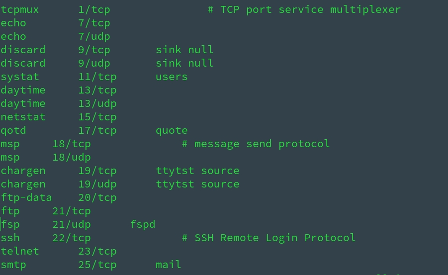
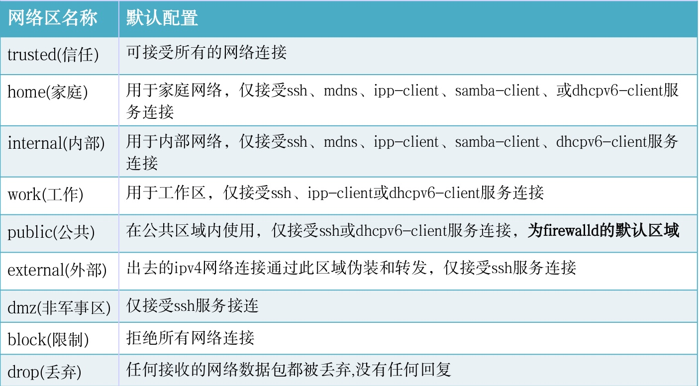

> 之前很少会需要修改防火墙，也一直懒得系统学习一下，尤其在 VPS 配置安全组时，只能照着教程改，但并不明白啥意思，总归还是太菜和太懒！最近接触 zabbix ，看来不得不学习一下了

# 防火墙学习笔记

## 背景补充

### SELinux、Netfilter、iptables、firewall 和 ufw五者关系

1. SELinux ( Security-Enhanced Linux，安全增强式 Linux ) 是一个 Linux 内核的安全模块，其提供了访问控制安全策略机制
2. netfilter 是 Linux 内核中的一个软件框架，用于管理网络数据包。不仅具有网络地址转换（ NAT ）的功能，也具备数据包内容修改、以及数据包过滤等防火墙功能。利用运作于用户空间的应用软件，如 iptables、ebtables 和 arptables 等，来控制 netfilter，系统管理者可以管理通过 Linux 操作系统的各种网络数据包
3. iptables 是一个命令行工具，用来配置 netfilter 防火墙
4. firewall 是 centos7+、RHEL7+、Fedora 里面新的防火墙管理命令
5. ufw 是 Ubuntu 下的一个简易的防火墙配置工具


> * SELinux 是美国国家安全局 (NSA ) 对于强制访问控制的实现，是 Linux 历史上最杰出的新安全子系统，它不是用来防火墙设置的，但它对 Linux 系统的安全很有用。Linux 内核 ( Kernel ) 从 2.6 就有了SELinux
> * ufw、firewall 其实都是对 iptables 的封装，底层执行的都是 iptables 命令；iptables 调用内核模块 netfilter 实施真正的操作

### `/etc/services`文件详解

> * `/etc/services` 文件包含网络服务和它们映射端口的列表；inetd 或 xinetd ( Internet 守护程序 ) 会查看这些细节，以便在数据包到达各自的端口或服务有需求时，它会调用特定的程序
> * 文件格式：`service-name    port/protocol   [aliases..]  [#comment]`
>   * service-name 是网络服务的名称。例如 telnet、ftp 等
>   * port/protocol 是网络服务使用的端口（一个数值 ）和服务通信使用的协议（ TCP/UDP ）
>   * alias 是服务的别名
>   * comment 是你可以添加到服务的注释或说明，以 # 标记开头
>   * 最后两个字段是可选的，因此用 [ ] 表示


<div align=cneter>
<br/>sudo vim /etc/services
</div>


## SELinux

* **很多教程安装配置的时候一上来就让我们关了 SELinux，知乎回答**
  * SELinux 策略是白名单原则，所以你需要非常清楚你的各项操作都需要哪些访问权限，这个好像数量有点多了
  * 不外乎不懂怎么用，关了一了百了，懂怎么用的不想折腾，还是关了一了百了
  * 因为它在本来已经很安全的 Linux 上，凌驾于 root 权限之上，设置了很多额外的条条框框；如果你了解这些条条框框，那还好；但如果不了解，那 SELinux 可能并没有帮什么忙，却给你带来了很多不确定因素
  
#### 常用命令

``` shell
# 查看 SELinux 是否运行
getenforce                
# disabled：表示 selinux 关闭，没有启动；其他两种 ( enforcing、permissive ) 均表示 selinux 启动了，只是运行的模式不一样

# 关闭SELinux

# 临时生效，重启机器后失效
# 命令临时生效：
setenforce 0 
#            1 启用
#           0 告警，不启用

# 永久生效
# 操作前先备份
cp /etc/selinux/config /etc/selinux/config.bak
# 更改 setlinux 级别
sed -i 's/SELINUX=enforcing/\SELINUX=disabled/' /etc/selinux/config
 # 或 
vim /etc/selinux/config
# 修改SELINUX=disabled
# 使用配置生效
reboot 
# 或
setenforce 0        #使配置立即生效
```

## netfilter

* netfilter 是 Linux 操作系统核心层内部的一个数据包处理模块
## iptables

* 在 Linux 生态系统中，iptables 是使 用很广泛的防火墙工具之一，它基于内核的包过滤框架（packet filtering framework） netfilter
* iptables 是运行在用户态的一个程序，通过 netlink 和内核的 netfilter 框架打交道
* iptables 是 Linux 下功能强大的应用层防火墙工具, 说到 iptables 必然提到Netfilter，iptables 是应用层的，其实质是一个定义规则的配置工具，而核心的数据包拦截和转发是 Netfiler

#### 常用命令

```shell
# 安装 iptables
yum install iptables-serices -y
# 查看防火墙状态：
service iptables status
# 关闭防火墙（永久性,重启机器后也会保持生效)
chkconfig iptables off
# 开启防火墙 (永久性,重启机器后也会保持生效）
chkconfig iptables on
# 临时关闭防火墙（重启机器后失效)
service iptables off
# 临时开启防火墙（重启机器后失效)
service iptables on
```

**[iptables 深度详解](https://liqiang.io/post/dive-in-iptables)**


## firewall

> * firewall 的底层是使用 iptables 进行数据过滤，建立在 iptables 之上
> * firewall 是动态防火墙，使用了 D-BUS 方式，修改配置不会破坏已有的数据链接

### firewalld

* firewalld - Dynamic Firewall Manager

#### 常用命令

``` shell
# 安装 firewall 
yum install firewalld firewall-config -y
# 启动防火墙
systemctl start firewalld.service
# 停止防火墙/关闭防火墙
systemctl stop firewalld.service
# 重启防火墙
systemctl restart firewalld.service
# 设置开机启用防火墙
systemctl enable firewalld.service
# 设置开机不启动防火墙
systemctl disable firewalld.service
```

#### 配置

* 修改 firewall 三种方法：**firewall-config ( 图形化 )、firewall-cmd ( 命令行 )、配置文件内修改**
* firewalld 的配置文件是以 xml 的格式，存储在 `/usr/lib/firewalld/`（用户 和 `/etc/firewalld/` 目录中


### firewall-cmd

* firewall - cmd is the command line client of the firewalld daemon. It provides interface to manage runtime and permanent configuration.


#### 常用命令

``` shell
# 查看 firewall 状态
firewall-cmd --state
# 列出开放的端口号
firewall-cmd --zone=public --list-ports
# 新增开放端口号
firewall-cmd [--zone=<zone>] --add-port=<port>[-<port>]/<protocol> [--timeout=<seconds>] [--permanent]
# 例如：
firewall-cmd --zone=public --add-port=80/tcp --permanent
#说明:
# --zone 网络区域定义了网络连接的可信等级
#       阻塞区域（block）：任何传入的网络数据包都将被阻止
#       工作区域（work）：相信网络上的其他计算机，不会损害你的计算机
#       家庭区域（home）：相信网络上的其他计算机，不会损害你的计算机
#       公共区域（public）：不相信网络上的任何计算机，只有选择接受传入的网络连接
#       隔离区域（DMZ）：也称为非军事区域，内外网络之间增加的一层网络，起到缓冲作用。对于隔离区域，只能选择接受传入的网络连接
#       信任区域（trusted）：所有的网络连接都可以接受
#       丢弃区域（drop）：任何传入的网络连接都被拒绝
#       内部区域（internal）：信任网络上的其他计算机，不会损害你的计算机。只有选择接受传入的网络连接
#       外部区域（external）：不相信网络上的其他计算机，不会损害你的计算机。只有选择接受传入的网络连接
# --add-port=80/tcp 添加端口，格式为：端口或端口范围/协议(udp/tcp)
# --permanent 永久生效，没有此参数重启后失效
# 查看
firewall-cmd --zone=public --query-port=80/tcp
# 删除
firewall-cmd --zone=public --remove-port=80/tcp --permanent
# 查看当前活动的区域,并附带一个目前分配给它们的接口列表
firewall-cmd --get-active-zones
# 查看默认区域
firewall-cmd --get-default-zone
# 查看所有可用区域
firewall-cmd --get-zones
# 列出指定域的所有设置
firewall-cmd --zone=public --list-all
# 列出所有预设服务
firewall-cmd --get-services
# (这样将列出 /usr/lib/firewalld/services/ 中的服务器名称。注意:配置文件是以服务本身命名的service-name. xml)
# 列出所有区域的设置
firewall-cmd --list-all-zones
# 设置默认区域
firewall-cmd --set-default-zone=dmz
# 设置网络地址到指定的区域
firewall-cmd --permanent --zone=internal --add-source=192.168.122.0/24
# (--permanent参数表示永久生效设置,如果没有指定--zone参数,那么会加入默认区域)
# 删除指定区域中的网路地址
# firewall-cmd --permanent --zone=internal --remove-source=192.168.122.0/24
# 添加、改变、删除网络接口
firewall-cmd --permanent --zone=internal --add-interface=eth0
firewall-cmd --permanent --zone=internal --change-interface=eth0
firewall-cmd --permanent --zone=internal --remove-interface=eth0
# 添加、删除服务
firewall-cmd --permanent --zone=public --add-service=smtp
firewall-cmd --permanent --zone=public --remove-service=smtp
# 列出、添加、删除端口
firewall-cmd --zone=public --list-ports
firewall-cmd --permanent --zone=public --add-port=8080/tcp
firewall-cmd --permanent --zone=public --remove-port=8080/tcp
# 重新载入，每次执行完 firewall-cmd 都应该 reload 一次
# 注意: 这并不会中断已经建立的连接,如果打算中断,可以使用 --complete-reload 选项
firewall-cmd --reload
```

<div align=cneter>
<br/>zone 信任等级详解
</div>


 ## ufw - uncomplicated firewall - 简易防火墙

> * ufw 是一个 **Arch Linux、Debian 或 Ubuntu** 中管理防火墙规则的前端；ufw 默认包含在 Ubuntu 中，但在 Arch 和 Debian 中需要自行安装
> * ufw 是基于 iptables 实现的防火墙管理工具，所以实际上 ufw 修改的是 iptables 的规则

  #### 配置

  > * `/etc/ufw` - 一些 ufw 的环境设定文件
  > * `/etc/sysctl.conf` - 若开启ufw之 后，`/etc/ufw/sysctl.conf`会覆盖默认的`/etc/sysctl.conf`文件，若你原来的`/etc/sysctl.conf`做了修改，启动ufw后，若`/etc/ufw/sysctl.conf`中有新赋值，则会覆盖`/etc/sysctl.conf`的，否则还以`/etc /sysctl.conf`为准
  > * `/etc/default/ufw` - 当然你可以通过修改`/etc/default/ufw`中的`IPT_SYSCTL=`条目来设置使用哪个 sysctrl.conf

#### 备份/还原规则

>  * ufw 的所有规则文件都在路径`/etc/ufw/`，其中`before.rules`规则为  ufw 在运行用户自定义的规则之前运行的规则，相应的`before6.rules`对应 IPV6；`after.rules`为 ufw 启用用户自定义规则之后运行的规则；`user.rules`即为用户自定义的规则
> * 所以可以通过直接备份这些配置文件的方式来备份防火墙规则，需要备份的文件有：
>   * `/etc/ufw/*.rules`
>   * `/lib/ufw/*.rules`
>   * `/etc/default/ufw`  *这个配置文件如果没有修改过，可以不备份*
> * 修改配置文件之后需要重新加载配置文件：`sudo ufw reload`

 #### 常用命令

 ``` shell
 # 安装 ufw
 sudo apt-get install ufw
 # 查看防火墙状态
sudo ufw status
# 启动、关闭、查看状态、开机启动、开机不启动防火墙
systemctl start|stop|status|enable|disable ufw
# 开机启动、开机不启动防火墙  ( 默认设置是 disable )
sudo ufw enable|disable
# 设置默认策略，即为拒绝所有传入连接，允许所有传出链接
sudo ufw default deny incoming
sudo ufw default allow outgoing
# 允许/拒绝访问 20 端口，20 后可跟 /tcp 或 /udp，表示 tcp 或 udp 封包
sudo ufw allow/deny 20[/tcp|/udp]
# 删除上面定义的“允许/拒绝访问 20 端口”的规则
sudo ufw delete allow/deny 20[/tcp|/udp]
# ufw 的 allow 不加 in/out 允许连接默认是指允许入站连接，如果要指定允许出站，可以加上 out，如：
sudo ufw allow in port        #允许 port 入站
sudo ufw allow out port     #允许 port 出站
# 允许/拒绝访问某个 service 的端口 ( 在  /etc/services 文件中查看 service )，删除同前面加 delete
# ufw 通过 /etc/services 文件得到 service 默认端口号
sudo ufw allow/deny [service]
# 例如
sudo ufw allow http       <==>       sudo ufw allow 80/tcp
# 设置外来访问默认允许/拒绝
sudo ufw default allow/deny
# 允许/拒绝特定端口范围连接
sudo ufw allow/deny 1000:2000[/tcp|/udp]
# 允许/拒绝特定 IP，删除同前面加 delete
sudo ufw allow/deny from 192.168.254.254
# 允许/拒绝特定 IP 特定端口的连接，删除同前面加 delete
sudo ufw allow/deny from 111.111.111.111 to any port 22
# 允许/拒绝自10.0.1.0/10 的 tcp 封包访问本机的 25 端口，删除同前面加 delete
sudo ufw allow/deny proto tcp from 10.0.1.0/10 to 127.0.0.1 port 25
# 查看所有规则的规则号
sudo ufw status numbered
# 删除规则编号或删除指定实际规则
delete num/rule
# 重置防火墙
# 该命令将禁用 ufw，删除所有已经定义的规则，所有规则将被重设为安装时的默认值，不过默认该命令会对已经设置的规则进行备份
sudo ufw reset
# 批量禁止 IP，file.txt 里面是一个需要禁止的 IP 列表
while read line; do sudo ufw deny from $line; done < file.txt
# 重启 ufw 使得新规则生效
sudo ufw reload
 ```


