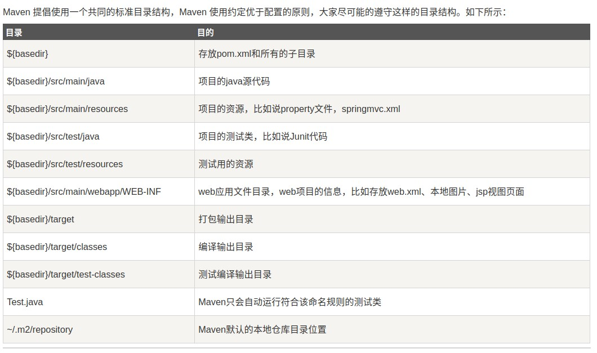

# Maven 小知识

## [目录]

* [maven help 插件](#maven-help-插件)

###  maven help 插件

Maven就是是专门为 Java 项目打造的管理和构建工具，它的主要功能有：

- 提供了一套标准化的项目结构；
- 提供了一套标准化的构建流程（编译，测试，打包，发布……）；
- 提供了一套依赖管理机制

``` shell
a-maven-project
├── pom.xml
├── src
│   ├── main
│   │   ├── java
│   │   └── resources
│   └── test
│       ├── java
│       └── resources
└── target
		├── classes
        └── test-classes
```



## pom.xml

>  **项目描述文件 - maven 核心**

### `<dependency>` - 依赖

* Maven使用`groupId`，`artifactId`和`version`唯一定位一个依赖

* Maven 项目的构建往往要依赖于第三方的类库。通过 `<dependencies>` 可以给出 Maven 项目所依赖的第三方类库
* 使用 `<dependency>` 声明一个依赖后，Maven 就会自动下载这个依赖包并把它放到 classpath 中

``` xml
<dependencies>
    <dependency>
      <groupId>junit</groupId>
      <artifactId>junit</artifactId>
      <version>4.0</version>
      <type>jar</type>  <!-- 打包类型，默认jar -->
      <scope>test</scope>
      <optional>true</optional>
    </dependency>
    ...
</dependencies>
```

### `<parent>` - 继承

> 若每个子模块都都用的了 spring，那么我们是不是每个子模块都需要单独配置 spring 依赖了？这么做是可以的，但是我们有更优的做法，那就是继承，用parent 来实现

* 用聚合 pom.xml 来做父 pom，配置子模块的公共依赖

``` xml
<parent>
    <groupId>com.youzhibing.account</groupId>
    <artifactId>account-aggregator</artifactId>
    <version>1.0.0-SNAPSHOT</version>
    <relativePath>../pom.xml</relativePath> <!-- 与不配置一样，默认就是寻找上级目录下的 pom.xml -->
 </parent>
```

>  假设将来需要添加一个新的子模块 account-util，该模块只是提供一些简单的帮助工具，不需要依赖 spring、junit，那么继承后就依赖上了，有没有什么办法了？ - **`<dependencyManagement>`**


Snapshot 版本代表不稳定、尚处于开发中的版本

Release 版本则代表稳定的版本

