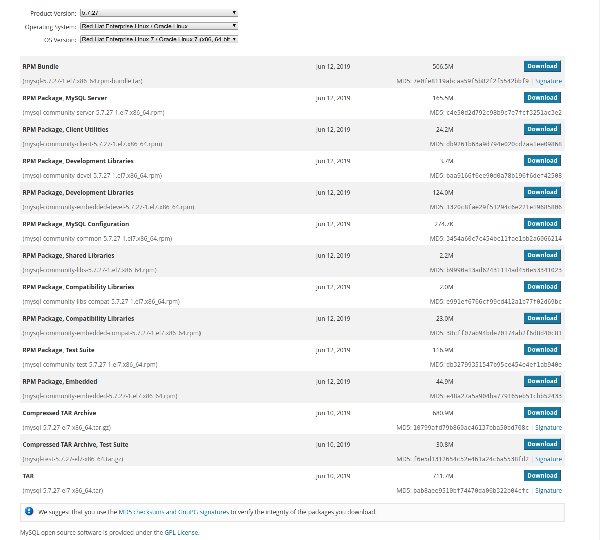
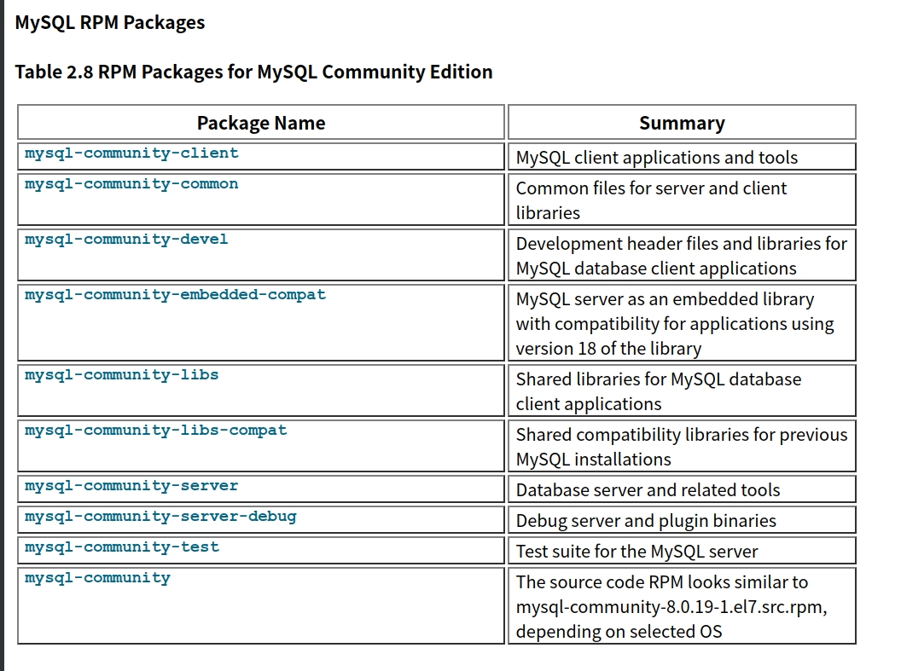

# 目录

* [MySQL Product Archives](https://downloads.mysql.com/archives/)
* [MySQL Community Server (Archived Versions)](https://downloads.mysql.com/archives/community/)
* [Installing and Upgrading MySQL](https://nowjava.com/docs/mysql-8.0-en/installing.html#linux-installation-yum-repo)
* [MySQL 8.0 中文参考手册](http://www.deituicms.com/mysql8cn/cn/index.html)
* [使用Mysqldump备份和恢复MySQL数据库](http://blog.itpub.net/31516067/viewspace-2690413/)
* [mysqldump备份所有数据库，恢复单个库的场景预演](https://my.oschina.net/rootliu/blog/1819708)

## MySQL DataBase 各个发行版本
* MySQL Community Server：社区版本，开源免费，但不提供官方技术支持（我们常用的MySQL版本）
* MySQL Enterprise Edition：企业版本，需付费，可以试用30天
* MySQL Cluster：集群版，开源免费。可将几个MySQL Server封装成一个Server
* MySQL Cluster CGE：高级集群版，需付费
* MySQL Workbench (GUI TOOL)：专为MySQL设计的ER/数据库建模工具。MySQL Workbench又分为两个版本，分别是社区版（MySQL Workbench OSS）、商用版（MySQL Workbench SE）

## MySQL Community Server 各个下载版本

> * MySQL 官网的 [MySQL Community Server](https://dev.mysql.com/downloads/mysql/) (也就是我们常说的 MySQL ) 档案
> * CentOS / Red Hat

可以看到如下下载选项：

* rpm package  是某个特定的包，比如 server、client、shared lib 等，也可以单独安装
* rpm bundle  是该版本所有包的集合，一般是把服务器端要用的都安装上，其他的不带，尤其是开发包
* Compressed TAR Archive  源码，必须用源码方式安装，需要自己编译的，也有编译好，但不是安装包的

* mysql-server  mysql服务器
* mysql-client  mysql客户端
* mysql-common  包含客户端需要的一些文件，如/etc/mysql/my.cnf
* mysql-devel  库和包含文件，如果想要做客户端开发，则需要该包
* mysql-share  包含某些语言和应用程序需要动态装载的共享库(libmysqlclient.so*)
* mysql-libs  包含任意mysql客户端程序与接口的共享库
* mysql-bench   MySQL数据库服务器的基准和性能测试工具
* mysql-embedded  MySQL是一个多用户、多线程的数据库，这个组件将mysql服务程序集成到客户端应用程序中，而不是占用一个单独的进程

