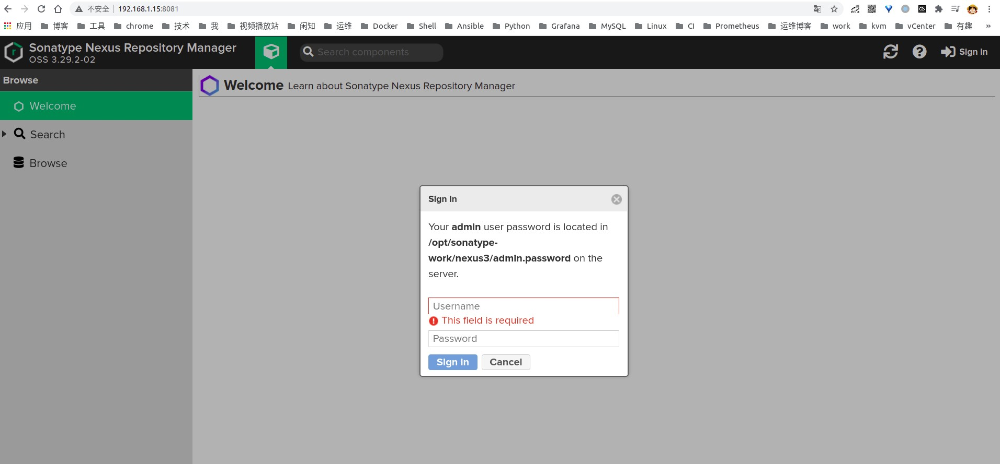
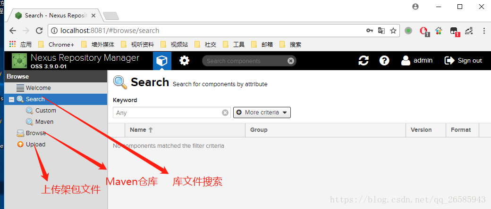
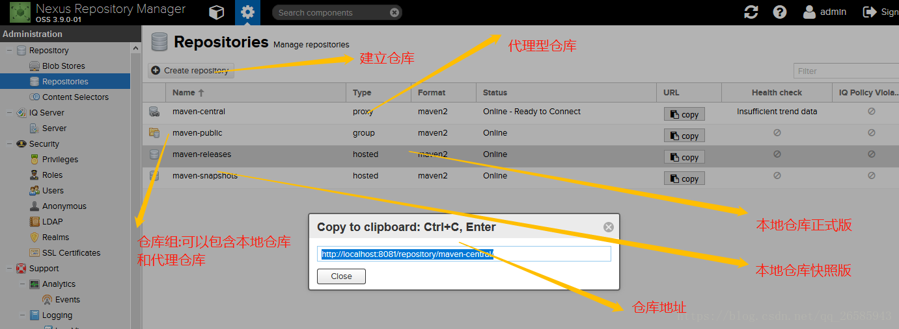

# Nexus 学习

## 目录

* **[部署 & 管理](#部署--管理)** 

* **[配置详解](#配置详解)**


## 部署 & 管理

* nexus 命令管理

``` shell
# /opt/nexus/bin/nexus start
WARNING: ************************************************************
WARNING: Detected execution as "root" user.  This is NOT recommended!
WARNING: ************************************************************
Starting nexus
# /opt/nexus/bin/nexus stop
WARNING: ************************************************************
WARNING: Detected execution as "root" user.  This is NOT recommended!
WARNING: ************************************************************
Shutting down nexus
Stopped.
```

* systemd 管理

``` shell
# cat /lib/systemd/system/nexus.service
[Unit]
Description=Nexus service
After=network.target
[Service]
Type=forking
LimitNOFILE=65536
ExecStart=/opt/nexus/bin/nexus start
ExecStop=/opt/nexus/bin/nexus stop
User=root
Restart=on-abort

[Install]
WantedBy=multi-user.target

# systemctl daemon-reload
# systemctl enable nexus.service
# systemctl start nexus.service
# systemctl status nexus.service

# firewall-cmd --zone=public --permanent --add-port=8081/tcp
# firewall-cmd --reload 
# journalctl -xefu nexus 查看 Nexus 服务日志
```

* 检测 nexus 启动是否成功

``` shell
# 返回 pong 则是成功
$ curl -u admin:admin123 http://192.168.1.15:8081/service/metrics/ping
pong
```

* 浏览器访问



* 查看密码

``` shell
# cat /opt/sonatype-work/nexus3/admin.password
af262c70-e495-46ba-adc2-885e5ba1d72a
```

## 配置详解

* **`/opt/nexus/bin/nexus.vmoptions`** 配置文件

## 使用说明



