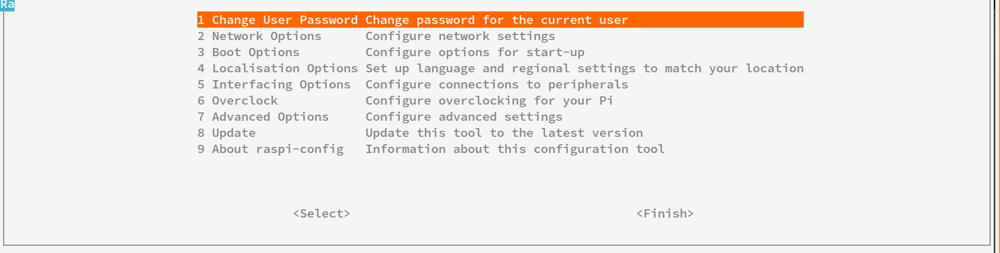

# 使用树莓派 3B 遇到的问题

## 树莓派挂载硬盘

``` shell
# 查看系统上的文件系统的磁盘使用情况统计
df -h  //
```
## 树莓派源的配置

* 修改`/etc/apt/sources.list`
> 命令`sudo apt update`就是在这个文件里找软件源镜像站进行缓存更新

``` shell
pi@raspberrypi:/etc/apt $ cat sources.list
# Uncomment line below then 'apt-get update' to enable 'apt-get source'
# 注释掉原来的软件源
#deb-src http://archive.raspbian.org/raspbian/ stretch main contrib non-free rpi
# 添加替换的软件源
deb http://mirrors.aliyun.com/raspbian/raspbian/ stretch main contrib non-free rpi 
```
* 修改好文件后执行命令：`sudo apt update`即完成软件源的替换了
* 常用软件源
```
中科大
deb http://mirrors.ustc.edu.cn/raspbian/raspbian/ jessie main contrib non-free rpi 
清华
deb https://mirrors.tuna.tsinghua.edu.cn/raspbian/raspbian/ jessie main contrib non-free rpi
大连东软
deb http://mirrors.neusoft.edu.cn/raspbian/raspbian/ jessie main contrib non-free rpi
重庆大学
deb http://mirrors.cqu.edu.cn/raspbian/raspbian/ jessie main contrib non-free rpi
浙江大学
deb http://mirrors.zju.edu.cn/raspbian/raspbian/ jessie main contrib non-free rpi
阿里云
deb http://mirrors.aliyun.com/raspbian/raspbian/ jessie main contrib non-free rpi 
搜狐
deb http://mirrors.sohu.com/raspbian/raspbian/ jessie main contrib non-free rpi 
元智大学（中国台湾）
deb http://ftp.cse.yzu.edu.tw/Linux/raspbian/raspbian/ jessie main contrib non-free rpi 
新加坡国立大学
deb http://mirror.nus.edu.sg/raspbian/raspbian/ jessie main contrib non-free rpi
北陆先端科学技术大学院大学（日本知名镜像站，日常出口带宽2g）
deb http://ftp.jaist.ac.jp/raspbian/ jessie main contrib non-free rpi 
牛津大学
deb http://mirror.ox.ac.uk/sites/archive.raspbian.org/archive/raspbian/  jessie main contrib non-free rpi 
美国Berkely大学
deb http://mirrors.ocf.berkeley.edu/raspbian/raspbian/ jessie main contrib non-free rpi
美国俄克拉荷马大学
deb http://reflection.oss.ou.edu/raspbian/raspbian/ jessie main contrib non-free rpi
南非知名软件源
deb http://mirror.liquidtelecom.com/raspbian/raspbian/ jessie main contrib non-free rpi 
默认源（带重定向by mirrorbrain）
deb http://mirrordirector.raspbian.org/raspbian/ jessie main contrib non-free rpi
官方源
deb https://archive.raspbian.org/raspbian/ jessie main contrib non-free rpi
```

## ssh 登录，开启后台运行命

### `screen` - 希望断开 ssh 即关闭 screen 内执行任务，当再次登录还能从上次任务结束出开始，不必重新执行
* 安装 screen :`sudo apt install screen`
* 开启一个后台：`screen -dmS xxx( 后台名字 )`
* 暂时退出当前 screen :<kbd>CTRL</kbd> + <kbd>a</kbd> + <kbd>d</kbd>
* 显示已开启的后台：`screen -ls`
* 返回某一个后台“xxx” :`screen -r xxx`

### `nohup` - 即使断开 ssh 连接，使用 nohup 执行的任务仍然会在后台运行，非常适用于远程使用服务器下载

* 如果你正在运行一个进程，而且你觉得在退出帐户时该进程还不会结束，那么可以使用 nohup 命令。该命令可以在你退出帐户/关闭终端之后继续运行相应的进程。nohup 就是不挂起的意思( no hang up)

``` shell
nohup [命令] [参数] [&]
# 最后加上 & ，这样即使退出当前终端，命令仍然会在后台运行
```

## 安装中文字库

* 由于树莓派默认是采用英文字库的，而且系统里没有预装中文字库，所以即使你在locale中改成中文，也不会显示中文，只会显示一堆方块。因此需要我们手动来安装中文字体，好在有一个中文字体是免费开源使用

``` shell
# 安装
sudo apt-get install ttf-wqy-zenhei
# 刷新字库缓存
sudo fc-cache
```

## 在命令状态下输入一下代码，打开配置界面 

``` shell
# 进入配置界面
sudo raspi-config
# 当想直接进入字体配置可用
sudo dpkg-reconfigure locales
```
<div align=center>
  <br/>树莓派命令行打开的配置界面
</div>

<div align=center>
  <br/>树莓派命令行打开的字体配置界面
</div>


