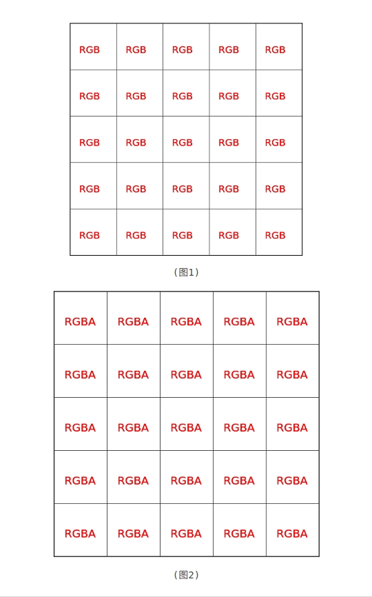
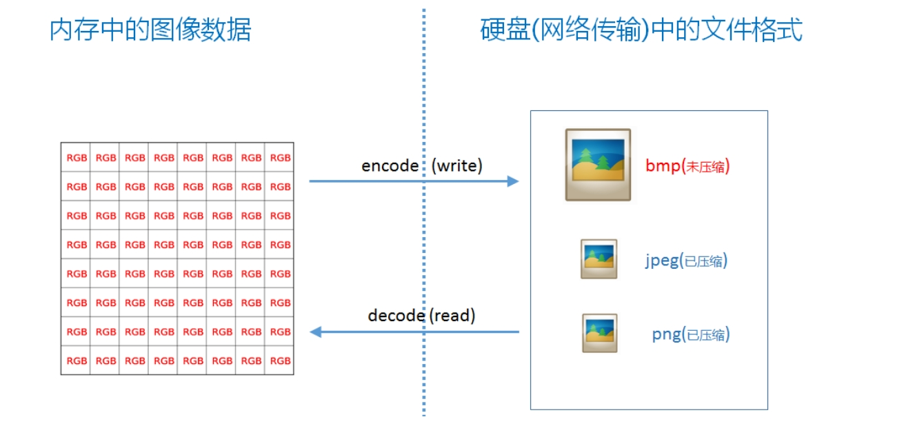
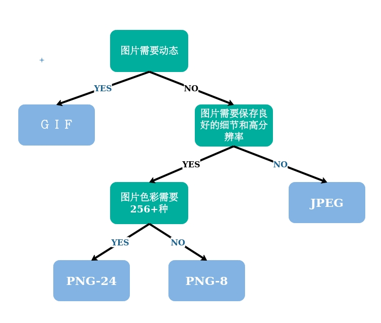

# 图片格式详解及其对比

## 图像的基本数据结构

要讲图片格式还先得从图像的基本数据结构说起，在计算机中, 图像是由一个个像素点组成，像素点就是颜色点，而颜色最简单的方式就是用RGB或RGBA表示，如图所示

  

* 常见的图片格式有 bmp、jpg(jpeg)、png、gif、webp 等
* 如果有 A 通道就表明这个图像可以有透明效果
* R、G、B 每个分量一般是用一个字节( 8 位 )来表示，所以图 ( 1 ) 中每个像素大小就是 3 × 8 = 24 位图, 而图( 2 )中每个像素大小是 4 × 8 = 32 位

## 三点补充介绍

1. 图像 y 方向正立或倒立

图像是二维数据，数据在内存中只能一维存储，二维转一维有不同的对应方式。比较常见的只有两种方式: 按像素 “行排列” 从上往下或者从下往上

  

如图所示的图像有 9 个像素点，如果从上往下排列成一维数据是( 123456789 )， 如果是从下往上排列则为( 789456123 )

只所以会有这种区别是因为，前一种是以计算机图形学的屏幕坐标系为参考( 右上为原点，y 轴向下 )，而另后一种是以标准的数学坐标系为参考( 右下为原点，y 轴向上 )。这两个坐标系只是 y 值不一样，互相转换的公式为:

  y2 = height-1-y1

y1、y2 分别为像素在两个坐标系中的 y 坐标，height 为图像的高度

不过好像只有 bmp 图片格式以及 windows 下的 GDI，GDI+ 是从下往上排列，其它比如 DirectX、OpenGL、Cocoa( NSImage、UIImage )，OpenCV 等都是从上往下排列

2. RGB排列顺序

不同图形库中每个像素点中RGBA的排序顺序可能不一样。上面说过像素一般会有RGB,或RGBA四个分量，那么在内存中RGB的排列就有6种情况，如下:
* RGB
* RBG
* GRB
* GBR
* BGR
* BRG

RGBA的排列有24种情况，这里就不全部列出来了 
不过一般只会有RGB,BGR, RGBA, RGBA, BGRA这几种排列据。 绝大多数图形库或环境是BGR/BGRA排列，cocoa中的NSImage或UIImage是RGBA排列

3. 像素32位对齐

如果是 RGB 24 位图，会存在一个 32 位对齐的问题：

在 x86 体系下，cpu 一次处理 32 整数倍的数据会更快，图像处理中经常会按行为单位来处理像素。24 位图，宽度不是 4 的倍数时，其行字节数将不是 32 整数倍。这时可以采取在行尾添加冗余数据的方式，使其行字节数为 32 的倍数

比如，如果图像宽为 5 像素，不做 32 位对齐的话，其行位数为 24 × 5 = 120，120不是32的倍数。是 32 整数倍并且刚好比 120 大的数是 128，也就只需要在其行尾添加 1 字节( 8 位 )的冗余数据即可。(一个以空间换时间的例子)

有个公式可以轻松计算出 32 位对齐后每行应该占的字节数

<divb align=center>
byteNum = ((width × 24 + 31) & ~31)>>3

 注意结果是字节数，如果想知道位数，还得 x8

## 图片格式的必要性

* 如果将图像原始格式直接存储到文件中将会非常大，比如一个 5000 × 5000 24 位图，所占文件大小 为5000 × 5000 × 3 字节 = 71.5MB，其大小非常可观
* 如果用 zip 或 rar 之类的通用算法来压缩像素数据，得到的压缩比例通常不会太高，因为这些压缩算法没有针对图像数据结构进行特殊处理
* 于是就有了 jpeg、png 等格式，同样是图像压缩算法 jpeg 和 png 也有不同的适用场景

  

> 所以可以总结如下: jpeg、png 文件之于图像，就相当于 zip、rar 格式之于普通文件(用 zip、rar 格式对普通文件进行压缩)

## 常见图片压缩格式比较

### 图片格式分类

* 无压缩 - 无压缩的图片格式不对图片数据进行压缩处理，能准确地呈现原图片（例如 BMP 格式）
* 无损压缩 - 压缩算法对图片的所有的数据进行编码压缩，能在保证图片的质量的同时降低图片的尺寸（例如 png 格式）
* 有损压缩 - 压缩算法不会对图片所有的数据进行编码压缩，而是在压缩的时候，去除了人眼无法识别的图片细节。因此有损压缩可以在同等图片质量的情况下大幅降低图片的尺寸（例如 jpg 格式）

### PNG 格式

* png 是一种无损压缩格式， 压缩大概是用行程编码算法
* png 可以有透明效果
* png 比较适合适量图、几何图

png 可能有 24 位图和 32 位图之分。32位图就是带有alpha通道的图片

> jpeg 比较适合存储色彩 “杂乱” 的拍摄图片，png 比较适合存储几何特征强的图形类图片

### JPEG 格式

* jpeg 是有损压缩格式，将像素信息用 jpeg 保存成文件再读取出来，其中某些像素值会有少许变化。在保存时有个质量参数可在 [ 0, 100 ] 之间选择，参数越大图片就越保真，但图片的体积也就越大。一般情况下选择 70 或 80 就足够了
* jpeg 没有透明信息
* jpeg 比较适合用来存储相机拍出来的照片，这类图像用 jpeg 压缩后的体积比较小。其使用的具体算法核心是离散余弦变换、Huffman 编码、算术编码等技术

jpeg格式支持不完全读取整张图片，即可以选择读取原图、1/2、1/4、1/8大小的图片
比如5000*5000的一张大图，可以只读取将其缩小成1/8后即625*625大小的图片。 这样比先完全读取5000*5000的图像，再用算法缩小成625*625大小不知快多少倍。
如果应用需求只需要一张小图时，这种读取方式就可以大显身手了

### JPG 格式

* jpg 是一种有损的基于直接色的图片格式
* jpg 由于采用直接色，jpg可使用的颜色有 1600w 之多（2^24），而人眼识别的颜色数量大约只有 1w 多种，因此 jpg 非常适合色彩丰富图片、渐变色
* jpg 有损压缩移除肉眼无法识别的图片细节后，可以将图片的尺寸大幅度地减小
* jpg 不适合 icon、logo，因为相比 gif / png-8，它在文件大小上丝毫没有优势

### GIF 格式

* gif 采用 LZW 压缩算法进行编码，是一种无损的基于索引色的图片格式
* gif 由于采用了无损压缩，相比古老的bmp格式，尺寸较小，而且支持透明和动画
* 缺点是由于 gif 只存储 8 位索引（也就是最多能表达 2^8=256 种颜色），色彩复杂、细节丰富的图片不适合保存为 gif 格式，色彩简单的 logo、icon、线框图适合采用 gif 格式

### WEBG 格式

* WebP 图片是一种新的图像格式，由 Google 开发
* webp 与 png、jpg 相比，相同的视觉体验下，WebP 图像的尺寸缩小了大约 30％
* WebP 图像格式还支持有损压缩、无损压缩、透明和动画，理论上完全可以替代 png、jpg、gif 等图片格式，当然目前 webp 的还没有得到全面的支持

### BMP 格式
* bmp 格式没有压缩像素格式，存储在文件中时先有文件头、再图像头、后面就都是像素数据了，上下颠倒存储
* 用 windows 自带的 mspaint 工具保存 bmp 格式时，可以发现有四种 bmp 可供选择：
  * 单色: 一个像素只占一位，要么是 0，要么是 1，所以只能存储黑白信息
  * 16 色位图: 一个像素 4 位，有 16 种颜色可选
  * 256 色位图: 一个像素 8 位，有 256 种颜色可选
  * 24 位位图: 就是图( 1 )所示的位图，颜色可有 2^24 种可选，对于人眼来说完全足够了

图片格式　| 优点　| 缺点 | 适应场景 
------------ | ------------- | ------------- | ------------- 
GIF | 文件小，支持动画、透明，无兼容性问题 | 只支持256种颜色 | 色彩简单的logo、icon、动图
JPG | 色彩丰富，文件小 | 有损压缩，反复保存图片质量下降明显 | 色彩丰富的图片/渐变图像
PNG | 无损压缩，支持透明，简单图片尺寸小 | 不支持动画，色彩丰富的图片尺寸大 | logo/icon/透明图
WEBG | 文件小，支持有损和无损压缩，支持动画、透明 | 浏览器兼容性不好 | 支持webp格式的app和webview

   Google　关于图片格式的选择指南

## 参考链接
[常见图片格式详解](https://www.cnblogs.com/xiangism/p/5311314.html)
[聊一聊几种常用web图片格式：gif、jpg、png、webp](https://juejin.im/post/5b32ea55e51d4558bf7c45e0)
