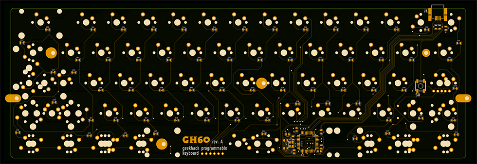
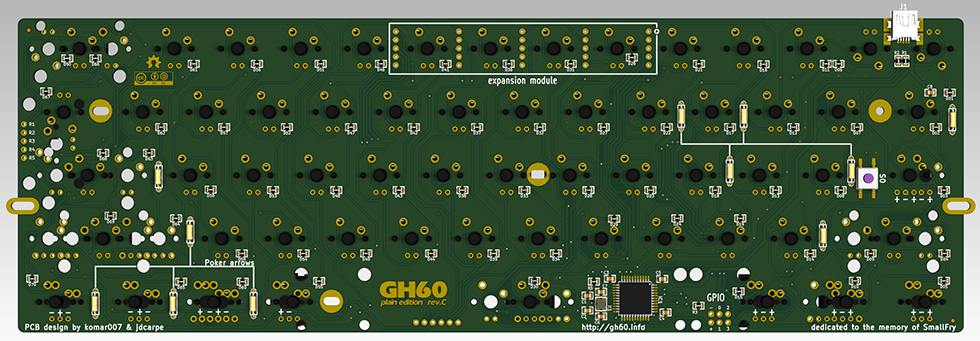
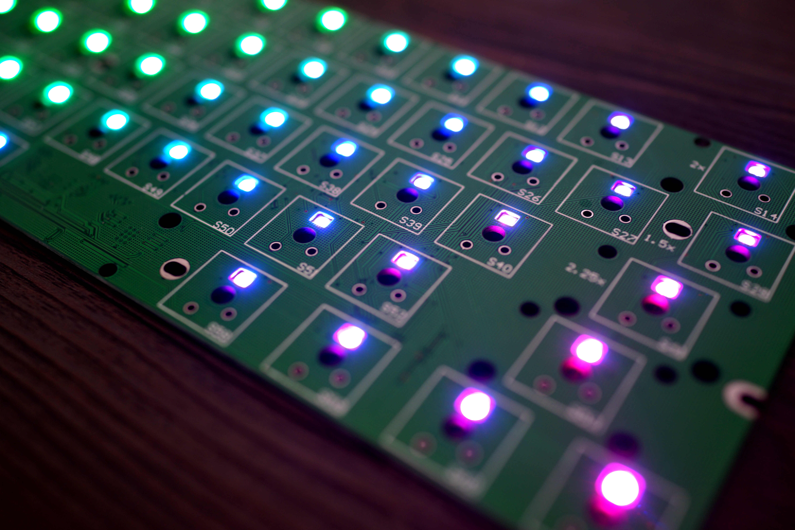
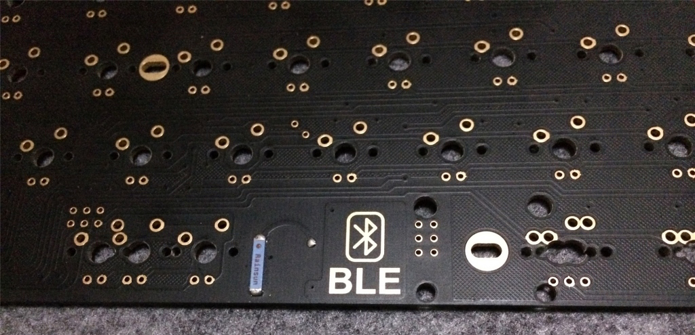
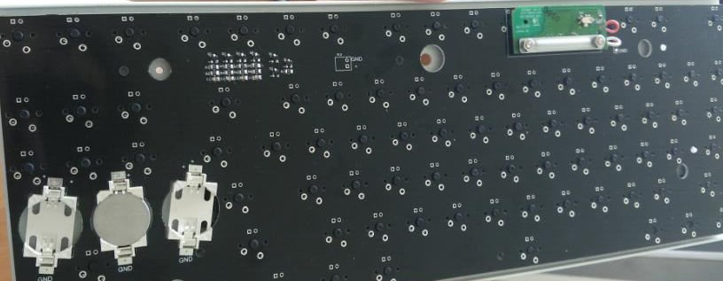
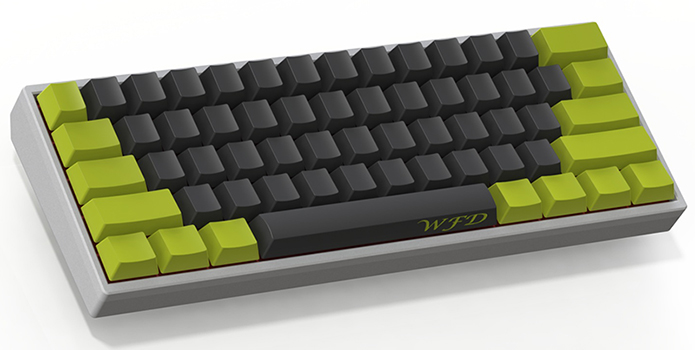
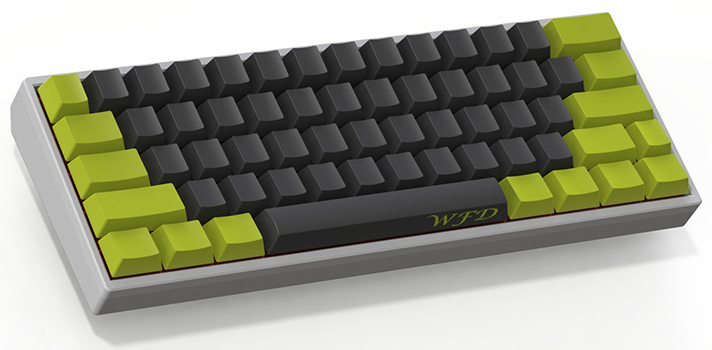
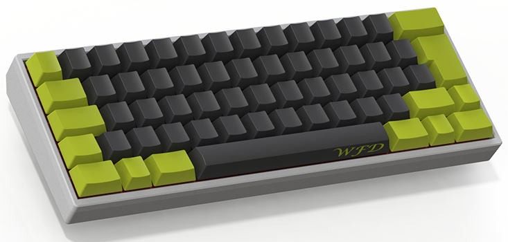
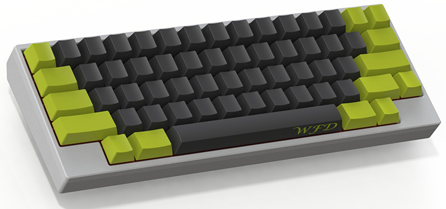

# 客制化键盘 - GH60

## 工具

* [键位自定义网站](http://www.keyboard-layout-editor.com/) - http://www.keyboard-layout-editor.com
* 

Gh60 是 [geekhack](https://geekhack.org/) 论坛上的键盘爱好者自行设计开发制作的一款 60% 键盘（其 PCB 方案已开源），其特点主要是支持很多种键位组合，可以根据自己的喜好来组合出不同的键位配列，例如最常用的三种配列方案  poker/pure/HHKB 的键数分别是 61、62、59 键。玩 gh60 的精髓就在于开源和按键可编程，让你可以造出自己的专属键盘。本文目的是带你了解 gh60 的所有部件，包括一些最新的方案，不涉及安装手法。

## 「造」出一把键盘都需要什么

1. PCB + 元件
2. 轴体
3. 定位板（可选）
4. 卫星轴
5. LED 灯（可选）
6. 外壳
7. 键帽
8. 锡焊套装（电烙铁、烙铁架、焊锡丝、吸锡器）
9. USB 数据线（mini USB、micro USB）

### PCB 与元件

PCB 就是印刷线路板，可能大家最长见的 PCB 就是主板，gh60 的 PCB 方案被 [komar007](https://github.com/komar007) 设计并开源后，世界各地出现了众多不同的版本，国内更是出现了很多自己设计并打样的版本方案。

> GH60 Rev.A
>
> - 无灯
> - 最早的方案
>
> GH60 Rev.B, GH60 Rev.C
>
> - 11 灯
> - GH60 Rev.C 修复了 bug, 增强了稳定性
> - B5, B6, B7 都用作行列矩阵了, 背光控制需要 software PWM, 比如 https://github.com/kairyu/tmk_keyboard_custom/blob/master/keyboard/gh60/backlight.c
>
> EEPW 版 GH60, TU60
>
> - 基于 GH60 Rev.B
> - 全灯
> - B5, B6, B7 都用作行列矩阵了, 背光控制需要 software PWM, 比如 https://github.com/kairyu/tmk_keyboard_custom/blob/master/keyboard/gh60/backlight.c
>
> GH60 Rev.CHN/CNY(Satan)
>
> - 基于 GH60 Rev.B
> - 全灯
> - 留有 PWM: B6
>
> AMJ60
>
> - 行列的 pinout 跟 GH60 Rev.B 不同
> - 全灯
> - 留有 PWM: B6
>
> XD60
>
> - 第四/五行支持更多的配列
> - 2.0 版本带 RGB 底灯
> - 全灯
> - B5, B6, B7 都用作行列矩阵了, 背光控制需要 software PWM, 比如 https://github.com/kairyu/tmk_keyboard_custom/blob/master/keyboard/gh60/backlight.c

**详细区别**

> 国外 rev.A、rev.B、rev.C 开源方案

- rev.A 版没有 LED 灯位，也就是所谓的护眼板，不会被闪瞎眼，这是出现最早的 PCB 方案，使用 ATMEL MEGA32U4 主控芯片，也是目前 gh60 的通用单片机。支持 3 脚、5 脚轴体，支持各种自定义键位配列方式。

* rev.B 与 rev.C 版本的 PCB，在 PCB 上扩展了灯位，支持直插式 LED 普通灯。每个按键由一个轴，一个 LED，一个 330 欧电阻，一个二极管组成，因为 330 欧电阻是 LED 的限流电阻，所以如果不需要 LED 灯就不需要 LED 和 330R 了，只需要焊轴和二极管，二极管在这里起到一个按键无冲突的作用。Jump4 是为了实现 LED 的功能，所以上面的原件 PMOS 和电阻都不需要焊，单片机和晶振是大脑，这是必须要的，USB 母座是和电脑连接的接口，也十分重要。然后是电容，C4-C8 四个电容是电源的滤波电容，让电压稳定没有交流，c1、c2 是晶振的电容，让频率稳定。剩下 MCU 和 USB 接口接的电阻是按照 Datasheet 的要求标配的，原理图很简单。

> 国内未开源方案

- Satan、菜菜

国内玩 gh60 用的最多的 2 个 PCB 版本，都是基于 komar007 的 rev.B 开源方案，两者也都是采用 atm 控制器，支持自定义配列，大键位可以自己设计大小位置。具体刷固件的方法可以自行搜索。
最近国内还出现了使用 STM32 控制器的方案，STM32 性能更强，但网上暂时没有自行刷固件的方法，所以需要自定义配列的朋友，在购买 PCB 时需要问清楚支持哪些键位配列，以及 USB 母座是 mini USB 还是 micro USB。
另外购买时可选购买焊好元件的 PCB 板和未焊好元件带元件包的 PCB 板，如果自己焊接元件，需要由低到高，先焊 MCU、贴片原件，可以先不焊二极管，然后可以焊上 USB 母座连接电脑刷固件看是否有问题。没有问题之后可以焊上二极管，需要 LED 灯的还要焊上 330R 电阻。

- RGB 全彩灯贴片版

RGB 全彩灯版是现在比较新的解决方案，就是在 PCB 上有贴片式的（也有直插式的）LED 光源全彩灯位，可以自由改变灯光颜色亮度，这种 PCB 方案受众较小，需要自己用心去淘。

- BLE60 蓝牙无线方案

BLE60 据说是第一个 gh60 无线解决方案，即在原有 PCB 方案上增加了蓝牙 4.0 模块和一块电池，因为之前的蓝牙通讯都太耗电了，所以它从底层就抛弃了原来的蓝牙物理层，也就是说蓝牙 4.0 无法和不支持蓝牙 4.0 的设备进行配对。支持蓝牙 4.0 的手机和平板都可以使用，电脑可以买个蓝牙 4.0 的适配器。

* 优联无线方案

优联是罗技的无线技术，相比 BLE60 的优点是抗干扰能力强于蓝牙、续航超强，两节 AAA 电池用一到两年、唤醒速度比蓝牙快，从节能休眠状态中唤醒几乎感觉不到明显延迟，不过就是需要一个接收器。

### 常用配列方案

自定义配列方案可以说是玩 GH60 的精髓，因为自己组一套 gh60 的花费并不比买一把机械键盘低，但是有情怀的人都希望拥有一把自定义键位的键盘。

> poker(winkey)

键帽收集器，配合键帽外观很漂亮。主要标志就是左下角 3 个等宽的 Ctrl-Win-Alt 和右下角 4 个等长 Alt-Fn-Menu-Ctrl。右 Shift 是一根完整的。且比左侧 Shift 长。

> pure(winkey+1.75)

pure 把右侧 Shift 倍分成了 1 个 1.75x 的 Shift 和 1 个 1 倍的。一般是 fn 或 del，其余部分与 winkey 完全相同。喜欢单独「↑」「↓」「←」「→」键的朋友可以用这套配列，把 1.75x 的 Shift 变为「↑」，下面的 Fn-Menu-Ctrl 变成「←」「↓」「→」。

> iso 大回车键位

这个配列适合习惯使用大回车键的朋友，我觉得也很实用。

> hhkb

HHKB 配列一向被称为程序员神器，它的键位设计原则就是：尽量少去移动手，这一点和 vim 的原则一样，所有的动作都在一个较小的范围内完成。

### 定位板、轴体、卫星轴

> 定位板

定位板也被称为钢板，通常使用阳极氧化铝合金板，还有亚克力板、碳纤维、玻塑板等材质。定位板是一个可选配件，但是他却能完全的改变一个键盘的手感。上定位板尤其是钢板的键盘，手感清脆，触底感强烈，甚至有人说有震手的感觉，没有定位板的键盘手感较软，弹性十足，两种手感各有特点，完全看个人爱好，没有优劣！ 一般会认为段落轴：如茶轴 青轴上钢板比较好，更能突出清脆的特点。红轴 黑轴不上钢板更能突出绵柔感和弹性。

需要注意的是，如果是不选择钢板，必须选五角轴，否则将会很容易歪轴，目前，除了 cherry 原厂的键盘全部采用无钢板设计，其他 OEM 厂商多数采用有钢板设计。

> 卫星轴

卫星轴以及平衡杆都是出现在键盘上的空格以及 shift 等大键位上，卫星轴是在大按键中间有一个主机械轴，两旁则有两个小的副轴作作为支撑。

平衡轴就比较常见了，机械键盘以及薄膜键盘都在使用，即是一个轴作为支撑，两边用金属丝作为固定。

两者之间并没有好坏之分，当然卫星轴的造价会更高一点，容易拆卸，但调校不好，会造成大键位回弹不顺滑，俗称软绵肉的感觉。平衡轴相对于卫星轴来说，声音大，弹性好，不容易拆卸，难清理。二者不存在谁比谁好，只有说谁更适合自己罢了。按照键盘配列至少需要 4-5 套，榔头的卫星轴口碑较好。

### LED 灯

一个键盘每个键位都需要一颗，目前可用的有 234 的方灯和 3mm 无边圆灯。另外，灯是可以安装热插拔底座自由换灯的颜色的。灯玩不好会有洗剪吹很俗的感觉，建议新玩家使用白灯，想加颜色可以购买 LED 灯罩，想变什么颜色就变什么颜色。

### 外壳

通常是指后壳，由于 gh60 尺寸和量产 60% 键盘通用，因此有许多公模可以使用，其中也有部分图纸流出，其中较常见的有 poker 或 anne 塑料外壳、亚克力透明壳、阳极铝合金壳还有提升逼格的实木外壳，一定要配合实木手托服用。

### 键帽

玩机械键盘的重点中的重点，也是最突出个性化的部分，普通屌丝玩家有一套不打油的 PBT 键帽就够了，也有人说青轴配合 ABS 键帽手感才是最好的，下面来看看土豪是怎么玩键帽的，由于太过于博大精深，这里搬运论坛网友 [Cavanlx](http://bbs.ngacn.cc/read.php?tid=9576753) 的文章。

## 参考

* [GH60 各版本说明](https://medium.com/@xream/gh60-各版本说明-b7c1301b38b3)

* [机械键盘 GH60 从入门到懵逼](https://open343.github.io/Writing/zh-cmn-Hans/Diy-Gh60.html)