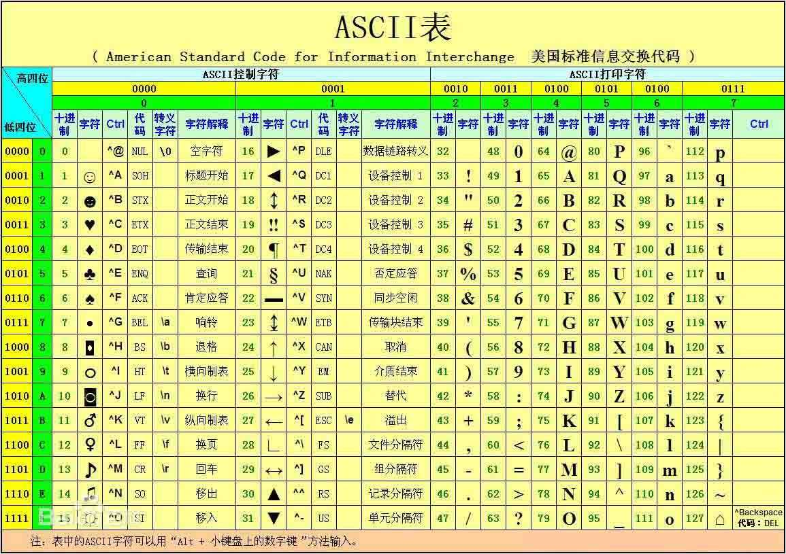

# 记录一些计算机的小知识

## 目录

[集成电路上的晶体管的摩尔定律](#集成电路上的晶体管的摩尔定律---Moores-law-top) 
[CPU 集成度](#CPU-集成度-top) 
[CPU、MPU、MCU、SoC详解](#cpumpumcusoc-详解-top) 
[常会用到的２的ｎ次幂的值](#常会用到的２的ｎ次幂的值-top) 
[计算机中的编码格式](#计算机中的编码格式-top) 
[静态链接库和动态链接库](#静态链接库和动态链接库-top) 
[TCP/IP 协议端口详解](#tcpip-协议端口详解-top) 

## 集成电路上的晶体管的[摩尔定律](https://zh.wikipedia.org/wiki/%E6%91%A9%E5%B0%94%E5%AE%9A%E5%BE%8B) - Moore's law [[Top]](#目录)
* 由英特尔（Intel）创始人之一戈登·摩尔提出来的，其内容为：当价格不变时，集成电路上可容纳的元器件的数目，约每隔 18-24 个月便会增加一倍，性能也将提升一倍
* 目前，摩尔定律也快到尽头了，根据量子力学，2nm 是理论极限值，线宽不能再细了，低于 2nm，隧穿效应就会产生干扰。intel i9 的制程工艺已经到了 14nm

## CPU 集成度 [[Top]](#目录)

* 集成度，是指**图形中最小线条宽度**，集成电路的集成度是指**单块芯片上所容纳的元件数目**，集成度越高，所容纳的元件数目越多，为此对传统的光刻方法进行了很多改进以满足分辨率的要求，增加集成电路的集成度
* 集成电路的线宽通常可理解为所加工的电路图形中最小线条宽度，但在 MOS 电路中，人们也常用栅极长度来定义线宽。集成度与线宽有对应关系，即集成度越高，线宽越小，所以，线宽也常用来表示集成电路制造技术水平的高低。

## CPU、MPU、MCU、SoC 详解 [[Top]](#目录)

### CPU - Central Processing Unit - 中央处理单元 

CPU 是指**单一的中央处理器**，是一块超大规模的集成电路，是一台计算机的运算核心和控制核心。CPU 由运算器、控制器和寄存器及实现它们之间联系的数据、控制及状态的总线构成。差不多所有的CPU的运作原理可分为四个阶段：提取(Fetch)、解码(Decode)、执行(Execute)和写回(Writeback)。CPU 从存储器或高速缓冲存储器中取出指令，放入指令寄存器，并对指令译码，并执行指令。所谓的计算机的可编程性主要是指对 CPU 的编程

### MPU - Micro Processor Unit - 微处理器

MPU (不是微控制器)，通常代表一个功能强大的 CPU (暂且理解为增强版的CPU吧)，但不是为任何已有的特定计算目的而设计的芯片。这种芯片往往是个人计算机和高端工作站的核心 CPU。Intel X86，ARM　的一些 Cortex-A 芯片如飞思卡尔 i.MX6、全志 A20、TI AM335X 等都属于 MPU。

### MCU - Microcontroller Unit - 微控制单元【又称微控制器、单片微型计算机(Single Chip Microcomputer )或者单片机】
* MCU 是把 CPU 的频率与规格做适当缩减，并将内存(memory)、计数器(Timer)、USB、A/D转换、UART、PLC、DMA 等周边接口，甚至 LCD 驱动电路都整合在单一芯片上，形成芯片级的计算机，为不同的应用场合做不同组合控制。诸如手机、PC 外围、遥控器，至汽车电子、工业上的步进马达、机器手臂的控制等，都可见到 MCU 的身影。
* 是指随着大规模集成电路的出现及其发展，是把中央处理器、存储器、定时/计数器（timer/counter）、各种输入输出接口等都集成在一块集成电路芯片上的微型计算机，比如 51，AVR、Cortex-M 这些芯片，内部除了 CPU 外还有 RAM、ROM，可以直接加简单的外围器件(电阻，电容)就可以运行代码了。而如 x86、ARM 这些 MPU 就不能直接放代码了，它只不过是增强版的 CPU，所以得添加 RAM，ROM。
* MCU 只是集成了一些更多的功能模块，它本质上仍是一个完整的单片机，有处理器，有各种接口，所有的开发都是基于已经存在的系统架构，应用者要做的就是开发软件程序和加外部设备
  
### SoC - System on Chip - 系统芯片
* 从狭义角度讲，SoC 是信息系统核心的芯片集成，是将系统关键部件集成在一块芯片上；从广义角度讲，SoC 是一个微小型系统，如果说中央处理器(CPU)是大脑，那么 SoC 就是包括大脑、心脏、眼睛和手的系统
* 系统芯片是采用低于 0.6um 工艺尺寸的电路，包含一个或者多个微处理器（CPU），并且有相当容量的存储器（用来记忆），在一块芯片上实现多种电路，能够自主地工作，这里的多种电路就是对信号进行操作的各种电路，就像我们的手、脚，各有各的功能
* SoC 指的是片上系统，SOC 是系统级的芯片，它既 MCU(51，avr) 那样有内置 RAM、ROM 同时又像 MPU 那样强大，不单单是放简单的代码，可以放系统级的代码，也就是说可以运行操作系统（可以认为是将 MCU 集成化优点与 MPU 强处理力优点合二为一）。
* SoC 是一个有专用目标的集成电路，其中包含完整系统并有嵌入软件的全部内容。目前 SoC 大多集成处理器 (包括　CPU、GPU、DSP)、存储器、基带、各种接口控制模块、各种互联总线等，其典型代表为手机芯片。
可以理解为SoC里包涵CPU
> * 比如 ARM 公司生产的就是 CPU，他将自己的所生产的 CPU 设计卖给其他公司，而其他公司就根据 ARM 提供的 CPU 自己添加上自己所需要的各种外设控制器，这就产生了各自手机厂商的手机芯片（SoC）
> * CPU = 运算器 + 控制器，现在几乎没有纯粹的 CPU 了，都是 SoC，常说的 CPU 其实就是 SoC，就像内存有 NandFlash 和普通内存

## 常会用到的２的ｎ次幂的值 [[Top]](#目录)
n 的数值 | 8 | 10 | 16 | 24 |32
------------ | ------------- | ------------- | ------------- | ------------- | -------------
２的ｎ次幂的值 | 256 | 1024 | 65536 | 16777216 | 4294967296

> * 三原色光模式（RGB color model），又称RGB颜色模型，以每像素24位（比特s per pixel，bpp）编码RGB值：使用三个8位无符号整数（0到255）表示红色、绿色和蓝色的强度，所以可以显示 16777216 种颜色组合

## 计算机中的编码格式 [[Top]](#目录)

### 编码和解码

### 编码格式发展概述

编码格式　| ASCII 码　| ANSI编码 | Unicode 编码 | UTF-8编码 
------------ | ------------- | ------------- | ------------- | ------------- 
由来 | 计算机起源于美国，ASCII 码利用 8 位二进制数（一个字节）表示字母及常用的符号 | 随着计算机发展传播，各个地区都需要能显示自己语言的计算机，就要扩展或重建编码格式（大多是基于 ASCII 码扩展，即向下兼容） | 收集所有已知的符号并统一编码，二或四字节定长编码方式 | 是 Unicode 编码的衍生，一种变长的编码方式
例子 | ASCII 码 | 中国制定了 GB2312 编码，用来把中文编进去另外，日本把日文编到 Shift_JIS 里，韩国把韩文编到 Euc-kr 里，各国有各国的标准 | 经历了定长为 2 字节和定长为 4 字节编码 | UTF-8，UTF-32等等
缺点 | 计算机只能显示英文及一些 ASCII 码中规定的符号 | 不同语言之间的 ANSI 码之间不能互相转换，这就会导致在多语言混合的文本中会有乱码 | 浪费存储空间 | 节约了存储文件所需的硬盘空间，但由于是变长，不利于查找每个符号，所以在内存中编码使用 Unicode 编码

> ASCII 码 (发音：/ˈæski/) - American Standard Code for Information Interchange - 美国信息交换标准代码

 ASCII 码表

* 在计算机内存中，统一使用 Unicode 编码，当需要保存到硬盘或者需要传输的时候，就转换为 UTF-8 编码，很多编辑器也可以选择转换为其他格式进行保存。
* 用记事本编辑的时候，从文件读取的 UTF-8 字符被转换为 Unicode 字符到内存里，编辑完成后，保存的时候再把 Unicode 转换为 UTF-8 保存到文件
* 浏览网页的时候，服务器一般情况下会是先读取静态的 UTF-8 网页到内存中成为 Unicode 编码，然后将动态修改后的 Unicode 内容转换为 UTF-8 传输到浏览器，因为传输的文本包含大量英文字符，用 UTF-8 编码就能节省空间
* C、C++、Python2 内部字符串都是使用当前系统默认编码，而 Python3、Java 内部字符串用 Unicode 保存 
* 不怕浪费空间的，就用 UTF-32；不怕浪费处理时间的，就用完整的 UTF-16，或者索性用 UTF-8。
* 因为一些历史原因，Windows 记事本的 “Unicode” 这个名号其实相当有误导性。这个编码实际上是 UTF-16 LE
    * LE 是 “小端” 的缩写。因为只要是多字节的数据，就有端序问题，也就是高位字节在先还是低位字节在先的问题。windows 平台默认小端，即低位字节在先
    * Windows 身上的“历史原因”，在于 Unicode 标准初生的时，字符码其实是 16 位，那时的 UTF-16 就能直接保存 Unicode 字符码，于是 Windows 就直接将自己使用的 UTF-16 LE 编码命名为 “Unicode"。但是后来发现如果把中文里的罕用字，各种小语种的文字都收进去的话，16 位 65536 个码位仍然是不够用的，Unicode 升级成了 32 位，出现了字符码突破 16 位的字符，UTF-16 从定长码变成了不定长码。字符码在 16 位以内的字符，在新的 UTF-16 编码仍然保持不变
* Unicode 字符码是定长 32 位，因为其太浪费空间，很少在计算机中直接用在存储和表达文本上。平常使用的字符里，99% 以上的字符都不会突破2个字节，这就诞生了 UTF-8，UTF-16，UTF-32 等编码标准
* UTF-32 是定长编码，UTF-8 和 UTF-16 都是不定长的编码。可以理解为按照编码规则，将一个 Unicode 字符的字符码，编码成 N 个 8 位或者 N 个 16 位，至于 N 是多少，要看具体的字符来定。UTF-32 例外的原因是，它已经足够直接保存 Unicode 的所有字符码了
* UTF-8 编码综合了 ASCII 和 Unicode ,会自动根据不同数据类型弹性分配编码字节大小,比如英文字母被编码成 1 个字节,而中文单词则被编码成 3 个字节, 只有很生僻的字符才会被编码成 4 - 6 个字节, 但这就造成了查询数据时会更慢, 是一种用时间换空间的方法

> * 在操作字符串时，我们经常遇到 str 和 bytes 的互相转换。为了避免乱码问题，应当始终坚持使用 UTF-8 编码对 str 和 bytes 进行转换

   用记事本编辑的时候，从文件读取的 UTF-8 字符被转换为 Unicode 字符到内存里，编辑完成后，保存的时候再把 Unicode 转换为 UTF-8 保存到文件
 

 
  
 
 

   浏览网页的时候，服务器会把动态生成的 Unicode 内容转换为 UTF-8 再传输到浏览器
 

## 静态链接库和动态链接库 [[Top]](#目录)

* 库是写好的现有的，成熟的，可以复用的代码。现实中每个程序都要依赖很多基础的底层库
* 静态/动态链接库都是库函数
* 本质上来说库是一种可执行代码的二进制形式，可以被操作系统载入内存执行
* 库有两种：静态库和动态库，Windows 上对应的是 .lib 和 .dll 文件，Linux 对应的是 .a 和 .so 文件

### 静态链接库 - Static Link Libaray

* 静态链接库是在编译过程中的链接（ Link ）阶段，链接器把中间代码与相关的静态链接库和应用程序的其他模块组合起来创建最终的可执行文件（例如 .EXE 文件）。在运行时，程序与函数库再无瓜葛，因为所有需要的函数已经拷贝进来了下
* 若一个程序的依赖只涉及静态链接库，当需要运行可执行文件时，不需要再载入静态库。如果执行时有多个程序调用静态库里的内容，那么在内存中就会存在多个拷贝
* 代码的装载速度快，执行速度也比较快，因为编译时它只会把你需要的那部分链接进去
* 应用程序相对比较大，如果多个应用程序使用的话，会被装载多次，浪费内存
* 如果静态函数库改变了，那么你的程序必须重新编译
* 如果你的系统上有多个应用程序都使用该库的话，建议把它编译成动态库，这样虽然刚启动的时候加载比较慢，但是多任务的时候会比较节省内存；如果你的系统上只有一到两个应用使用该库，并且使用的 API 比较少的话，就编译成静态库吧，一般的静态库还可以进行裁剪编译，这样应用程序可能会比较大，但是启动的速度会大大提高
* Linux 中，通常文件名为“ lib静态库名.a ”，Windows 通常扩展名为 .lib

### 动态链接库 - Dynamic Link Library

* 动态链接库是在程序运行的时期（ runtime ）再链接载入（编译过程的链接阶段不链接动态链接库到可执行文件
* 就是说在程序运行过程中，使用到动态库里函数时我再调用这些函数，而不是一开始就将动态库里所有函数都加载进程序，如果有多个程序调用同一个动态链接库里内容，系统内存中只会有一份数据
* 共享：多个应用程序可以使用同一个动态库，启动多个应用程序的时候，只需要将动态库加载到内存一次即可
* 开发模块好：要求设计者对功能划分的比较好
* 动态函数库的改变并不影响你的程序，所以动态函数库的升级比较方便
* Linux中，通常文件名为“lib动态库名.so”，Windows 通常扩展名为 .dll

> * 因此目前实际情况是许多应用程序并不是一个完整的可执行文件，它们被分割成一些相对独立的动态链接库，即 .dll 文件，放置于系统中。当程序真正运行的时候，相应的 .dll 文件才会被调用。一个应用程序可有多个 .dll 文件，同时一个 .dll 文件也可能被几个应用程序所共用，这样的 .dll 文件被称为共享 dll 文件
> * dll 也是一个被编译过的二进制程序，可以被其他程序调用，但与 exe 不同，dll 不能独立运行，必须由其他程序调用载入内存。dll 中封装了很多函数，只要知道函数的入口地址，就可以被其他程序调用。
> * 通过使用 dll，程序可以实现模块化，程序可以由相对独立的模块组件组成。因为模块是彼此独立的，程序在启动时不用加载所有的模块，因以程序的加载速度更快，而且模块只在相应的功能被请求时才加载

### 比较静态链接库和动态链接库

1. 简单的说，静态库和应用程序编译在一起，在任何情况下都能运行，而动态库是动态链接，顾名思义就是在应用程序启动的时候才会链接，所以，当用户的系统上没有该动态库时，应用程序就会运行失败。
2. 如果程序是在编译时加载库文件的，就是使用了静态库。如果是在运行时加载目标代码，就成为动态库。换句话说，如果是使用静态库，则静态库代码在编译时就拷贝到了程序的代码段，程序的体积会膨胀。如果使用动态库，则程序中只保留库文件的名字和函数名，在运行时去查找库文件和函数体，程序的体积基本变化不大。
3. 静态库的原则是“以空间换时间”，增加程序体积，减少运行时间; 动态库则是“以时间换空间”，增加了运行时间，但减少了程序本身的体积。

## TCP/IP 协议端口详解 [[Top]](#目录)

> * 物理意义上的端口，比如 ADSL Modem、集线器、交换机、路由器用于连接其他网络设备的接口，如 RJ-45 端口、SC 端口等等
> * 逻辑意义上的端口，一般是指 TCP/IP 协议中的端口，端口号的范围从 0 到 65535，比如用于浏览网页服务的 80 端口，用于 FTP 服务的 21 端口等等

## 引入背景

在 Internet上，各主机间通过 TCP/TP 协议发送和接收数据报，各个数据报根据其目的主机的 ip 地址来进行互联网络中的路由选择，进而把数据报传送到目的主机，但我们知道大多数操作系统都支持多程序（进程）同时运行，那么目的主机应该把接收到的数据报传送给众多同时运行的进程中的哪一个呢？显然这个问题有待解决，端口机制便由此被引入进来

> * 链路层层标识 MAC
> * 网络层标识 IP
> * 传输层标识 PORT

## 端口分类

1. 按端口号分布划分
* 知名端口（ Well-Known Ports ）
知名端口即众所周知的端口号，范围从 0 到 1023，这些端口号一般固定分配给一些服务。比如 21 端口分配给 FTP 服务，25 端口分配给 SMTP（简单邮件传输协议）服务，80 端口分配给 HTTP 服务，135 端口分配给 RPC（远程过程调用）服务等等
* 动态端口（ Dynamic Ports ）
动态端口的范围从 1024 到 65535，这些端口号一般不固定分配给某个服务，也就是说许多服务都可以使用这些端口。只要运行的程序向系统提出访问网络的申请，那么操作系统就可以从这些端口号中分配一个供该程序使用。比如 1024 端口就是分配给第一个向系统发出申请的程序。在关闭程序进程后，就会释放所占用的端口号
不过，动态端口也常常被病毒木马程序所利用，如冰河默认连接端口是7626、WAY 2.4是8011、Netspy 3.0是7306、YAI病毒是1024等等
2. 按协议类型划分
按协议类型划分，可以分为 TCP、UDP、IP 和 ICMP（ Internet 控制消息协议）等端口。下面主要介绍 TCP 和 UDP 端口
* TCP 端口
TCP 端口，即传输控制协议端口，需要在客户端和服务器之间建立连接，这样可以提供可靠的数据传输。常见的包括 FTP 服务的 21 端口，Telnet 服务的 23 端口，SMTP 服务的 25 端口，以及 HTTP 服务的 80 端口等等
* UDP 端口
UDP 端口，即用户数据包协议端口，无需在客户端和服务器之间建立连接，安全性得不到保障。常见的有 DNS 服务的 53 端口，SNMP（简单网络管理协议）服务的 161 端口，QQ 使用的 8000 和 4000 端口等等

> * [TCP/UDP端口列表](https://zh.wikipedia.org/wiki/TCP/UDP%E7%AB%AF%E5%8F%A3%E5%88%97%E8%A1%A8)

### Linux 下关于端口操控

* 查看进程占用端口和端口占用进程命令

### 通过端口入侵计算机

入侵者通常会用扫描器对目标主机的端口进行扫描，以确定哪些端口是开放的，从开放的端口，入侵者可以知道目标主机大致提供了哪些服务，进而猜测可能存在的漏洞，因此对端口的扫描可以帮助我们更好的了解目标主机，而对于管理员，扫描本机的开放端口也是做好安全防范的第一步

## 内存中的堆栈详解 [[Top]](#目录)

