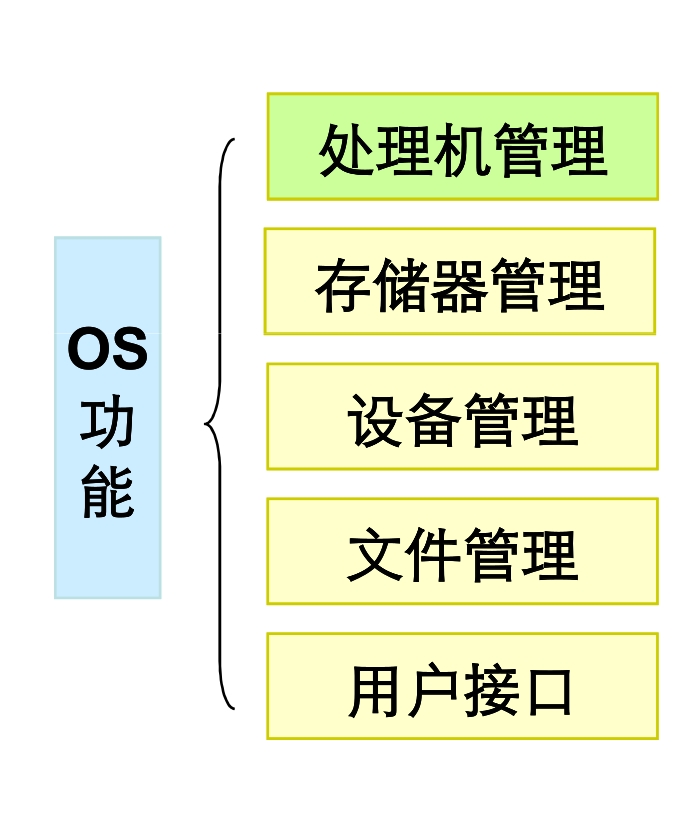

# 操作系统学习笔记

## 计算机组成架构图

 计算机组成架构图

## 计算机架构 - Computer Architecture

定义：计算机架构是描述计算机系统功能，组织和实现的一组规则和方法。而这组规则和方法是通过 ISA(指令集架构) 和 Microarchitecture(微架构) 实现的

指令集架构与微架构（一套用于执行指令集的微处理器设计方法）不同。使用同一个指令集架构可以有不同的微架构，例如，Intel 的 Pentium 和 AMD 的 AMD Athlon，两者几乎采用相同版本的 x86 指令集体系，但是两者在内部设计（即微架构）上有本质的区别

> 人们通常所说的 X86 ARM 架构分别采用的是复杂指令集和精简指令集，桌面及服务器端通常是 X86 架构，移动端通常是 ARM 架构。例如苹果、ThinkPad 等等电脑都是 X86，苹果、三星等手机都是 ARM 架构。所以理论上苹果电脑可以安装 windows 系列系统，原来安装的是 windows 系统可以安装 MacOS，（但由于苹果不希望 windows 系统用户可以随意安装 MacOS 导致安装十分困难，但理论上完全可行，实际也可以实现，只是即使实现了也难以像苹果电脑使用起来舒服），手机也是同理

 计算机架构图

### CPU 的指令集架构（又称指令集或指令集体系） - ISA - Instruction Set Architecture

> * 指令集架构是规定程序设计如何使用指令的规范，指令集架构为汇编语言的设计师和编译器所见
> * 计算机是由硬件和软件组成的，而它们之间的桥梁是 ISA，换句话说，硬件的功能通过ISA提供出来，而软件通过 ISA 规定的指令使用硬件。
> * 机器语言（即二进制机器指令）是由声明和指令所组成的，不同的指令集规定的指令也不相同，即机器语言也会由于指令集架构不同而有不同形式，针对同一指令集架构编写的软件可以运行在采用该指令集架构而微架构不同的机器上

定义：是计算机体系结构中与程序设计有关的部分，包含了基本数据类型，指令集，寄存器，寻址模式，存储体系，中断，异常处理以及外部 I/O。指令集架构包含一系列的 opcode 即操作码（机器语言），以及由特定处理器执行的基本命令

指令集架构的种类：
* 复杂指令集 - CISC - Complex Instruction Set Computing
* 精简指令集 - RISC - Reduced Instruction Set Computing
* 显式并发指令集 - EPIC - Explicitly Parallel Instruction Computing
* 超长指令字指令集 - VLIW

### CPU 的微架构（又称处理器架构、CPU架构） - Microarchitecture

* 微架构是 ISA 在处理器的实现，描述处理器是怎样实现功能的，其本质就是一系列硬件实现以满足各种指令集
* CPU 执行指令集架构的方法叫做微架构，各品牌为了使 CPU 更高效化，在设计上花费了不少功夫，所以即使是拥有同一指令集架构的 CPU，其性能和负荷方面的特点也是有所不同的。
* Microarchitecture 是 ISA 的具体实现，而且对于同一个ISA，可以使用不同技术的微架构 ，比如单周期、多周期以及流水线。比如说 x86 ISA 有 286，386，486，Pretium，Pretium Pro 等实现。目前，微架构涉及以下部分：流水线、并行、存储系统分层结构
* 微架构包含处理器内部的构成以及这些构成起来的部分如何运行指令集架构，微架构通常被表示成流程图，以描述机器内部组件的连接情况，从一个闸或是寄存器，到算术逻辑单元（ALU），图上分布着数据路径（可以显示数据在微架构的位置）以及控制路径（显示数据该被什么指令所处理）

## 现代操作系统模块化图

 现代操作系统模块化图

## 操作系统内核

* 内核，是一个操作系统的核心。是基于硬件的第一层软件扩充，提供操作系统的最基本的功能，是操作系统工作的基础，它负责管理系统的进程、内存、设备驱动程序、文件和网络系统，决定着系统的性能和稳定性
* 内核并不是计算机系统中必要的组成部分
* 操作系统内核按照体系结构分为两类 : 微内核　(microkernel)　与宏内核　(macrokernel)

### 微内核

* 只是将 OS 中最核心的功能加入内核，包括IPC通信、地址空间分配和基本的调度，这些东西处在内核态运行,自身仅仅是一个消息中转战,用于各种功能间的通讯
* 其他功能如设备驱动、文件系统、存储管理、网络等作为一个个处于用户态的进程而向外提供某种服务来实现，而且这些处于用户态的进程可以针对某些特定的应用和环境需求进行定制。有时，也称这些进程为服务器。
* 功能被划分成独立的进程，进程间通过 IPC 进行通信，且模块化程度高，一个服务失效不会影响另外一个服务
* 微内核小而精炼，运行在内核态（ 管态、系统态 )，开机后常驻内存
* 微内核的系统有 WindowNT, Minix, Mach, etc.

 操作系统微内核

> IPC - InterProcess Communication - 进程间通信

### 宏内核（或单内核）

* 将 OS 的全部功能都做进内核中，包括调度、文件系统、网络、设备驱动器、存储管理,比如设备驱动管理、资源分配、进程间通信、进程间切换管理、文件系统、存储管理、网络等,这一切都运行在内核态，内核模块间的通讯是通过直接调用其他模块中的函数实现的（只针对于内核态的进程，内核态进程与用户态进程通信需要消息传递），无需消息传递
* 在一大块代码中实际包含了所有操作系统功能，并作为一个单一进程运行，具有唯一地址空间
* 宏内核的系统有 Unix, Linux, etc.
* Linux 是一个宏内核结构，同时又吸收了微内核的优点：模块化设计，支持动态装载内核模块，避免一次性装入所有内核造成内存浪费。但也正因为 Linux 采用宏内核，造成 Linux 系统移植到其他架构平台较难实现（传统 Linux 系统是 X86 架构的）

> 微内核是一个信息中转站，自身完成很少功能，主要是传递一个模块对另一个模块的功能请求，而宏内核则是一个大主管，把内存管理，文件管理等等一股脑全部接管。
从理论上来看，微内核的思想更好些，微内核把系统分为各个小的功能块，降低了设计难度，系统的维护与修改也容易，但通信带来的效率损失是个问题。宏内核的功能块之间的耦合度太高，造成修改与维护的代价太高，不过在目前的 Linux 里面还不算大问题，因为 Linux 目前还不算太复杂，宏内核因为是直接调用，所以效率是比较高的。
