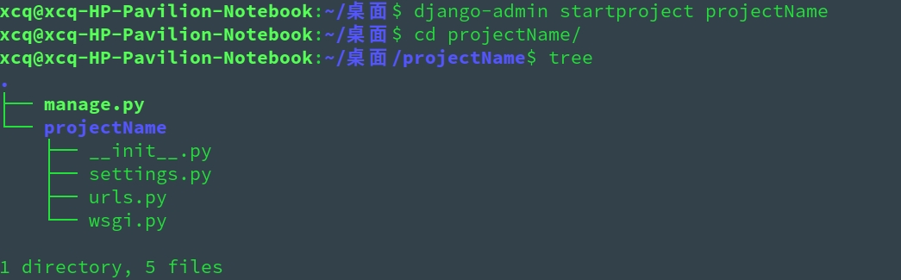
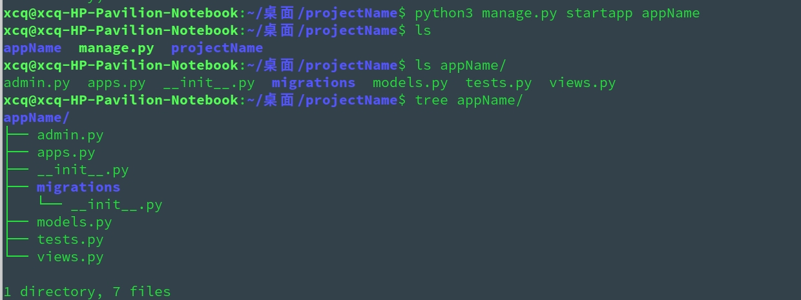

# Python Django 学习笔记


**`django-admin startproject teste`** - **`修改时区`** - **`python3 manage.py startapp blog`**  - **`注册 INSTALLED_APPS`** - **`修改 blog 的 models.py`** - **`注册模型`** - **`python3 manage.py migrate`** - **`python3 manage.py migration`** - **`python3 manage.py runserver`**


## 命令行新建并初始化 Django 项目

``` shell
$ django-admin startproject projectName
```

<div align=center>
<br/>创建 Django 项目
</div>

> * 新建的 `projectName/` 目录就是根目录

* `manage.py`：一个命令行工具，用于与 Django 进行不同方式的交互脚本，非常重要
* 外层的 `projectName/` 目录与 Django 无关，只是你项目的容器，可以任意命名
* 内层的 `projectName/` 目录是真正的项目文件包裹目录，它的名字是你引用内部文件的包名
* `projectName/__init__.py`:一个定义包的空文件
* `projectName/settings.py`:项目的主配置文件，非常重要
* `projectName/urls.py`:路由文件，所有的任务都是从这里开始分配，相当于 Django 驱动站点的内容表格，非常重要
* `projectName/wsgi.py`:一个基于 WSGI 的 web 服务器进入点，提供底层的网络通信功能，通常不用关心

## 模型转为数据库中的表

``` bash
# 模型生产数据表
$ python manage.py makemigrations
# 迁移数据表到数据库
$ python manage.py migrate
```

## 生成 Admin 用户

```bash
$ python manage.py createsuperuser
```

## 启动服务器

``` python
# 在 manage.py 文件层
pyhton3 manage.py runserver   //默认运行在 localhost 的 8000 端口
# 修改运行的端口为 8080
python3 manage.py runserver 8080
# 修改服务器 ip 地址
python3 manage.py runserver 0.0.0.0:8000 //这时 Django 运行在8000端口，整个局域网内都将可以访问站点，而不只是是本机
```

> 注意： Django 的开发服务器具有自动重载功能，当你的代码有修改，每隔一段时间服务器将自动更新。但是，有一些例如增加文件的动作，不会触发服务器重载，这时就需要你自己手动重启

## Web app 和 project 

* 一个 project 可以包含 多个 web app；一个 web app 可以属于多个 project
* 一个 web app 常常实现某个功能，一个 project 往往是配置文件和多个 web app 的集合
* app 的存放位置可以是任何地点，但是通常都将它们放在与 manage.py 脚本同级的目录下，这样方便导入文件
* Django 项目中的内层 `projectName/` 目录就是一个 web app，也可以在一个 Django project 里创建多个 app，使用命令：
``` shell
# 在 manage.py 层执行如下命令
python3 manage.py startapp appName
```

<div align=center>
  </br>在 project 里新创建一个 app
</div>
