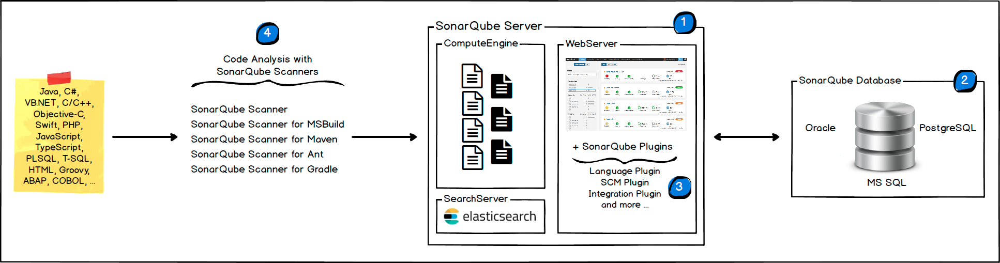

# SonarQube 学习

> * [官方文档](https://docs.sonarqube.org/latest/)

如上图展示，	SonarQube 平台由 4 个组件组成：

1、SonarQube Server：

* Web Server：供开发者、管理人员浏览质量指标和进行 SonarQube 的配置

* Search Server：基于 Elasticsearch，可以在 SonarQube UI 进行历史搜索

* Compute Engine：负责处理代码分析报告并将其保存在 SonarQube 数据库中

2、SonarQube Database： 存储 SonarQube 的配置与质量报告、各种视图数据

> SonarQube >=7.9 不再支持 Mysql 做为存储数据库

3、SonarQube Plugins：SonarQube 插件支持，包括开发语言、SCM、持续集成、身份验证和管理等

4、SonarQube Scanner：在手动构建或持续集成服务器上运行一个或多个 SonarScanner，以分析项目

上图可以看出 SonarQube 各组件的工作流程：

1、开发者在 IDE 中编码，可以使用 SonarLint 执行本地代码分析

2、开发者向 SCM（Git、SVN、TFVC 等）提交代码

3、代码提交触发持续集成平台（如 Jenkins 等）自动构建，执行 SonarQube Scanner 进行分析

4、持续集成平台将分析报告发送到 SonarQube Server 进行处理

5、SonarQube Server 处理好的分析报告生成对应可视化的视图并保存数据到数据库

6、开发者可以在 SonarQube UI 进行查看、评论、通过解决问题来管理和减少技术债

7、SonarQube 支持导出报表、使用 API 提取数据、基于 JMX 的监控

## SonarQube Scanner

