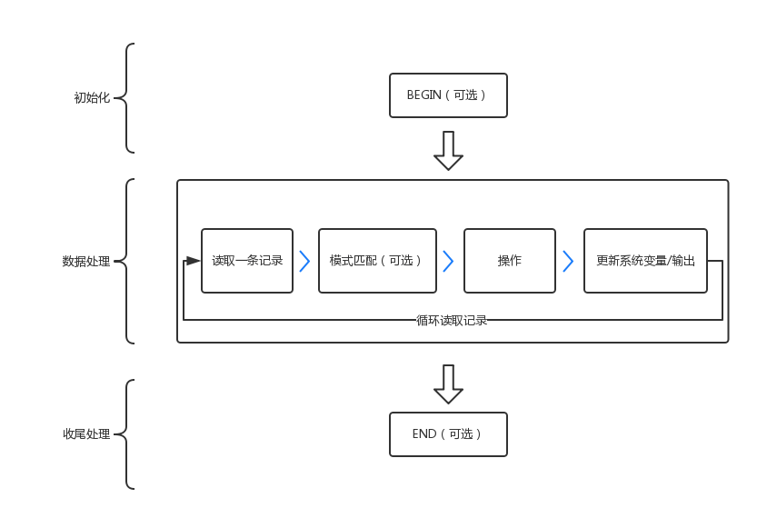

# grep、sed、awk 详解

* grep -  更适合单纯的查找或匹配文本
* sed -  更适合编辑匹配到的文本
* awk - 更适合格式化文本，对文本进行较复杂格式处理

# grep

* grep - global search regular expression(RE) and print out the line - 全面搜索正则表达式并把行打印出来


# sed

* sed - stream editor - 流编辑器
* 一次处理一行内容，处理时，把当前处理的行存储在临时缓冲区中，称为“模式空间”( pattern space )，接着用 sed 命令处理缓冲区中的内容，处理完成后，把缓冲区的内容送往屏幕
* sed 默认不会直接修改源文件
* sed 不管是否找到指定的模式，命令退出状态都是 0；只有当命令存在语法错误时，sed 的退出状态才是非 0
* sed 适合使用 vi 类编辑器操作不太方便的情况，比如操作有数千行的文本和在 shell 脚本中修改文本文件
* <kbd>**sed [选项] '命令' 文件名\>**</kbd>

* <kbd>**[选项]**</kbd>
  * <kbd>-n</kbd> - 取消默认输出 ( sed 默认会打印模式空间里的内容 )
  * <kbd>-e</kbd> - 多点编辑，可以执行多个子命令，每个 `-e` 后都可以接一个 '命令'
  * <kbd>-f</kbd> - 从脚本文件中读取命令（ sed 操作可以事先写入脚本，然后通过 `-f` 读取并执行）
  * <kbd>-r</kbd> - 在 '命令' 中允许使用扩展正则表达式，默认是允许基础正则表达式
  * <kbd>-i</kbd> - 直接编辑原文件，且不输出到终端
* <kbd>**'命令'**</kbd>
  * <kbd>a \\</kbd> -  append - 在当前行后添加一行或多行。多行时除最后一行外，每行末尾需用`\`续行
  * <kbd>c \\</kbd> - chang - 用 `c` 后的新文本替换指定行。多行时除最后一行外，每行末尾需用 `\`续行
  * <kbd>i \\</kbd> - insert -  在当前行之前插入一行或多行。多行时除最后一行外，每行末尾需用 `\` 续行
  * <kbd>d</kbd> - delete - 删除选中的行
  * <kbd>p</kbd> - print - 打印当前选择的行
  * <kbd>s/re/string/[flag]</kbd> -  subs - 用 string 替换正则表达式 re


### 常用命令

> * `sed -n` 修改行后不会有输出，所以想查看结果，一般会用 `sed -n -e '操作' -e '1,$p' filename`
> * `$` - 行尾定位符

#### 对指定的 n~m 行操作

* 显示 n~m 行
  * `sed -n 'n,mp' filename`
* 新增行
  * 第 n 行后新增字符串 string：`sed 'na string' filename`
  * 第 n 行前新增字符串 string：`sed 'ni string' filename`
  * 需要新增多行，新增行末尾加 `\`，再换行输入下一新增行即可
* 删除 n~m 行
  * `sed 'n,md' filename`
  * `sed 'n,$d' filename` - 删除从第 n 行开始到结束所有行，`$` 代表最后一行
  * `sed 'n' filename` - 删除第 n 行单行
* 替换 n~m 行
  * `sed 'n,mc newstring' filename` - 用 newstring 替换第 n~m 行

#### 对匹配 string 的行操作

> * 在指定 n~m 行内操作匹配 string 的行：`sed -n -e '[位置参数] 操作命令' -e '1,$ p'  filename`
>   * eg: `sed -n -e '2,3 s/old/new/g' -e '1,$ p' inputfile`

* 显示匹配 string 的行
  * `sed -n '/string/p' filename`
* 删除匹配 string 的行
  * `sed -n '/string/d' filename`
* 在匹配 string 的行后插入字符串 new
  * `sed -n '/string/a new' filename`
* 在匹配 string 的行前插入字符创 new
  * `sed -n '/string/i new' filename`
* 用 new 字符串替换 string 字符串
  * `sed '[位置参数] s/string/new/[替换标志]'`
  * [替换标志] - 标志可以一起使用，比如 `2p` 就是替换每行第 2 个匹配的字符串，并打印修改过的行
    * <kbd>g</kbd> - 全局替换，会替换文本行中所有匹配的字符串
      * eg: `ps aux | sed -n -e '1,10 s/0/1/g' -e '1,10 p'`
    * <kbd>n</kbd> ( 数字 ) - 替换每行中第 n 个匹配的字符串
      * eg: `ps aux | sed -n -e '1,10 s/0/1/2' -e '1,10 p'`
    * <kbd>p</kbd> - 替换第一个匹配的字符串，并打印修改过的行
      * eg: `ps aux | sed -n -e '1,10 s/0/1/p' -e '1,10 p'`
    * <kbd>w file</kbd> - 替换每行第一个匹配的字符串，并将所选的行写入文件 file 中
      * eg: `ps aux | sed -n -e '1,10 s/0/1/w test' -e '1,10 p'`
    * <kbd>缺省</kbd> - 默认替换每行第一个匹配的字符串
       * eg: `ps aux | sed -n -e '1,10 s/0/1/' -e '1,10 p'`
* 对匹配 string 行执行自定义命令
  * `sed -n '[位置参数] s/string/{命令}' filename`
  
### 实战命令

``` shell
# 删除空行并输出
$ sed '/^$/d' file 
或
$ sed -n '/./p' file
# 删除首行空格
$ sed 's/^[[ :space: ]]*//g' file
# 在特定字符串后添换行
$ sed 's/new/&\n/g' file
# 在特定字符串前添加空行
$ sed 's/new/\n&/g' file
```

# awk

## 抛砖引玉

<kbd>**如何查看Linux系统上的所有用户？**</kbd>

``` bash
awk 'BEGIN{
    FS=":"
    printf("%-10s%-20s\n", "UserName", "HomeDir")
    print "=============================="
}
{
    printf("%-10s%-20s\n", $1, $6)
}
END{
    print "=============================="
    printf("User(s):%d\n", NR)
    print "=============================="
}' /etc/passwd
```

## 原理简述

<div align=center>
<br>awk 原理
</div>


从上图中可以看出，awk 在工作时主要分为以下三个部分：

- `BEGIN` - 也就是所谓的初始化模块，比如定义分隔符，初始化一些值等，它会在数据处理部分执行之前执行，并且只执行一次，这一部分是可选的

- `数据处理` - 这一部分也就是 awk 脚本的核心部分，它是一对以模式 `pattern` 与大括号括起来的操作 `action` 组合而成的，二者可能会出现以下组合：

  - <kdb>pattern {action}</kbd> - 记录匹配对应的模式，则执行大括号中的操作
  - <kdb>pattern</kbd> - 记录匹配对应的模式，则直接打印记录
  - <kdb>{action}</kbd> - 对每一条记录都执行大括号中的操作

  数据处理模块会循环读取待处理文件中的记录，每次读取一条记录，处理完一条以后再读取下一条记录，直至所有记录被读取完毕

- `END` - 是最终的收尾处理模块，它会在所有数据处理完成以后才执行，并且只执行一次；比如我们处理完数据了，需要输出一共处理了多少条记录，多少个字段等信息，就可以在 END 部分进行输出，这一部分也是可选的

> * 记录 - 行
> * 字段 - 列

## 命令使用

* awk 是一种处理文本文件的语言，是一个强大的文本分析工具
* awk 更适合格式化文本，对文本进行较复杂格式处理
* awk 是以列为划分计数的，$0 表示当前行（即所有列），$1 表示第一列，$2 表示第二列
* <kbd>**awk [选项] '[动作]' [文件名]**</kbd>
* awk 动作只能使用单引号
* <kbd>**[选项]** </kbd>

| 选项 | 解释 |
| --- | --- |
| -F fs | 划分数据字段的分隔符 |
| -f file | 从指定文件中读取 awk 命令 |
| -v var=value |  |

### awk printf 格式说明符

* <kbd>**awk [选项] '{printf "%说明符1,%说明符2",var1，var2}' 文件名**</kbd>
* `%说明符` - <kbd>**%\[flags\]\[width\]\[.precision\]conversion**</kbd>

<kbd>**%**</kbd> - 是必须的, 任何格式符都由百分号开始

<kbd>**flag 标志（可省）**</kbd>

| flag | 解释                 |
| ---- | -------------------- |
| 默认 | 右对齐，且用空格填充 |
| -    | 左对齐               |
| +    | 打印正负数的符号     |
| 0    | 用 0 填充            |

<kbd>**width 宽度（可省）**</kbd> - 输出的宽度

<kbd>**precision 精度（可省）**</kbd>

| awk '{printf "%.5说明符\n",$1}' | 解释                                               |
| ------------------------------- | -------------------------------------------------- |
| %d,%i,%o,%u,%x,%X               | 数字位数最大为 5，不够前缀补 0                     |
| %e, %E                          | 数字位数最大为 5，不够后缀补 0                     |
| %f                              | 如果小数点后位数少于 5，后缀补 0                   |
| %g, %G                          | 最多数字位数                                       |
| %s                              | 字符位数少于 5，原样输出，多于5，只输出前 5 个字符 |

<kbd>**conversion 说明符（必选）**</kbd>

| conversion 说明符 | 解释             |
| ----------------- | ---------------- |
| %d 和 %i          | 十进制的整数部分 |
| %s                | 字符串           |
| %f                | 浮点数           |
| %c                | 单个字符         |
| %e 或 %E          | 科学计数法格式   |
| %o                | 八进制数         |
| %x                | 十六进制数       |
| %%                | %                |

#### 实例解析

<kbd>%-5.2f</kbd> - 输出总宽度为 5 的浮点数，其中小数位为 2，整数位为 2，小数点占 1 位，不够 5 为左对齐

<kbd>%9.2f</kbd> -  表示输出场宽为9的浮点数, 其中小数位为 2， 整数位为 6，小数点占 1 位, 不够 9 位右对齐

<kbd>%04d</kbd> - 表示在输出一个小于 4 位的数值时, 将在前面补 0 使其总宽度为 4 位

<kbd>%6.9s</kbd> - 表示显示一个长度不小于 6 且不大于 9 的字符串。若大于 9, 则第 9 个字符以后的内容将被删除

### awk 内置变量

* `NF`：表示当前行的字段总数
  * `NF` - 打印当前行字段数
  * `$NF` - 打印当前行最后一个字段
  * `$NF-1` - 打印当前行倒数第二个字段

* `NR`：表示当前处理的是第几行

- `FILENAME`：当前文件名
- `FS`：字段分隔符，默认是空格和制表符。
- `RS`：行分隔符，用于分割每一行，默认是换行符。
- `OFS`：输出字段的分隔符，用于打印时分隔字段，默认为空格。
- `ORS`：输出记录的分隔符，用于打印时分隔记录，默认为换行符。
- `OFMT`：数字输出的格式，默认为 `％.6g`。

```shell
$ cat /etc/passwd | awk -F ':' '{printf "行字段数：%d\n",NF}'
$ cat /etc/passwd | awk -F ':' '{printf "行最后一个字段是：%s\n", $NF}'
# print 命令里面，如果原样输出字符，要放在双引号里面
$ cat /etc/passwd | awk -F ':' '{print "行字段数：" NF}'  # 和上面 printf 效果一样
```

### awk 内置函数

> * [内置函数完整列表](https://www.gnu.org/software/gawk/manual/html_node/Built_002din.html#Built_002din)

* `toupper()`：字符转为大写

- `tolower()`：字符转为小写
- `length()`：返回字符串长度
- `substr()`：返回子字符串
- `sin()`：正弦
- `cos()`：余弦
- `sqrt()`：平方根
- `rand()`：随机数

```shell
$ cat /etc/passwd | head -10 | awk '{print toupper($0)}'
```

### awk 条件判断

* <kbd>**awk [选项] '条件判断 {动作}' 文件名**</kbd>
* 适合于只需一次判断
* `[选项]`  和 `'条件判断 {动作}'` 之间空格一定不能少，`'条件判断 {动作}'` 内部空格可以省略

``` shell
# 输出奇数行
$ cat /etc/passwd | awk 'NR % 2 == 1 {print $0}'
# 输出第 5 行后的行
$ cat /etc/passwd | awk 'NR > 5 {print $0}'
# 输出第一个字段是 'root' 或 'bin' 的行
$ cat /etc/passwd | awk -F ':' '$1 == "root" || $1 == "bin" {print $0} '
```

#### awk if 条件判断

* <kbd>**awk [选项] '{if(条件判断) 动作}' 文件名**</kbd>
* 适合于需要多次判断

```shell
# if 判断出第一个字段的第一个字符大于 'q' 的行，并输出
$ cat /etc/passwd | awk -F ':' '{if ($1 > "q") print $0}'
# 等价于
$ cat /etc/passwd | awk -F ':' '$1 > "q" {print $0}'

# if else
$ cat /etc/passwd | awk -F ':' '{if ($1 > "m") print $0; else print "---"}'
```


## 参考

* [awk 入门教程 - 阮一峰](http://www.ruanyifeng.com/blog/2018/11/awk.html?20191114101617#comment-last)
* [进阶：玩玩awk - 果冻想](https://www.jellythink.com/archives/138)
* [进阶：awk中的函数 - 果冻想](https://www.jellythink.com/archives/140)