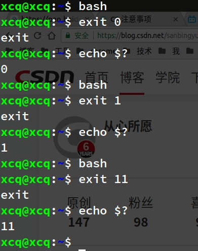
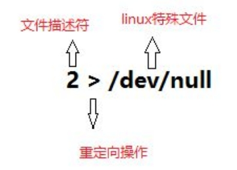
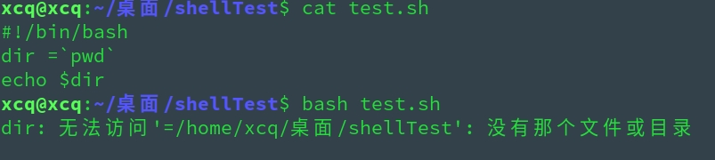
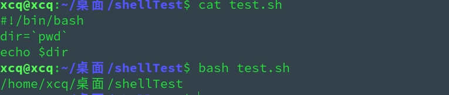

# Linux Shell 学习时的小知识

## 目录

* [if 条件判断的坑](#if-条件判断的坑)
* [打印主机ip](#打印主机ip)
* [通过端口判断服务是否启动](#通过端口判断服务是否启动)
* [Shell常用调试方法](#shell常用调试方法)
* [tar zxvf 的坑](#tar-zxvf-的坑)
* [变量替换](#变量替换)
* [shift](#shift)
* [nohup 和 & 区别](#nohup-和-&-区别)
* [数组](#数组)
* [命令后台运行](#命令后台运行)
* [while read line 和 for](#while-read-line-和-for)
* [rpm 离线安装步骤](#rpm-离线安装步骤)
* [使用 set 调试 shell 脚本](#使用-set-调试-shell-脚本)
* [Shell 中的单引号和双引号区别](#shell-中的单引号和双引号区别)
* [exit 退出值](#exit-退出值)
* [Shebang 行](#shebang-行)
* [echo $(命令) 原样输出](#echo-命令-原样输出)
* [单行命令拆成多行执行](#单行命令拆成多行执行)
* [exit 0 和 exit 1](#exit-0和exit-1)
* [特殊变量](#特殊变量)
* [让一个变量获得命令输出的结果](#让一个变量获得命令输出的结果)
* [`命令 > /dev/null 2 > &1`和`命令 &> /dev/null`](#命令--devnull-2--1和命令--devnull)
* [数值比较](#数值比较)
* [几种数值计算方法](#几种数值计算方法)
* [数值进制间相互转换](#数值进制间相互转换)
* [等号两边不能有空格](#等号两边不能有空格)
* [ $( )、\` \`、${ }、$(( ))、$[ ] 、[ ]、(( )) 和 [[ ]] 详解]（#---------和---详解)
* [用 cat、echo 命令向文件写入](#用-cat-命令向文件写入)
* [杀死一个进程](#杀死一个进程)
* [删除空行](#删除空行)
* [文件去重](#文件去重)
* [截取文件开头几行、末尾几行和中间几行](#截取文件开头几行、末尾几行和中间几行)
* [修改文件以包含当前时间命名](#修改文件以包含当前时间命名)
* [查看当前主机公网 IP](#查看当前主机公网-ip)
* [while 无限循环](while-无限循环)
* [进程查端口，端口查进程](#进程查端口端口查进程)
* [查看其他主机开放的端口](#查看其他主机开放的端口)
* [快速查看配置文件中有效配置行](#快速查看配置文件中有效配置行)
* [使用重定向新建文件](#使用重定向新建文件)


## if 条件判断的坑
> Shell 的条件判断一直用的是 `if then ... else ... fi`，之前没遇到需要多加判断分支的情况，所以一直没遇到这个小坑: **`elif` 后天需要加 `then`**

``` shell
if [ $year -eq 2020 ]
then
echo 'Happy 2020 Year!'
elif [ $year -eq 2021 ]
then
echo 'Happy Next Year!'
else
echo 'Day Day Happy!'
fi
```

## 打印主机ip

``` shell
# hostname -I
192.168.7.12 172.17.0.1

# ip a
1: lo: <LOOPBACK,UP,LOWER_UP> mtu 65536 qdisc noqueue state UNKNOWN group default qlen 1000
    link/loopback 00:00:00:00:00:00 brd 00:00:00:00:00:00
    inet 127.0.0.1/8 scope host lo
       valid_lft forever preferred_lft forever
    inet6 ::1/128 scope host
       valid_lft forever preferred_lft forever
2: ens192: <BROADCAST,MULTICAST,UP,LOWER_UP> mtu 1500 qdisc mq state UP group default qlen 1000
    link/ether 00:0c:29:70:19:ed brd ff:ff:ff:ff:ff:ff
    inet 192.168.7.12/19 brd 192.168.31.255 scope global noprefixroute dynamic ens192
       valid_lft 25955sec preferred_lft 25955sec
    inet6 fe80::e6c4:2316:88fe:9d85/64 scope link noprefixroute
       valid_lft forever preferred_lft forever
3: docker0: <BROADCAST,MULTICAST,UP,LOWER_UP> mtu 1500 qdisc noqueue state UP group default
    link/ether 02:42:f4:62:f5:a4 brd ff:ff:ff:ff:ff:ff
    inet 172.17.0.1/16 brd 172.17.255.255 scope global docker0
       valid_lft forever preferred_lft forever
    inet6 fe80::42:f4ff:fe62:f5a4/64 scope link
       valid_lft forever preferred_lft forever
33: veth03e6e07@if32: <BROADCAST,MULTICAST,UP,LOWER_UP> mtu 1500 qdisc noqueue master docker0 state UP group default
    link/ether 2a:2f:f6:08:96:9b brd ff:ff:ff:ff:ff:ff link-netnsid 1
    inet6 fe80::282f:f6ff:fe08:969b/64 scope link
       valid_lft forever preferred_lft forever
```

## 通过端口判断服务是否启动

* 以前判断服务是否启动都是使用 `ps aux | grep -v grep | grep xxx` 去且服务名，但有时不太准确。而通过切端口判断服务是否启动是一个很好的办法，但服务的端口一般可以改变，所以通过一下方法可以用 `端口` + `服务名` 双重判定服务是否启动

``` shell
# 判断 jenkins 是否启动，假设端口修改为 12345
jenkins_pid=`netstat -ntlp | grep :12345 | awk '{print $7}' | awk -F"/" '{ print $1 }'`
[ $jenkins_pid ] && echo 'jenkins 启动了'
```

## Shell常用调试方法

> * Maven - https://archive.apache.org/dist/maven/maven-3/
* 常用的三种 Shell 脚本调试方法：
1、执行脚本时候 - `bash -ex test.sh`
2、脚本开头中添加 - `set -ex`
3、使用 `bashdb` 工具，可以设置断点、按行执行等

* bashdb
``` shell
#下载软件
wget --no-check-certificate https://nchc.dl.sourceforge.net/project/bashdb/bashdb/4.2-0.92/bashdb-4.4-0.92.tar.gz

#第二步：解压并进入目录
tar -zxvf  4.4-0.92.tar.gz
cd  4.4-0.92
#第三步：配置及编译安装
./configure
make && make install

# bashdb --debug 脚本名
一、列出代码和查询代码类：
l  列出当前行以下的10行
-  列出正在执行的代码行的前面10行
.  回到正在执行的代码行
/pat/ 向后搜索pat
？pat？向前搜索pat
二、Debug控制类：
h     帮助
help  命令 得到命令的具体信息 q     退出bashdb x     算数表达式 计算算数表达式的值，并显示出来 !!    空格Shell命令 参数 执行shell命令 使用bashdb进行debug的常用命令(cont.) 三、控制脚本执行类：
n   执行下一条语句，遇到函数，不进入函数里面执行，将函数当作黑盒
s n 单步执行n次，遇到函数进入函数里面
b   行号n 在行号n处设置断点
del 行号n 撤销行号n处的断点
c   行号n 一直执行到行号n处
R   重新启动当前调试脚本
Finish 执行到程序最后
cond n expr 条件断点
```

## tar zxvf 的坑

执行 `tar zxvf test.tar.gz -C /opt/`，如果 `/opt/` 下已经有 test.tar.gz 解压后的内容（比如解压后是 test 目录），在未删除直接执行解压命令，则只会覆盖 `test.tar.gz` 解压出来的相同文件，最好是提前判断解压路径下有无 test 目录，有的话提前删除


## 变量替换

* 变量替换可以根据变量的状态（是否为空、是否定义等）来改变它的值


| 形式 | 说明 |
| --- | --- |
| `${var}` | 变量本来的值 |
| `${var:-word}` | 如果变量 var 为空或已被删除(unset)，那么返回 word，但不改变 var 的值 |
| `${var:=word}` | 如果变量 var 为空或已被删除(unset)，那么返回 word，并将 var 的值设置为 word |
| `${var:?message}` | 如果变量 var 为空或已被删除(unset)，那么将消息 message  送到标准错误输出，可以用来检测变量 var 是否可以被正常赋值，若此替换出现在Shell脚本中，那么脚本将停止运行 |
| `${var:+word}` | 如果变量 var 被定义，那么返回 word，但不改变 var 的值 |
| `${value:offset}` 或 `${value:offset:length}` |  从变量中提取子串，这里 offset 和 length 可以是算术表达式 |
| `${#value}` | 变量的字符个数 (变量的字符个数，并不是变量个数） |
| `${value#pattern}` 或 `${value##pattern}` | 去掉 `value` 中与 `pattern` 相匹配的部分,条件是 `value` 的开头与 `pattern` 相匹配。#与##的区别：`#`是最短匹配模式，而`##`是最长匹配模式 |
| `${value％pattern}` 或 `${value％％pattern}` | 去掉 `value` 中与 `pattern` 相匹配的部分,条件是从 `value` 的尾部于 `pattern` 相匹配,`%`与`%%`的区别：`%`是最短匹配模式,而`%%`是最长匹配模式 |
| `${value/pattern/string}` 或 `${value//pattern/string}` | 进行变量内容的替换,把与 `pattern` 匹配的部分替换为 `string` 的内容,`/` 和 `//` 的区别：`/` 是只替换第一个，而 `//` 替换所有的 |
| `${var/#pattern/string}` 或 `${var/%pattern/string}` | 进行变量内容的替换,把与 `pattern` 匹配的部分替换为 `string` 的内容，`%` 和 `#` 的区别是：`#` 是从前面开始匹配，`%` 是从后面开始匹配 |
|  |  |

## shift

* shift 命令用于对脚本传入参数的移动(左移)，通常用于在不知道传入参数个数的情况下依次遍历每个参数然后进行相应处理（常见于Linux中各种程序的启动脚本）

`**run.sh**`
``` shell
#!/bin/bash
while [ $# != 0 ]
do
echo "第一个参数为：$1,参数个数为：$#"
shift
done
```

## nohup 和 & 区别

* 使用 nohup 运行程序
  * 结果默认会输出到 nohup.out
  * 使用 `Ctrl + C` 发送 SIGINT 信号，程序关闭
  *  关闭 session 发送 SIGHUP 信号，程序免疫
* 使用 & 后台运行程序
  * 结果会输出到终端
  * 使用 Ctrl + C 发送 SIGINT 信号，程序免疫
  * 关闭 session 发送 SIGHUP 信号，程序关闭

## 数组

* Bash Shell 只支持一维数组（不支持多维数组），初始化时不需要定义数组大小
* 数组元素的下标由 0 开始，使用括号表示一个数组，数组元素用"空格"符号分割开
* 数组元素可以是：字符串、数字等
* 读取数组格式：**`${array_name[index]}`**

``` shell
$ my_array=(1 "1" "C" D)
$ for i in ${my_array[*]};do echo $i;done  
1
1
C
D
```

## 命令后台运行

1、支持后台运行，但是关闭终端的话，程序也会停止。使用 `jobs -l` 查看和使用 `fg` 命令将后台运行调到前台运行

``` shell
$ [command] &
```

2、支持后台运行，关闭终端后，程序也会继续运行。使用 `jobs` 命令查看不到，需要使用 `ps aux | grep -v grep | grep [command]` 查看

``` shell
$ nohup [command] &
```

## while read line 和 for

* while read line 是一次性将文件的一行读入并赋值给变量 line ，while 中使用重定向机制,文件中的所有信息都被读入并重定向给了整个 while 语句中的 line 变量
``` shell
# 从文件读取
while read line
do
command
done < [文件]

# 从命令输出读取
command1 | while read line
do
command2
done
```
* for 是每次读取文件中一个以空格为分割符的字符串

## rpm 离线安装步骤

> Linux 离线部署一般采用 docker 或 rpm 包安装

* yum 只下载不安装软件 rpm 包

``` shell
# 下载 vim 所有 rpm 包到当前目录下的 vim 文件夹 
$ yum install --downloadonly --downloaddir=./ vim
```

* 检测是否还有遗漏的依赖 rpm

``` shell
$ yum -ivh ./*.rpm
```

## 使用 set 调试 shell 脚本

> **参考**：http://www.ruanyifeng.com/blog/2017/11/bash-set.html

**`set -u` 或 `set -o nounset`** - 遇到不存在的变量就会报错，并停止执行
* 默认遇到不存在的变量，Bash 忽略它。使用 `set -u`，

**`set -x` 或 `set -o xtrace`** - 在运行结果之前，先输出执行的那一行命令
* 默认情况下，脚本执行后，屏幕只显示运行结果，没有其他内容。如果多个命令连续执行，它们的运行结果就会连续输出。有时会分不清，某一段内容是什么命令产生的

**`set -e` 或 `set -o errexit`** - 脚本只要发生错误，就终止执行
* 如果脚本里面有运行失败的命令（返回值非0），Bash 默认会继续执行后面的命令
* `set -e` 根据返回值来判断，一个命令是否运行失败。但是，某些命令的非零返回值可能不表示失败，或者开发者希望在命令失败的情况下，脚本继续执行下去。这时可以暂时关闭 `set -e`，该命令执行结束后，再重新打开 `set -e`
``` shell
# set +e 表示关闭 -e 选项，set -e 表示重新打开 -e 选项
set +e
command1
command2
set -e
```
* 不管有没有设置 `set -e`，手动确保命令执行失败退出或继续执行
```shell
# 命令失败则一定退出
command || echo "fail!";exit 1
# 命令失败也一定继续执行
command || true
```

**set -o pipefail** - 只要管道中一个子命令失败，整个管道命令就失败，脚本就会终止执行
``` shell
$ cat script.sh
#!/usr/bin/env bash
set -eo pipefail
foo | echo a
echo bar
$ bash script.sh
a
script.sh:行4: foo: 未找到命令
```
* `set -e` 不适用于管道命令。Bash 会把管道最后一个子命令的返回值，作为整个命令的返回值。也就是说，只要最后一个子命令不失败，管道命令总是会执行成功，因此它后面命令依然会执行，`set -e` 就失效了
```shell
# 管道连接多个 command，$? 是最后一个 command 的返回值
$ hello | echo "hello"
hello
-bash: hello: 未找到命令
$ echo $?
0
```

**以上四个参数汇总** 

```shell
# 方法一
set -euxo pipefail

# 方法二
set -eux
set -o pipefail

# 方法三，执行脚本时传入
$ bash -euxo pipefail script.sh
```

## Shell 中的单引号和双引号区别

> **参考**：https://blog.csdn.net/fdl19881/article/details/7849286

**结论**：单引号和双引号都能关闭 shell 对特殊字符的处理。不同的是，双引号没有单引号严格，单引号关闭所有有特殊作用的字符，而双引号只要求 shell 忽略大多数。具体的说，双引号保留对**美元符号、反引号、反斜杠**的特殊解析。所以，在 sed 中需要引用变量则必须使用双引号；而 awk 中 `'{print $0}'` 的 `$0` 不是引用 shell 的 `$0`（即不是由 shell 解析），而是由 awk 程序解析

在 shell 终端输入一行命令然后按下 enter，这时 shell 会以进程方式执行提交的命令，而对于命令行中字符的解析，shell 有不同的方法：

简而言之，命令行的的字符都可按如下两种分类：
* **literal**：就是普通字符串，没有特殊意义，例如 abcd、123456 等等
* **meta**：具有特定功能的保留元字符
  * **IFS**：由 <space> <tab> <enter> 三者之一组成
  * **CR**：由 <enter> 产生
  * **=**：设定变量
  * **$**：做变量或运算替换(请不要与 shell prompt 搞混了)
  * **>**：重定向 stdout
  * **<**：重定向 stdin
  * **|**：管道命令
  * **&**：重定向 file descriptor ，或将命令置于后台执行
  * **( )**：將其內的命令置于 nested subshell 执行，或用于运算或命令替换
  * **{ }**：將其內的命令置于 non-named function 中执行，或用在变量替换的界定范围
  * **;**：在前一个命令结束时，而忽略其返回值，继续执行下一個命令
  * **&&**：在前一個命令结束时，若返回值为 true，继续执行下一個命令
  * **||**：在前一個命令结束时，若返回值为 false，继续执行下一個命令
  * **!**：执行 history 列表中的命令
meta 往往具有多重意义，比如 `$` 有时需要作为单纯的美元符号，但有时需要作为 `$变量` 使用。在 shell 中，是通过 quoting 开启和关闭 meta 功能，常用 quoting 有一下三种方法：
* **hard quote**：`''`（单引号），凡在 hard quote 中的所有 meta 均被关闭
* **soft quote**：`""`（双引号），在 soft quote 中的大部分 meta 都会被关闭，但某些保留（如 $ ）
* **escape**：`\` （反斜线），只有紧接在 escape（跳脱字符）之后的单一 meta 才被关闭

## exit 退出值

0 表示正常，1 表示发生错误，2 表示用法不对，126 表示不是可执行脚本，127 表示命令没有发现。如果脚本被信号 N 终止，则退出值为 128 + N。简单来说，只要退出值非 0，就认为执行出错。

``` bash
$ ls 参数 || echo $?
ls: 无法访问'参数': 没有那个文件或目录
2

$ ./README.md || echo $?
bash: ./README.md: 权限不够
126

$ 命令 || echo $?
命令：未找到命令
127
```

## Shebang 行

* Shebang 行位于脚本第一行，用于指定解释器，即这个脚本必须通过什么解释器执行

``` bash
#!/usr/bin/env bash
# 意思是让 Shell 查找 $PATH 环境变量里面第一个匹配的 bash

# 这样执行脚本时就不用手动指定 Shell 解释器
$ ./script.sh
# 若没有 Shebang 行，则需要如下：
$ bash ./script.sh
```

## echo $(命令) 原样输出

``` bash
# echo `命令` 打印的命令的输出是单行的，可以通过添加双引号保持命令的原样格式输出
$ echo `ls`
abcdefghij001 abcdefghij002 abcdefghij003 abcdefghij004 abcdefghij005 abcdefghij006 abcdefghij007 abcdefghij008 abcdefghij009 abcdefghij010 abcdefghij011 abcdefghij012 abcdefghij013
$ echo "`ls`"
abcdefghij001
abcdefghij002
abcdefghij003
abcdefghij004
abcdefghij005
abcdefghij006
abcdefghij007
abcdefghij008
abcdefghij009
abcdefghij010
abcdefghij011
abcdefghij012
abcdefghij013
```

## 单行命令拆成多行执行

``` shell
$ echo foo bar
# 等同于
$ echo foo \
bar
```

## `exit 0`和`exit 1`

* Linux exit 命令用于退出目前的 shell
* 执行 exit 可使 shell 以指定的状态值退出
* 若不设置状态值参数，则 shell 以预设值退出；状态值 0 代表执行成功，其他值代表执行失败
* exit 也可用在 script，离开正在执行的 script，回到 shell
> 语法：exit [ 状态值 ]

<div align=center>
  <br/>Ubuntu shell exit
 </div>

## 特殊变量

| $X | 说明 |
| --- | --- |
| $? | 最近一次运行命令的结束代码（返回值 0 表示成功，非 0 表示失败） |
| $$ | 脚本运行的当前进程 ID 号（PID） |
| $n(n=1,2...) | 传递给该 shell 脚本的第 n 个参数，参数多于 9 个时候，使用`${10}`形式引用 |
| $0 | 执行脚本本身的名字 |
| $# | 传递给脚本参数的个数 |
| $* | 脚本的所有参数列表,代表"$1 $2 … $n"，即当成一个整体输出，每一个变量参数之间以空格隔开 |
| $@ | 脚本的所有参数列表,代表"$1" "$2" … "$n" ，即每一个变量参数是独立的 ,也是全部输出 |

* 如果多个参数放在双引号里面，视为一个参数。
``` bash
$ ./script.sh "a b"
a b
```

### `$*` 和 `$@`区别
``` shell 
#!/bin/bash
# This script is to verify the difference between $* and $@
 
echo Dollar Star is $*
echo "Dollar Star in double quotes is $*"
 
echo Dollar At is $@
echo "Dollar At in double quotes is $@"
 
echo 
echo "Looping through Dollar Star"
for i in $*
do
	echo "parameter is $i"
done
echo 
echo "Looping through Dollar Star with double quotes"
for i in "$*"
do
	echo "Parameter is $i"
done 
 
echo
echo "Looping through Dollar At"
for i in $@
do
	echo "Parameter is $i"
done
echo
echo "Looping through Dollar At with double quotes"
for i in "$@"
do
	echo "Parameter is $i"
done

$ bash test.sh 1 2 " 3 4 " 5 6
Dollar Star is 1 2 3 4 5 6
Dollar Star in double quotes is 1 2  3 4  5 6
Dollar At is 1 2 3 4 5 6
Dollar At in double quotes is 1 2  3 4  5 6

Looping through Dollar Star
parameter is 1
parameter is 2
parameter is 3
parameter is 4
parameter is 5
parameter is 6

Looping through Dollar Star with double quotes
Parameter is 1 2  3 4  5 6

Looping through Dollar At
Parameter is 1
Parameter is 2
Parameter is 3
Parameter is 4
Parameter is 5
Parameter is 6

Looping through Dollar At with double quotes
Parameter is 1
Parameter is 2
Parameter is  3 4 
Parameter is 5
Parameter is 6
```

> * 相同点如下：
> 1、直接输出不保留空格
> 2、带双引号输出会保留带引号的空格
> 3、不带双引号循环遍历的输出结果一样：每个字符串单独输出
> * 不同点如下：
> 1、带双引号遍历`$*`相当于带双引号输出`$*`
> 2、带双引号遍历`$@`分别输出每个参数，带双引号的参数保留空格输出

<br/>
<div align=center>
  <br/>$* 示例
 </div>

## 让一个变量获得命令输出的结果

### 1、`$(命令)`表示

``` shell
#!/bin/bash
i=$(ls 123.txt)
echo $i
```

### 2、反引号表示

``` shell
#!/bin/bash
i=`ls 123.txt`
echo $i
```

## `命令 > /dev/null 2 > &1`和`命令 &> /dev/null`

> 解释：无提示（包括 stdin 和 stderr ）执行

<br/>
<div align=center>
  <br/>
 </div>

 ### 文件描述符

 * 文件描述符是与文件输入、输出关联的整数。它们用来跟踪已打开的文件
 * 最常见的文件描述符是 stidin、stdout、和 stderr
  * 0 —— stdin（标准输入）
  * 1 —— stdout （标准输出）
  * 2 —— stderr （标准错误）
  
 * 我们可以将某个文件描述符的内容重定向到另外一个文件描述符中

<br/>
<div align=center>
  <br/>stdout （标准输出）
 </div>

 <br/>
<div align=center>
  <br/>stderr （标准错误）
 </div>

 ### `/dev/null`

 * `/dev/null`是一个特殊的设备文件，这个文件接收到的任何数据都会被丢弃。因此，null 这个设备通常也被成为位桶（ bit bucket ）或黑洞
 * 重定向操作给这个`/dev/null`文件的所有东西都会被丢弃

 ### 扩展使用

 ``` shell
 # 将 stderr 单独定向到一个文件，将stdout重定向到另一个文件
$ ls 123.txt 1> stdout.txt 2> stderr.txt
 # 将 stderr 转换成 stdout，使得 stderr 和 stdout 都被重新定向到同一个文件中
$ ls 123.txt 1> output.txt 2>&1
# 或
$ ls 123.txt > output.txt 2>&1
# 或
 $ ls 123.txt &> output.txt
# 或
 $ ls 123.txt >& output.txt
 ```

> * `>` 或 `1>`（标准输出）：把 STDOUT 重定向到文件,将默认或正确的传到另一个终端
> * `2>`（标准错误）：把 STDERR 重定向到文件，可将错误信息传到另一个终端，正确留下
> * `2>&1`：将错误转为正确输出，老式“洗钱”方法
> * `1>&2`：将正确转为错误输出
> * `&>`or`>&`：正确、错误都输出，新式方法

 ## 数值比较

| arg1 OP arg2 ( OP ) | 说明 |
| --- | --- |
| -eq | arg1 is equal arg2 |
| -ne | arg1 is not-equal arg2 |
| -lt | arg1 is less-than arg2 |
| -le | arg1 is less-than-or-equal arg2 |
| -gt | arg1 is greater-than arg2 |
| -ge | arg1 is greater-than-or-equal arg2 |

## 几种数值计算方法

 ``` shell
 $ ((i=5%2))
 $ echo $i            
 # 1
 
 $ let i=5%2
 $ echo $i            
 # 1
 
 $ expr 5 % 2
 # expr 之后的 5，%，2 之间必须有空格分开。如果进行乘法运算，需要对运算符进行转义，否则 Shell 会把乘号解释为通配符，导致语法错误
 
 $ i=$(echo 5%2 | bc)
 $ echo $i            
 # 1
  
  $ i=$(echo "5 2" | awk `{print $1+$2;}`)
  $ echo $i            
  # 1
 ```

 * `let`，`expr`，`bc` 都可以用来求模，运算符都是 `%`，而 `let` 和 `bc`可以用来求幂，运算符不一样，前者是` **`，后者是 `^ `
 * `(())` 的运算效率最高，而 `let` 作为 `Shell` 内置命令，效率也很高，但是 `expr`，`bc`，`awk` 的计算效率就比较低
* `let` 和 `expr` 都无法进行浮点运算，但是 `bc` 和 `awk` 可以
 ``` shell
 $ echo "scale=3; 1/12" | bc
 # 0.083
 
 $ echo "1 12" | awk '{printf("%0.3f\n",$1/$2)}'
 # 0.083
 ```

 ## 数值进制间相互转换

 ``` shell
# 八进制 12 转换为十进制
# 方法一、
$ echo "obase=8;ibase=10;12" | bc            
# 10
# obase - 进制源
# ibase - 进制转换目标
# bc 命令是任意精度计算器语言，通常在 linux 下当计算器用
 
# 方法二、
$ echo $((8#12)                                                 
# 10
 ```

 ## 等号两边不能有空格

 <div align=center>
  <br/>= 含有空格导致无法运行
 </div>

 <div align=center>
  <br/>正确
 </div>

 ## $( )、\` \`、${ }、$(( ))、$[ ] 、[ ]、(( )) 和 [[ ]] 详解

|  | 说明 | 举例 | 例子说明 |
| --- | --- | --- | --- |
| $( ) | 命令替换 | `version=$(uname -r)` | 得到内核版本号 |
| \` \` | 命令替换，同 $() | version=\`uname -r\` | 同上 |
| ${ } | 用于变量替换 |  `a=1; b=${a}`  其实这里用 $a 一样，但有时会有区别 | a 赋给 b |
| $(( )) | 进行数学运算 | `echo $(( 1+2*3 ))` | 输入 1+2×3 的结果 |
| $[ ] | 进行数学运算 | `echo $[ 1+2*3 ]` | 同上 |
| [ ] | test 命令的另一种形式 | `if [ 1 eq 1 ]...` | 字面意思 |
| (( )) | 是`[  ]`的针对数学比较表达式加强版 |  |  |
| [[ ]] | 是`[  ]`的针对字符串表达式的加强版 | [[ $? != 0 ]] |  |

 * \` \` 和 $( )：反引号几乎可以在所有 shell 上执行，而`$( )`有些不可以；多层使用反引号需要加`\`，`$( )`更浅显易懂，不易出错
 ``` shell
 $ cat a.txt
 b.txt
 $ cat b.txt
 c.txt
 $ cat c.txt
 Hello World!
 $ cat `cat \`cat a.txt\``   
 # ``内的反引号必须使用 \`
 Hello World!
 $ cat $(cat $(cat a.txt))
 Hello World!
 ```
 * bash 只能作整数运算，对于浮点数是当作字符串处理的
 * `[ ]`：必须在左括号的右侧和右括号的左侧各加一个空格，否则会报错

 ### 更多资料

http://bbs.chinaunix.net/forum.php?mod=viewthread&tid=218853&page=7#pid1617953

https://www.cnblogs.com/zejin2008/p/8412680.html

## 用 cat、echo 命令向文件写入

<kbd>**cat**</kbd>

``` bash
# 文件不存在则自动创建
# EOF 为开头结尾标记，可以换成任意字符串
# 1. 覆盖
cat > test.sh << EOF
> 1
> 2
> EOF
# 2. 追加
$ cat >> test.sh << EOF
> 1
> 2
> EOF
```

<kbd>**echo**</kbd>

``` bash
# 文件不存在则自动创建
# 1. 覆盖
echo 'hello
hello
world'>hello
# 2. 追加
echo 'hello
hello
world' >> hello
```

## 杀死一个进程

1. ps aux | grep 进程名 ---> kill -s 9 进程号
2. kill -s 9 \`ps aux | grep 进程名 | grep -v grep | awk '{print $2}'\`
3. ps aux | grep 进程名 | grep -v grep | xrags kill -s 9
4. kill -s 9 \`pgrep 进程名\`
5. pkill -s 9 进程名


<kbd>**kill [信号] [进程号]**</kbd>

* kill 给指定进程发送指定信号，默认发送 TERM 信号，这回杀死不能捕获该信号的进程，对于单纯 kill 杀不死的进程，可能需要使用 kill ( 9 ) 信号，因为该信号不能被任何进程捕获
* 当我们杀掉父进程时，其下的子进程也会被杀死
* `kill -9` 常用来杀死僵尸进程
* `pkill -9 进程名` 可以一次性杀死所有包含 `进程名` 的进程
  * `killall -9 进程名全称` 也是一次性杀死所有包含 `进程名` 的进程，但必须使用进程完整名称

*  `kill -s singal` 命令最长使用的信号：

| Signal Name | Single Value |        Effect         |
| :---------: | :----------: | :-------------------: |
|   SIGHUP    |      1       |         挂起          |
|   SIGINT    |      2       | 中断（等同 Ctrl + C） |
|             |      3       |  退出（同 Ctrl + \）  |
|   SIGKILL   |      9       |   发出强制杀死信号    |
|   SIGTERM   |      15      |  默认，发出终止信号   |
|   SIGSTOP   |  17, 19, 23  | 暂停（等同 Ctrl + Z） |

## 删除空行

``` shell
 sed '/^$/d' file

 sed -n '/./p' file

 grep -v ^$ file

 awk '/./ {print}' file 

 awk '{if($0!="") print}'

 tr -s "\n"
```


## 文件去重

``` shell
# 1. awk （不排序直接去重，按原顺序输出）
awk '!a[$0]++' file
cat file | awk '!a[$0]++'

# 2. sort + uniq (先排序再去重，打乱了顺序)
cat file | sort | uniq
```


## 截取文件开头几行、末尾几行和中间几行

``` shell
 # 截取前 5 行 - head、sed、awk
 head -5 filename
 # 或
 sed -n '1,5p' filename
 # 或
 awk 'NR < 5 {print $0}' filename
# 截取最后 5 行
tail -5 
# 截取 5 - 10 行
sed -n '5,10p' filename
# 或
cat filename | head -n 10 | tail -n +5
        # tail -n +2 : 从第 2  行开始显示之后的行
        # tail -n 2 或 tail -2 : 显示最后 2 行
# 先内容匹配找到某一行行号，再显示此行后 5 行
# 匹配显示 netstat -a 输出中的    Active UNIX domain sockets (servers and established) 后 5 行
netstat -a | tail -n +`netstat -a | sed -n -e '/UNIX/='` | head -n 5
活跃的UNIX域套接字 (服务器和已建立连接的)
Proto RefCnt Flags       Type       State         I-Node   路径
unix  2      [ ]         数据报                25378    /var/spool/postfix/dev/log
unix  2      [ ACC ]     流        LISTENING     38931    /tmp/.ICE-unix/3025
unix  2      [ ACC ]     流        LISTENING     36700    public/pickup
```


## 修改文件以包含当前时间命名

``` shell
$ ls
hello_log.txt
$ mv hello_log.txt $(date +%Y%m%d-%H%M%S)_hello_log.txt
$ ls
20191113-205057_hello_log.txt
$ tar cvf hello_log_$(date +%Y%m%d-%H%M%S).tar.gz 20191113-205057_hello_log.txt 
20191113-205057_hello_log.txt
$ ls
20191113-205057_hello_log.txt  hello_log_20191113-205252.tar.gz
```


## 查看当前主机公网 IP

``` shell
# 只返回 ip
$ curl ip.sb 
$ curl www.pubyun.com/dyndns/getip
$ curl members.3322.org/dyndns/getip

# 返回中文解析，包括 IP、地址、运营商
$ curl cip.cc
```

## while 无限循环

```bash
while :
do
    echo '我是死循环'
done

while /bin/true
do
     echo '我是死循环'
done
```

## 进程查端口，端口查进程

<kbd>**进程**</kbd> **->** <kbd>**端口**</kbd>

1. <kbd>**sudo netstat -tlpn | grep nginx**</kbd>
2. <kbd>**sudo ss -tlpn | grep nginx**</kbd>
3. <kbd>**sudo netstat -nap | grep \<pid\>**</kbd>

<kbd>**端口**</kbd> **->** <kbd>**进程**</kbd>

1. <kbd>**lsof -i:\<port\>**</kbd>
2. <kbd>**sudo netstat -nap | grep \<port\>**</kbd>

## 查看其他主机开放的端口

<kbd>**sudo nmap -sS \<ip\>**</kbd>

```bash
$ sudo nmap -sS 47.101.133.201

Starting Nmap 7.60 ( https://nmap.org ) at 2019-11-26 19:40 CST
Nmap scan report for 47.101.133.201
Host is up (0.045s latency).
Not shown: 995 filtered ports
PORT     STATE  SERVICE
22/tcp   open   ssh
80/tcp   closed http
443/tcp  closed https
1080/tcp closed socks
8080/tcp closed http-proxy

Nmap done: 1 IP address (1 host up) scanned in 28.81 seconds
```

## 快速查看配置文件中有效配置行

> 配置文件往往动辄几百行，但可能只有几行是非注释非换行的有效配置，可以使用 egrep -v 排除空行和注释行，快速查看配置文件的有效配置行

``` bash
# 查看 ansible 配置文件中的有效配置 ( 以 # 号开头是注释行 )
$ egrep -v "(^$|^#)" ./ansible.cfg
```

## 使用重定向新建文件

```bash
# 比 touch 新建少输入几个字符！
$ > new.txt
```

