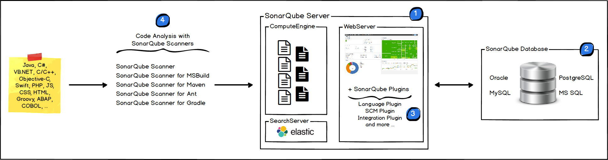
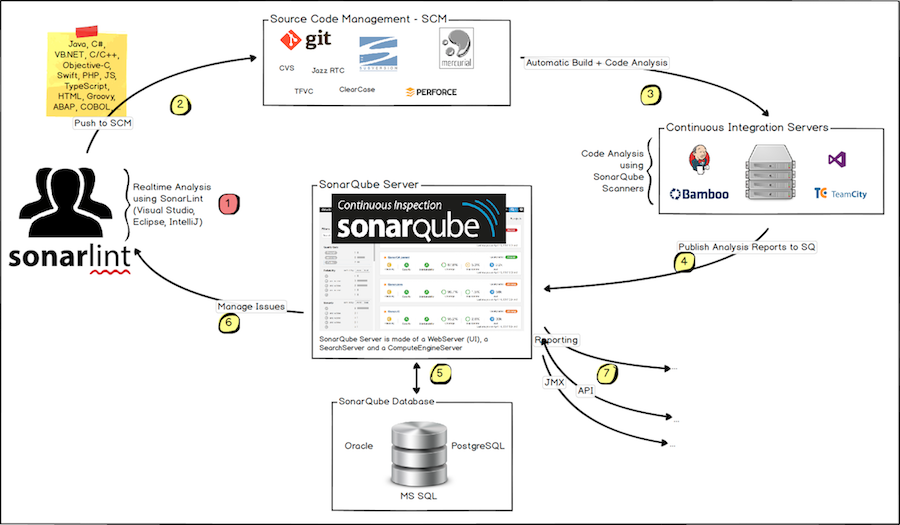

# SonarQube

## 目录


**[Sonar 架构](#架构)**
**[Sonar 服务端](#服务端)**
**[Sonar 数据库](#数据库)**
**[Sonar 客户端](#客户端)**
**[Jenkins 集成 Sonar 客户端](#jenkins-集成-sonar-客户端)**

## 架构

> * [Architecture and Integration](https://docs.sonarqube.org/latest/architecture/architecture-integration/)

#### 组成架构


#### 集成架构



## 客户端 - Scanners

> * [Scanners](https://docs.sonarqube.org/latest/analysis/overview/)

### Sonar Scanner

#### `conf/sonar-scanner.properties`

``` shell
#Configure here general information about the environment, such as SonarQube server connection details for example
#No information about specific project should appear here
#----- Default SonarQube server
#sonar.host.url=http://localhost:9000
sonar.host.url=http://192.168.2.35:8080

#----- Default source code encoding
sonar.sourceEncoding=UTF-8

#----- Security (when 'sonar.forceAuthentication' is set to 'true')
sonar.login=admin
sonar.password=admin

# pgsql
sonar.jdbc.url=jdbc:postgresql://192.168.2.35:5432/sonar?currentSchema=public
sonar.jdbc.username=sonar
sonar.jdbc.password=tivoli123
```

#### `sonar-project.properties`

``` shell
# 需要扫描的源代码目录，相对路径
sonar.sources=./osc-api/osc-user-feign/src
# 编译后
sonar.java.binaries=./osc-api/osc-user-feign/target
# 项目的Key，可任意，唯一标识，直接用项目名即可
sonar.projectKey=osc-test-demo
# 项目名，项目在 SonarQube 上显示的名称
sonar.projectName=osc-test-demo
# 项目版本
# sonar.projectVersion=1.0
# 扫描的语言
sonar.sourceEncoding=UTF-8
sonar.language=java
```

### Scanner For Maven

#### 方法一、修改 setttings.xml
``` shell
<pluginGroups>
  <pluginGroup>org.sonarsource.scanner.maven</pluginGroup> </pluginGroups> 
...

<profile>
  <id>sonar</id>
  <activation>
    <activeByDefault>true</activeByDefault>
  </activation>
  <properties>
    <sonar.host.url>
      http://192.168.2.35:8080
    </sonar.host.url>
  </properties>
</profile>
```

#### 方法二、修改 pom.xml
 

## Jenkins 集成 Sonar 客户端


