# AWS LightSail 创建和基本配置

## 本地使用 ssh 命令行登录

### 步骤讲解

1、首次登录命令: `ssh -i xxx.pem username@host_ip`

<div align=center>
  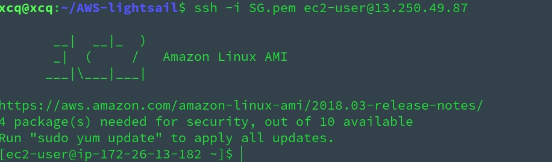<br/>使用密钥直接登录无需密码
</div>


2、`xxx.pem` 可以在 aws lightsail 服务器控制台下载 **( Lightsail 在您创建实例的每个 AWS 区域中创建一个默认密钥对 )** 

<div align=center>
  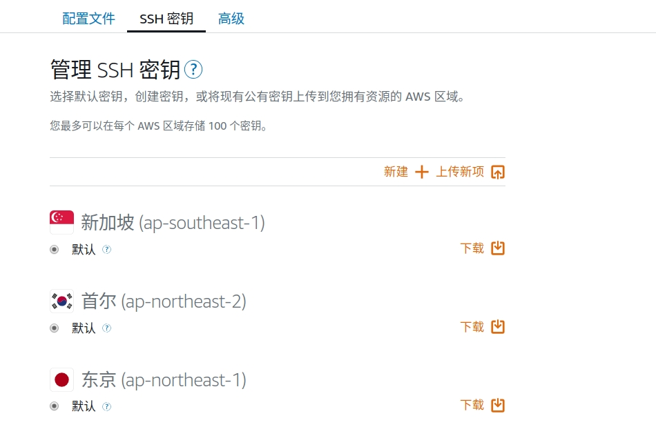<br/>每个地区都有自己的默认密钥
</div>

3、首次登录用户需要在实例的 "管理" 中的 "连接" 页面查看

<div align=center>
  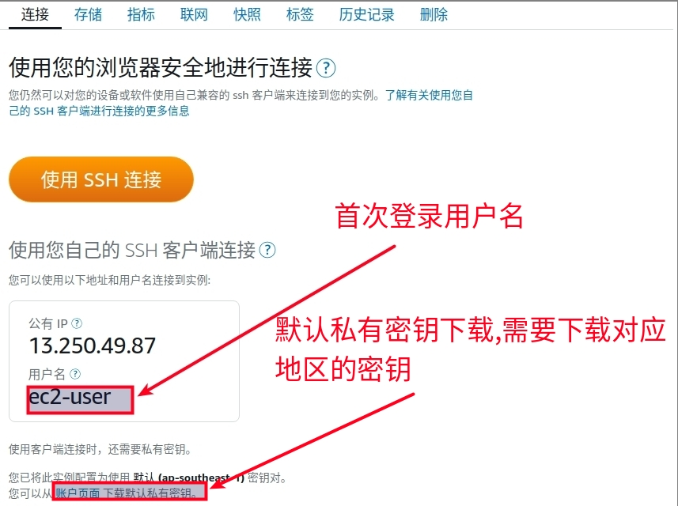<br/>
</div>

4、登录后切换成 root 用户, 设置 root 密码

```
sudo su
passwd root
```

5、修改 `/etc/ssh/sshd_config` 文件

``` 
# 被注释去掉注释, 是 no 的改为 yes
PermitRootLogin yes
PasswordAuthentication yes
```

6、最后修改 `/root/.ssh/authorized_keys`  , 删除 `/root/.ssh/authorized_keys` 中 `ssh-rsa` 前面内容 ( 没有则不修改 )

7、重启 ssh: `sudo service sshd restart`

8、再次登录时即可使用 `ssh root@host_ip`,之后输入密码即可登入

> * 若想使用普通用户登录, 需要切换到 root 下修改普通用户登录密码, 并且需要如上面一样修改 `/home/用户名/.ssh/authorized_keys`,重启 ssh 后退出再次登录即可使用普通用户


### 实操截屏

<div align=center>
  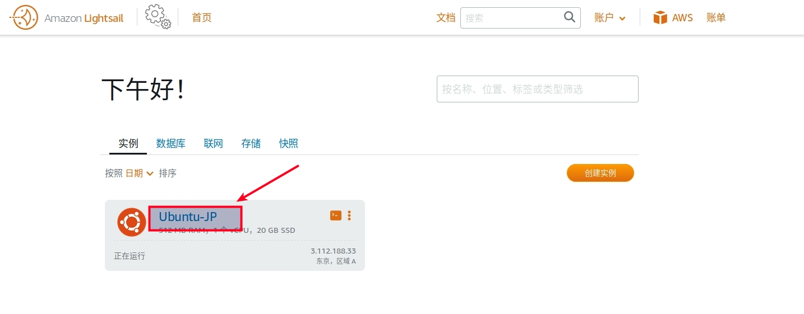<br/>
</div>
<br/>

<div align=center>
  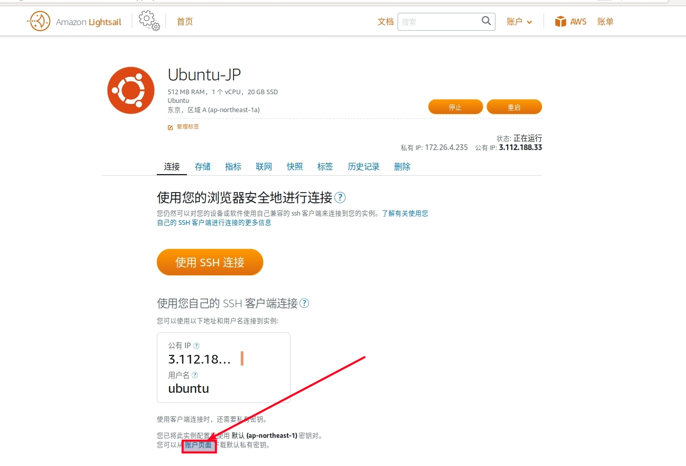<br/>
</div>
<br/>

<div align=center>
  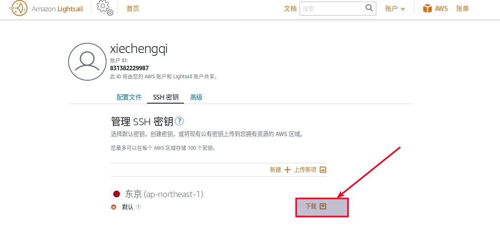<br/>下载私钥到本地
</div>


<br/>
<div align=center>
  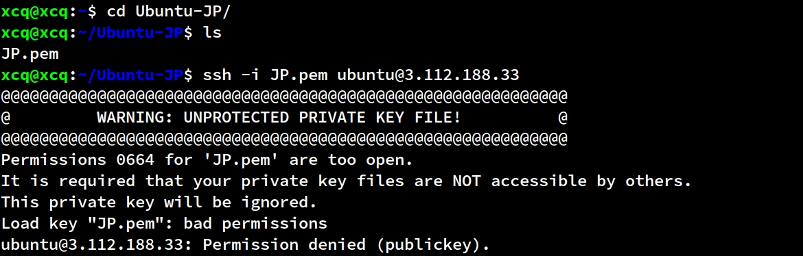<br/>本地切换到私钥目录
</div>
<br/>

<div align=center>
  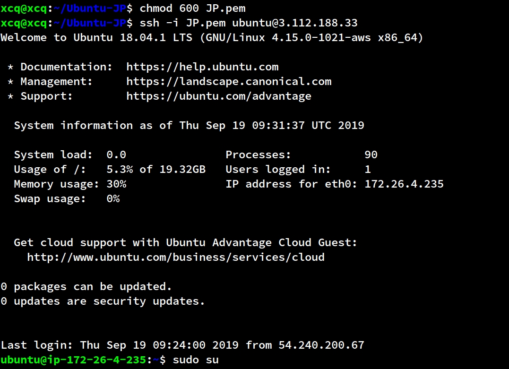<br/>本地修改私钥权限为 600
</div>
<br/>

<div align=center>
  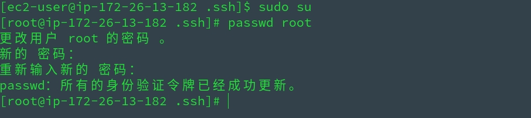<br/>登入远程服务器, sudo su 切换到 root 用户并修改 root 密码
</div>
<br/>

<div align=center>
  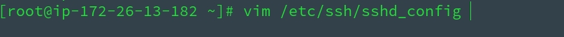<br/>PermitRootLogin yes   PasswordAuthentication yes
</div>
<br/>

<div align=center>
  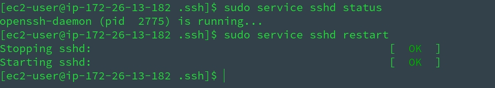<br/>修改 /root/.ssh/authorized_keys
</div>
<br/>

<div align=center>
  <br/>重启 sshd 服务
</div>
<br/>

<div align=center>
  <br/>ssh root@ip 登录
</div>
<br/>

 
