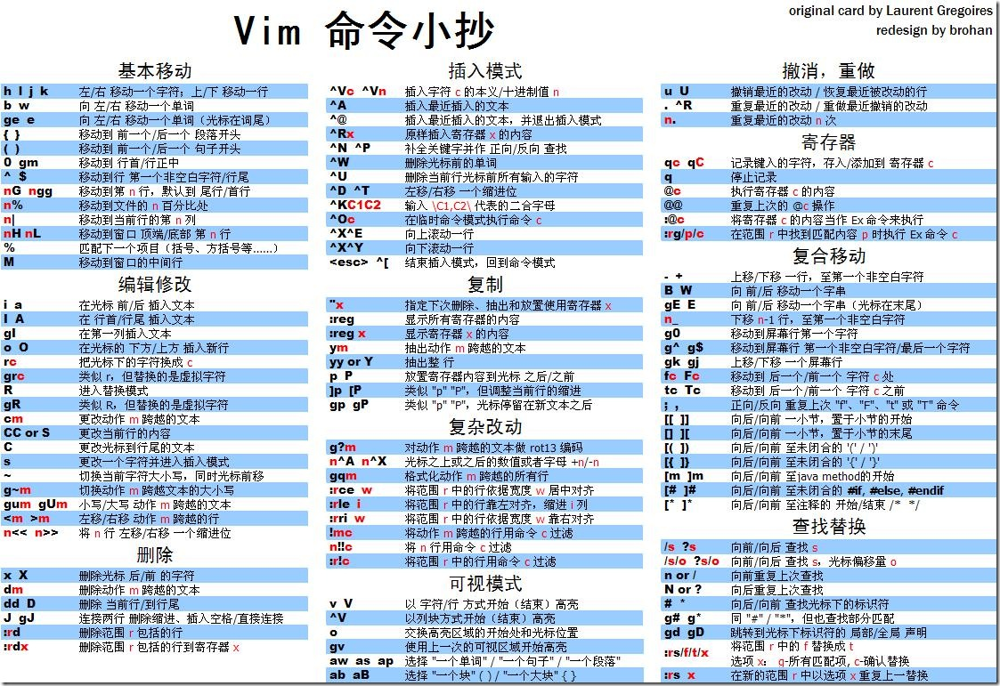
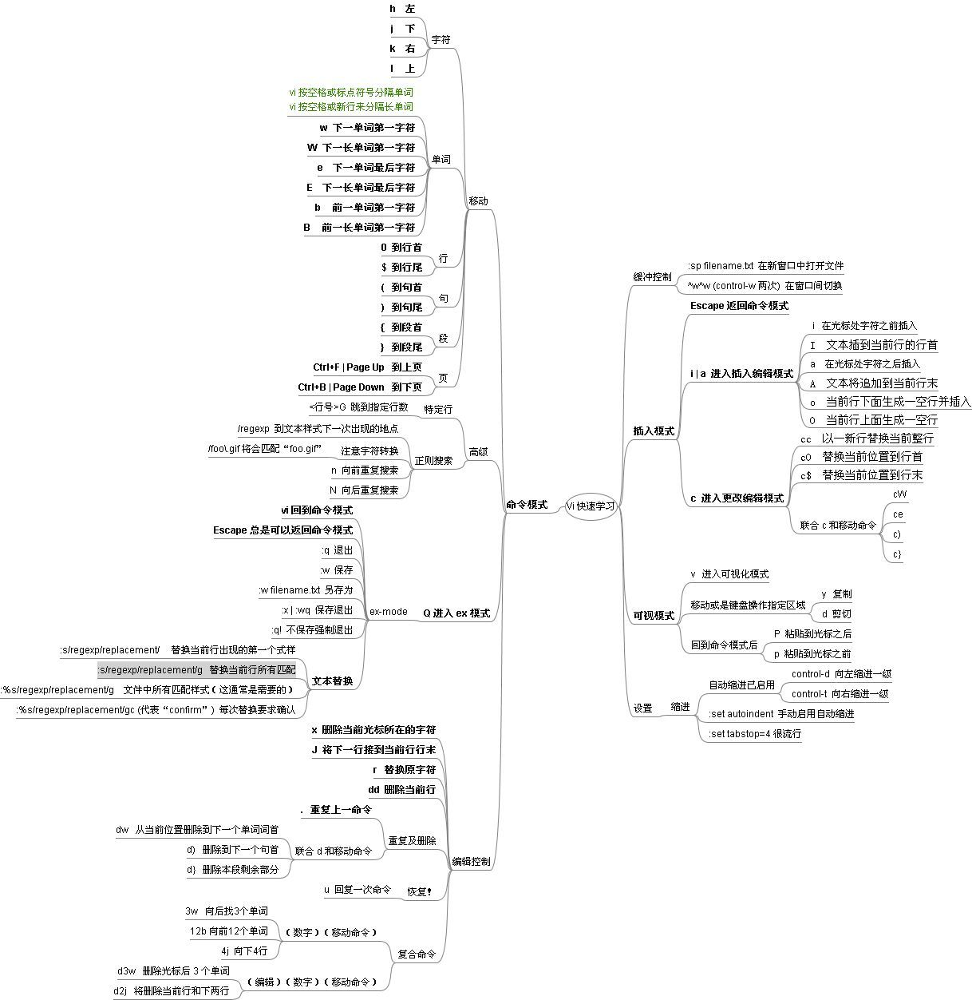

# Vim 小知识

## 奇淫技巧

* **`:w !sudo tee %`** - 保存的时提示你没有权限，可以临时提权保存

* **`全部 tab 替换为空格`**
```
# 不加感叹号!，则只处理行首的 tab
:set ts=4
:set expandtab 
:%retab!
```

* **`全部空格替换为 tab`**
```
:set ts=4
:set noexpandtab
:%retab!
# 不加感叹号!，则只处理首行的空格
```

* **`:g/^$/d`** - 删除空行

* **`:g/^\s*$/d`** - 删除空行以及只有空格的行

* **`:g/^\s*#/d`** - 删除以 # 开头或 空格# 或 tab# 开头的行

* **`:g/^\s*;/d`** - 对于 php.ini 配置文件，注释为 ; 开头

* **`:/bbs/d`** - 如果当前行包含 bbs ，则删除当前行

* **`:2,/bbs/d`** - 删除从第二行到包含 bbs 的区间行

* **`:/bbs/,$d`** - 删除从包含 bbs 的行到最后一行区间的行

* **`:g/bbs/d`** - 删除所有包含 bbs 的行

* **`:g/.bbs/d`** - 删除匹配 bbs 且前面只有一个字符的行

* **`:g/^bbs/d`** - 删除匹配 bbs 且以它开头的行

* **`:g/bbs$/d`** - 删除匹配 bbs 且以它结尾的行

* **`:%s/\;.\+//g`** - `.ini` 的注释是以 ; 开始的，如果注释不在行开头，那么删除 ; 及以后的字符

* **`%s/\#.*//g`** - 删除 # 之后所有字符

## 快捷键






