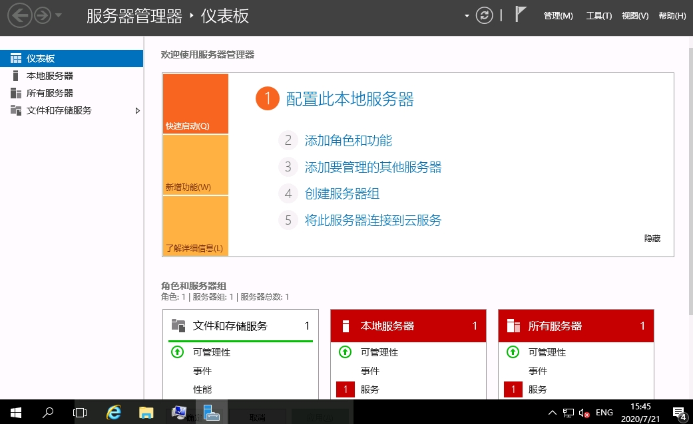

# Windows 小知识

> * [大法将至：将Windows Server 2016打造成个人办公系统,WIN2016打造成超级WIN10,WIN2016优化设置](https://www.z01.com/help/tech/3094.shtml)

## cmd 中的快捷键打开

**`win r + control`** - 打开控制面板

**`win r + netplwiz`** - 打开用户账户 - 管理用户

**`win r + SystemPropertiesPerformance`** - 打开性能选项

**`win r + ServerManager`** - 打开服务器管理器 - 

**`win r + compmgmt.msc`** - 打开计算机管理 - 设置密码永不过期

**`win r + gpedit.msc`** - 打开本地组策略编辑器 - 设置启动时无须按ctrl+alt+del就能进系统

**`win r + services.msc`** - 打开服务 - 开启 windows 需要的服务

**`win r + regedit.msc`** - 打开注册表编辑器

**

## Windows 开启指定端口

## Windows 修改默认远程桌面端口

* `cmd + r + regedit`
* 修改 `HKEY_LOCAL_MACHINE\SYSTEM\CurrentContro1Set\Control\Tenninal Server\WinStations\RDP-Tcp\
* 修改 `HKEY_LOCAL_MACHINE\SYSTEM\CurrentControlSet\Control\Terminal Server\Wds\rdpwd\Tds\tcp\PortNumber` 

