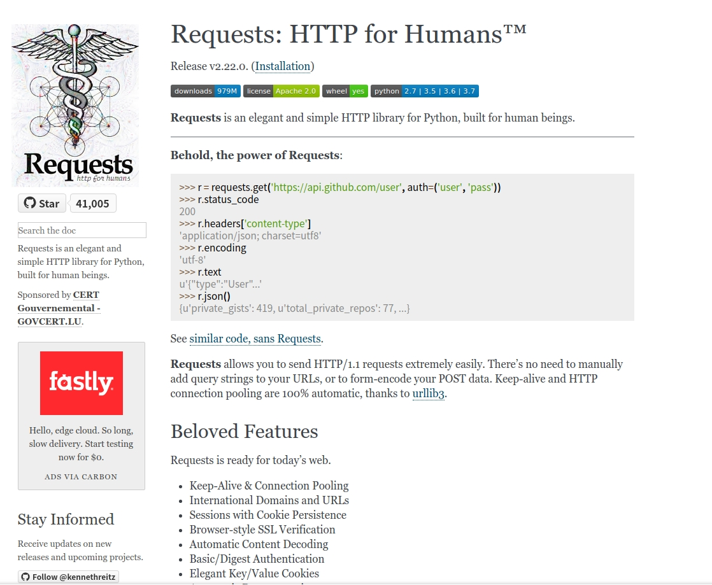
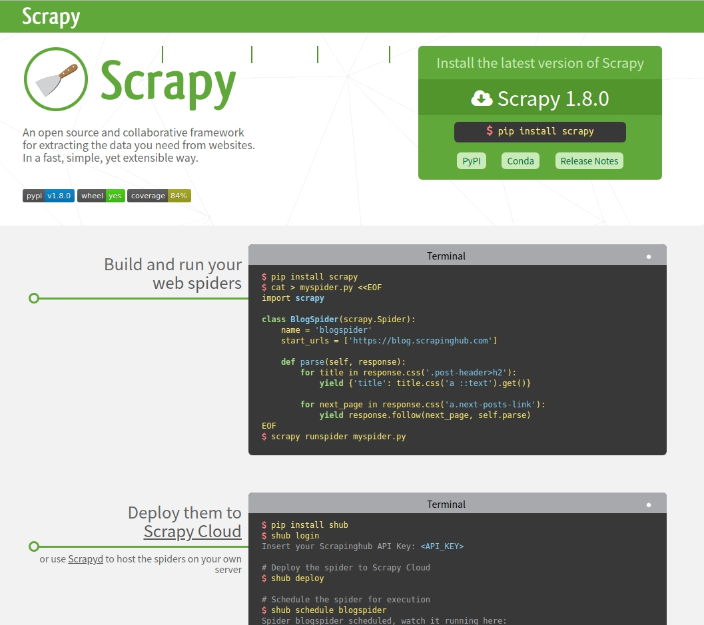
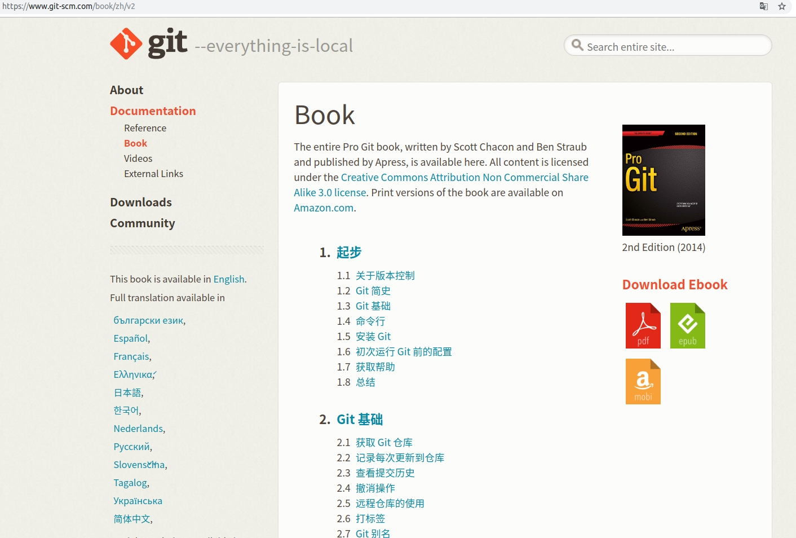
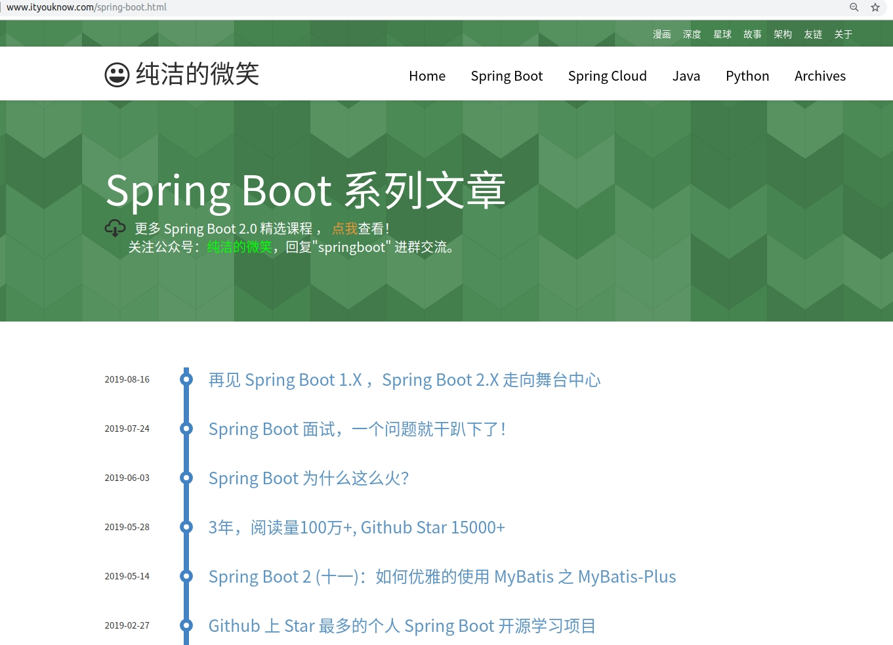
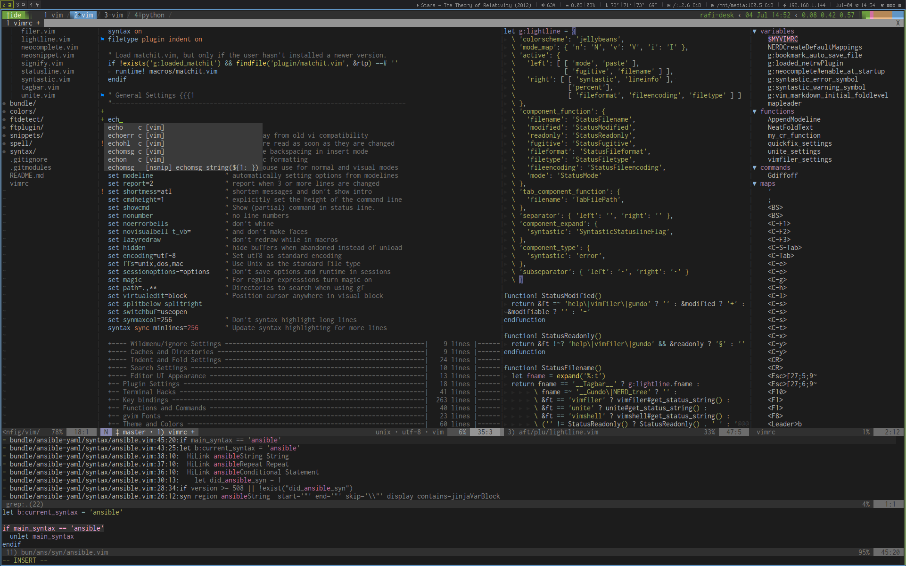

# 网络学习资源

## 目录

**[Linux](#linux)**

**[Shell](#shell)**

**[Python](#python)**

**[Go](#go)**

**[Git](#git)**

**[Gitbook](#gitbook)**

**[Ansible](#ansible)**

**[Prometheus](#prometheus)**

**[Docker](#docker)**

**[Node](#node)**

**[Vim](#vim)**

**[Tmux](#tmux)**

**[微服务](#微服务)**

**[Spring Boot](#spring-boot)**

**[Hexo](#hexo)**

**[私有云](#私有云)**

**[HTTPS](#https)**

**[etcd](#etcd)**

**[FrontEnd](#frontend)**

**[IOS](#ios)**

## Linux

* [鸟哥的 Linux 私房菜 - 基础篇](http://cn.linux.vbird.org/linux_basic/linux_basic.php)

* [鸟哥的 Linux 私房菜 - 服务器架设篇](http://cn.linux.vbird.org/linux_server/)

* [《Linux工具快速教程》](https://linuxtools-rst.readthedocs.io/zh_CN/latest/index.html)

## Shell

* [《Linux命令行与shell脚本编程大全.第3版》]([https://github.com/byterotate/Book/blob/master/Linux%E5%91%BD%E4%BB%A4%E8%A1%8C%E4%B8%8Eshell%E8%84%9A%E6%9C%AC%E7%BC%96%E7%A8%8B%E5%A4%A7%E5%85%A8.%E7%AC%AC3%E7%89%88.pdf](https://github.com/byterotate/Book/blob/master/Linux命令行与shell脚本编程大全.第3版.pdf))

* [《Linux Shell脚本攻略（第二版）》](https://maybrittnelson.gitbooks.io/linux-shell/content/)

* [《Shell 编程范例》](https://tinylab.gitbooks.io/shellbook/content/)
* [《sed and awk 101 hacks》](http://www.thegeekstuff.com/sed-awk-101-hacks-ebook/)
* [《高级shell脚本编程指南》](http://www.tldp.org/LDP/abs/html/)
* [Bash Pitfalls](http://mywiki.wooledge.org/BashPitfalls)
* [简洁的 Bash Programming 技巧](http://kodango.com/simple-bash-programming-skills)
* [The Unix School](http://www.theunixschool.com/)
* [One-Liners Explained](http://www.catonmat.net/series/sed-one-liners-explained)

## Python

* [Awsome Python](https://awesome-python.com/)

* [Python frameworks, libraries, software and resources - 7w stars](https://github.com/vinta/awesome-python)

* [python模拟登陆一些大型网站 - github 1w stars](https://github.com/Kr1s77/awesome-python-login-model)
* [《python爬虫教程，带你从零到一》- 快速入门](https://github.com/Kr1s77/Python-crawler-tutorial-starts-from-zero)
* [《爬虫教程》- 详细](https://piaosanlang.gitbooks.io/spiders/)
* [在线编辑python](https://www.pythonanywhere.com/)
* [Django 优秀资源大全](https://github.com/haiiiiiyun/awesome-django-cn)
* [Requests](https://2.python-requests.org/en/master/)

* [urllib](https://docs.python.org/zh-cn/3/library/urllib.html)

* [BeautifulSoup4](https://beautifulsoup.readthedocs.io/zh_CN/latest/)

* [scrapy](https://scrapy.org/)

## Go

* [《The way to go中文版》](https://github.com/unknwon/the-way-to-go_ZH_CN/blob/master/eBook/directory.md)
* 《[build-web-application-with-golang](https://github.com/astaxie/build-web-application-with-golang/tree/master/zh)》
* [参考百度文库，使用Beego（Golang）开发的开源文库系统](https://gitee.com/truthhun/DocHub#aboutus)
* [Awsome Go](https://awesome-go.com/)

## Git

* [《Pro Git》](https://www.git-scm.com/book/zh/v2)

* [《Pro Git》 中文优排](https://iissnan.com/progit/)
* [猴子都能懂的GIT入门](https://backlog.com/git-tutorial/cn/)

* [廖学峰GIT教程](https://www.liaoxuefeng.com/wiki/896043488029600)
* [Git 工作流](https://harttle.land/git-workflow.html)
* [使用 GitHub 操作自动化工作流程](https://help.github.com/cn/actions/automating-your-workflow-with-github-actions)
* [《git community book中文版》](http://gitbook.liuhui998.com/)
* [《Git Magic》](http://www-cs-students.stanford.edu/~blynn/gitmagic/intl/zh_cn/)
* [在线 git 可视化编程学习](https://learngitbranching.js.org/?demo)

## Gitbook

* [Gitbook中文文档](https://chrisniael.gitbooks.io/gitbook-documentation/)

## Ansible

* [Ansible 专题文章总揽](https://lework.github.io/2016/11/19/Ansible-zhuan-ti-wen-zhang-zong-lan/#ansible-role)

* [Ansible github](https://github.com/ansible/ansible)
* [Ansible中文权威指南](https://ansible-tran.readthedocs.io/en/latest/)
* [《ansible-first-book中文》](https://ansible-book.gitbooks.io/ansible-first-book/)
* [Ansible博客系列教程](https://www.pyfdtic.com/categories/DevOps/)

## Prometheus

* [《Prometheus 中文文档》](https://ryanyang.gitbook.io/prometheus/)

## Docker

* [《Docker學習筆記》](https://peihsinsu.gitbooks.io/docker-note-book/content/)

* [docker中文](http://www.docker.org.cn/index.html)

* [10张图带你深入理解Docker容器和镜像](http://dockone.io/article/783) - [原文](http://merrigrove.blogspot.com/2015/10/visualizing-docker-containers-and-images.html)
* [Marathon](https://mesosphere.github.io/marathon/) - A container orchestration platform for Mesos and DC/OS
* [kubernetes](https://kubernetes.io/zh/) - 生产级别的容器编排系统，自动化的容器部署、扩展和管理

## 微服务

* [《微服务gitbook》](https://docs.servicecomb.io/java-chassis/zh_CN/)

## Spring Boot

* [Spring Boot 系列文章](http://www.ityouknow.com/spring-boot.html)

## Node

* [cnpm](https://cnpmjs.org/) - Private npm registry and web for Company
* [《Node.js区块链开发》](https://bitcoin-on-nodejs.ebookchain.org/)

## Tmux

* [Tmux 快捷键 & 速查表 & 简明教程](https://gist.github.com/ryerh/14b7c24dfd623ef8edc7)

* [A Tmux crash course: tips and tweaks](http://tangosource.com/blog/a-tmux-crash-course-tips-and-tweaks/)
* [Tmux - Linux从业者必备利器](http://cenalulu.github.io/linux/tmux/)
* [tmux shortcuts & cheatsheet](https://gist.github.com/MohamedAlaa/2961058)
* [文本三巨头：zsh、tmux 和 vim](https://linux.cn/article-5399-1.html)

**.tmux 经典配置**

**https://github.com/gpakosz/.tmux**

## VIM 

* [专注于Vim配置、插件、Vim命令和Vim教程的网站](https://vimjc.com/)

* [Vim中的自定义快捷键](https://blog.csdn.net/u012291393/article/details/78650512)
* [插件网站](https://vimawesome.com/)

* Vimrc 经典配置

**https://spacevim.org/**

**https://github.com/rafi/vim-config**

## Hexo

* [Hexo](https://hexo.io/)
* [Hexo Admin Plugin](https://jaredforsyth.com/hexo-admin/)
* [Hexo Theme](https://hexo.io/themes/)
* [Hexo 系列博客](https://www.simon96.online/categories/hexo/)
* [Next 主题](https://muse.theme-next.org/)
* [【持续更新】最全Hexo博客搭建+主题优化+插件配置+常用操作+错误分析](https://www.simon96.online/2018/10/12/hexo-tutorial/)

### 主题

* https://github.com/JoeyBling/hexo-theme-yilia-plus

## Vuejs

* https://zhousiwei.gitee.io/ibooks - [[源码]](https://gitee.com/zhousiwei/ibooks)

## 私有云

* [《主流的网盘（文档管理）软件镜像部署和使用、运维实战指南》](http://help.websoft9.com/cloudbox-practice/default.html)

## HTTPS

* [图解 HTTPS](https://www.hi-linux.com/posts/21572.html)

## etcd

* [Etcd 使用入门](https://www.hi-linux.com/posts/40915.html)

## FrontEnd

* [前端工程化概述](https://juejin.im/post/5ac9c6f451882555677ed301)
* [究竟什么是前端脚手架？](https://juejin.im/post/5d0337df6fb9a07ed2246a3c#heading-0)
* [前端小峰哥的学习笔记](http://www.xuefeng666.com/)

#### 工具

* [webpack](https://webpack.docschina.org/)
* [Postman](https://learning.getpostman.com/docs/postman/launching-postman/introduction/)

#### 前端 UI 组件库

* [Ant Design](https://ant.design/index-cn) - `antd` 是基于 Ant Design 设计体系的 React UI 组件库，主要用于研发企业级中后台产品

* [Element](https://element.eleme.cn/#/zh-CN) - 一套为开发者、设计师和产品经理准备的基于 Vue 2.0 的桌面端组件库
* [Bootstrap](https://code.z01.com/v4/docs/index.html) - Bootstrap is an open source toolkit for developing with HTML, CSS, and JS. Quickly prototype your ideas or build your entire app with our Sass variables and mixins, responsive grid system, extensive prebuilt components, and powerful plugins built on jQuery

#### 前端工具库

* [React](https://zh-hans.reactjs.org/docs/getting-started.html) - A JavaScript library for building user interfaces - 用于构建用户界面的 JavaScript 库
* [Vue](https://cn.vuejs.org/v2/guide/) -The Progressive JavaScript Framework - 渐进式 JavaScript 框架
* [Angulars](https://www.angularjs.net.cn/tutorial/7.html) - One framework.Mobile & desktop

## IOS

* [ios 学习笔记](http://ios.xuefeng6.com/)