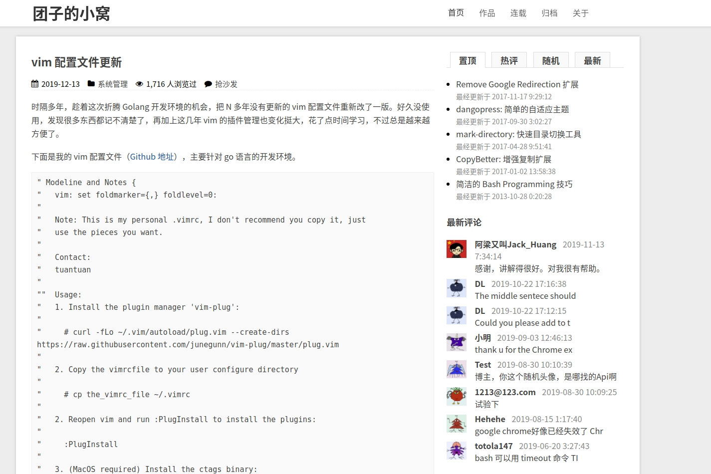
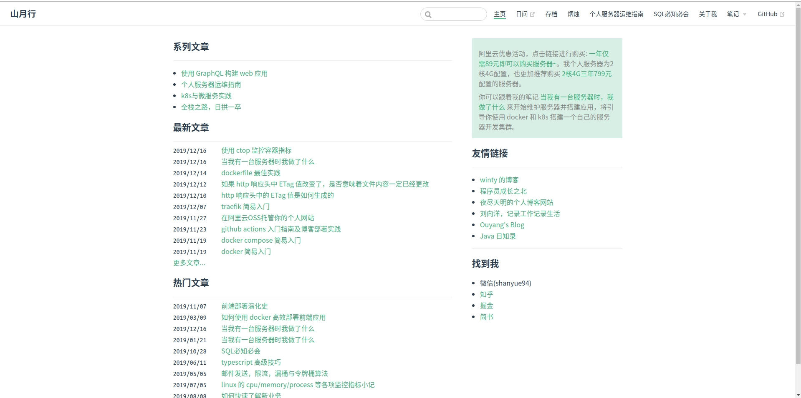
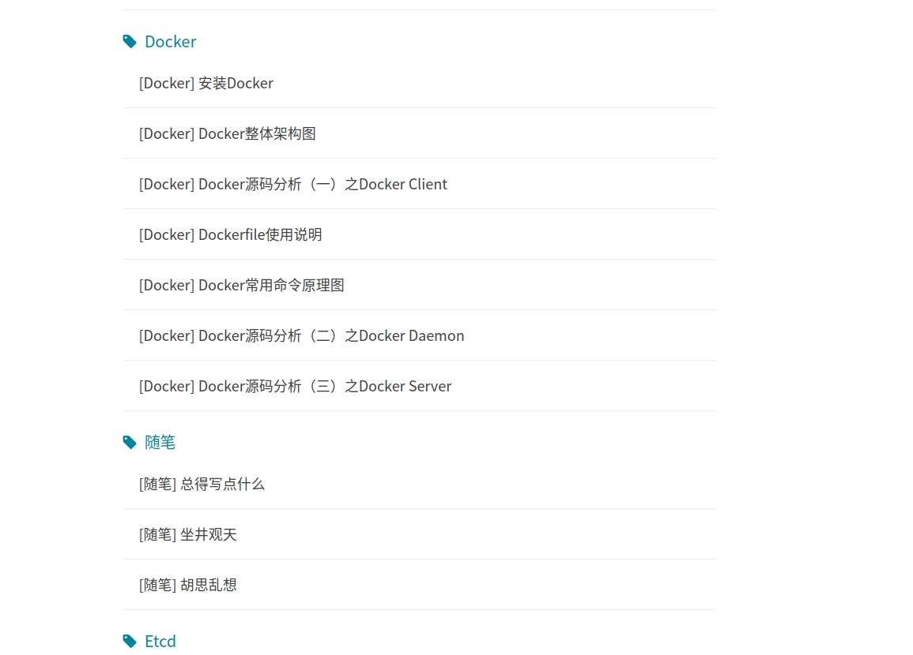
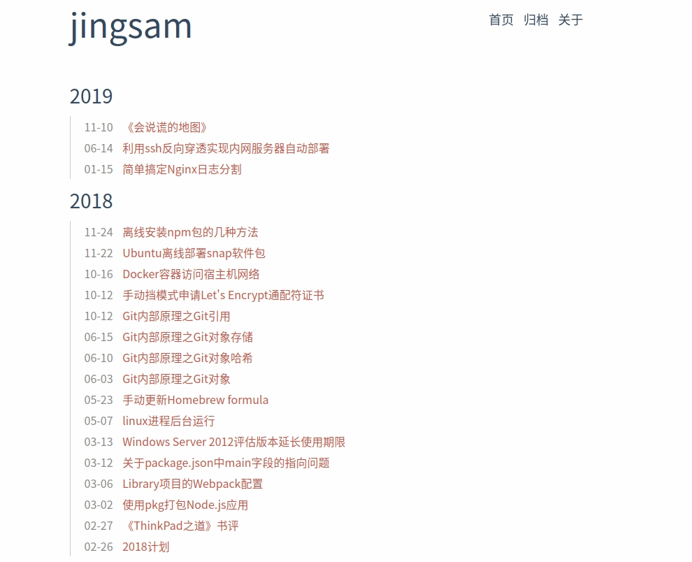
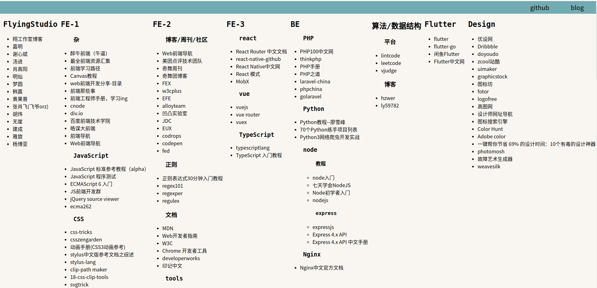
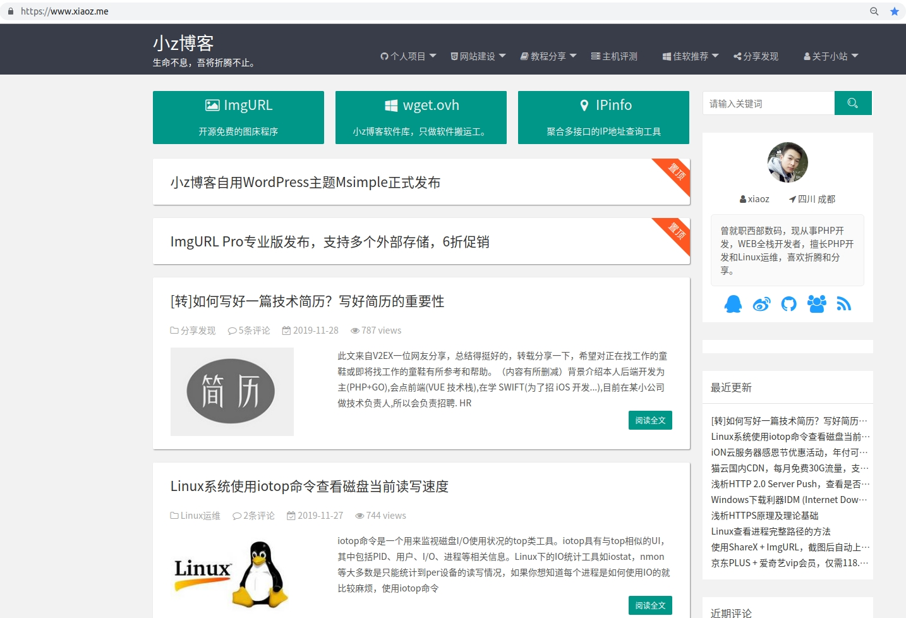
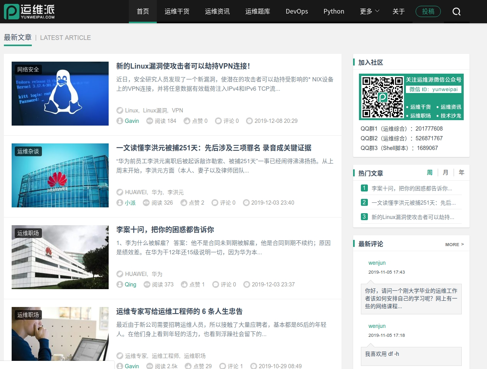
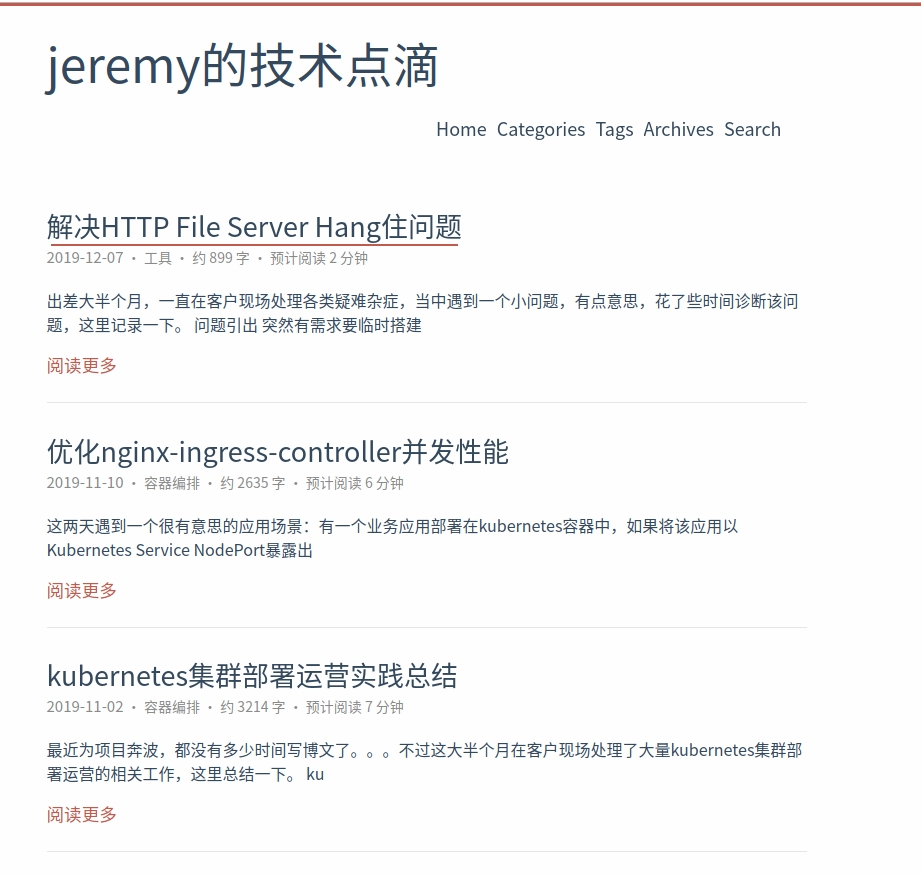

# 运维博客

## [团子的小窝](http://kodango.com) - [[源码]](https://github.com/kodango/dangopress) - wordpress

## [运维生存时间](http://www.ttlsa.com/)

## [dockone](http://dockone.io/)

## [山月行](https://shanyue.tech/) - [[源码]](https://github.com/shfshanyue/blog)

## [胡伟煌](https://www.huweihuang.com/tags/#Linux)

* https://www.huweihuang.com/linux-notes/ - gitbook 技术文档
* https://www.huweihuang.com - Hexo 博客

## [运维之窗](http://www.sunrisenan.com/)

## [博客园](https://www.cnblogs.com/wang618/)

### [jingsam](https://jingsam.github.io/)

### [代码日志](https://codeday.me/)

### [Sail](https://www.sail.name/Resource/)

### [小z博客](https://www.xiaoz.me/)

### [ARLOOR](http://arloor.com/)

### [果冻想](https://www.jellythink.com/)

### [运维咖啡吧](https://ops-coffee.cn/)

### [纯洁的微笑](https://ops-coffee.cn/)

### [运维派](https://ops-coffee.cn/)

### [Linux 运维部落](http://www.178linux.com/)

### [jeremy的技术点滴](https://jeremyxu2010.github.io/)

