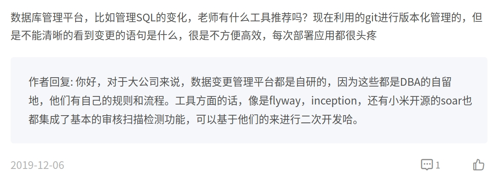
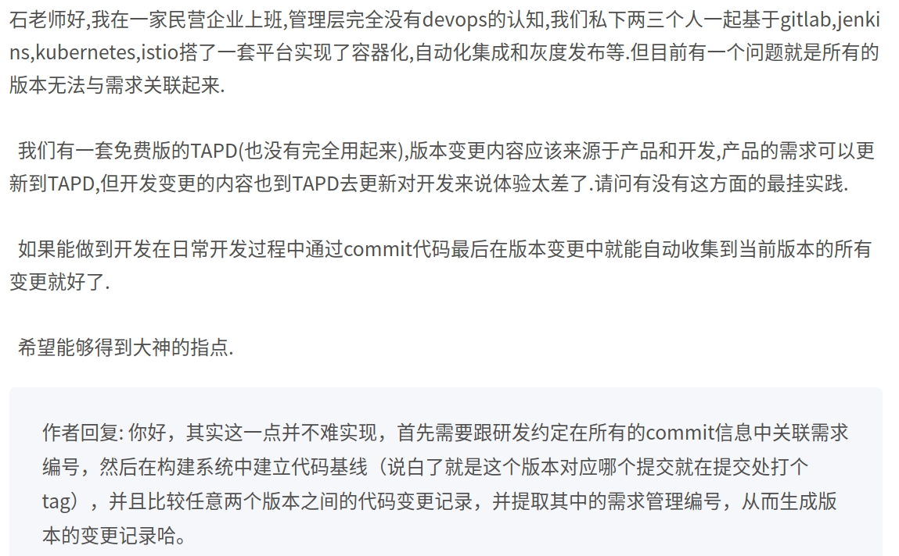

## 记录运维过程遇到的问题和最佳实践

#### 银联部署发版安装包结构

* tar 包
* 环境预检查脚本
* 安装脚本
* 服务状态检查脚本
* 回滚重安装脚本

#### 一个软件产品从开发到用户使用都涉及哪些环境？

> 开发环境、测试环境、回归环境、预发布环境、生产环境 

1、开发环境
顾名思义，开发同学开发时使用的环境，每位开发同学在自己的dev分支上干活，提测前或者开发到一定程度，各位同学会合并代码，进行联调。

2、测试环境
也就是我们测试同学干活的环境啦，一般会由测试同学自己来部署，然后在此环境进行测试。bug修复后，需要发版更新测试环境来回归bug。

3、回归环境
回归bug的环境，其实就是我们的测试环境，在测试环境上测试、回归验证bug。

4、预发布环境
测试环境到生产环境的过渡。测试环境可能会受到一些限制，一些流程或者数据没有测试到，就可以在预发布环境进行验证，从而保证产品上线质量

5、生产环境
即线上环境，用户使用的环境。由特定人员来维护，一般人没有权限去修改

> 预发布环境和生产环境区别：
> * 预发环境中新功能为最新代码，其他功能代码和生产环境一致
> * 预发环境和生产环境的访问域名不同

> 另外，还有个灰度发布，发生在预发布环境之后，生产环境之前。生产环境一般会部署在多台机器上，以防某台机器出现故障，这样其他机器可以继续运行，不影响用户使用。灰度发布会发布到其中的几台机器上，验证新功能是否正常。如果失败，只需回滚这几台机器即可
